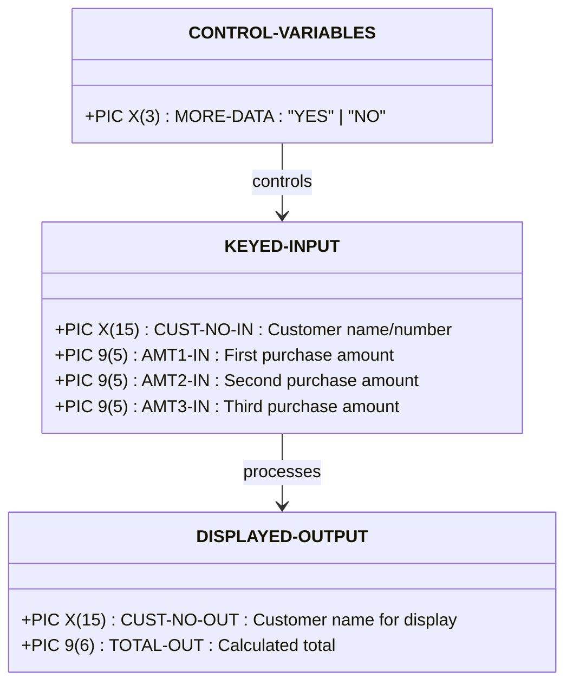
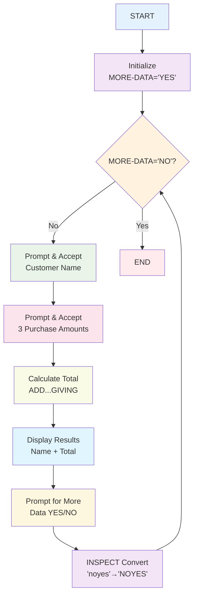

# ADDAMT.cobol - Interactive Addition Calculator

## Reference Documentation

### File Purpose
ADDAMT.cobol demonstrates interactive COBOL programming with user input, loop control, and arithmetic operations. It accepts customer information and three purchase amounts, calculates totals, and continues until the user indicates no more data.

### Program Structure

#### Main Divisions
- **IDENTIFICATION DIVISION**: Program identification (PROGRAM-ID: ADDAMT)
- **DATA DIVISION**: Working storage for input/output structures and control variables
- **PROCEDURE DIVISION**: Main processing loop with user interaction

#### Key Sections
1. **100-MAIN** - Main processing loop with PERFORM UNTIL
2. **User Input Collection** - Multiple ACCEPT statements
3. **Calculation Logic** - ADD statement with GIVING clause
4. **Output Display** - Formatted results display
5. **Loop Control** - Continue/exit decision handling

### Data Structures

#### Program Data Structures



### External Dependencies
- **System Dependencies**: Console I/O capability for ACCEPT/DISPLAY
- **User Interaction**: Requires terminal/console for interactive operation

### Input/Output Specifications

#### Interactive Inputs
1. **Customer Name**: 15-character alphanumeric field
2. **Purchase Amount 1**: 5-digit numeric value
3. **Purchase Amount 2**: 5-digit numeric value  
4. **Purchase Amount 3**: 5-digit numeric value
5. **Continue Flag**: YES/NO response for loop control

#### Display Outputs
- **Input Prompts**: Clear instructions for each input field
- **Calculation Results**: Customer name and total amount
- **Continuation Prompt**: Request for more data processing

## Explanation Documentation

### Design Rationale

This program demonstrates essential interactive COBOL programming concepts:

1. **User Interaction**: Real-time input/output processing
2. **Loop Control**: PERFORM UNTIL with user-controlled termination
3. **Data Validation**: Input transformation and case conversion
4. **Arithmetic Operations**: Multi-operand addition
5. **Data Movement**: Transfer between input and output structures

### Business Logic Flow



### COBOL Language Features Demonstrated

#### Interactive Processing
1. **ACCEPT Statement**: Reading user input from console
2. **DISPLAY Statement**: Prompting user and showing results
3. **Loop Control**: PERFORM UNTIL with condition testing
4. **Data Conversion**: INSPECT with CONVERTING clause

#### Data Handling
1. **Data Structures**: Hierarchical input/output records
2. **Data Movement**: MOVE statements between structures
3. **Arithmetic**: ADD with multiple operands and GIVING
4. **String Processing**: Case conversion for user responses

#### Program Control
1. **Structured Programming**: Single entry/exit loop
2. **Condition Testing**: Loop termination logic
3. **User-Controlled Processing**: Interactive decision making

### Arithmetic Operations

#### Addition Logic
```cobol
ADD AMT1-IN AMT2-IN AMT3-IN GIVING TOTAL-OUT
```

**Equivalent to:**
```
TOTAL-OUT = AMT1-IN + AMT2-IN + AMT3-IN
```

#### Data Type Considerations
- **Input**: PIC 9(5) allows up to 99,999 per amount
- **Output**: PIC 9(6) allows total up to 999,999
- **Overflow Protection**: Output field sized for maximum possible total

### User Interaction Pattern

#### Input Validation
- **Case Insensitive**: Accepts 'yes', 'YES', 'no', 'NO'
- **Format Flexibility**: INSPECT handles mixed case input
- **Prompt Clarity**: Specific instructions for each field

#### Error Handling
- **Implicit**: Relies on COBOL runtime for input validation
- **User Guidance**: Clear prompts reduce input errors
- **Graceful Termination**: Simple YES/NO for program exit

### Integration Points

#### Development Environment
- **Interactive Testing**: Immediate feedback during development
- **User Training**: Demonstrates typical business application flow
- **Template Usage**: Pattern for other interactive programs

#### Business Applications
- **Order Entry**: Pattern for multi-item transactions
- **Data Collection**: Interactive data gathering applications
- **Customer Service**: Real-time transaction processing

### Performance Characteristics

- **Response Time**: Immediate processing per transaction
- **Memory Usage**: Minimal (single record structures)
- **User Experience**: Interactive with clear prompts
- **Scalability**: Single-user interactive session

### Modernization Considerations

#### Modern Equivalent (Python)
```python
def main():
    more_data = "YES"
    
    while more_data.upper() == "YES":
        print("ENTER NAME (15 CHARACTERS)")
        customer_name = input()[:15]
        
        print("Enter amount of first purchase (5 digits)")
        amt1 = int(input())
        
        print("Enter amount of second purchase (5 digits)")
        amt2 = int(input())
        
        print("Enter amount of third purchase (5 digits)")
        amt3 = int(input())
        
        total = amt1 + amt2 + amt3
        print(f"{customer_name} Total Amount = {total}")
        
        print("MORE INPUT DATA (YES/NO)?")
        more_data = input().upper()

if __name__ == "__main__":
    main()
```

#### Web Application Migration
```html
<!-- Modern web form equivalent -->
<form id="addamt-form">
    <input type="text" maxlength="15" placeholder="Customer Name" />
    <input type="number" max="99999" placeholder="Purchase 1" />
    <input type="number" max="99999" placeholder="Purchase 2" />
    <input type="number" max="99999" placeholder="Purchase 3" />
    <button type="submit">Calculate Total</button>
</form>
```

### Usage Scenarios

1. **Education**: Interactive programming instruction
2. **Prototyping**: Quick calculation tool development
3. **Testing**: User interface flow validation
4. **Training**: COBOL interactive programming concepts

---

*This program excellently demonstrates interactive COBOL programming patterns, showing how traditional mainframe applications handled real-time user interaction and data processing.*