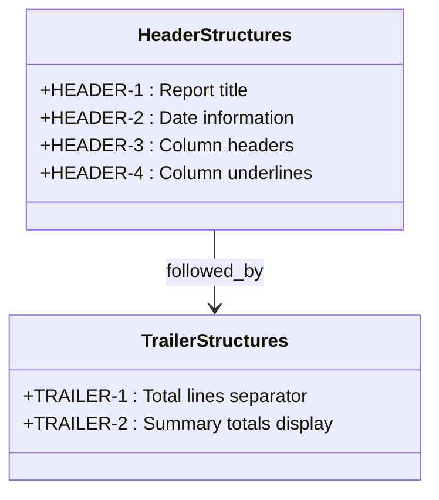
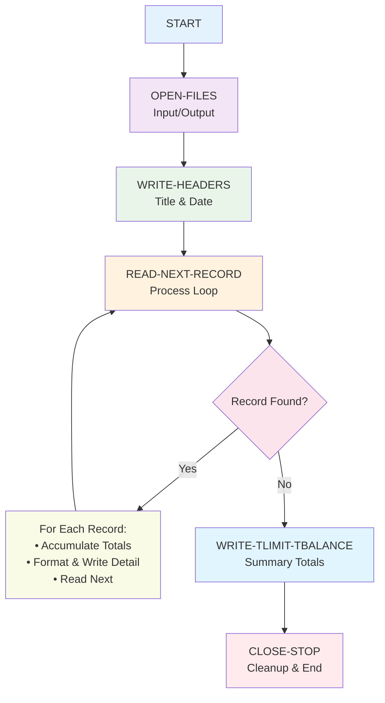

# CBL0009.cobol - Financial Report Generator with Totals

## Reference Documentation

### File Purpose
CBL0009.cobol is a comprehensive file processing program that generates a formatted financial report for client accounts, including individual account details and summary totals. It demonstrates advanced COBOL concepts including file I/O, report formatting, date handling, and arithmetic operations.

### Program Structure

#### Main Divisions
- **IDENTIFICATION DIVISION**: Program metadata (PROGRAM-ID: CBL0009, AUTHOR: Otto B. Mathwiz)
- **ENVIRONMENT DIVISION**: File assignments for input and output
- **DATA DIVISION**: Complex data structures for files, working storage, and report formatting
- **PROCEDURE DIVISION**: Multi-paragraph program with structured processing flow

#### Key Sections and Procedures
1. **OPEN-FILES** - Initialize input and output files
2. **WRITE-HEADERS** - Generate report headers with current date
3. **READ-NEXT-RECORD** - Main processing loop with PERFORM UNTIL
4. **WRITE-TLIMIT-TBALANCE** - Output summary totals
5. **CLOSE-STOP** - File cleanup and program termination
6. **READ-RECORD** - File input with EOF handling
7. **LIMIT-BALANCE-TOTAL** - Accumulate running totals
8. **WRITE-RECORD** - Format and output detail records

### Data Structures

#### File Definitions

```mermaid
classDiagram
    class ACCT-REC {
        <<Input File>>
        +PIC X(8) ACCT-NO
        +PIC S9(7)V99 COMP-3 ACCT-LIMIT
        +PIC S9(7)V99 COMP-3 ACCT-BALANCE
        +PIC X(20) LAST-NAME
        +PIC X(15) FIRST-NAME
        +PIC X(7) RESERVED
        +PIC X(50) COMMENTS
    }
    
    class CLIENT-ADDR {
        +PIC X(25) STREET-ADDR
        +PIC X(20) CITY-COUNTY
        +PIC X(15) USA-STATE
    }
    
    class PRINT-LINE {
        <<Output File>>
        +PIC varies PRINT-REC
    }
    
    ACCT-REC ||--|| CLIENT-ADDR : contains
```

#### Report Layout Structures



#### Working Storage Variables

```mermaid
classDiagram
    class FLAGS {
        +PIC X LASTREC : End of file indicator
    }
    
    class TLIMIT-TBALANCE {
        +PIC S9(9)V99 COMP-3 TLIMITED
        +PIC S9(9)V99 COMP-3 TBALANCE
    }
    
    class WS-CURRENT-DATE-DATA {
        <<Date/Time Structure>>
    }
    
    class WS-CURRENT-DATE {
        +PIC 9(04) WS-CURRENT-YEAR
        +PIC 9(02) WS-CURRENT-MONTH
        +PIC 9(02) WS-CURRENT-DAY
    }
    
    class WS-CURRENT-TIME {
        +PIC 9(02) WS-CURRENT-HOUR
        +PIC 9(02) WS-CURRENT-MINUTE
        +PIC 9(02) WS-CURRENT-SECOND
        +PIC 9(02) WS-CURRENT-CENTISECOND
    }
    
    WS-CURRENT-DATE-DATA ||--|| WS-CURRENT-DATE
    WS-CURRENT-DATE-DATA ||--|| WS-CURRENT-TIME
```

### External Dependencies

#### File System Dependencies
- **ACCTREC**: Input dataset containing account records
- **PRTLINE**: Output dataset for formatted report

#### System Dependencies
- **CURRENT-DATE Function**: System date/time function
- **COBOL Runtime**: File I/O and arithmetic support

### Input/Output Specifications

#### Input Format
- **File Type**: Sequential file with fixed-length records
- **Record Structure**: Account information with financial data
- **Data Types**: Mixed alphanumeric and packed decimal fields

#### Output Format
- **Report Type**: Formatted business report
- **Headers**: Title, date, and column headers
- **Detail Lines**: Account number, name, limit, and balance
- **Totals**: Summary of all account limits and balances

## Explanation Documentation

### Design Rationale

This program demonstrates professional COBOL report generation with:

1. **Structured Programming**: Modular paragraphs with specific functions
2. **Professional Formatting**: Headers, detail lines, and summary totals
3. **Date Integration**: Current date in report headers
4. **Arithmetic Processing**: Running total calculations
5. **Error Handling**: End-of-file detection and control
6. **Data Types**: Efficient packed decimal for financial data

### Business Logic Flow



### COBOL Language Features Demonstrated

#### Advanced File Processing
1. **File Control**: SELECT/ASSIGN statements
2. **File Operations**: OPEN, READ, WRITE, CLOSE
3. **EOF Handling**: AT END clause with flag setting
4. **Record Processing**: Structured loop with PERFORM UNTIL

#### Report Formatting
1. **Header Generation**: Multiple header lines with formatting
2. **Column Alignment**: Proper spacing and alignment
3. **Data Movement**: Moving data between record structures
4. **Date Functions**: CURRENT-DATE intrinsic function

#### Arithmetic and Data Handling
1. **Packed Decimal**: COMP-3 for efficient numeric storage
2. **Arithmetic Operations**: COMPUTE statements for totals
3. **Data Conversion**: Moving between different numeric formats
4. **Accumulator Patterns**: Running total calculations

### Data Flow Architecture

The program follows a classic **Extract-Transform-Load (ETL)** pattern:

1. **Extract**: Read account records from input file
2. **Transform**: Format data for report output and calculate totals
3. **Load**: Write formatted records to report file

#### Processing Pipeline
```
Input Record → Data Validation → Total Accumulation → Format Conversion → Output Record
```

### Financial Data Processing

#### Account Information Structure
- **Account Number**: Unique identifier (8 characters)
- **Financial Data**: Limits and balances in packed decimal format
- **Customer Data**: Name and address information
- **Metadata**: Comments and reserved fields

#### Arithmetic Operations
```
Running Totals:
TLIMIT = TLIMIT + ACCT-LIMIT
TBALANCE = TBALANCE + ACCT-BALANCE

Alternative Syntax Demonstrated:
ADD ACCT-LIMIT TO TLIMIT
ADD ACCT-BALANCE TO TBALANCE
```

### Integration Points

#### Data Integration
- **Input Source**: Account master file or database extract
- **Output Destination**: Report file for printing or viewing
- **Date Integration**: System date for report timestamp

#### System Integration
- **JCL Integration**: Executed via CBL0009J.jcl job control
- **Dataset Management**: Standard mainframe file handling
- **Batch Processing**: Designed for scheduled report generation

### Error Handling Strategy

1. **File Operations**: Implicit error handling through COBOL runtime
2. **End-of-File**: Explicit handling with LASTREC flag
3. **Data Validation**: Relies on file format consistency
4. **Resource Management**: Proper file closing in all cases

### Performance Characteristics

- **Processing Model**: Sequential file processing
- **Memory Usage**: Minimal (single record buffering)
- **I/O Pattern**: Read-process-write loop
- **Scalability**: Linear performance with file size

### Modernization Considerations

#### Modern Equivalent (Python/Pandas)
```python
import pandas as pd
from datetime import datetime

# Read account data
accounts = pd.read_csv('accounts.csv')

# Generate report header
today = datetime.now()
print(f"Financial Report for")
print(f"Year {today.year} Month {today.month:02d} Day {today.day:02d}")

# Process and display details
total_limit = 0
total_balance = 0

for _, account in accounts.iterrows():
    print(f"{account['account_no']:8} {account['last_name']:20} "
          f"{account['limit']:>10.2f} {account['balance']:>10.2f}")
    total_limit += account['limit']
    total_balance += account['balance']

# Display totals
print(f"Totals = {total_limit:>10.2f} {total_balance:>10.2f}")
```

#### Migration Strategy
1. **Data Layer**: Convert to modern database or file formats
2. **Processing Layer**: Implement in modern reporting framework
3. **Presentation Layer**: Web-based or PDF report generation
4. **Business Logic**: Preserve calculation and formatting rules

---

*This program exemplifies professional COBOL report generation, demonstrating essential patterns for file processing, report formatting, and business calculation that are fundamental to enterprise mainframe applications.*