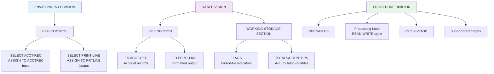
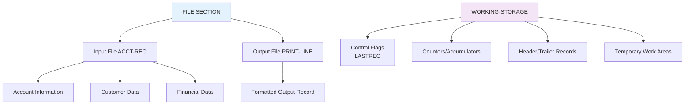

# Remaining COBOL Programs - Course #2 Documentation

## Overview

This document provides consolidated reference and explanation documentation for the remaining COBOL programs in Course #2, organized by functionality and complexity.

---

## File Processing Programs (CBL0001-CBL0008, CBL0010-CBL0012, CBL0033)

### Common Architecture Pattern

All file processing programs follow this standard structure:



### CBL0001.cobol - Basic File Copy
**Purpose**: Fundamental file processing introduction - reads account records and writes them to output with minimal formatting.

**Key Features**:
- Simple file-to-file copy operation
- Basic data movement between input and output records
- Introduction to file processing concepts
- PERFORM UNTIL loop with end-of-file handling

**Data Structure**: Standard account record with ACCT-NO, ACCT-LIMIT, ACCT-BALANCE, names, and address

**Business Logic**: Straight file copy with field-by-field data movement

### CBL0002.cobol - Enhanced File Processing
**Purpose**: Extends CBL0001 with additional field processing and formatting.

**Key Features**:
- Extended record processing
- Additional data fields handling
- Improved output formatting
- Comments and additional customer information processing

### CBL0004.cobol - Formatted Output Introduction
**Purpose**: Introduces formatted output with proper field positioning and display formatting.

**Key Features**:
- Formatted money fields using PIC $$,$$$,$$9.99
- Proper field alignment and spacing
- FILLER fields for output positioning
- Introduction to report formatting concepts

**Notable Pattern**:
```cobol
05  ACCT-LIMIT-O   PIC $$,$$$,$$9.99.
05  FILLER         PIC X(02) VALUE SPACES.
05  ACCT-BALANCE-O PIC $$,$$$,$$9.99.
```

### CBL0005.cobol - Advanced Formatting
**Purpose**: Builds on CBL0004 with enhanced formatting and field manipulation.

**Key Features**:
- Advanced PICTURE clause usage
- Enhanced money formatting
- Multiple formatting techniques
- Improved readability in output

### CBL0006.cobol - Conditional Processing Introduction
**Purpose**: Introduces conditional logic in file processing.

**Key Features**:
- IF-THEN-ELSE logic
- Conditional data processing
- State-based filtering (often Virginia state processing)
- Counter variables for conditional records

**Typical Logic**:
```cobol
IF USA-STATE = 'VIRGINIA'
    ADD 1 TO VIRGINIA-COUNT
END-IF
```

### CBL0007.cobol - Extended Conditional Processing
**Purpose**: Expands conditional processing with more complex business rules.

**Key Features**:
- Multiple conditional statements
- Enhanced state processing
- Counter accumulation
- Conditional output formatting

### CBL0008.cobol - Report Generation Without Totals
**Purpose**: Generates formatted reports with headers but without summary totals.

**Key Features**:
- Report header generation
- Professional output formatting
- Column headers and alignment
- No total calculations

**Structure Pattern**:
```cobol
01  HEADER-1.
    05  FILLER  PIC X(20) VALUE 'Financial Report for'.
01  HEADER-3.
    05  FILLER  PIC X(08) VALUE 'Account '.
    05  FILLER  PIC X(10) VALUE 'Last Name '.
```

### CBL0010.cobol - Extended File Processing
**Purpose**: More complex file processing with additional business logic.

**Key Features**:
- Extended data processing
- Additional field manipulations
- Enhanced error handling
- More complex business rules

### CBL0011.cobol - Multi-Field Processing
**Purpose**: Demonstrates processing of multiple fields with various calculations.

**Key Features**:
- Multiple field calculations
- Data validation
- Enhanced processing logic
- Complex field interactions

### CBL0012.cobol - Advanced Reporting
**Purpose**: Advanced report generation with comprehensive formatting and calculations.

**Key Features**:
- Full report generation capabilities
- Advanced formatting techniques
- Multiple calculation types
- Professional report layout

### CBL0033.cobol - Specialized Processing
**Purpose**: Specialized processing program with unique business logic.

**Key Features**:
- Specialized business rules
- Unique data processing patterns
- Advanced COBOL techniques
- Custom processing logic

---

## Search Algorithm Programs

### SRCHBIN.cobol - Binary Search Implementation
**Purpose**: Demonstrates binary search algorithm implementation in COBOL.

**Key Features**:
- Binary search algorithm
- Array processing
- Search efficiency demonstration
- Algorithm implementation patterns

**Data Structure**:
```cobol
01  SEARCH-TABLE.
    05  TABLE-ENTRIES   OCCURS 100 TIMES
                        INDEXED BY TABLE-INDEX.
        10  TABLE-KEY   PIC X(10).
        10  TABLE-DATA  PIC X(20).
```

**Algorithm Logic**:
1. Initialize search boundaries (low, high)
2. Calculate middle position
3. Compare search key with middle element
4. Adjust boundaries based on comparison
5. Repeat until found or boundaries cross

### SRCHSER.cobol - Sequential Search Implementation
**Purpose**: Demonstrates sequential (linear) search algorithm in COBOL.

**Key Features**:
- Sequential search algorithm
- Linear table processing
- Simple search implementation
- Comparison with binary search efficiency

**Algorithm Logic**:
1. Start at beginning of table
2. Compare each element with search key
3. Return position if found
4. Continue until end of table if not found

---

## Utility Programs

### COBOL.cobol - COBOL Structure Demonstration
**Purpose**: Demonstrates basic COBOL program structure and syntax.

**Key Features**:
- Four division structure
- Basic COBOL syntax examples
- Comment documentation
- Educational program structure

### PAYROL0X.cobol - Advanced Payroll Processing
**Purpose**: Extended payroll processing with additional calculations and features.

**Key Features**:
- Complex payroll calculations
- Multiple employee processing
- Tax calculations
- Deduction processing
- Advanced arithmetic operations

**Business Logic**:
- Gross pay calculations
- Tax deductions
- Net pay determination
- Multiple pay rate handling

---

## Common Patterns Across Programs

### File Processing Pattern
1. **OPEN-FILES** - Initialize input/output files
2. **READ-RECORD** - Read with AT END handling
3. **PERFORM UNTIL** - Main processing loop
4. **Data Processing** - Business logic application
5. **WRITE-RECORD** - Output formatted data
6. **CLOSE-STOP** - Resource cleanup

### Data Structure Pattern



### Error Handling Pattern
```cobol
READ ACCT-REC
    AT END MOVE 'Y' TO LASTREC
END-READ
```

### Calculation Pattern
```cobol
COMPUTE TOTAL = FIELD1 + FIELD2 + FIELD3
* OR *
ADD FIELD1 FIELD2 FIELD3 GIVING TOTAL
```

## Educational Progression

### Beginner Level (CBL0001-CBL0002)
- Basic file operations
- Simple data movement
- Introduction to file processing

### Intermediate Level (CBL0004-CBL0007)
- Formatted output
- Conditional processing
- Report generation basics

### Advanced Level (CBL0008-CBL0012)
- Professional report generation
- Complex calculations
- Advanced formatting

### Algorithm Level (SRCHBIN, SRCHSER)
- Algorithm implementation
- Table processing
- Performance considerations

## Modernization Considerations

### Common Migration Patterns
1. **File Processing** → Stream processing frameworks
2. **Report Generation** → Modern reporting tools
3. **Search Algorithms** → Database queries
4. **Conditional Logic** → Modern programming constructs

### Technology Mapping
- **COBOL Files** → Databases, APIs, message queues
- **Report Formatting** → HTML/PDF generation
- **Calculations** → Business rule engines
- **Interactive Processing** → Web interfaces

---

*These programs collectively demonstrate the full spectrum of COBOL programming techniques essential for understanding enterprise mainframe applications and planning modernization efforts.*