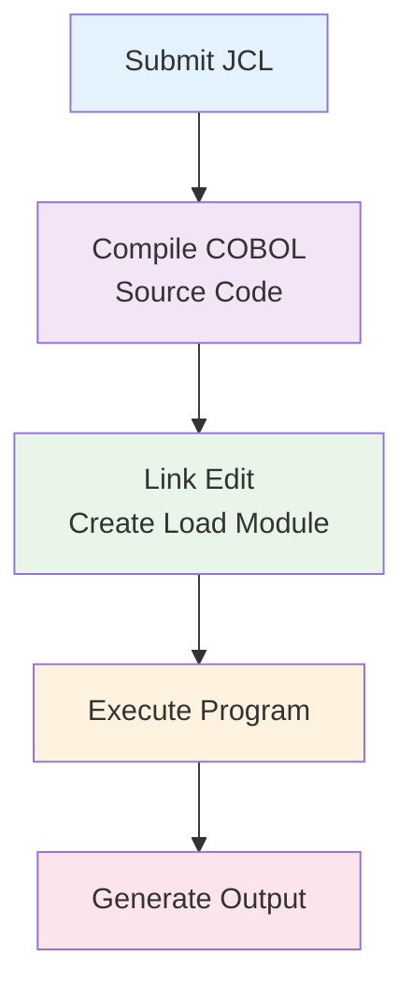

# JCL Files Documentation

## Overview

This directory contains Job Control Language (JCL) files that define how COBOL programs are compiled, linked, and executed on the mainframe system. Each JCL file corresponds to a specific COBOL program and defines the job execution environment.

## JCL File Categories

### Program Execution JCL Files
Each COBOL program has a corresponding JCL file following the pattern: `[PROGRAM]J.jcl`

#### Basic Program JCL
- **HELLOJ.jcl** - Execute HELLO.cobol program
- **CBL0001J.jcl** - Execute CBL0001.cobol program
- **CBL0002J.jcl** - Execute CBL0002.cobol program
- **PAYROL00.jcl** - Execute PAYROL00.cobol program

#### File Processing JCL
- **CBL0009J.jcl** - Execute CBL0009.cobol with file processing
- **CBL0010J.jcl** - Execute CBL0010.cobol with file processing
- **CBL0011J.jcl** - Execute CBL0011.cobol with file processing
- **CBL0012J.jcl** - Execute CBL0012.cobol with file processing

#### Utility and Search Program JCL
- **ADDAMT.jcl** - Execute ADDAMT.cobol calculation program
- **SRCHBINJ.jcl** - Execute SRCHBIN.cobol binary search
- **SRCHSERJ.jcl** - Execute SRCHSER.cobol sequential search

### JCL Procedure Files (jclproc/)
- **IGYWC.jcl** - Compile only procedure
- **IGYWCL.jcl** - Compile and link procedure
- **IGYWCLG.jcl** - Compile, link, and go (execute) procedure

## Common JCL Structure

### Standard Job Header
```jcl
//JOBNAME JOB 1,NOTIFY=&SYSUID
//***************************************************/
//* Copyright Contributors to the COBOL Programming Course 
//* SPDX-License-Identifier: CC-BY-4.0
//***************************************************/
```

### Typical Program Execution Steps
```jcl
//COBRUN  EXEC IGYWCL
//COBOL.SYSIN  DD DSN=&SYSUID..CBL(PROGRAM),DISP=SHR
//LKED.SYSLMOD DD DSN=&SYSUID..LOAD(PROGRAM),DISP=SHR
//*************************************************/
// IF RC = 0 THEN
//*************************************************/
//RUN     EXEC PGM=PROGRAM
//STEPLIB   DD DSN=&SYSUID..LOAD,DISP=SHR
//ACCTREC   DD DSN=&SYSUID..DATA,DISP=SHR
//PRTLINE   DD SYSOUT=*,OUTLIM=15000
//SYSOUT    DD SYSOUT=*,OUTLIM=15000
//CEEDUMP   DD DUMMY
//SYSUDUMP  DD DUMMY
//*************************************************/
// ELSE
// ENDIF
```

## JCL Components Explained

### Job Statement
- **Job Name**: Identifies the job in the system
- **NOTIFY=&SYSUID**: Sends completion notification to submitter
- **Priority and Class**: Job scheduling parameters

### Procedure Execution
- **EXEC IGYWCL**: Execute the compile and link procedure
- **EXEC IGYWCLG**: Execute compile, link, and go procedure

### Dataset Definitions (DD Statements)
- **COBOL.SYSIN**: Source code input
- **LKED.SYSLMOD**: Load module output
- **STEPLIB**: Load library for execution
- **ACCTREC**: Account record input file
- **PRTLINE**: Print line output file
- **SYSOUT**: System output
- **CEEDUMP/SYSUDUMP**: Dump datasets for debugging

### Conditional Processing
- **IF RC = 0 THEN**: Execute only if compilation successful
- **ELSE/ENDIF**: Error handling structure

## File Assignment Patterns

### Input Files
```jcl
//ACCTREC   DD DSN=&SYSUID..DATA,DISP=SHR
```
- Maps to COBOL `SELECT ACCT-REC ASSIGN TO ACCTREC`
- Uses user's data dataset
- Shared disposition for read access

### Output Files
```jcl
//PRTLINE   DD SYSOUT=*,OUTLIM=15000
```
- Maps to COBOL `SELECT PRINT-LINE ASSIGN TO PRTLINE`
- Directs output to system output
- Limits output to 15,000 lines

### Load Libraries
```jcl
//STEPLIB   DD DSN=&SYSUID..LOAD,DISP=SHR
```
- Specifies where to find executable programs
- Uses user's load library

## Procedure Files (jclproc/)

### IGYWC.jcl - Compile Only
```jcl
//IGYWC    PROC
//COMPILE  EXEC PGM=IGYCRCTL,PARM='...'
//SYSIN    DD DSN=&SYSUID..CBL(&MEMBER),DISP=SHR
//SYSPRINT DD SYSOUT=*
//SYSLIN   DD DSN=&SYSUID..OBJ(&MEMBER),DISP=(NEW,KEEP)
//         PEND
```

### IGYWCL.jcl - Compile and Link
```jcl
//IGYWCL   PROC
//COMPILE  EXEC PGM=IGYCRCTL,PARM='...'
//LINK     EXEC PGM=IEWL,PARM='...'
//SYSLMOD  DD DSN=&SYSUID..LOAD(&MEMBER),DISP=(NEW,KEEP)
//         PEND
```

### IGYWCLG.jcl - Compile, Link, and Go
```jcl
//IGYWCLG  PROC
//COMPILE  EXEC PGM=IGYCRCTL,PARM='...'
//LINK     EXEC PGM=IEWL,PARM='...'
//GO       EXEC PGM=&MEMBER
//         PEND
```

## Integration with COBOL Programs

### File Name Mapping
| COBOL SELECT Statement | JCL DD Statement | Purpose |
|------------------------|------------------|---------|
| `ASSIGN TO ACCTREC` | `//ACCTREC DD ...` | Input data file |
| `ASSIGN TO PRTLINE` | `//PRTLINE DD ...` | Output report file |
| `ASSIGN TO SYSIN` | `//SYSIN DD ...` | Standard input |
| `ASSIGN TO SYSOUT` | `//SYSOUT DD ...` | Standard output |

### Dataset Naming Conventions
- **&SYSUID**: Substituted with user ID
- **CBL**: Source code library
- **LOAD**: Executable program library
- **DATA**: Data file library
- **OBJ**: Object code library

## Job Execution Flow



## Error Handling

### Return Code Checking
- **RC = 0**: Successful completion
- **RC > 0**: Warning or error conditions
- **Conditional execution**: Prevents execution of failed compiles

### Debugging Support
- **CEEDUMP**: Language Environment dump
- **SYSUDUMP**: System dump for abends
- **SYSPRINT**: Compiler messages and listings

## Modernization Considerations

### Modern Equivalents
- **Container Orchestration**: Kubernetes jobs
- **CI/CD Pipelines**: Jenkins, GitLab CI
- **Build Systems**: Maven, Gradle, Make
- **Deployment**: Docker containers, cloud deployment

### Migration Strategy
1. **Containerization**: Convert JCL to container build scripts
2. **Automation**: Replace with modern CI/CD pipelines
3. **Cloud Migration**: Adapt for cloud-native deployment
4. **DevOps Integration**: Integrate with modern development workflows

---

*These JCL files represent traditional mainframe job control and execution patterns essential for understanding enterprise COBOL application deployment and execution.*