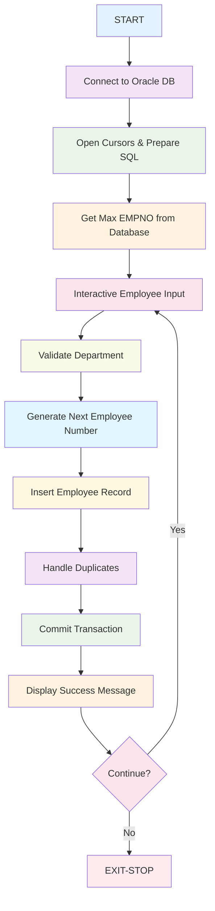

# CBDEM1.COB - Oracle Employee Database Management System

## Reference Documentation

### File Purpose
CBDEM1 is a comprehensive Oracle database integration program that provides employee management functionality. It allows users to add new employee records to an Oracle personnel database with automatic employee number generation and data integrity checking.

### Program Structure

#### Main Divisions
- **IDENTIFICATION DIVISION**: Program metadata and identification
- **ENVIRONMENT DIVISION**: Environment configuration (minimal)
- **DATA DIVISION**: Extensive data structure definitions for Oracle connectivity
- **PROCEDURE DIVISION**: Main program logic and Oracle database operations

#### Key Sections and Procedures

1. **BEGIN** - Main initialization and Oracle connection setup
2. **NEXT-EMP** - Interactive employee data collection loop
3. **ASK-DPT** - Department validation routine
4. **ADD-ROW** - Employee record insertion with duplicate handling
5. **PRINT-RESULT** - Success confirmation display
6. **EXIT-CLOSE** - Cursor cleanup
7. **EXIT-LOGOF** - Oracle disconnection
8. **EXIT-STOP** - Program termination
9. **ORA-ERROR** - Comprehensive error handling

### Data Structures

#### Oracle Connection Structures

```mermaid
classDiagram
    class LDA {
        +PIC S9(9) LDA-V2RC
        +PIC S9(9) LDA-RC
        +PIC X(512) HDA
    }
    
    class CURSOR-1 {
        +PIC S9(9) C-V2RC
        +PIC S9(9) C-TYPE
        +PIC S9(9) C-ROWS
        +PIC S9(9) C-OFFS
        +PIC S9(9) C-FNC
        +PIC S9(9) C-RC
    }
    
    class CURSOR-2 {
        +PIC S9(9) C-V2RC
        +PIC S9(9) C-TYPE
        +PIC S9(9) C-ROWS
        +PIC S9(9) C-OFFS
        +PIC S9(9) C-FNC
        +PIC S9(9) C-RC
    }
    
    LDA ||--|| CURSOR-1 : uses
    LDA ||--|| CURSOR-2 : uses
```

#### Authentication Data
```
USER-ID          PIC X(5)   VALUE "SCOTT"
PSW              PIC X(5)   VALUE "tiger"
CONN             PIC S9(9)  VALUE 0
CONN-MODE        PIC S9(9)  VALUE 0
```

#### SQL Statements
```
SQL-SEL          - Department lookup: "SELECT DNAME FROM DEPT WHERE DEPTNO=:1"
SQL-INS          - Employee insertion: "INSERT INTO EMP (EMPNO,ENAME,JOB,SAL,DEPTNO) VALUES (:EMPNO,:ENAME,:JOB,:SAL,:DEPTNO)"
SQL-SELMAX       - Max employee number: "SELECT NVL(MAX(EMPNO),0) FROM EMP"
SQL-SELEMP       - Employee metadata: "SELECT ENAME,JOB FROM EMP"
```

#### Employee Data Fields

```mermaid
classDiagram
    class Employee {
        +PIC S9(9) COMP EMPNO
        +PIC X(12) ENAME
        +PIC X(12) JOB
        +PIC X(10) SAL
        +PIC X(10) DEPTNO
        +PIC X(15) DNAME
        +validateDepartment()
        +generateEmployeeNumber()
        +insertRecord()
    }
    
    class Department {
        +PIC X(10) DEPTNO
        +PIC X(15) DNAME
        +validate()
    }
    
    Employee ||--|| Department : belongs_to
```

### External Dependencies

#### Oracle Call Interface (OCI) Functions
- **OLOG** - Oracle login/connection
- **OOPEN** - Open cursor
- **OCOF** - Disable auto-commit
- **OPARSE** - Parse SQL statement
- **ODESCR** - Describe column attributes
- **ODEFIN** - Define output variables
- **OBNDRV** - Bind input variables
- **OEXEC** - Execute SQL statement
- **OFETCH** - Fetch result rows
- **OCOM** - Commit transaction
- **OCLOSE** - Close cursor
- **OLOGOF** - Oracle logoff
- **OERHMS** - Get error message

#### Database Tables
- **EMP** (Employee table)
  - EMPNO (Primary Key)
  - ENAME
  - JOB
  - SAL
  - DEPTNO (Foreign Key)
- **DEPT** (Department table)
  - DEPTNO (Primary Key)
  - DNAME

### Input/Output Specifications

#### User Inputs (Interactive)
1. **Employee Name** (required) - Empty input exits program
2. **Employee Job** (required)
3. **Employee Salary** (required)
4. **Department Number** (required, validated against DEPT table)

#### System Outputs
- Connection confirmation
- Employee addition confirmation with generated employee number
- Error messages for invalid departments or system errors
- Program termination message

## Explanation Documentation

### Design Rationale

This program implements a robust employee management system with the following design principles:

1. **Data Integrity**: Validates department numbers against the DEPT table
2. **Automatic Key Generation**: Finds maximum EMPNO and generates sequential numbers
3. **Duplicate Handling**: Automatically skips duplicate employee numbers
4. **Transaction Safety**: Uses explicit commit/rollback mechanisms
5. **Error Resilience**: Comprehensive error handling for all Oracle operations

### Business Logic Flow



### Data Flow Architecture

The program follows a traditional mainframe data processing pattern:

1. **Connection Layer**: Manages Oracle database connectivity using OCI
2. **Data Validation Layer**: Ensures referential integrity with department validation
3. **Business Logic Layer**: Handles employee number generation and insertion logic
4. **Transaction Layer**: Manages database commits and rollbacks
5. **Presentation Layer**: Provides user interaction and feedback

### Integration Points

#### Database Integration
- **Primary Integration**: Oracle database via OCI (Oracle Call Interface)
- **Tables Accessed**: EMP (read/write), DEPT (read-only)
- **Transaction Management**: Explicit commit/rollback control

#### System Dependencies
- **Operating System**: Mainframe/z/OS environment
- **Database**: Oracle with OCI libraries
- **Authentication**: Hardcoded SCOTT/tiger credentials (security concern)

### Error Handling Strategy

The program implements comprehensive error handling:

1. **Connection Errors**: Handled during Oracle login process
2. **SQL Errors**: Caught and reported for all database operations
3. **Data Validation Errors**: Department number validation with retry capability
4. **Resource Management**: Proper cursor and connection cleanup
5. **User Errors**: Graceful handling of invalid inputs

### Security Considerations

**Current Issues:**
- Hardcoded database credentials (SCOTT/tiger)
- No input validation beyond department existence
- No authentication/authorization mechanisms

**Recommended Improvements:**
- Implement external credential management
- Add input sanitization
- Implement user authentication
- Add audit logging

### Performance Characteristics

- **Interactive Processing**: Synchronous user input processing
- **Database Efficiency**: Uses prepared statements and bound variables
- **Memory Usage**: Minimal working storage requirements
- **Scalability**: Single-user interactive application

---

*This program represents a classic example of mainframe database integration using COBOL and Oracle OCI, demonstrating traditional transaction processing patterns common in enterprise systems.*