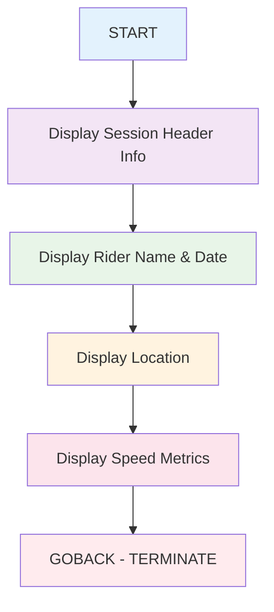

# WINDSURF.COB - Windsurf Session Tracking Application

## Reference Documentation

### File Purpose
WINDSURF.COB is a specialized COBOL program designed to track and display windsurf session performance metrics. It stores session information, equipment details, and performance data for a windsurfer, providing a comprehensive view of a single windsurf session.

### Program Structure

#### Main Divisions
- **IDENTIFICATION DIVISION**: Program metadata (PROGRAM-ID: WINDSURF)
- **ENVIRONMENT DIVISION**: Minimal environment configuration
- **DATA DIVISION**: Complex data structure for windsurf session tracking
- **PROCEDURE DIVISION**: Simple display logic for session information

#### Key Sections
1. **Main Program Flow** - Sequential display of session details
2. **GOBACK** - Program termination

### Data Structures

#### Main Data Structure: WINDSURF-SESSION

```mermaid
classDiagram
    class WINDSURF-SESSION {
        <<record>>
    }
    
    class SESSION-INFO {
        +PIC X(30) RIDER-NAME : "Damien Henry"
        +PIC X(10) SESSION-DATE : "31/07/2023"  
        +PIC X(30) SESSION-LOCATION : "Pont-Mahe"
        +PIC X(10) SESSION-TYPE : "Slalom"
    }
    
    class EQUIPMENT-INFO {
        +PIC X(20) BOARD-TYPE : (Not initialized)
        +PIC X(20) SAIL-SIZE : (Not initialized)
        +PIC X(20) FIN-TYPE : (Not initialized)
        +PIC X(10) GPS-MODEL : "GW-60"
    }
    
    class PERFORMANCE-METRICS {
        +PIC 99V99 MAX-2S : 31.93 knots
        +PIC 99V99 VMAX : 31.98 knots
        +PIC 99V99 AVG-10S : 30.44 knots
    }
    
    class DISTANCE-MARKS {
        +PIC 99V99 MARK-100M : 30.54 knots
        +PIC 99V99 MARK-250M : 30.87 knots
        +PIC 99V99 MARK-500M : 30.02 knots
    }
    
    class TIME-SPLITS {
        +PIC 99V99 NAUTICAL-MILE : 24.04 knots
        +PIC 99V99 MARK-30MIN : 15.34 knots
        +PIC 99V99 MARK-1HOUR : 12.82 knots
    }
    
    class SESSION-TOTALS {
        +PIC 999 ALPHA-500 : (Not initialized)
        +PIC 999V99 TOTAL-DISTANCE : 71.98 km
        +PIC X(4) SESSION-DURATION : "4h7"
    }
    
    WINDSURF-SESSION ||--|| SESSION-INFO
    WINDSURF-SESSION ||--|| EQUIPMENT-INFO
    WINDSURF-SESSION ||--|| PERFORMANCE-METRICS
    WINDSURF-SESSION ||--|| SESSION-TOTALS
    PERFORMANCE-METRICS ||--|| DISTANCE-MARKS
    PERFORMANCE-METRICS ||--|| TIME-SPLITS
```

### External Dependencies
- **None**: This is a standalone program with no external file dependencies
- **System Dependencies**: Standard COBOL runtime environment
- **Hardware**: Compatible with mainframe/z/OS systems

### Input/Output Specifications

#### Inputs
- **None**: All data is hardcoded within the program

#### Outputs
- **DISPLAY statements**: Console output showing session details
  - Rider name
  - Session date
  - Location
  - Maximum speed (2-second average)
  - VMax (absolute maximum speed)
  - Average speed (10-second average)

## Explanation Documentation

### Design Rationale

This program serves as a **data demonstration and reporting tool** with the following characteristics:

1. **Static Data Model**: Represents a specific windsurf session with hardcoded values
2. **Performance Tracking**: Captures various speed metrics important to windsurfers
3. **Equipment Tracking**: Provides structure for equipment information (though not fully utilized)
4. **Session Summary**: Consolidates key performance indicators

### Business Logic Flow



### Data Flow Architecture

The program follows a simple **read-only data presentation pattern**:

1. **Data Storage Layer**: Working-storage section contains all session data
2. **Presentation Layer**: PROCEDURE DIVISION formats and displays the data
3. **No Processing Layer**: No calculations or data transformations occur

### Windsurf Performance Metrics Explained

#### Speed Measurements
- **MAX-2S (31.93 knots)**: Maximum speed averaged over 2 seconds - represents peak performance
- **VMAX (31.98 knots)**: Absolute maximum speed recorded - single GPS reading
- **AVG-10S (30.44 knots)**: Average speed over 10 seconds - sustainable high speed

#### Distance Marks
- **MARK-100M through MARK-500M**: Speed measurements over specific distance intervals
- **Purpose**: Different distances favor different sailing techniques and conditions

#### Time Splits
- **NAUTICAL-MILE**: Average speed over one nautical mile
- **MARK-30MIN/1HOUR**: Longer duration averages showing endurance performance

### Integration Points

#### Current State
- **Standalone Application**: No external system integration
- **Console Output Only**: Results displayed to terminal/console
- **Static Data**: No dynamic data input or file processing

#### Potential Enhancements
- **GPS Integration**: Could read from GPS device files
- **Database Storage**: Session data could be persisted to database
- **Report Generation**: Could output formatted reports to files
- **Comparative Analysis**: Could compare multiple sessions

### Technical Characteristics

#### Data Types Used
- **PIC X(n)**: Character fields for names, dates, and text
- **PIC 99V99**: Numeric fields with 2 decimal places for speeds
- **PIC 999V99**: Larger numeric fields for distances
- **PIC 999**: Integer fields for counts/indexes

#### Memory Usage
- **Minimal**: Single working-storage record structure
- **Fixed Size**: All fields have defined maximum lengths
- **Static**: No dynamic memory allocation

### Use Cases

1. **Educational**: Demonstrates COBOL data structure definition
2. **Prototype**: Template for windsurf session tracking system
3. **Testing**: Simple program for testing COBOL compilation and execution
4. **Documentation**: Example of performance metrics data modeling

### Modernization Considerations

For migration to modern languages, consider:

1. **Data Modeling**: The hierarchical structure maps well to JSON/XML
2. **Object-Oriented Design**: Could become a Session class with methods
3. **Database Schema**: Fields could directly map to relational table columns
4. **API Design**: Structure suitable for REST API data representation

---

*This program demonstrates classic COBOL programming practices for structured data representation and simple output formatting, making it an excellent example for understanding COBOL data organization principles.*