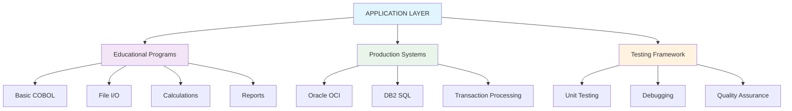
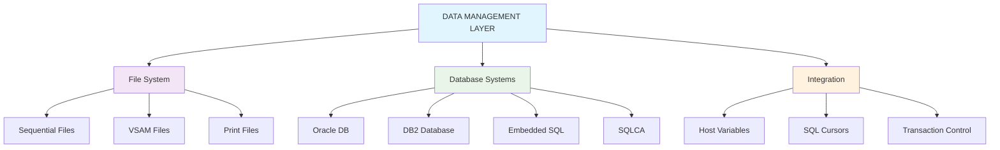
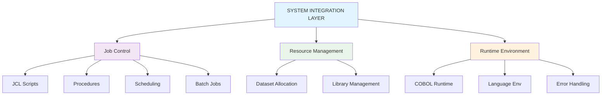
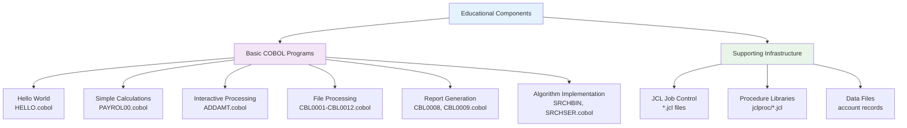
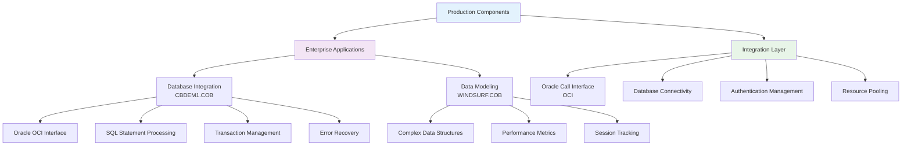
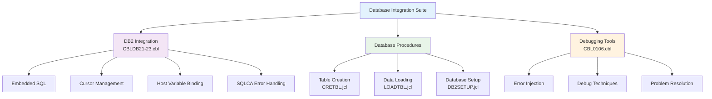
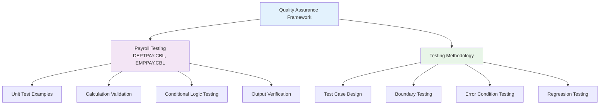
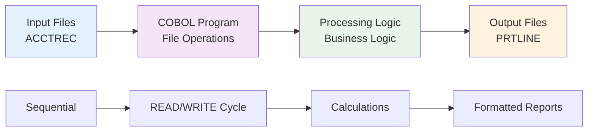
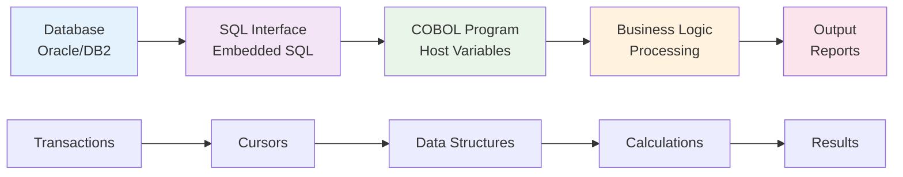
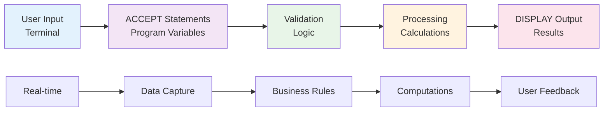

# Architectural Overview - COBOL Application Suite

## Executive Summary

This repository contains a comprehensive COBOL application suite spanning from educational examples to production-ready enterprise systems. The architecture demonstrates traditional mainframe development patterns, database integration, and system integration approaches that are fundamental to understanding legacy enterprise systems.

## System Architecture Layers

### 1. Application Layer



### 2. Data Management Layer



### 3. System Integration Layer



## Component Architecture

### Educational Components (Course #1 & #2)



### Production Components (ORCL_COBOL)



### Advanced Components (Course #3)



### Testing Components (Course #4)



## Data Flow Architecture

### Traditional File Processing Flow



### Database Integration Flow



### Interactive Processing Flow



## Integration Patterns

### Database Integration Pattern
```cobol
EXEC SQL INCLUDE SQLCA END-EXEC.
EXEC SQL DECLARE CURSOR C1 FOR
    SELECT * FROM TABLE_NAME
    WHERE CONDITION = :HOST-VARIABLE
END-EXEC.

EXEC SQL OPEN C1 END-EXEC.
PERFORM UNTIL SQLCODE NOT = 0
    EXEC SQL FETCH C1 INTO :HOST-VARIABLES END-EXEC
    IF SQLCODE = 0
        PERFORM PROCESS-RECORD
    END-IF
END-PERFORM.
EXEC SQL CLOSE C1 END-EXEC.
```

### File Processing Pattern
```cobol
OPEN INPUT INPUT-FILE
OPEN OUTPUT OUTPUT-FILE

PERFORM READ-RECORD
PERFORM UNTIL EOF-FLAG = 'Y'
    PERFORM PROCESS-RECORD
    PERFORM WRITE-RECORD
    PERFORM READ-RECORD
END-PERFORM

CLOSE INPUT-FILE
CLOSE OUTPUT-FILE
```

### Error Handling Pattern
```cobol
PERFORM OPERATION
IF RETURN-CODE NOT = 0
    PERFORM ERROR-HANDLER
    IF RETRY-ALLOWED
        PERFORM RETRY-OPERATION
    ELSE
        PERFORM TERMINATE-PROGRAM
    END-IF
END-IF
```

## System Dependencies

### Runtime Environment
- **COBOL Compiler**: IBM Enterprise COBOL
- **Runtime System**: Language Environment (LE)
- **Operating System**: z/OS Mainframe
- **Job Control**: JES2/JES3 Job Entry Subsystem

### Database Systems
- **Oracle Database**: With OCI (Oracle Call Interface)
- **IBM DB2**: With embedded SQL support
- **File Systems**: VSAM, Sequential files, Print datasets

### Development Tools
- **Source Management**: PDS (Partitioned Data Sets)
- **Compilation**: COBOL compiler with SQL preprocessor
- **Link Editing**: System link editor
- **Debugging**: Interactive debugging facilities

## Security Architecture

### Access Control
- **Dataset Security**: RACF/ACF2/Top Secret integration
- **Database Security**: Oracle/DB2 user authentication
- **Program Security**: Load module protection
- **Resource Security**: File and system resource access control

### Data Protection
- **Encryption**: Database field encryption (where implemented)
- **Audit Trails**: Transaction logging and monitoring
- **Backup/Recovery**: Database and file backup procedures
- **Data Integrity**: Transaction consistency and rollback

## Performance Characteristics

### Batch Processing
- **Throughput**: High-volume sequential processing
- **Resource Usage**: Efficient memory and CPU utilization
- **Scalability**: Linear scaling with data volume
- **Reliability**: Robust error handling and recovery

### Interactive Processing
- **Response Time**: Sub-second response for simple operations
- **Concurrency**: Single-user interactive sessions
- **Resource Sharing**: Shared system resources
- **User Experience**: Terminal-based interaction

### Database Operations
- **Query Performance**: Optimized SQL execution
- **Transaction Processing**: ACID compliance
- **Connection Management**: Efficient resource utilization
- **Data Integrity**: Referential integrity enforcement

## Modernization Architecture

### Current State Assessment
```
Mainframe COBOL → Database Integration → JCL Batch Processing
       ↓                    ↓                    ↓
Legacy Systems → Embedded SQL → Job Scheduling
       ↓                    ↓                    ↓
Monolithic Apps → Tight Coupling → Batch-Oriented
```

### Target State Vision
```
Microservices → API Integration → Event-Driven Processing
      ↓               ↓                    ↓
Cloud Native → RESTful Services → Real-time Processing
      ↓               ↓                    ↓
Containerized → Loose Coupling → Stream Processing
```

### Migration Strategy
1. **Data Layer**: Database modernization and cloud migration
2. **Application Layer**: Service decomposition and containerization
3. **Integration Layer**: API-first design and event streaming
4. **User Interface**: Web-based and mobile interfaces
5. **Operations**: DevOps and continuous deployment

## Quality Attributes

### Maintainability
- **Code Structure**: Well-organized program divisions
- **Documentation**: Comprehensive inline comments
- **Modularity**: Reusable paragraph structures
- **Standards Compliance**: COBOL programming standards

### Reliability
- **Error Handling**: Comprehensive error detection and recovery
- **Resource Management**: Proper file and database resource cleanup
- **Transaction Integrity**: Consistent transaction processing
- **Fault Tolerance**: Graceful failure handling

### Performance
- **Efficiency**: Optimized algorithms and data structures
- **Scalability**: Designed for high-volume processing
- **Resource Utilization**: Efficient memory and CPU usage
- **Response Time**: Acceptable performance characteristics

### Security
- **Authentication**: User and system authentication
- **Authorization**: Access control and permissions
- **Data Protection**: Sensitive data handling
- **Audit Compliance**: Logging and monitoring capabilities

---

*This architectural overview provides a comprehensive understanding of the COBOL application suite, serving as a foundation for system analysis, maintenance, and modernization planning.*