# COBOL to Java Modernization Roadmap

## Table of Contents

- [Overview](#overview)
- [Modernization Strategy](#modernization-strategy)
- [Phase 1: Assessment and Planning](#phase-1-assessment-and-planning)
- [Phase 2: Infrastructure Setup](#phase-2-infrastructure-setup)
- [Phase 3: Database Modernization](#phase-3-database-modernization)
- [Phase 4: Business Logic Migration](#phase-4-business-logic-migration)
- [Phase 5: Testing and Validation](#phase-5-testing-and-validation)
- [Phase 6: Deployment and Migration](#phase-6-deployment-and-migration)
- [Risk Mitigation](#risk-mitigation)
- [Success Metrics](#success-metrics)

## Overview

This roadmap provides a structured approach to modernizing the COBOL/JCL codebase to Java. The strategy focuses on minimizing risk while maximizing business value.

### Current State

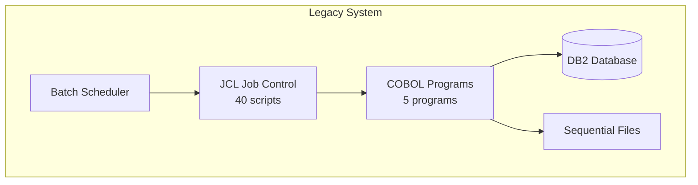

### Target State

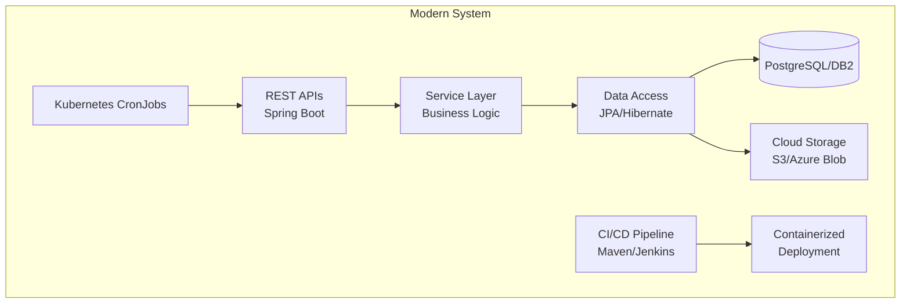

## Modernization Strategy

### Approach: Strangler Fig Pattern

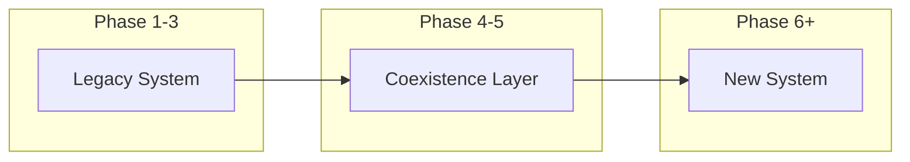

**Benefits**:
- ✅ Incremental migration reduces risk
- ✅ Systems run in parallel during transition
- ✅ Rollback capability at each step
- ✅ Business continuity maintained

### Migration Order (Recommended)

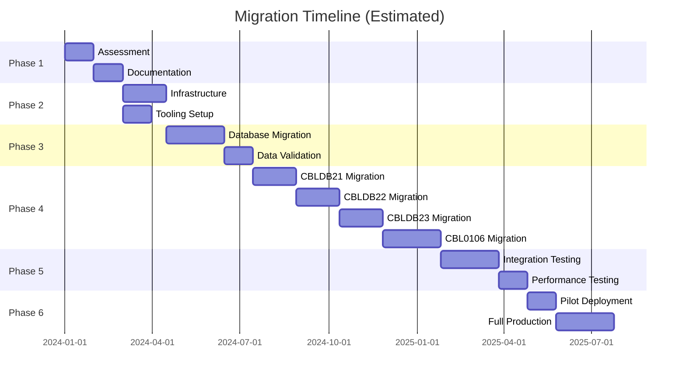

## Phase 1: Assessment and Planning

**Duration**: 6-8 weeks  
**Key Activities**: Analyze, document, and plan

### Week 1-2: Code Analysis

- [ ] Complete code inventory
  - [x] 5 COBOL programs identified
  - [x] 40 JCL scripts identified
  - [ ] Dependencies mapped
  - [ ] Data flows documented
- [ ] Identify business rules
  - [ ] Extract from COBOL logic
  - [ ] Document decision tables
  - [ ] Validate with business owners
- [ ] Assess technical debt
  - [x] Buffer overflow bug in CBL0106 identified
  - [ ] Performance bottlenecks identified
  - [ ] Security vulnerabilities cataloged

### Week 3-4: Database Assessment

- [ ] DB2 schema analysis
  - [ ] Table structures documented
  - [ ] Relationships mapped
  - [ ] Stored procedures inventoried
  - [ ] Data volumes measured
- [ ] Data quality analysis
  - [ ] Identify data issues
  - [ ] Plan data cleansing
  - [ ] Design validation rules

### Week 5-6: Technology Selection

- [ ] Choose target platform
  - [ ] Java version (recommend: Java 17 LTS)
  - [ ] Spring Boot version (recommend: 3.x)
  - [ ] Database (DB2, PostgreSQL, or Oracle)
  - [ ] Cloud provider (AWS, Azure, GCP, or on-prem)
- [ ] Select supporting tools
  - [ ] Build tool: Maven or Gradle
  - [ ] Testing: JUnit 5, Mockito, TestContainers
  - [ ] CI/CD: Jenkins, GitLab CI, or GitHub Actions
  - [ ] Monitoring: Prometheus, Grafana, ELK Stack

### Week 7-8: Create Migration Plan

- [ ] Define success criteria
- [ ] Establish timelines
- [ ] Allocate resources
- [ ] Identify risks
- [ ] Plan training

### Deliverables

- ✅ Code documentation (this repository)
- [ ] Technical architecture document
- [ ] Migration plan with timeline
- [ ] Risk register
- [ ] Resource plan

## Phase 2: Infrastructure Setup

**Duration**: 6-8 weeks  
**Key Activities**: Build foundation for modern application

### Development Environment

```yaml
# docker-compose.yml for local development
version: '3.8'
services:
  postgres:
    image: postgres:15
    environment:
      POSTGRES_DB: customer_accounts
      POSTGRES_USER: appuser
      POSTGRES_PASSWORD: secret
    ports:
      - "5432:5432"
  
  app:
    build: .
    ports:
      - "8080:8080"
    environment:
      SPRING_DATASOURCE_URL: jdbc:postgresql://postgres:5432/customer_accounts
    depends_on:
      - postgres
```

### Setup Tasks

- [ ] Version control
  - [ ] Create Git repositories
  - [ ] Define branching strategy
  - [ ] Setup code review process
- [ ] Build automation
  - [ ] Configure Maven/Gradle
  - [ ] Setup dependency management
  - [ ] Create build profiles (dev, test, prod)
- [ ] CI/CD pipeline
  - [ ] Automated builds
  - [ ] Unit test execution
  - [ ] Code quality checks (SonarQube)
  - [ ] Security scanning
  - [ ] Automated deployment to test
- [ ] Development environment
  - [ ] Local database setup
  - [ ] IDE configuration (IntelliJ/Eclipse/VS Code)
  - [ ] Debugging tools
  - [ ] Docker containers

### Project Structure

```
customer-account-system/
├── pom.xml
├── src/
│   ├── main/
│   │   ├── java/
│   │   │   └── com/example/accounts/
│   │   │       ├── entity/          # JPA entities
│   │   │       ├── repository/      # Data access
│   │   │       ├── service/         # Business logic
│   │   │       ├── controller/      # REST endpoints
│   │   │       ├── dto/             # Data transfer objects
│   │   │       ├── config/          # Configuration
│   │   │       └── exception/       # Error handling
│   │   └── resources/
│   │       ├── application.yml
│   │       ├── schema.sql
│   │       └── data.sql
│   └── test/
│       ├── java/                    # Unit tests
│       └── resources/               # Test data
├── docker/
│   ├── Dockerfile
│   └── docker-compose.yml
└── docs/
    ├── api/                         # API documentation
    └── architecture/                # Architecture docs
```

### Deliverables

- [ ] Working development environment
- [ ] CI/CD pipeline operational
- [ ] Project skeleton created
- [ ] Build and deployment automation

## Phase 3: Database Modernization

**Duration**: 8-12 weeks  
**Key Activities**: Migrate or modernize database layer

### Database Options

#### Option A: Keep DB2

**Pros**:
- ✅ No data migration needed
- ✅ Existing expertise
- ✅ Proven reliability

**Cons**:
- ❌ Mainframe licensing costs
- ❌ Limited cloud options
- ❌ Developer unfamiliarity

#### Option B: Migrate to PostgreSQL

**Pros**:
- ✅ Open source (no licensing)
- ✅ Excellent performance
- ✅ Rich ecosystem
- ✅ Cloud-native options

**Cons**:
- ❌ Data migration required
- ❌ Application changes needed
- ❌ Team retraining

#### Option C: Hybrid (Recommended)

1. Start with DB2 (minimize initial risk)
2. Create abstraction layer (JPA)
3. Migrate to PostgreSQL later

### Database Tasks

- [ ] Schema migration
  ```sql
  -- Convert DB2 schema to target database
  CREATE TABLE customer_accounts (
      account_no     VARCHAR(8) PRIMARY KEY,
      credit_limit   DECIMAL(9,2),
      balance        DECIMAL(9,2),
      surname        VARCHAR(20) NOT NULL,
      first_name     VARCHAR(15) NOT NULL,
      address1       VARCHAR(25) NOT NULL,
      address2       VARCHAR(20) NOT NULL,
      address3       VARCHAR(15) NOT NULL,
      reserved       VARCHAR(7),
      comments       VARCHAR(50),
      created_at     TIMESTAMP DEFAULT CURRENT_TIMESTAMP,
      updated_at     TIMESTAMP DEFAULT CURRENT_TIMESTAMP
  );
  
  CREATE INDEX idx_surname ON customer_accounts(surname);
  CREATE INDEX idx_address3 ON customer_accounts(address3);
  ```

- [ ] Data migration
  - [ ] Extract data from DB2
  - [ ] Transform data types (COMP-3 → DECIMAL)
  - [ ] Load into target database
  - [ ] Validate data integrity
  - [ ] Verify record counts

- [ ] Create JPA entities
  ```java
  @Entity
  @Table(name = "customer_accounts")
  public class CustomerAccount {
      @Id
      @Column(name = "account_no", length = 8)
      private String accountNumber;
      
      @Column(name = "credit_limit", precision = 9, scale = 2)
      private BigDecimal creditLimit;
      
      // ... other fields
      
      @Column(name = "created_at")
      private LocalDateTime createdAt;
      
      @Column(name = "updated_at")
      private LocalDateTime updatedAt;
  }
  ```

- [ ] Build data access layer
  ```java
  @Repository
  public interface CustomerAccountRepository 
          extends JpaRepository<CustomerAccount, String> {
      List<CustomerAccount> findBySurname(String surname);
      List<CustomerAccount> findByAddress3(String state);
      
      @Query("SELECT c FROM CustomerAccount c WHERE c.balance > c.creditLimit")
      List<CustomerAccount> findOverlimitAccounts();
  }
  ```

### Data Migration Strategy

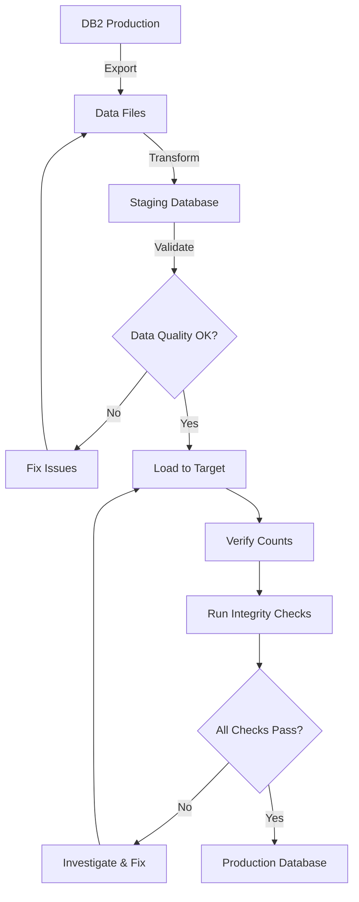

### Deliverables

- [ ] Migrated database schema
- [ ] Validated data in target database
- [ ] JPA entities for all tables
- [ ] Repository interfaces
- [ ] Database access integration tests

## Phase 4: Business Logic Migration

**Duration**: 16-20 weeks  
**Key Activities**: Convert COBOL programs to Java services

### Migration Priority

1. **CBLDB21** (Simple query) - 4 weeks
2. **CBLDB22** (Filtered query) - 4 weeks
3. **CBLDB23** (State filter) - 4 weeks
4. **CBL0106/CBL0106C** (Complex file processing) - 6-8 weeks

### Per-Program Migration Process

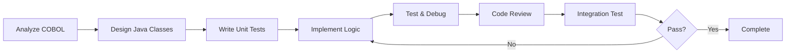

### CBLDB21 Migration Example

#### Step 1: Create Service

```java
@Service
@Slf4j
public class CustomerReportService {
    
    @Autowired
    private CustomerAccountRepository repository;
    
    @Autowired
    private ReportFormatter formatter;
    
    /**
     * Generate full customer report
     * Replaces: CBLDB21.cbl
     */
    public void generateCustomerReport(Path outputFile) throws IOException {
        log.info("Generating customer report to: {}", outputFile);
        
        try (BufferedWriter writer = Files.newBufferedWriter(outputFile)) {
            List<CustomerAccount> accounts = repository.findAll();
            log.info("Retrieved {} customer accounts", accounts.size());
            
            for (CustomerAccount account : accounts) {
                String line = formatter.formatCustomerLine(account);
                writer.write(line);
                writer.newLine();
                writer.newLine(); // COBOL: AFTER ADVANCING 2 LINES
            }
            
            log.info("Report generated successfully");
        } catch (DataAccessException e) {
            log.error("Database error generating report", e);
            throw new ReportGenerationException("Failed to generate report", e);
        }
    }
}
```

#### Step 2: Create Tests

```java
@SpringBootTest
class CustomerReportServiceTest {
    
    @Autowired
    private CustomerReportService service;
    
    @MockBean
    private CustomerAccountRepository repository;
    
    @Test
    void testGenerateReport() throws IOException {
        // Arrange
        List<CustomerAccount> mockData = createMockAccounts();
        when(repository.findAll()).thenReturn(mockData);
        
        Path outputFile = Files.createTempFile("report", ".txt");
        
        // Act
        service.generateCustomerReport(outputFile);
        
        // Assert
        List<String> lines = Files.readAllLines(outputFile);
        assertEquals(mockData.size() * 2, lines.size());
        
        Files.deleteIfExists(outputFile);
    }
}
```

#### Step 3: Create REST API

```java
@RestController
@RequestMapping("/api/reports")
public class ReportController {
    
    @Autowired
    private CustomerReportService reportService;
    
    @GetMapping("/customers")
    public ResponseEntity<byte[]> generateCustomerReport() {
        try {
            Path tempFile = Files.createTempFile("report", ".txt");
            reportService.generateCustomerReport(tempFile);
            
            byte[] content = Files.readAllBytes(tempFile);
            Files.deleteIfExists(tempFile);
            
            HttpHeaders headers = new HttpHeaders();
            headers.setContentType(MediaType.TEXT_PLAIN);
            headers.setContentDispositionFormData("attachment", 
                "customer-report.txt");
            
            return new ResponseEntity<>(content, headers, HttpStatus.OK);
        } catch (IOException e) {
            return ResponseEntity.internalServerError().build();
        }
    }
}
```

### Replacing JCL Jobs

#### Original JCL (CBLDB21C.jcl)

```jcl
//CBLDB21C JOB 1,NOTIFY=&SYSUID
//COMPILE  EXEC DB2CBL,MBR=CBLDB21
//BIND.SYSTSIN  DD *
 DSN SYSTEM(DBCG)
 BIND PLAN(&SYSUID) PKLIST(&SYSUID..*) MEMBER(CBLDB21)
/*
```

#### Modern Equivalent

**Option 1: Kubernetes CronJob**

```yaml
apiVersion: batch/v1
kind: CronJob
metadata:
  name: customer-report-job
spec:
  schedule: "0 2 * * *"  # Run at 2 AM daily
  jobTemplate:
    spec:
      template:
        spec:
          containers:
          - name: report-generator
            image: customer-account-service:latest
            command: ["java"]
            args: ["-jar", "app.jar", "--job=customer-report"]
            env:
            - name: SPRING_PROFILES_ACTIVE
              value: "production"
          restartPolicy: OnFailure
```

**Option 2: Shell Script with Cron**

```bash
#!/bin/bash
# customer-report.sh

# Run the report generation
java -jar customer-account-service.jar \
  --spring.profiles.active=production \
  --job.name=customer-report \
  --output.file=/reports/customer-report-$(date +%Y%m%d).txt

# Check exit status
if [ $? -eq 0 ]; then
  echo "Report generated successfully"
  exit 0
else
  echo "Report generation failed"
  exit 1
fi
```

**Option 3: Spring Batch**

```java
@Configuration
@EnableBatchProcessing
public class ReportBatchConfig {
    
    @Bean
    public Job customerReportJob(JobBuilderFactory jobs, 
                                  Step reportGenerationStep) {
        return jobs.get("customerReportJob")
            .start(reportGenerationStep)
            .build();
    }
    
    @Bean
    public Step reportGenerationStep(StepBuilderFactory steps,
                                      CustomerReportTasklet tasklet) {
        return steps.get("reportGenerationStep")
            .tasklet(tasklet)
            .build();
    }
}

@Component
public class CustomerReportTasklet implements Tasklet {
    
    @Autowired
    private CustomerReportService reportService;
    
    @Override
    public RepeatStatus execute(StepContribution contribution, 
                                ChunkContext context) throws Exception {
        Path outputFile = Paths.get("/reports/customer-report.txt");
        reportService.generateCustomerReport(outputFile);
        return RepeatStatus.FINISHED;
    }
}
```

### Deliverables

- [ ] All COBOL programs converted to Java services
- [ ] Unit tests with >80% coverage
- [ ] Integration tests for each service
- [ ] REST APIs for each function
- [ ] Batch jobs to replace JCL
- [ ] API documentation (Swagger/OpenAPI)

## Phase 5: Testing and Validation

**Duration**: 8-12 weeks  
**Key Activities**: Comprehensive testing before production

### Testing Strategy

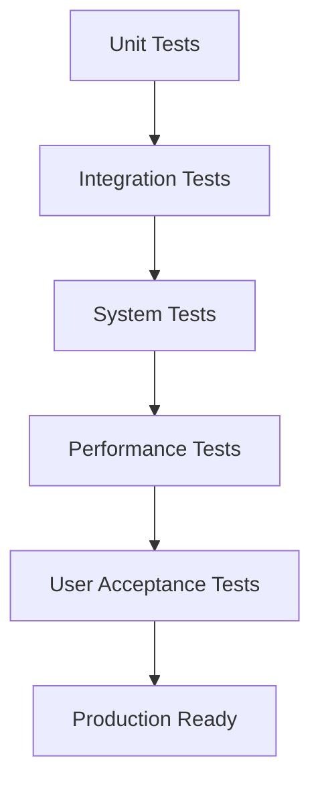

### Test Types

#### Unit Tests (Week 1-2)

```java
@Test
void testOverlimitDetection() {
    CustomerAccount account = new CustomerAccount();
    account.setCreditLimit(new BigDecimal("5000.00"));
    account.setBalance(new BigDecimal("6000.00"));
    
    assertTrue(account.isOverlimit());
}
```

**Targets**:
- [ ] >80% code coverage
- [ ] All business rules tested
- [ ] Edge cases covered

#### Integration Tests (Week 3-4)

```java
@SpringBootTest
@Testcontainers
class CustomerReportServiceIntegrationTest {
    
    @Container
    static PostgreSQLContainer<?> postgres = 
        new PostgreSQLContainer<>("postgres:15");
    
    @Test
    void testEndToEndReportGeneration() {
        // Test with real database
    }
}
```

**Targets**:
- [ ] Database operations
- [ ] File I/O
- [ ] External service calls

#### System Tests (Week 5-6)

- [ ] End-to-end workflows
- [ ] Data flow validation
- [ ] Error handling
- [ ] Recovery procedures

#### Performance Tests (Week 7-8)

```java
@Test
void testReportGenerationPerformance() {
    // Load test data
    createTestAccounts(10000);
    
    long startTime = System.currentTimeMillis();
    service.generateCustomerReport(outputFile);
    long duration = System.currentTimeMillis() - startTime;
    
    // Should complete in under 5 seconds for 10K records
    assertTrue(duration < 5000, 
        "Report generation took " + duration + "ms");
}
```

**Targets**:
- [ ] Response times ≤ legacy system
- [ ] Handle production data volumes
- [ ] Concurrent user load
- [ ] Memory usage acceptable

#### Data Validation (Week 9-10)

```java
@Test
void testDataMigrationAccuracy() {
    // Compare legacy vs new system output
    List<String> legacyOutput = readLegacyReport();
    List<String> newOutput = generateNewReport();
    
    assertEquals(legacyOutput.size(), newOutput.size());
    
    for (int i = 0; i < legacyOutput.size(); i++) {
        assertAccountDataMatches(
            parseLegacyLine(legacyOutput.get(i)),
            parseNewLine(newOutput.get(i))
        );
    }
}
```

**Checks**:
- [ ] Record counts match
- [ ] Calculated values match
- [ ] Report formats acceptable
- [ ] Business rules preserved

#### User Acceptance Testing (Week 11-12)

- [ ] Business users validate reports
- [ ] Verify all use cases work
- [ ] Confirm UI/UX acceptable
- [ ] Sign-off from stakeholders

### Deliverables

- [ ] Complete test suite
- [ ] Test results documentation
- [ ] Performance baseline
- [ ] UAT sign-off

## Phase 6: Deployment and Migration

**Duration**: 8-12 weeks  
**Key Activities**: Go-live preparation and execution

### Deployment Strategy

#### Option A: Big Bang (Not Recommended)

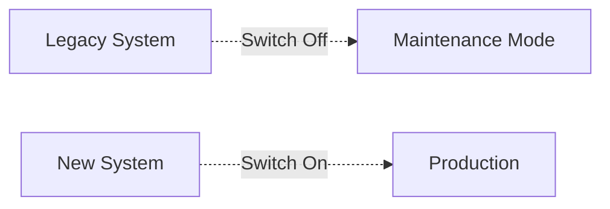

**Risks**: ⚠️ High risk, no rollback

#### Option B: Parallel Run (Recommended)

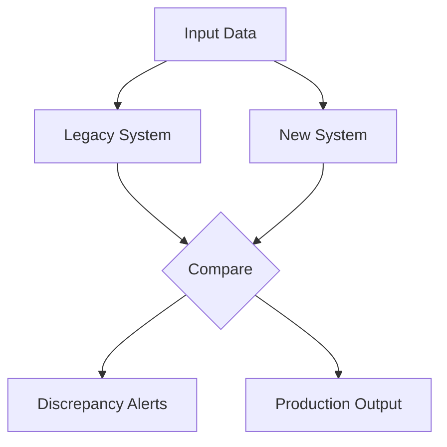

**Duration**: 4-8 weeks  
**Benefits**: ✅ Validate accuracy, ✅ Easy rollback

#### Option C: Canary Deployment

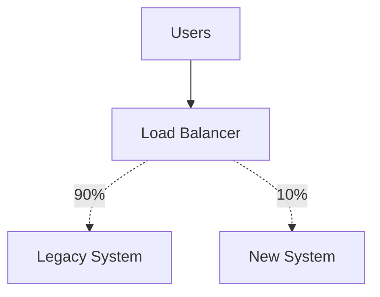

**Approach**: Gradually increase traffic to new system

### Deployment Checklist

#### Pre-Deployment (Week 1-2)

- [ ] Infrastructure ready
  - [ ] Production servers provisioned
  - [ ] Database migrated
  - [ ] Network configured
  - [ ] SSL certificates installed
- [ ] Code ready
  - [ ] Final code review complete
  - [ ] All tests passing
  - [ ] Documentation updated
  - [ ] Deployment scripts tested
- [ ] Operations ready
  - [ ] Monitoring configured
  - [ ] Logging setup
  - [ ] Alerting rules defined
  - [ ] Runbooks created

#### Deployment Day (Week 3)

```bash
# 1. Backup everything
./scripts/backup-production.sh

# 2. Deploy database changes
./scripts/migrate-database.sh

# 3. Deploy application
kubectl apply -f k8s/production/

# 4. Smoke tests
./scripts/smoke-tests.sh

# 5. Monitor
./scripts/monitor-deployment.sh
```

- [ ] 08:00 - Start deployment
- [ ] 08:30 - Database migration complete
- [ ] 09:00 - Application deployed
- [ ] 09:30 - Smoke tests passing
- [ ] 10:00 - Monitoring confirmed
- [ ] 10:30 - Parallel run begins

#### Post-Deployment (Week 4-8)

- [ ] Week 1: Parallel run at 10% traffic
- [ ] Week 2: Increase to 25% traffic
- [ ] Week 3: Increase to 50% traffic
- [ ] Week 4: Increase to 75% traffic
- [ ] Week 5: Move to 100% traffic
- [ ] Week 6-8: Monitor and optimize

### Rollback Plan

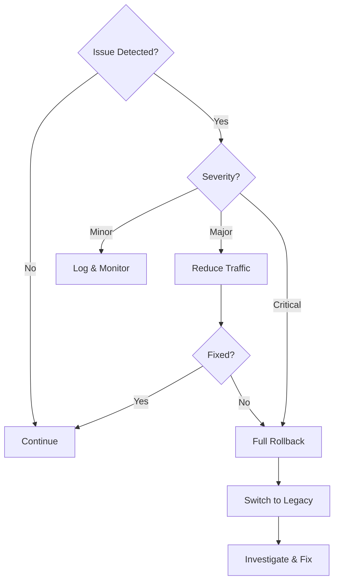

**Rollback Procedure**:
1. Reduce traffic to new system to 0%
2. Verify legacy system operational
3. Investigate issue
4. Fix and redeploy
5. Resume parallel run

### Deliverables

- [ ] Production deployment complete
- [ ] Parallel run successful
- [ ] Legacy system decommissioned
- [ ] Operations handover complete
- [ ] Project closure documentation

## Risk Mitigation

### Risk Register

| Risk | Probability | Impact | Mitigation |
|------|-------------|--------|------------|
| Data loss during migration | Medium | Critical | Backup strategy, parallel run |
| Performance degradation | Medium | High | Performance testing, optimization |
| Business logic differences | High | High | Comprehensive testing, UAT |
| Skills gap in team | Medium | Medium | Training, external expertise |
| Budget overrun | Medium | High | Phased approach, regular reviews |
| Timeline delays | High | Medium | Buffer time, agile approach |
| Integration issues | Medium | High | Early integration testing |
| Resistance to change | Medium | Medium | Change management, training |

### Contingency Plans

#### Data Migration Failure

- **Plan A**: Retry migration with fixes
- **Plan B**: Restore backup and retry
- **Plan C**: Extend parallel run period

#### Performance Issues

- **Plan A**: Optimize queries and code
- **Plan B**: Scale infrastructure
- **Plan C**: Implement caching layer

#### Critical Bug in Production

- **Plan A**: Hot fix and deploy
- **Plan B**: Rollback to legacy
- **Plan C**: Hybrid operation mode

## Success Metrics

### Technical Metrics

| Metric | Target | Measurement |
|--------|--------|-------------|
| Response Time | ≤ Legacy system | APM tools |
| Availability | >99.9% | Uptime monitoring |
| Error Rate | <0.1% | Application logs |
| Test Coverage | >80% | Code coverage tools |
| Code Quality | Grade A | SonarQube |

### Business Metrics

| Metric | Target | Measurement |
|--------|--------|-------------|
| Report Accuracy | 100% | Data validation |
| Processing Time | ≤ Legacy system | Job duration logs |
| Cost Reduction | 30% | TCO analysis |
| User Satisfaction | >8/10 | User surveys |
| Defect Density | <5 per KLOC | Defect tracking |

### Operational Metrics

| Metric | Target | Measurement |
|--------|--------|-------------|
| Deployment Frequency | Weekly | CI/CD metrics |
| Mean Time to Recovery | <1 hour | Incident logs |
| Change Failure Rate | <5% | Deployment tracking |
| Lead Time | <1 week | Development cycle time |

## Conclusion

This roadmap provides a structured approach to modernizing COBOL/JCL applications to Java. Success depends on:

1. **Thorough Planning**: Understand the current system completely
2. **Incremental Approach**: Migrate piece by piece, not all at once
3. **Comprehensive Testing**: Test early, test often, test everything
4. **Risk Management**: Plan for problems, have rollback strategies
5. **Team Preparation**: Ensure team has necessary skills and tools
6. **Stakeholder Engagement**: Keep business users involved throughout

> [!IMPORTANT]
> This is a template roadmap. Adjust timelines, priorities, and strategies based on your specific business requirements, constraints, and resources.

> [!TIP]
> Start with the simplest program (CBLDB21) to build confidence and establish patterns before tackling more complex migrations.
