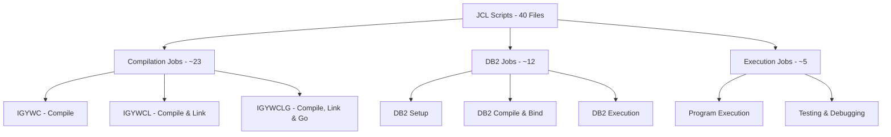
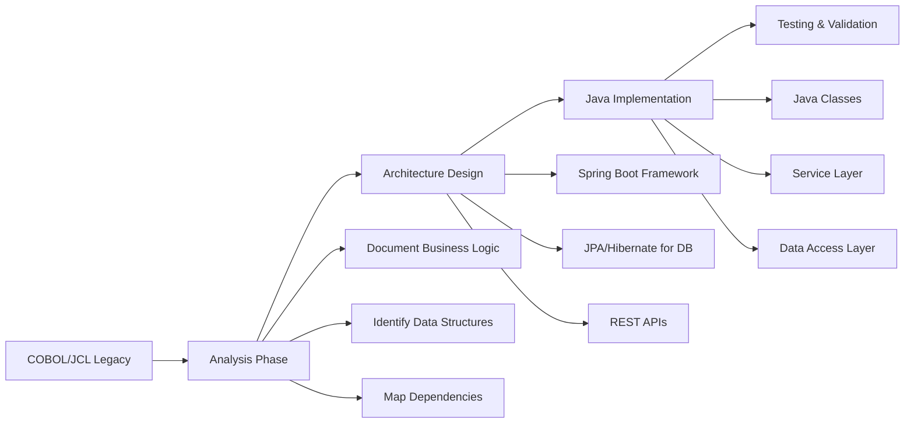
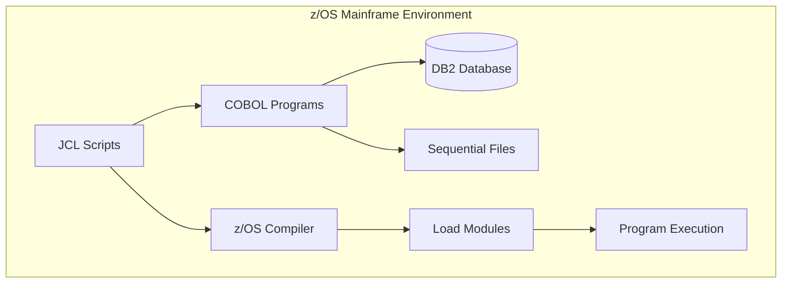
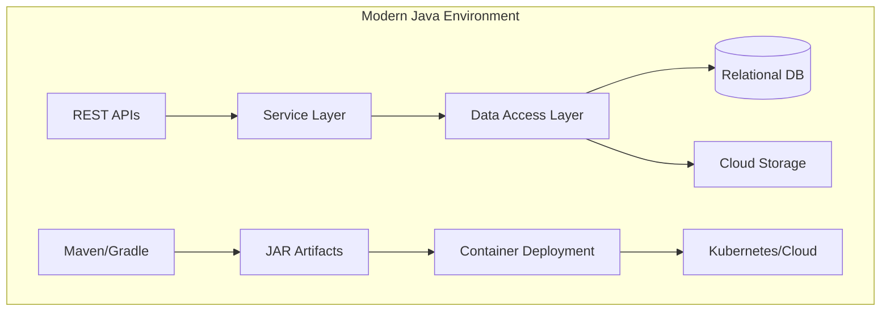

# COBOL and JCL Code Documentation for Java Modernization

## Table of Contents

- [Overview](#overview)
- [Purpose](#purpose)
- [COBOL Programs](#cobol-programs)
- [JCL Scripts](#jcl-scripts)
- [Modernization Strategy](#modernization-strategy)
- [Architecture Overview](#architecture-overview)
- [Related Documentation](#related-documentation)

## Overview

This directory contains comprehensive documentation for all COBOL programs and Job Control Language (JCL) scripts in the COBOL Programming Course repository. This documentation has been created to support the modernization effort from COBOL/z/OS to Java-based systems.

The codebase consists of educational materials demonstrating various COBOL programming concepts, including:
- Basic file I/O operations
- DB2 database integration
- Cursor-based data processing
- Financial data reporting
- Debugging and error handling

## Purpose

This documentation serves as a bridge between the legacy COBOL/JCL codebase and the future Java implementation by:

1. **Analyzing existing functionality** - Understanding what each program does and why
2. **Identifying business logic** - Separating business rules from platform-specific code
3. **Documenting data flows** - Mapping inputs, outputs, and transformations
4. **Highlighting dependencies** - DB2 databases, file systems, and external programs
5. **Providing modernization guidance** - Java equivalents and migration considerations

## COBOL Programs

The repository contains **5 COBOL programs** organized by complexity and functionality:

### Database-Integrated Programs (DB2)

| Program | Purpose | Complexity | Documentation |
|---------|---------|------------|---------------|
| **CBLDB21** | Query and report all customer accounts from DB2 | Medium | [View](cobol-programs/CBLDB21.md) |
| **CBLDB22** | Query customer accounts with surname filtering | High | [View](cobol-programs/CBLDB22.md) |
| **CBLDB23** | Query customer accounts with state/address filtering | High | [View](cobol-programs/CBLDB23.md) |

### File-Based Programs

| Program | Purpose | Complexity | Documentation |
|---------|---------|------------|---------------|
| **CBL0106** | Financial report generator with overlimit detection (with bugs) | High | [View](cobol-programs/CBL0106.md) |
| **CBL0106C** | Corrected version of CBL0106 with buffer overflow fix | High | [View](cobol-programs/CBL0106C.md) |

## JCL Scripts

The repository contains **40 JCL scripts** across different course modules:

### Overview by Category

### JCL Documentation Index

#### Course #2 - Learning COBOL (22 files)
- **Standard Procedures**: [IGYWC](jcl-scripts/IGYWC.md), [IGYWCL](jcl-scripts/IGYWCL.md), [IGYWCLG](jcl-scripts/IGYWCLG.md)
- **Program Execution**: [HELLO](jcl-scripts/HELLO.md), [COBRUN](jcl-scripts/COBRUN.md)
- **Lab Examples**: CBL0001J through CBL0012J, CBL0033J
- **Additional Jobs**: ADDAMT, PAYROL00, PAYROL0X, SRCHBINJ, SRCHSERJ

[Full JCL Index for Course #2](jcl-scripts/course2-index.md)

#### Course #3 - Advanced Topics (18 files)
- **DB2 Procedures**: [DB2CBL](jcl-scripts/DB2CBL.md), [DB2JCL](jcl-scripts/DB2JCL.md), [DSNUPROC](jcl-scripts/DSNUPROC.md)
- **DB2 Setup**: [DB2SETUP](jcl-scripts/DB2SETUP.md), [CRETBL](jcl-scripts/CRETBL.md), [LOADTBL](jcl-scripts/LOADTBL.md)
- **DB2 Program Jobs**: CBLDB21C, CBLDB21R, CBLDB22C, CBLDB22R, CBLDB23C, CBLDB23R
- **Debugging**: [CBL0106J](jcl-scripts/CBL0106J.md)

[Full JCL Index for Course #3](jcl-scripts/course3-index.md)

#### Course #4 - Testing (2 files)
- **Testing Jobs**: DEPTPAY, EMPPAY

[Full JCL Index for Course #4](jcl-scripts/course4-index.md)

## Modernization Strategy

### High-Level Approach

### Key Modernization Considerations

> [!IMPORTANT]
> The following areas require special attention during modernization:

1. **Data Type Conversion**
   - COBOL COMP-3 (packed decimal) → Java BigDecimal
   - COBOL PIC X (character) → Java String
   - COBOL file layouts → Java POJOs or Records

2. **Database Integration**
   - Embedded SQL (EXEC SQL) → JDBC or JPA/Hibernate
   - DB2 cursors → ResultSet or Stream processing
   - SQLCA error handling → SQLException handling

3. **File I/O**
   - Sequential file processing → Java NIO or BufferedReader
   - Record-oriented I/O → Object-oriented stream processing
   - COBOL file descriptors → Java File/Path objects

4. **Business Logic**
   - PERFORM paragraphs → Java methods
   - COBOL sections → Java classes or service methods
   - GO TO statements → Structured control flow

5. **Job Control**
   - JCL job streams → Maven/Gradle builds + shell scripts
   - DD statements → Configuration files (application.properties)
   - JCL procedures → Reusable scripts or CI/CD pipelines

## Architecture Overview

### Current COBOL Architecture

### Proposed Java Architecture

### Component Mapping

| COBOL Component | Java Equivalent | Notes |
|-----------------|-----------------|-------|
| PROGRAM-ID | Java Class | Main class or service |
| WORKING-STORAGE | Instance variables | Class fields |
| FILE SECTION | File I/O classes | BufferedReader, Files |
| PROCEDURE DIVISION | Methods | Business logic methods |
| EXEC SQL | JPA Repository | ORM-based data access |
| JCL Job | Build script + shell | Maven + bash/docker |
| Cursor processing | Stream API | Java 8+ streams |
| CALL statement | Method invocation | Direct method calls |

## Related Documentation

### Detailed Documentation

- [COBOL Programs Directory](cobol-programs/) - Individual program documentation
- [JCL Scripts Directory](jcl-scripts/) - Individual JCL documentation
- [Modernization Roadmap](MODERNIZATION-ROADMAP.md) - Step-by-step migration plan
- [Data Structure Mapping](DATA-STRUCTURES.md) - COBOL to Java data mappings
- [Diagrams Directory](diagrams/) - Architecture and flow diagrams

### External Resources

- [COBOL to Java Migration Best Practices](https://www.ibm.com/docs/en/cobol-zos)
- [Spring Boot for Enterprise Applications](https://spring.io/projects/spring-boot)
- [JPA and Hibernate Documentation](https://hibernate.org/orm/documentation/)

> [!TIP]
> Start the modernization process by reviewing the database-integrated programs (CBLDB21-23) as they represent the most critical business functionality.

> [!NOTE]
> This documentation is based on the COBOL Programming Course educational materials. The actual modernization strategy should be adapted based on specific business requirements and target architecture.
