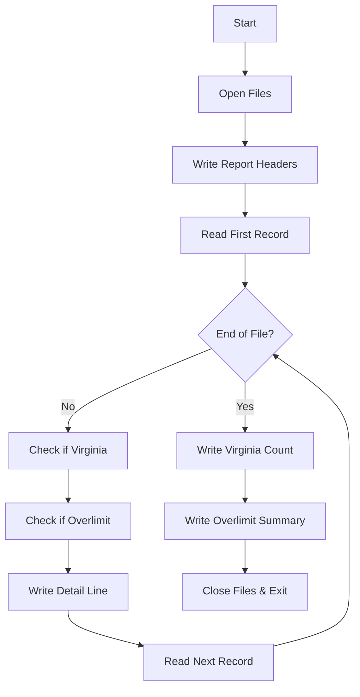
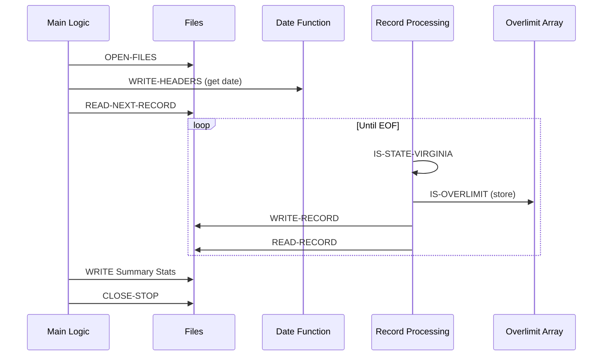
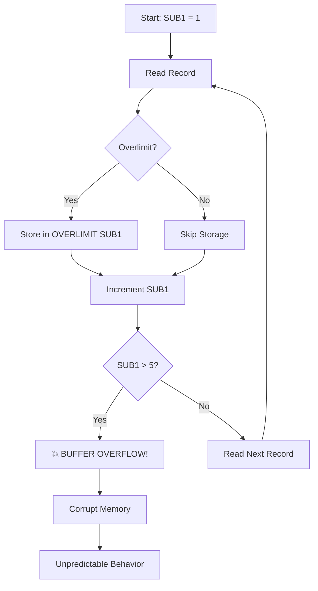

# CBL0106 - Financial Account Report (Buggy Version)

## Table of Contents

- [Overview](#overview)
- [Program Structure](#program-structure)
- [Data Structures](#data-structures)
- [Business Logic](#business-logic)
- [The Bug](#the-bug)
- [Java Modernization Guide](#java-modernization-guide)

## Overview

**Program ID**: CBL0106  
**Author**: Otto B. Boolean  
**Purpose**: Generate financial report with overlimit account detection  
**Complexity**: High  
**Type**: File-based processing (no database)  
**Status**: Contains buffer overflow bug

> [!WARNING]
> This version contains a critical buffer overflow bug. See [CBL0106C](CBL0106C.md) for the corrected version.

### Functionality

CBL0106 reads account records from a sequential file and generates a report showing:
- All account details with formatted balances
- Count of Virginia-based clients
- List of accounts where balance exceeds credit limit

### Key Features

1. **Sequential File Processing**: Reads fixed-length records
2. **Date Stamping**: Uses CURRENT-DATE function
3. **Report Formatting**: Professional headers and data formatting
4. **Business Rule Checking**: Identifies overlimit accounts
5. **State Tracking**: Counts customers by state
6. **Array Processing**: Stores overlimit accounts in memory

### Program Flow



## Program Structure

### Files

| File | Type | DD Name | Purpose |
|------|------|---------|---------|
| ACCT-REC | Input | ACCTREC | Customer account records |
| PRINT-LINE | Output | PRTLINE | Formatted report |

### Input Record Layout (ACCT-FIELDS)

Fixed-format 161-character record:

| Field | Picture | Start | Length | Description |
|-------|---------|-------|--------|-------------|
| ACCT-NO | X(8) | 1 | 8 | Account number |
| ACCT-LIMIT | S9(7)V99 COMP-3 | 9 | 5 | Credit limit (packed) |
| ACCT-BALANCE | S9(7)V99 COMP-3 | 14 | 5 | Current balance (packed) |
| LAST-NAME | X(20) | 19 | 20 | Customer last name |
| FIRST-NAME | X(15) | 39 | 15 | Customer first name |
| STREET-ADDR | X(25) | 54 | 25 | Street address |
| CITY-COUNTY | X(20) | 79 | 20 | City/county |
| USA-STATE | X(15) | 99 | 15 | State |
| RESERVED | X(7) | 114 | 7 | Reserved field |
| COMMENTS | X(50) | 121 | 50 | Account comments |

### Output Record Layout (PRINT-REC)

| Field | Picture | Description |
|-------|---------|-------------|
| ACCT-NO-O | X(8) | Account number |
| FILLER | X(02) | Spaces |
| LAST-NAME-O | X(20) | Last name |
| FILLER | X(02) | Spaces |
| ACCT-LIMIT-O | $$,$$$,$$9.99 | Formatted limit |
| FILLER | X(02) | Spaces |
| ACCT-BALANCE-O | $$,$$$,$$9.99 | Formatted balance |
| FILLER | X(02) | Spaces |

## Data Structures

### WORKING-STORAGE Variables

#### Control Variables

```cobol
01  Filler.
    05 LASTREC          PIC X VALUE SPACE.
    05 DISP-SUB1        PIC 9999.
    05 SUB1             PIC 99.
```

- **LASTREC**: End-of-file indicator ('Y' = EOF)
- **DISP-SUB1**: Display format for count
- **SUB1**: Array index (0-99)

#### Overlimit Account Array

```cobol
01 OVERLIMIT.
   03 FILLER OCCURS 5 TIMES.
       05  OL-ACCT-NO            PIC X(8).
       05  OL-ACCT-LIMIT         PIC S9(7)V99 COMP-3.
       05  OL-ACCT-BALANCE       PIC S9(7)V99 COMP-3.
       05  OL-LASTNAME           PIC X(20).
       05  OL-FIRSTNAME          PIC X(15).
```

> [!CAUTION]
> **CRITICAL BUG**: Array declared with OCCURS 5 but SUB1 is PIC 99 (0-99). This allows buffer overflow!

#### Report Counters

```cobol
01  CLIENTS-PER-STATE.
    05 FILLER              PIC X(19) VALUE 'Virginia Clients = '.
    05 VIRGINIA-CLIENTS    PIC 9(3) VALUE ZERO.
    05 FILLER              PIC X(59) VALUE SPACES.
```

#### Report Headers

**HEADER-1**: Report title
```cobol
01  HEADER-1.
    05  FILLER    PIC X(20) VALUE 'Financial Report for'.
    05  FILLER    PIC X(60) VALUE SPACES.
```

**HEADER-2**: Date stamp
```cobol
01  HEADER-2.
    05  FILLER    PIC X(05) VALUE 'Year '.
    05  HDR-YR    PIC 9(04).
    05  FILLER    PIC X(02) VALUE SPACES.
    05  FILLER    PIC X(06) VALUE 'Month '.
    05  HDR-MO    PIC X(02).
    05  FILLER    PIC X(02) VALUE SPACES.
    05  FILLER    PIC X(04) VALUE 'Day '.
    05  HDR-DAY   PIC X(02).
    05  FILLER    PIC X(56) VALUE SPACES.
```

**HEADER-3 & HEADER-4**: Column headers
```cobol
01  HEADER-3.
    05  FILLER    PIC X(08) VALUE 'Account '.
    05  FILLER    PIC X(02) VALUE SPACES.
    05  FILLER    PIC X(10) VALUE 'Last Name '.
    05  FILLER    PIC X(15) VALUE SPACES.
    05  FILLER    PIC X(06) VALUE 'Limit '.
    05  FILLER    PIC X(06) VALUE SPACES.
    05  FILLER    PIC X(08) VALUE 'Balance '.
    05  FILLER    PIC X(40) VALUE SPACES.
```

## Business Logic

### Main Program Sequence



### PROCEDURE DIVISION Paragraphs

#### OPEN-FILES

```cobol
OPEN-FILES.
    OPEN INPUT  ACCT-REC.
    OPEN OUTPUT PRINT-LINE.
```

Opens both input and output files.

#### WRITE-HEADERS

```cobol
WRITE-HEADERS.
    MOVE FUNCTION CURRENT-DATE TO WS-CURRENT-DATE-DATA.
    MOVE WS-CURRENT-YEAR  TO HDR-YR.
    MOVE WS-CURRENT-MONTH TO HDR-MO.
    MOVE WS-CURRENT-DAY   TO HDR-DAY.
    WRITE PRINT-REC FROM HEADER-1.
    WRITE PRINT-REC FROM HEADER-2.
    MOVE SPACES TO PRINT-REC.
    WRITE PRINT-REC AFTER ADVANCING 1 LINES.
    WRITE PRINT-REC FROM HEADER-3.
    WRITE PRINT-REC FROM HEADER-4.
    MOVE SPACES TO PRINT-REC.
    MOVE 1 TO SUB1.
```

> [!NOTE]
> SUB1 is initialized to 1 (not 0), which is part of the bug.

#### READ-NEXT-RECORD

```cobol
READ-NEXT-RECORD.
    PERFORM READ-RECORD
    PERFORM UNTIL LASTREC = 'Y'
        PERFORM IS-STATE-VIRGINIA
        PERFORM IS-OVERLIMIT
        PERFORM WRITE-RECORD
        PERFORM READ-RECORD
    END-PERFORM
    .
```

Main processing loop: read, check, write, repeat.

#### IS-STATE-VIRGINIA

```cobol
IS-STATE-VIRGINIA.
    IF USA-STATE = 'Virginia' THEN
       ADD 1 TO VIRGINIA-CLIENTS
    END-IF.
```

Counts Virginia customers for summary statistics.

#### IS-OVERLIMIT

```cobol
IS-OVERLIMIT.
    IF ACCT-LIMIT < ACCT-BALANCE THEN
        MOVE ACCT-LIMIT TO OL-ACCT-LIMIT(SUB1)
        MOVE ACCT-BALANCE TO OL-ACCT-BALANCE(SUB1)
        MOVE LAST-NAME TO OL-LASTNAME(SUB1)
        MOVE FIRST-NAME TO OL-FIRSTNAME(SUB1)
     END-IF.
     ADD 1 TO SUB1.
```

> [!CAUTION]
> **BUG LOCATION**: SUB1 is incremented unconditionally, even for non-overlimit accounts!

#### WRITE-OVERLIMIT

```cobol
WRITE-OVERLIMIT.
    IF SUB1 = 1 THEN
        MOVE OVERLIMIT-STATUS TO PRINT-REC
        WRITE PRINT-REC
    ELSE
        MOVE 'ACCOUNTS OVERLIMIT' TO OLS-STATUS
        MOVE SUB1 TO  DISP-SUB1
        MOVE DISP-SUB1 TO OLS-ACCTNUM
        MOVE OVERLIMIT-STATUS TO PRINT-REC
        WRITE PRINT-REC
    END-IF.
```

Writes summary of overlimit accounts.

#### CLOSE-STOP

```cobol
CLOSE-STOP.
    WRITE PRINT-REC FROM CLIENTS-PER-STATE.
    PERFORM WRITE-OVERLIMIT.
    CLOSE ACCT-REC.
    CLOSE PRINT-LINE.
    GOBACK.
```

## The Bug

### Buffer Overflow Vulnerability



### Problem Analysis

1. **Array Size**: OVERLIMIT declared with `OCCURS 5 TIMES`
   - Valid indices: 1, 2, 3, 4, 5

2. **Index Variable**: SUB1 is `PIC 99`
   - Can hold values 0-99
   - No bounds checking

3. **Bug**: SUB1 incremented for EVERY record
   ```cobol
   IS-OVERLIMIT.
       IF ACCT-LIMIT < ACCT-BALANCE THEN
           MOVE ... TO OL-ACCT-LIMIT(SUB1)
           ...
       END-IF.
       ADD 1 TO SUB1.  ← BUG: Always increments!
   ```

4. **Consequence**: When SUB1 exceeds 5:
   - Writes to memory beyond array bounds
   - Corrupts adjacent WORKING-STORAGE
   - May crash or produce invalid results
   - Classic buffer overflow vulnerability

### Exploitation Scenario

```
Record 1: Normal account    → SUB1 = 2
Record 2: Normal account    → SUB1 = 3
Record 3: Normal account    → SUB1 = 4
Record 4: Overlimit account → Store in (4), SUB1 = 5
Record 5: Normal account    → SUB1 = 6 ⚠️
Record 6: Overlimit account → Store in (6) 💥 OVERFLOW
```

### Impact

| Records Processed | SUB1 Value | Result |
|-------------------|------------|--------|
| 1-5 | 2-6 | May work if ≤1 overlimit |
| 6 | 7 | Buffer overflow starts |
| 7+ | 8+ | Severe memory corruption |

> [!WARNING]
> In production, this bug could:
> - Corrupt financial data
> - Cause program crashes (ABEND)
> - Create security vulnerabilities
> - Produce incorrect reports

### Why It Wasn't Caught

1. **Test Data**: If test data had ≤4 records, bug wouldn't manifest
2. **No Bounds Checking**: COBOL doesn't validate array indices at compile time
3. **Runtime Behavior**: May not crash immediately—corruption is silent

## Java Modernization Guide

### Preventing Similar Bugs in Java

Java's built-in protections prevent this class of bug:

```java
// Java automatically checks array bounds
List<OverlimitAccount> overlimitAccounts = new ArrayList<>();

// This would throw IndexOutOfBoundsException
// instead of silently corrupting memory
int[] fixedArray = new int[5];
fixedArray[10] = 42; // ❌ ArrayIndexOutOfBoundsException
```

### Modernized Implementation

```java
@Service
public class FinancialReportService {
    
    public FinancialReport generateReport(Path inputFile) throws IOException {
        FinancialReport report = new FinancialReport();
        
        try (BufferedReader reader = Files.newBufferedReader(inputFile)) {
            String line;
            while ((line = reader.readLine()) != null) {
                AccountRecord record = parseAccountRecord(line);
                
                // Process record
                report.addAccount(record);
                
                // Check for Virginia
                if ("Virginia".equals(record.getState())) {
                    report.incrementVirginiaCount();
                }
                
                // Check for overlimit - no fixed array!
                if (record.getBalance().compareTo(record.getCreditLimit()) > 0) {
                    report.addOverlimitAccount(record);
                }
            }
        }
        
        return report;
    }
}

public class FinancialReport {
    private List<AccountRecord> accounts = new ArrayList<>();
    private List<AccountRecord> overlimitAccounts = new ArrayList<>();
    private int virginiaCount = 0;
    private LocalDate reportDate = LocalDate.now();
    
    public void addAccount(AccountRecord account) {
        accounts.add(account);
    }
    
    public void addOverlimitAccount(AccountRecord account) {
        // No size limit - grows dynamically
        overlimitAccounts.add(account);
    }
    
    public void incrementVirginiaCount() {
        virginiaCount++;
    }
    
    // Getters
    public List<AccountRecord> getOverlimitAccounts() {
        return Collections.unmodifiableList(overlimitAccounts);
    }
    
    public int getOverlimitCount() {
        return overlimitAccounts.size();
    }
}
```

### Entity Classes

```java
public class AccountRecord {
    private String accountNumber;
    private BigDecimal creditLimit;
    private BigDecimal balance;
    private String lastName;
    private String firstName;
    private Address address;
    private String comments;
    
    public boolean isOverlimit() {
        return balance.compareTo(creditLimit) > 0;
    }
    
    // Getters and setters
}

public class Address {
    private String street;
    private String cityCounty;
    private String state;
    
    public boolean isVirginia() {
        return "Virginia".equals(state);
    }
}
```

### Report Generation

```java
@Component
public class ReportFormatter {
    
    public void writeReport(FinancialReport report, Path outputFile) 
            throws IOException {
        
        try (BufferedWriter writer = Files.newBufferedWriter(outputFile)) {
            // Write headers
            writeHeaders(writer, report.getReportDate());
            
            // Write account details
            for (AccountRecord account : report.getAccounts()) {
                writeAccountLine(writer, account);
            }
            
            // Write summary
            writeSummary(writer, report);
        }
    }
    
    private void writeHeaders(BufferedWriter writer, LocalDate date) 
            throws IOException {
        writer.write("Financial Report for");
        writer.newLine();
        writer.write(String.format("Year %d  Month %02d  Day %02d",
            date.getYear(), date.getMonthValue(), date.getDayOfMonth()));
        writer.newLine();
        writer.newLine();
        writer.write("Account   Last Name             Limit          Balance");
        writer.newLine();
        writer.write("--------  ----------            ----------     -------------");
        writer.newLine();
    }
    
    private void writeSummary(BufferedWriter writer, FinancialReport report) 
            throws IOException {
        writer.write(String.format("Virginia Clients = %d", 
            report.getVirginiaCount()));
        writer.newLine();
        
        if (report.getOverlimitCount() == 0) {
            writer.write("No Accounts Overlimit");
        } else {
            writer.write(String.format("ACCOUNTS OVERLIMIT %d",
                report.getOverlimitCount()));
        }
        writer.newLine();
    }
}
```

### Defensive Programming

```java
// If you must use fixed-size array, validate bounds
public class OverlimitTracker {
    private static final int MAX_SIZE = 20;
    private AccountRecord[] accounts = new AccountRecord[MAX_SIZE];
    private int count = 0;
    
    public void addOverlimitAccount(AccountRecord account) {
        if (count >= MAX_SIZE) {
            throw new IllegalStateException(
                "Maximum overlimit accounts exceeded: " + MAX_SIZE);
        }
        accounts[count++] = account;
    }
    
    public List<AccountRecord> getOverlimitAccounts() {
        return Arrays.asList(accounts).subList(0, count);
    }
}
```

### Testing to Catch Bugs

```java
@Test
void testHandlesMoreThan5OverlimitAccounts() throws IOException {
    // Create test file with 10 overlimit accounts
    Path testFile = createTestFile(10, true);
    
    FinancialReport report = reportService.generateReport(testFile);
    
    // Should handle all overlimit accounts without error
    assertEquals(10, report.getOverlimitCount());
    
    // Verify no data corruption
    assertEquals(10, report.getOverlimitAccounts().size());
}

@Test
void testHandlesMixedAccounts() throws IOException {
    // 100 accounts, 50 overlimit
    Path testFile = createMixedTestFile(100, 50);
    
    FinancialReport report = reportService.generateReport(testFile);
    
    assertEquals(100, report.getAccounts().size());
    assertEquals(50, report.getOverlimitCount());
}
```

### Migration Checklist

- [ ] Create AccountRecord and Address classes
- [ ] Implement FinancialReport with dynamic collections
- [ ] Create fixed-length record parser (161 bytes)
- [ ] Handle COMP-3 packed decimal conversion
- [ ] Implement report formatter
- [ ] Add comprehensive tests (especially edge cases)
- [ ] Test with large datasets (>100 records)
- [ ] Validate overlimit detection logic
- [ ] Implement date formatting
- [ ] Add logging and error handling

> [!TIP]
> Use property-based testing to generate random test data and catch edge cases that manual testing might miss.

> [!NOTE]
> See [CBL0106C documentation](CBL0106C.md) for the corrected COBOL version and comparison of the fix.
