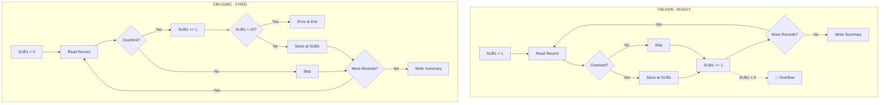

# CBL0106C - Financial Account Report (Corrected Version)

## Table of Contents

- [Overview](#overview)
- [Bug Fixes](#bug-fixes)
- [Implementation Changes](#implementation-changes)
- [Best Practices Demonstrated](#best-practices-demonstrated)
- [Java Modernization Guide](#java-modernization-guide)

## Overview

**Program ID**: CBL0106C  
**Author**: Otto B. Boolean  
**Purpose**: Generate financial report with overlimit detection (bug-free version)  
**Complexity**: High  
**Type**: File-based processing  
**Status**: Production-ready with buffer overflow fix

> [!NOTE]
> This is the corrected version of [CBL0106](CBL0106.md). All functionality is identical except for critical bug fixes.

### What Changed

CBL0106C fixes the buffer overflow vulnerability in CBL0106 through:
1. ✅ Larger array size (20 vs 5 elements)
2. ✅ Array bounds checking
3. ✅ Error handling for overflow conditions
4. ✅ Proper array index initialization (0 vs 1)
5. ✅ Conditional increment (only for overlimit accounts)

## Bug Fixes

### Fix #1: Increased Array Size

**Before (CBL0106)**:
```cobol
01 OVERLIMIT.
   03 FILLER OCCURS 5 TIMES.
       05  OL-ACCT-NO            PIC X(8).
       05  OL-ACCT-LIMIT         PIC S9(7)V99 COMP-3.
       05  OL-ACCT-BALANCE       PIC S9(7)V99 COMP-3.
       05  OL-LASTNAME           PIC X(20).
       05  OL-FIRSTNAME          PIC X(15).
```

**After (CBL0106C)**:
```cobol
05 OVERLIMIT-MAX    PIC S9(4) COMP VALUE 20.

01 OVERLIMIT.
   03 FILLER OCCURS 20 TIMES.
       05  OL-ACCT-NO            PIC X(8).
       05  OL-ACCT-LIMIT         PIC S9(7)V99 COMP-3.
       05  OL-ACCT-BALANCE       PIC S9(7)V99 COMP-3.
       05  OL-LASTNAME           PIC X(20).
       05  OL-FIRSTNAME          PIC X(15).
```

**Impact**: Reduces likelihood of overflow for typical datasets

### Fix #2: Added Array Maximum Constant

```cobol
05 OVERLIMIT-MAX    PIC S9(4) COMP VALUE 20.
```

**Benefits**:
- Single point of configuration
- Easy to adjust if requirements change
- Used in bounds checking logic

### Fix #3: Initialize SUB1 to 0

**Before (CBL0106)**:
```cobol
WRITE-HEADERS.
    ...
    MOVE 1 TO SUB1.
```

**After (CBL0106C)**:
```cobol
WRITE-HEADERS.
    ...
    MOVE 0 TO SUB1.
```

**Rationale**: Arrays indexed 1-20, but SUB1 incremented BEFORE use

### Fix #4: Conditional Increment with Bounds Check

**Before (CBL0106)** - BUGGY:
```cobol
IS-OVERLIMIT.
    IF ACCT-LIMIT < ACCT-BALANCE THEN
        MOVE ACCT-LIMIT TO OL-ACCT-LIMIT(SUB1)
        MOVE ACCT-BALANCE TO OL-ACCT-BALANCE(SUB1)
        MOVE LAST-NAME TO OL-LASTNAME(SUB1)
        MOVE FIRST-NAME TO OL-FIRSTNAME(SUB1)
     END-IF.
     ADD 1 TO SUB1.  ← BUG: Always increments!
```

**After (CBL0106C)** - FIXED:
```cobol
IS-OVERLIMIT.
    IF ACCT-LIMIT < ACCT-BALANCE THEN
        ADD 1 TO SUB1
* Check if there is enough space in the array, in case the input 
* file changes again. A handled error is easier to find and fix 
* than a buffer overwrite error.
        IF SUB1 > OVERLIMIT-MAX THEN
            DISPLAY 'OVERFLOW TABLE OVERLIMIT'
            MOVE 1000 TO RETURN-CODE
            STOP RUN
        END-IF
        MOVE ACCT-LIMIT TO OL-ACCT-LIMIT(SUB1)
        MOVE ACCT-BALANCE TO OL-ACCT-BALANCE(SUB1)
        MOVE LAST-NAME TO OL-LASTNAME(SUB1)
        MOVE FIRST-NAME TO OL-FIRSTNAME(SUB1)
     END-IF.
```

**Key Changes**:
1. Increment ONLY when overlimit detected
2. Check bounds BEFORE writing to array
3. Graceful error handling with clear message
4. Set return code to indicate error
5. Terminate with STOP RUN to prevent corruption

### Fix #5: Adjusted Summary Logic

**Before (CBL0106)**:
```cobol
WRITE-OVERLIMIT.
    IF SUB1 = 1 THEN
        MOVE OVERLIMIT-STATUS TO PRINT-REC
        WRITE PRINT-REC
    ELSE
        MOVE 'ACCOUNTS OVERLIMIT' TO OLS-STATUS
        MOVE SUB1 TO  DISP-SUB1
        MOVE DISP-SUB1 TO OLS-ACCTNUM
        MOVE OVERLIMIT-STATUS TO PRINT-REC
        WRITE PRINT-REC
    END-IF.
```

**After (CBL0106C)**:
```cobol
WRITE-OVERLIMIT.
    IF SUB1 = 0 THEN
        MOVE OVERLIMIT-STATUS TO PRINT-REC
        WRITE PRINT-REC
    ELSE
        MOVE 'ACCOUNTS OVERLIMIT' TO OLS-STATUS
        MOVE SUB1 TO  DISP-SUB1
        MOVE DISP-SUB1 TO OLS-ACCTNUM
        MOVE OVERLIMIT-STATUS TO PRINT-REC
        WRITE PRINT-REC
    END-IF.
```

**Change**: Check for `SUB1 = 0` instead of `SUB1 = 1` (since SUB1 now starts at 0)

## Implementation Changes

### Execution Flow Comparison



### Memory Safety

| Scenario | CBL0106 (Buggy) | CBL0106C (Fixed) |
|----------|-----------------|------------------|
| 3 overlimit accounts | Works | Works |
| 5 overlimit accounts | Works | Works |
| 6 overlimit accounts | **Buffer overflow** | Works |
| 20 overlimit accounts | **Severe corruption** | Works |
| 21 overlimit accounts | **Crash/corruption** | **Controlled error exit** |
| 100 normal accounts | **Buffer overflow** | Works perfectly |

## Best Practices Demonstrated

### 1. Defensive Programming

```cobol
* Check if there is enough space in the array, in case the input 
* file changes again. A handled error is easier to find and fix 
* than a buffer overwrite error.
IF SUB1 > OVERLIMIT-MAX THEN
    DISPLAY 'OVERFLOW TABLE OVERLIMIT'
    MOVE 1000 TO RETURN-CODE
    STOP RUN
END-IF
```

**Lessons**:
- ✅ Always validate array bounds
- ✅ Provide clear error messages
- ✅ Set meaningful return codes
- ✅ Fail fast rather than corrupt data

### 2. Configuration Constants

```cobol
05 OVERLIMIT-MAX    PIC S9(4) COMP VALUE 20.
```

**Benefits**:
- Single point of change
- Self-documenting code
- Easier maintenance
- Consistent bounds checking

### 3. Comments Explaining Why

```cobol
* Check if there is enough space in the array, in case the input 
* file changes again. A handled error is easier to find and fix 
* than a buffer overwrite error.
```

**Good Practice**: Comments explain rationale, not just what code does

### 4. Graceful Degradation

Instead of:
- ❌ Silent corruption
- ❌ Unpredictable crashes
- ❌ Invalid results

The program:
- ✅ Detects the problem
- ✅ Logs clear error message
- ✅ Exits with error code
- ✅ Preserves data integrity

## Java Modernization Guide

### The Java Advantage

The same logic in Java is inherently safer:

```java
@Service
public class FinancialReportService {
    private static final int MAX_OVERLIMIT_ACCOUNTS = 20;
    
    public FinancialReport generateReport(Path inputFile) throws IOException {
        FinancialReport report = new FinancialReport();
        
        try (BufferedReader reader = Files.newBufferedReader(inputFile)) {
            String line;
            while ((line = reader.readLine()) != null) {
                AccountRecord record = parseAccountRecord(line);
                
                report.addAccount(record);
                
                if ("Virginia".equals(record.getState())) {
                    report.incrementVirginiaCount();
                }
                
                if (record.getBalance().compareTo(record.getCreditLimit()) > 0) {
                    // Option 1: No limit (ArrayList grows dynamically)
                    report.addOverlimitAccount(record);
                    
                    // Option 2: Enforce limit like COBOL
                    // if (report.getOverlimitCount() >= MAX_OVERLIMIT_ACCOUNTS) {
                    //     throw new TooManyOverlimitAccountsException(
                    //         "Exceeded maximum overlimit accounts: " + 
                    //         MAX_OVERLIMIT_ACCOUNTS);
                    // }
                    // report.addOverlimitAccount(record);
                }
            }
        }
        
        return report;
    }
}
```

### Option 1: Dynamic Growth (Recommended)

```java
public class FinancialReport {
    // No size limit - ArrayList grows as needed
    private List<AccountRecord> overlimitAccounts = new ArrayList<>();
    
    public void addOverlimitAccount(AccountRecord account) {
        overlimitAccounts.add(account);
    }
    
    public List<AccountRecord> getOverlimitAccounts() {
        return Collections.unmodifiableList(overlimitAccounts);
    }
}
```

**Advantages**:
- ✅ No arbitrary limits
- ✅ No buffer overflows possible
- ✅ Handles any dataset size
- ✅ Automatic memory management

### Option 2: Enforce Limit (Matches COBOL Logic)

```java
public class FinancialReport {
    private static final int MAX_OVERLIMIT_ACCOUNTS = 20;
    private List<AccountRecord> overlimitAccounts = new ArrayList<>();
    
    public void addOverlimitAccount(AccountRecord account) {
        if (overlimitAccounts.size() >= MAX_OVERLIMIT_ACCOUNTS) {
            throw new TooManyOverlimitAccountsException(
                String.format("Cannot store more than %d overlimit accounts",
                    MAX_OVERLIMIT_ACCOUNTS));
        }
        overlimitAccounts.add(account);
    }
}

public class TooManyOverlimitAccountsException extends RuntimeException {
    public TooManyOverlimitAccountsException(String message) {
        super(message);
    }
}
```

**When to Use**:
- Business rule requires limit
- Memory constraints
- Matching legacy behavior exactly

### Option 3: Bounded Queue with Overflow Handling

```java
public class FinancialReport {
    private static final int MAX_OVERLIMIT_ACCOUNTS = 20;
    private List<AccountRecord> overlimitAccounts = new ArrayList<>();
    private int overflowCount = 0;
    
    public void addOverlimitAccount(AccountRecord account) {
        if (overlimitAccounts.size() < MAX_OVERLIMIT_ACCOUNTS) {
            overlimitAccounts.add(account);
        } else {
            overflowCount++;
            // Log or handle overflow gracefully
        }
    }
    
    public boolean hasOverflow() {
        return overflowCount > 0;
    }
    
    public int getOverflowCount() {
        return overflowCount;
    }
}
```

**Benefits**:
- ✅ Handles unlimited accounts
- ✅ Tracks overflow separately
- ✅ Maintains first N accounts for display
- ✅ No data loss - just limited reporting

### Testing Strategy

```java
@SpringBootTest
class FinancialReportServiceTest {
    
    @Autowired
    private FinancialReportService reportService;
    
    /**
     * Test that would have triggered the bug in CBL0106
     */
    @Test
    void testHandles100RecordsWith25Overlimit() throws IOException {
        Path testFile = createTestFile(100, 25); // 25 overlimit accounts
        
        FinancialReport report = reportService.generateReport(testFile);
        
        // Should handle all without error
        assertEquals(100, report.getAccounts().size());
        assertEquals(25, report.getOverlimitCount());
        
        // Verify first and last overlimit accounts are correct
        assertNotNull(report.getOverlimitAccounts().get(0));
        assertNotNull(report.getOverlimitAccounts().get(24));
    }
    
    /**
     * Test exact scenario that breaks CBL0106
     */
    @Test
    void testHandles6RecordsAllNormalWithOldBug() throws IOException {
        // In CBL0106, SUB1 increments for ALL records
        // After 6 records, SUB1 would be 7, exceeding array size of 5
        Path testFile = createTestFile(6, 0); // No overlimit accounts
        
        FinancialReport report = reportService.generateReport(testFile);
        
        assertEquals(6, report.getAccounts().size());
        assertEquals(0, report.getOverlimitCount());
        // Should not crash or corrupt data
    }
    
    /**
     * Edge case: exactly at limit
     */
    @Test
    void testHandlesExactlyMaxOverlimitAccounts() throws IOException {
        Path testFile = createTestFile(50, 20); // Exactly 20 overlimit
        
        FinancialReport report = reportService.generateReport(testFile);
        
        assertEquals(50, report.getAccounts().size());
        assertEquals(20, report.getOverlimitCount());
        assertFalse(report.hasOverflow());
    }
    
    /**
     * Edge case: more than max (if using bounded version)
     */
    @Test
    void testHandlesMoreThanMaxOverlimitAccounts() throws IOException {
        Path testFile = createTestFile(50, 25); // 25 overlimit (> 20 max)
        
        FinancialReport report = reportService.generateReport(testFile);
        
        assertEquals(50, report.getAccounts().size());
        assertEquals(20, report.getOverlimitCount()); // Capped at 20
        assertTrue(report.hasOverflow());
        assertEquals(5, report.getOverflowCount()); // 5 not stored
    }
}
```

### Comparison: COBOL Fix vs Java Implementation

| Aspect | CBL0106C (COBOL) | Java |
|--------|------------------|------|
| Array size | Fixed (20) | Dynamic (unlimited) |
| Bounds check | Manual `IF SUB1 > 20` | Automatic |
| Error handling | STOP RUN with RC=1000 | Exception throwing |
| Memory safety | Relies on programmer | Language guaranteed |
| Overflow detection | Explicit check | Built-in |
| Maintenance | Must update array size manually | No maintenance needed |

### Migration Recommendations

1. **Use Dynamic Collections**: Prefer `ArrayList` over fixed arrays
2. **Add Validation**: Even though Java is safe, validate business rules
3. **Comprehensive Testing**: Include edge cases that trigger original bug
4. **Logging**: Add logging for unusual conditions (many overlimit accounts)
5. **Monitoring**: Track overlimit account counts in production

### Modern Enhancement Ideas

```java
// 1. Add statistics
public class FinancialReport {
    public OverlimitStatistics getOverlimitStatistics() {
        return new OverlimitStatistics(
            overlimitAccounts.size(),
            calculateTotalOverlimitAmount(),
            calculateAverageOverlimitPercentage()
        );
    }
}

// 2. Stream processing for large files
public void generateReportStreaming(Path inputFile, Path outputFile) 
        throws IOException {
    try (Stream<String> lines = Files.lines(inputFile);
         BufferedWriter writer = Files.newBufferedWriter(outputFile)) {
        
        FinancialReport report = lines
            .map(this::parseAccountRecord)
            .peek(report::addAccount)
            .filter(AccountRecord::isOverlimit)
            .peek(report::addOverlimitAccount)
            .collect(Collectors.toCollection(() -> 
                new FinancialReport()));
        
        // Write report...
    }
}

// 3. Parallel processing
public FinancialReport generateReportParallel(Path inputFile) 
        throws IOException {
    return Files.lines(inputFile)
        .parallel()
        .map(this::parseAccountRecord)
        .collect(FinancialReport::new,
                 FinancialReport::addAccount,
                 FinancialReport::merge);
}
```

## Migration Checklist

- [ ] Analyze requirements: Fixed size or dynamic?
- [ ] Create AccountRecord entity
- [ ] Implement FinancialReport class
- [ ] Choose collection strategy (dynamic vs bounded)
- [ ] Add error handling and logging
- [ ] Write comprehensive tests
  - [ ] Test with 0 overlimit accounts
  - [ ] Test with exactly max overlimit accounts
  - [ ] Test with more than max overlimit accounts
  - [ ] Test with large datasets (>1000 records)
- [ ] Test edge cases from original bug
- [ ] Performance test with production-sized data
- [ ] Add monitoring and alerting
- [ ] Document differences from legacy behavior

> [!TIP]
> The fix in CBL0106C demonstrates the value of defensive programming. Apply the same principles in Java: validate inputs, check bounds, and fail gracefully.

> [!NOTE]
> This case study illustrates why modern languages with automatic memory management and bounds checking prevent entire classes of bugs. The Java equivalent is simpler, safer, and more maintainable.
