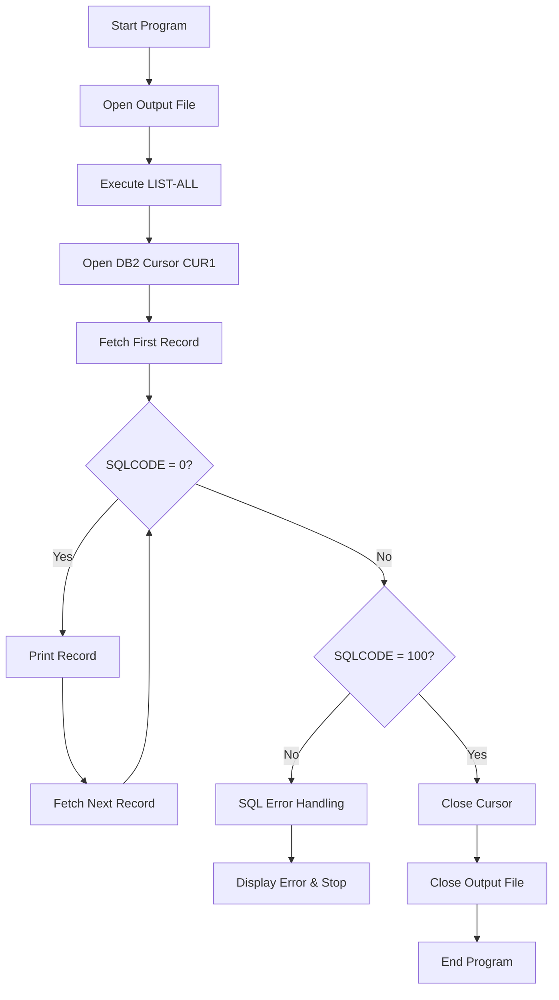
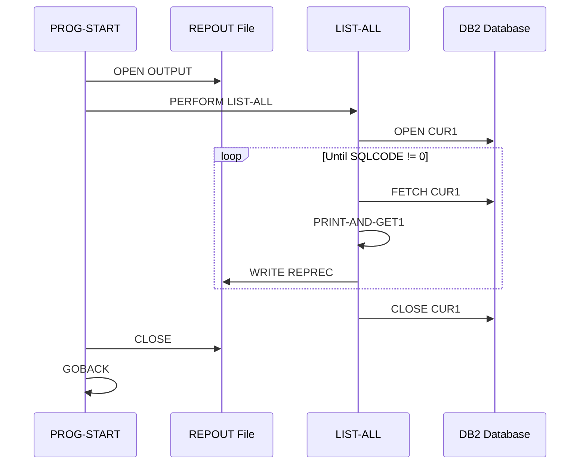
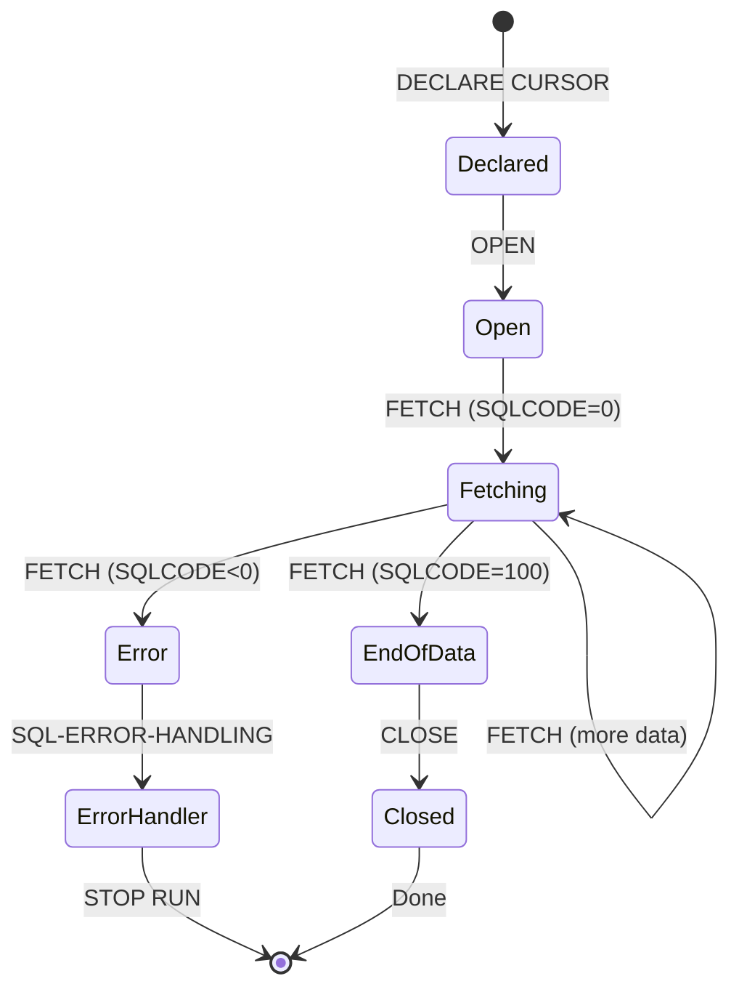
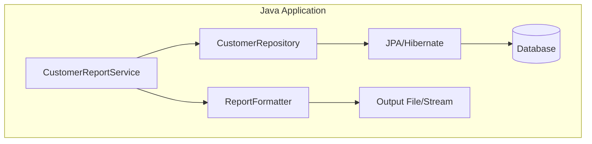

# CBLDB21 - Customer Account List Report

## Table of Contents

- [Overview](#overview)
- [Program Structure](#program-structure)
- [Division Breakdown](#division-breakdown)
- [Data Structures](#data-structures)
- [Business Logic](#business-logic)
- [Database Operations](#database-operations)
- [Java Modernization Guide](#java-modernization-guide)

## Overview

**Program ID**: CBLDB21  
**Author**: Otto B. Relational  
**Purpose**: Generate a formatted report of all customer accounts from DB2 database  
**Complexity**: Medium  
**Database**: DB2 for z/OS

### Functionality

CBLDB21 retrieves all customer account records from a DB2 table and produces a formatted report containing:
- Account number
- Credit limit
- Account balance
- Customer surname and first name
- Account comments

### Program Flow



## Program Structure

### IDENTIFICATION DIVISION

- **PROGRAM-ID**: CBLDB21
- **AUTHOR**: Otto B. Relational
- **License**: CC-BY-4.0 (COBOL Programming Course)

### File Organization

| Component | Type | Purpose |
|-----------|------|---------|
| REPOUT | Output File | Sequential report file |
| DB2 Table Z#####T | Database Table | Customer accounts |

## Division Breakdown

### ENVIRONMENT DIVISION

#### FILE-CONTROL

```cobol
SELECT REPOUT ASSIGN TO UT-S-REPORT.
```

- **REPOUT**: Unit-tape sequential output file for the report
- Assigned to external name `UT-S-REPORT`

### DATA DIVISION

#### FILE SECTION

**Report Output File (REPOUT)**

```cobol
FD  REPOUT
    RECORD CONTAINS 120 CHARACTERS
    LABEL RECORDS ARE OMITTED
    DATA RECORD IS REPREC.
```

**REPREC Layout** (120 characters):

| Field | Picture | Length | Description |
|-------|---------|--------|-------------|
| ACCT-NO-O | X(8) | 8 | Account number |
| ACCT-LIMIT-O | $$,$$$,$$9.99 | 13 | Formatted credit limit |
| ACCT-BALANCE-O | $$,$$$,$$9.99 | 13 | Formatted balance |
| ACCT-LASTN-O | X(20) | 20 | Last name |
| ACCT-FIRSTN-O | X(15) | 15 | First name |
| ACCT-COMMENT-O | X(50) | 50 | Comments |
| (Spaces) | | 1 | Padding |

#### WORKING-STORAGE SECTION

**SQL Communication Area (SQLCA)**

```cobol
EXEC SQL INCLUDE SQLCA END-EXEC.
```

The SQLCA provides return codes and diagnostic information for all SQL operations:
- **SQLCODE**: Return code (0=success, 100=no data, negative=error)
- **SQLSTATE**: Standard SQL state
- **SQLERRM**: Error message text

**Error Handling Structures**

| Variable | Type | Purpose |
|----------|------|---------|
| ERROR-MESSAGE | Group | Container for error messages |
| ERROR-LEN | S9(4) COMP | Length of error message buffer (1320) |
| ERROR-TEXT | X(132) OCCURS 10 | Array of error message lines |
| ERROR-TEXT-LEN | S9(9) COMP | Length of single line (132) |
| ERROR-TEXT-HBOUND | S9(9) COMP | Max lines (10) |
| UD-ERROR-MESSAGE | X(80) | User-defined context message |

**Database Table Declaration**

```cobol
EXEC SQL DECLARE Z#####T TABLE
    (ACCTNO     CHAR(8)  NOT NULL,
     LIMIT      DECIMAL(9,2),
     BALANCE    DECIMAL(9,2),
     SURNAME    CHAR(20) NOT NULL,
     FIRSTN     CHAR(15) NOT NULL,
     ADDRESS1   CHAR(25) NOT NULL,
     ADDRESS2   CHAR(20) NOT NULL,
     ADDRESS3   CHAR(15) NOT NULL,
     RESERVED   CHAR(7)  NOT NULL,
     COMMENTS   CHAR(50) NOT NULL)
END-EXEC.
```

> [!NOTE]
> The `Z#####T` table name uses placeholders (`#####`) which would be replaced with actual identifiers in production.

**Cursor Declaration**

```cobol
EXEC SQL DECLARE CUR1 CURSOR FOR
    SELECT * FROM Z#####T
END-EXEC.
```

- **CUR1**: Read-only forward cursor
- Retrieves all columns from all rows
- No WHERE clause - returns complete dataset

**CUSTOMER-RECORD Structure**

```cobol
01 CUSTOMER-RECORD.
   02 ACCT-NO            PIC X(8).
   02 ACCT-LIMIT         PIC S9(7)V99 COMP-3.
   02 ACCT-BALANCE       PIC S9(7)V99 COMP-3.
   02 ACCT-LASTN         PIC X(20).
   02 ACCT-FIRSTN        PIC X(15).
   02 ACCT-ADDR1         PIC X(25).
   02 ACCT-ADDR2         PIC X(20).
   02 ACCT-ADDR3         PIC X(15).
   02 ACCT-RSRVD         PIC X(7).
   02 ACCT-COMMENT       PIC X(50).
```

> [!IMPORTANT]
> Note the use of COMP-3 (packed decimal) for monetary amounts. This provides exact decimal arithmetic with no rounding errors.

## Data Structures

### Data Type Mapping for Java

| COBOL Data Type | Storage | Java Equivalent | Notes |
|-----------------|---------|-----------------|-------|
| PIC X(n) | Character | String | Direct mapping |
| PIC S9(7)V99 COMP-3 | Packed Decimal | BigDecimal | Use for monetary values |
| PIC 9(n) | Zoned Decimal | Integer/Long | Numeric values |

### Record Layouts

**Input**: DB2 Table Row
```
┌─────────┬──────────┬──────────┬───────────┬────────────┬─────────────┐
│ ACCTNO  │  LIMIT   │ BALANCE  │  SURNAME  │   FIRSTN   │  COMMENTS   │
│  8 char │ Dec(9,2) │ Dec(9,2) │  20 char  │   15 char  │  50 char    │
└─────────┴──────────┴──────────┴───────────┴────────────┴─────────────┘
```

**Output**: Report Line (120 characters)
```
┌─────────┬───────────────┬───────────────┬───────────┬────────────┬─────────────┐
│ ACCT-NO │  ACCT-LIMIT   │ ACCT-BALANCE  │ LAST-NAME │ FIRST-NAME │  COMMENTS   │
│  8 char │  13 formatted │  13 formatted │  20 char  │   15 char  │  50 char    │
└─────────┴───────────────┴───────────────┴───────────┴────────────┴─────────────┘
```

## Business Logic

### PROCEDURE DIVISION

#### Main Program Flow



#### PROG-START (Main Entry Point)

```cobol
PROG-START.
    OPEN OUTPUT REPOUT.
    PERFORM LIST-ALL.
PROG-END.
    CLOSE REPOUT.
    GOBACK.
```

**Actions**:
1. Open the output report file
2. Execute the LIST-ALL paragraph
3. Close the report file
4. Return to caller (z/OS)

#### LIST-ALL (Core Logic)

```cobol
LIST-ALL.
    EXEC SQL OPEN CUR1 END-EXEC.
    IF SQLCODE NOT = 0 THEN
       MOVE 'OPEN CUR1' TO UD-ERROR-MESSAGE
       PERFORM SQL-ERROR-HANDLING
    END-IF
    EXEC SQL FETCH CUR1 INTO :CUSTOMER-RECORD END-EXEC.
    PERFORM PRINT-AND-GET1
         UNTIL SQLCODE IS NOT EQUAL TO ZERO.
    IF SQLCODE NOT = 100 THEN
       MOVE 'FETCH CUR1' TO UD-ERROR-MESSAGE
       PERFORM SQL-ERROR-HANDLING
    END-IF
    EXEC SQL CLOSE CUR1 END-EXEC.
    IF SQLCODE NOT = 0 THEN
       MOVE 'CLOSE CUR1' TO UD-ERROR-MESSAGE
       PERFORM SQL-ERROR-HANDLING
    END-IF
    .
```

**Logic Flow**:
1. Open the cursor (execute SELECT query)
2. Check for errors (SQLCODE != 0)
3. Fetch first record into CUSTOMER-RECORD
4. Loop: print and fetch until no more data
5. Verify end condition (SQLCODE should be 100)
6. Close cursor
7. Check for close errors

> [!IMPORTANT]
> SQLCODE values:
> - **0**: Successful execution
> - **100**: No data found (end of result set)
> - **Negative**: Error condition

#### PRINT-AND-GET1 (Print Loop)

```cobol
PRINT-AND-GET1.
    PERFORM PRINT-A-LINE.
    EXEC SQL FETCH CUR1 INTO :CUSTOMER-RECORD END-EXEC.
```

**Actions**:
1. Print current record
2. Fetch next record

#### PRINT-A-LINE (Output Formatting)

```cobol
PRINT-A-LINE.
    MOVE  ACCT-NO      TO  ACCT-NO-O.
    MOVE  ACCT-LIMIT   TO  ACCT-LIMIT-O.
    MOVE  ACCT-BALANCE TO  ACCT-BALANCE-O.
    MOVE  ACCT-LASTN   TO  ACCT-LASTN-O.
    MOVE  ACCT-FIRSTN  TO  ACCT-FIRSTN-O.
    MOVE  ACCT-COMMENT TO  ACCT-COMMENT-O.
    WRITE REPREC AFTER ADVANCING 2 LINES.
```

**Actions**:
1. Copy fields from CUSTOMER-RECORD to output record
2. Automatic formatting occurs:
   - COMP-3 values converted to edited format ($$,$$$,$$9.99)
   - Character fields copied as-is
3. Write record with 2-line spacing

#### SQL-ERROR-HANDLING

```cobol
SQL-ERROR-HANDLING.
    DISPLAY 'ERROR AT ' FUNCTION TRIM(UD-ERROR-MESSAGE, TRAILING)
    CALL 'DSNTIAR' USING SQLCA ERROR-MESSAGE ERROR-TEXT-LEN.
    PERFORM VARYING ERROR-INDEX FROM 1 BY 1
              UNTIL ERROR-INDEX > ERROR-TEXT-HBOUND
                 OR ERROR-TEXT(ERROR-INDEX) = SPACES
       DISPLAY FUNCTION TRIM(ERROR-TEXT(ERROR-INDEX), TRAILING)
    END-PERFORM
    IF SQLCODE NOT = 0 AND SQLCODE NOT = 100
       MOVE 1000 TO RETURN-CODE
       STOP RUN
    END-IF
    .
```

**Error Handling Process**:
1. Display user context message
2. Call DSNTIAR (DB2 error message formatter)
3. Display all formatted error messages
4. If serious error (not 0 or 100):
   - Set return code to 1000
   - Terminate program

## Database Operations

### SQL Operations Summary

| Operation | Statement | Purpose |
|-----------|-----------|---------|
| **Declare Cursor** | `EXEC SQL DECLARE CUR1 CURSOR` | Define query |
| **Open Cursor** | `EXEC SQL OPEN CUR1` | Execute SELECT |
| **Fetch Row** | `EXEC SQL FETCH CUR1 INTO :host-var` | Retrieve data |
| **Close Cursor** | `EXEC SQL CLOSE CUR1` | Release resources |

### Cursor Lifecycle



### DB2 Integration Points

1. **Precompiler Requirements**:
   - Source must be processed by DB2 precompiler
   - Generates DBRM (Database Request Module)
   - Replaces EXEC SQL with CALL statements

2. **Bind Process**:
   - DBRM bound to create application plan
   - Plan stored in DB2 catalog
   - Associates program with database

3. **Runtime**:
   - Program linked with DB2 interface libraries
   - SQLCA updated after each SQL statement
   - DSNTIAR available for error formatting

## Java Modernization Guide

### Recommended Architecture



### Class Structure

**Entity Class (Customer.java)**

```java
@Entity
@Table(name = "CUSTOMER_ACCOUNTS")
public class Customer {
    @Id
    @Column(name = "ACCTNO", length = 8)
    private String accountNumber;
    
    @Column(name = "LIMIT", precision = 9, scale = 2)
    private BigDecimal creditLimit;
    
    @Column(name = "BALANCE", precision = 9, scale = 2)
    private BigDecimal balance;
    
    @Column(name = "SURNAME", length = 20)
    private String lastName;
    
    @Column(name = "FIRSTN", length = 15)
    private String firstName;
    
    @Column(name = "ADDRESS1", length = 25)
    private String address1;
    
    @Column(name = "ADDRESS2", length = 20)
    private String address2;
    
    @Column(name = "ADDRESS3", length = 15)
    private String address3;
    
    @Column(name = "RESERVED", length = 7)
    private String reserved;
    
    @Column(name = "COMMENTS", length = 50)
    private String comments;
    
    // Getters and setters omitted
}
```

**Repository Interface (CustomerRepository.java)**

```java
@Repository
public interface CustomerRepository extends JpaRepository<Customer, String> {
    // JPA provides findAll() automatically - replaces cursor
    List<Customer> findAll();
    
    // Stream for large datasets
    @Query("SELECT c FROM Customer c")
    Stream<Customer> streamAllCustomers();
}
```

**Service Class (CustomerReportService.java)**

```java
@Service
public class CustomerReportService {
    
    @Autowired
    private CustomerRepository customerRepository;
    
    public void generateReport(Path outputPath) throws IOException {
        try (BufferedWriter writer = Files.newBufferedWriter(outputPath)) {
            // Equivalent to OPEN OUTPUT REPOUT
            
            List<Customer> customers = customerRepository.findAll();
            // Equivalent to OPEN CUR1 + fetch all
            
            for (Customer customer : customers) {
                // Equivalent to PRINT-AND-GET1 loop
                String line = formatCustomerLine(customer);
                writer.write(line);
                writer.newLine();
                writer.newLine(); // AFTER ADVANCING 2 LINES
            }
            
            // Writer auto-closed by try-with-resources (CLOSE REPOUT)
        }
    }
    
    private String formatCustomerLine(Customer customer) {
        return String.format("%-8s %13s %13s %-20s %-15s %-50s",
            customer.getAccountNumber(),
            formatCurrency(customer.getCreditLimit()),
            formatCurrency(customer.getBalance()),
            customer.getLastName(),
            customer.getFirstName(),
            customer.getComments()
        );
    }
    
    private String formatCurrency(BigDecimal amount) {
        NumberFormat formatter = NumberFormat.getCurrencyInstance(Locale.US);
        return formatter.format(amount);
    }
}
```

### Key Differences and Considerations

| COBOL Concept | Java Equivalent | Notes |
|---------------|-----------------|-------|
| OPEN CURSOR | `repository.findAll()` | Or use `@Query` with Stream |
| FETCH loop | `for` loop or Stream | Stream is memory-efficient |
| SQLCODE checking | Exception handling | `try-catch` blocks |
| DSNTIAR | Logger or custom formatter | Use SLF4J/Logback |
| WORKING-STORAGE | Instance variables | Class fields |
| GOBACK | `return` statement | Method completion |
| Sequential file | `BufferedWriter` | Or generate PDF/Excel |

### Error Handling

**COBOL Approach**:
```cobol
IF SQLCODE NOT = 0 THEN
   MOVE 'OPEN CUR1' TO UD-ERROR-MESSAGE
   PERFORM SQL-ERROR-HANDLING
END-IF
```

**Java Equivalent**:
```java
try {
    List<Customer> customers = customerRepository.findAll();
} catch (DataAccessException e) {
    logger.error("Error accessing customer database: {}", e.getMessage());
    throw new ReportGenerationException("Failed to retrieve customer data", e);
}
```

### Performance Considerations

> [!TIP]
> For large datasets, use streaming instead of loading all records into memory:

```java
@Transactional(readOnly = true)
public void generateReportStreaming(Path outputPath) throws IOException {
    try (BufferedWriter writer = Files.newBufferedWriter(outputPath);
         Stream<Customer> customers = customerRepository.streamAllCustomers()) {
        
        customers.forEach(customer -> {
            try {
                String line = formatCustomerLine(customer);
                writer.write(line);
                writer.newLine();
                writer.newLine();
            } catch (IOException e) {
                throw new UncheckedIOException(e);
            }
        });
    }
}
```

### Testing Strategy

**Unit Test Example**:

```java
@SpringBootTest
class CustomerReportServiceTest {
    
    @Autowired
    private CustomerReportService reportService;
    
    @MockBean
    private CustomerRepository customerRepository;
    
    @Test
    void testGenerateReport() throws IOException {
        // Arrange
        List<Customer> mockCustomers = createMockCustomers();
        when(customerRepository.findAll()).thenReturn(mockCustomers);
        
        Path tempFile = Files.createTempFile("test-report", ".txt");
        
        // Act
        reportService.generateReport(tempFile);
        
        // Assert
        List<String> lines = Files.readAllLines(tempFile);
        assertEquals(mockCustomers.size() * 2, lines.size()); // 2 lines per record
        
        // Cleanup
        Files.deleteIfExists(tempFile);
    }
    
    private List<Customer> createMockCustomers() {
        Customer c1 = new Customer();
        c1.setAccountNumber("12345678");
        c1.setCreditLimit(new BigDecimal("5000.00"));
        c1.setBalance(new BigDecimal("1234.56"));
        c1.setLastName("Smith");
        c1.setFirstName("John");
        c1.setComments("Good standing");
        
        return List.of(c1);
    }
}
```

### Migration Checklist

- [ ] Create Customer entity class with JPA annotations
- [ ] Define CustomerRepository interface
- [ ] Implement CustomerReportService
- [ ] Add error handling and logging
- [ ] Create unit tests with mock data
- [ ] Test with actual database
- [ ] Implement report formatting
- [ ] Add output file generation
- [ ] Performance test with large datasets
- [ ] Document API and usage

### Dependencies (Maven)

```xml
<dependencies>
    <!-- Spring Data JPA -->
    <dependency>
        <groupId>org.springframework.boot</groupId>
        <artifactId>spring-boot-starter-data-jpa</artifactId>
    </dependency>
    
    <!-- Database Driver (example: PostgreSQL) -->
    <dependency>
        <groupId>org.postgresql</groupId>
        <artifactId>postgresql</artifactId>
    </dependency>
    
    <!-- For DB2 connectivity -->
    <dependency>
        <groupId>com.ibm.db2</groupId>
        <artifactId>jcc</artifactId>
        <version>11.5.8.0</version>
    </dependency>
</dependencies>
```

> [!NOTE]
> This documentation provides a foundation for modernization. Specific business requirements and target architecture may necessitate adjustments to the proposed Java implementation.
