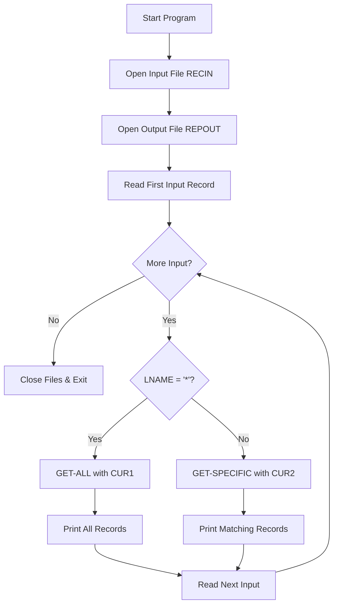
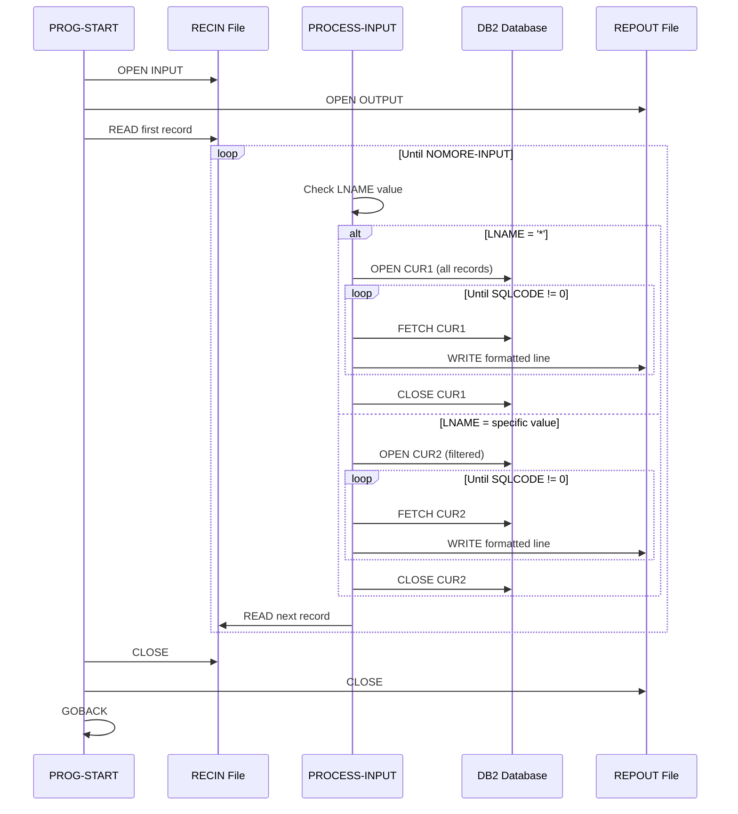
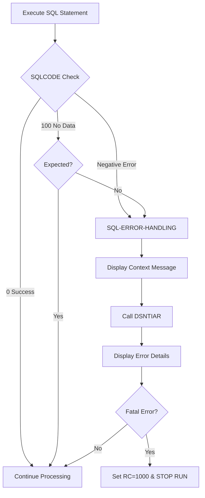
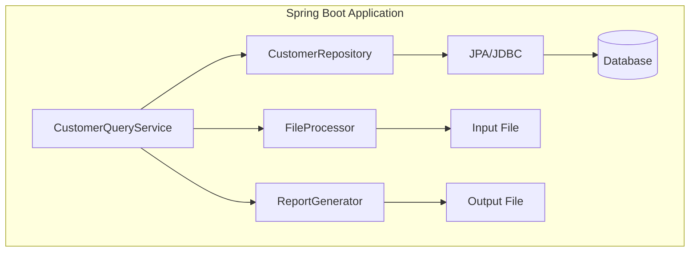

# CBLDB22 - Customer Account Query with Filtering

## Table of Contents

- [Overview](#overview)
- [Program Structure](#program-structure)
- [Data Structures](#data-structures)
- [Business Logic](#business-logic)
- [Database Operations](#database-operations)
- [Java Modernization Guide](#java-modernization-guide)

## Overview

**Program ID**: CBLDB22  
**Purpose**: Generate customer account reports with optional surname filtering  
**Complexity**: High  
**Database**: DB2 for z/OS  
**Input**: Sequential file with search criteria  
**Output**: Formatted report file

### Functionality

CBLDB22 reads search criteria from an input file and produces filtered reports:
- **Wildcard search** (`*`): Returns all customer accounts
- **Specific surname**: Returns only accounts matching the surname

The program uses two DB2 cursors to handle both scenarios efficiently.

### Program Flow



## Program Structure

### Key Features

1. **Dual Cursor Design**: Separate cursors for filtered and unfiltered queries
2. **Input-Driven Processing**: Reads multiple search criteria from input file
3. **Dynamic Query Selection**: Chooses appropriate cursor based on input
4. **Comprehensive Error Handling**: Checks every SQL operation

### Files and Datasets

| Component | Type | Purpose |
|-----------|------|---------|
| RECIN | Input File | Search criteria (80-char records) |
| REPOUT | Output File | Formatted report (120-char records) |
| Z#####T | DB2 Table | Customer accounts |

## Data Structures

### FILE SECTION

#### Input File (RECIN)

```cobol
FD  RECIN
    RECORD CONTAINS 80 CHARACTERS
    BLOCK CONTAINS 0 RECORDS
    RECORDING MODE F
    LABEL RECORDS ARE OMITTED.

01  INREC    PIC X(80).
```

**IOAREA Structure** (parsed from INREC):

| Field | Picture | Length | Description |
|-------|---------|--------|-------------|
| LNAME | X(25) | 25 | Last name to search or '*' for all |
| FILLER | X(55) | 55 | Unused space |

#### Output File (REPOUT)

Same structure as CBLDB21 (120-character records with formatted customer data).

### WORKING-STORAGE SECTION

#### Input Control

```cobol
77  INPUT-SWITCH        PIC X          VALUE  'Y'.
    88  NOMORE-INPUT               VALUE  'N'.
```

This is a **condition-name** (88-level) pattern:
- `INPUT-SWITCH` holds 'Y' (more input) or 'N' (end of file)
- `NOMORE-INPUT` is a boolean condition name
- `SET NOMORE-INPUT TO TRUE` sets INPUT-SWITCH to 'N'

#### Database Cursors

**CUR1 - All Records**:
```cobol
EXEC SQL DECLARE CUR1 CURSOR FOR
    SELECT * FROM Z#####T
END-EXEC.
```

**CUR2 - Filtered by Surname**:
```cobol
EXEC SQL DECLARE CUR2 CURSOR FOR
    SELECT *
    FROM   Z#####T
    WHERE  SURNAME = :LNAME
END-EXEC.
```

> [!IMPORTANT]
> CUR2 uses a **host variable** (`:LNAME`) for parameterized query. This is the COBOL equivalent of a prepared statement in Java.

## Business Logic

### Main Program Flow



### PROCEDURE DIVISION Paragraphs

#### PROG-START (Main Entry)

```cobol
PROG-START.
    OPEN INPUT  RECIN.
    OPEN OUTPUT REPOUT.
    READ RECIN  RECORD INTO IOAREA
       AT END SET NOMORE-INPUT TO TRUE.
    PERFORM PROCESS-INPUT
       UNTIL NOMORE-INPUT.
```

**Actions**:
1. Open both input and output files
2. Read first input record into IOAREA
3. Process all input records in loop
4. Continue until end-of-file

#### PROCESS-INPUT (Dispatcher)

```cobol
PROCESS-INPUT.
    IF LNAME = '*'
       PERFORM GET-ALL
    ELSE
       PERFORM GET-SPECIFIC.
    READ RECIN  RECORD INTO IOAREA
       AT END SET NOMORE-INPUT TO TRUE.
```

**Logic**:
- Branches based on input value
- `*` triggers full dataset retrieval
- Any other value triggers filtered query
- Reads next input record

#### GET-ALL (Unfiltered Query)

```cobol
GET-ALL.
    EXEC SQL OPEN CUR1  END-EXEC.
    IF SQLCODE NOT = 0 THEN
       MOVE 'OPEN CUR1' TO UD-ERROR-MESSAGE
       PERFORM SQL-ERROR-HANDLING
    END-IF
    EXEC SQL FETCH CUR1  INTO :CUSTOMER-RECORD END-EXEC.
    PERFORM PRINT-ALL
         UNTIL SQLCODE IS NOT EQUAL TO ZERO.
    IF SQLCODE NOT = 100 THEN
       MOVE 'FETCH CUR1' TO UD-ERROR-MESSAGE
       PERFORM SQL-ERROR-HANDLING
    END-IF
    EXEC SQL CLOSE CUR1  END-EXEC.
    IF SQLCODE NOT = 0 THEN
       MOVE 'CLOSE CUR1' TO UD-ERROR-MESSAGE
       PERFORM SQL-ERROR-HANDLING
    END-IF
    .
```

**Process**:
1. Open cursor (executes SELECT * query)
2. Check for open errors
3. Fetch first record
4. Loop through all records via PRINT-ALL
5. Verify end condition (SQLCODE 100)
6. Close cursor
7. Check for close errors

#### GET-SPECIFIC (Filtered Query)

```cobol
GET-SPECIFIC.
    EXEC SQL OPEN  CUR2  END-EXEC.
    IF SQLCODE NOT = 0 THEN
       MOVE 'OPEN CUR2' TO UD-ERROR-MESSAGE
       PERFORM SQL-ERROR-HANDLING
    END-IF
    EXEC SQL FETCH CUR2  INTO :CUSTOMER-RECORD END-EXEC.
    PERFORM PRINT-SPECIFIC
         UNTIL SQLCODE IS NOT EQUAL TO ZERO.
    IF SQLCODE NOT = 100 THEN
       MOVE 'FETCH CUR2' TO UD-ERROR-MESSAGE
       PERFORM SQL-ERROR-HANDLING
    END-IF
    EXEC SQL CLOSE CUR2  END-EXEC.
    IF SQLCODE NOT = 0 THEN
       MOVE 'CLOSE CUR2' TO UD-ERROR-MESSAGE
       PERFORM SQL-ERROR-HANDLING
    END-IF
    .
```

**Process**: Same as GET-ALL but uses CUR2 with WHERE clause

> [!NOTE]
> The host variable `:LNAME` is evaluated when the cursor opens, not when it's declared.

#### Print Paragraphs

- **PRINT-ALL**: Calls PRINT-A-LINE, then fetches next from CUR1
- **PRINT-SPECIFIC**: Calls PRINT-A-LINE, then fetches next from CUR2
- **PRINT-A-LINE**: Moves fields to output record and writes with 2-line spacing

## Database Operations

### Parameterized Queries

CUR2 demonstrates **host variable** usage:

```cobol
WHERE SURNAME = :LNAME
```

**At Runtime**:
1. LNAME field from IOAREA is read
2. When CUR2 opens, :LNAME is replaced with actual value
3. DB2 executes: `SELECT * FROM Z#####T WHERE SURNAME = '<actual-value>'`
4. Results are fetched one row at a time

### Comparison with Static Query

| Feature | CUR1 (Static) | CUR2 (Parameterized) |
|---------|---------------|----------------------|
| WHERE clause | None | `SURNAME = :LNAME` |
| Returns | All rows | Filtered rows |
| Host variables | No | Yes (`:LNAME`) |
| Reusable | No | Yes (different values) |

### SQL Error Handling Strategy



## Java Modernization Guide

### Recommended Architecture



### Java Implementation

#### Repository with Query Methods

```java
@Repository
public interface CustomerRepository extends JpaRepository<Customer, String> {
    
    // Replaces CUR1 - get all customers
    List<Customer> findAll();
    
    // Replaces CUR2 - filter by surname
    List<Customer> findBySurname(String surname);
    
    // More efficient: use query methods
    @Query("SELECT c FROM Customer c WHERE c.surname = :surname")
    List<Customer> findCustomersBySurname(@Param("surname") String surname);
}
```

#### Service Class

```java
@Service
public class CustomerQueryService {
    
    @Autowired
    private CustomerRepository customerRepository;
    
    @Autowired
    private ReportGenerator reportGenerator;
    
    /**
     * Process input file with search criteria
     * Replaces PROG-START logic
     */
    public void processQueryFile(Path inputFile, Path outputFile) 
            throws IOException {
        
        try (BufferedReader reader = Files.newBufferedReader(inputFile);
             BufferedWriter writer = Files.newBufferedWriter(outputFile)) {
            
            String line;
            while ((line = reader.readLine()) != null) {
                // Parse first 25 characters as surname
                String surname = line.substring(0, 
                    Math.min(25, line.length())).trim();
                
                List<Customer> customers;
                if ("*".equals(surname)) {
                    // Replaces GET-ALL
                    customers = customerRepository.findAll();
                } else {
                    // Replaces GET-SPECIFIC
                    customers = customerRepository
                        .findBySurname(surname);
                }
                
                // Write results to output
                for (Customer customer : customers) {
                    String reportLine = reportGenerator
                        .formatCustomerLine(customer);
                    writer.write(reportLine);
                    writer.newLine();
                    writer.newLine();
                }
            }
        } catch (DataAccessException e) {
            throw new ReportGenerationException(
                "Database error during query processing", e);
        }
    }
}
```

#### Input File Processor

```java
@Component
public class QueryFileProcessor {
    
    /**
     * Parse COBOL-style 80-character input record
     */
    public String parseSurname(String line) {
        if (line == null || line.isEmpty()) {
            return "*"; // Default to all
        }
        
        // Extract first 25 characters (LNAME field)
        String surname = line.substring(0, Math.min(25, line.length()));
        return surname.trim();
    }
    
    /**
     * Validate input
     */
    public boolean isWildcard(String surname) {
        return "*".equals(surname);
    }
}
```

### Using Spring Data Specifications (Advanced)

For more complex queries, use **Spring Data Specifications**:

```java
public class CustomerSpecifications {
    
    public static Specification<Customer> hasSurname(String surname) {
        return (root, query, criteriaBuilder) -> {
            if ("*".equals(surname)) {
                return criteriaBuilder.conjunction(); // No filter
            }
            return criteriaBuilder.equal(root.get("surname"), surname);
        };
    }
}

// Usage in repository
@Repository
public interface CustomerRepository 
        extends JpaRepository<Customer, String>,
                JpaSpecificationExecutor<Customer> {
}

// In service
List<Customer> customers = customerRepository
    .findAll(CustomerSpecifications.hasSurname(surname));
```

### Error Handling Comparison

**COBOL**:
```cobol
IF SQLCODE NOT = 0 THEN
   MOVE 'OPEN CUR2' TO UD-ERROR-MESSAGE
   PERFORM SQL-ERROR-HANDLING
END-IF
```

**Java (Spring)**:
```java
try {
    List<Customer> customers = customerRepository.findBySurname(surname);
} catch (DataAccessException e) {
    logger.error("Database error querying surname {}: {}", 
                 surname, e.getMessage());
    throw new ReportGenerationException(
        "Failed to query customers by surname: " + surname, e);
}
```

### Performance Optimization

#### Batch Processing

```java
@Service
public class CustomerQueryService {
    
    @Autowired
    private EntityManager entityManager;
    
    /**
     * Stream results for large datasets
     * More memory-efficient than loading all into List
     */
    @Transactional(readOnly = true)
    public void processQueryFileStreaming(Path inputFile, Path outputFile) 
            throws IOException {
        
        try (BufferedReader reader = Files.newBufferedReader(inputFile);
             BufferedWriter writer = Files.newBufferedWriter(outputFile)) {
            
            String line;
            while ((line = reader.readLine()) != null) {
                String surname = parseSurname(line);
                
                if ("*".equals(surname)) {
                    processAllCustomersStreaming(writer);
                } else {
                    processFilteredCustomersStreaming(surname, writer);
                }
            }
        }
    }
    
    private void processAllCustomersStreaming(BufferedWriter writer) 
            throws IOException {
        
        String query = "SELECT c FROM Customer c";
        try (Stream<Customer> stream = entityManager
                .createQuery(query, Customer.class)
                .getResultStream()) {
            
            stream.forEach(customer -> {
                try {
                    writeCustomerLine(customer, writer);
                } catch (IOException e) {
                    throw new UncheckedIOException(e);
                }
            });
        }
    }
    
    private void processFilteredCustomersStreaming(String surname, 
            BufferedWriter writer) throws IOException {
        
        String query = "SELECT c FROM Customer c WHERE c.surname = :surname";
        try (Stream<Customer> stream = entityManager
                .createQuery(query, Customer.class)
                .setParameter("surname", surname)
                .getResultStream()) {
            
            stream.forEach(customer -> {
                try {
                    writeCustomerLine(customer, writer);
                } catch (IOException e) {
                    throw new UncheckedIOException(e);
                }
            });
        }
    }
}
```

### Testing

#### Unit Test with Mock Data

```java
@SpringBootTest
class CustomerQueryServiceTest {
    
    @Autowired
    private CustomerQueryService queryService;
    
    @MockBean
    private CustomerRepository customerRepository;
    
    @Test
    void testWildcardQuery() throws IOException {
        // Arrange
        List<Customer> mockCustomers = createMockCustomers();
        when(customerRepository.findAll()).thenReturn(mockCustomers);
        
        Path inputFile = createInputFile("*\n");
        Path outputFile = Files.createTempFile("output", ".txt");
        
        // Act
        queryService.processQueryFile(inputFile, outputFile);
        
        // Assert
        List<String> lines = Files.readAllLines(outputFile);
        assertEquals(mockCustomers.size() * 2, lines.size());
        
        // Cleanup
        Files.deleteIfExists(inputFile);
        Files.deleteIfExists(outputFile);
    }
    
    @Test
    void testFilteredQuery() throws IOException {
        // Arrange
        String surname = "Smith";
        List<Customer> mockCustomers = List.of(createCustomer(surname));
        when(customerRepository.findBySurname(surname))
            .thenReturn(mockCustomers);
        
        Path inputFile = createInputFile(surname + "\n");
        Path outputFile = Files.createTempFile("output", ".txt");
        
        // Act
        queryService.processQueryFile(inputFile, outputFile);
        
        // Assert
        List<String> lines = Files.readAllLines(outputFile);
        assertEquals(2, lines.size()); // One customer, 2 lines
        assertTrue(lines.get(0).contains(surname));
        
        // Cleanup
        Files.deleteIfExists(inputFile);
        Files.deleteIfExists(outputFile);
    }
    
    private Path createInputFile(String content) throws IOException {
        Path file = Files.createTempFile("input", ".txt");
        Files.writeString(file, content);
        return file;
    }
}
```

### Migration Checklist

- [ ] Create Customer entity (reuse from CBLDB21)
- [ ] Add `findBySurname()` method to repository
- [ ] Implement CustomerQueryService
- [ ] Create input file parser
- [ ] Implement output formatter (reuse from CBLDB21)
- [ ] Add comprehensive error handling
- [ ] Create unit tests for both query types
- [ ] Integration test with actual database
- [ ] Performance test with large files
- [ ] Document API and configuration

### Key Differences

| Aspect | COBOL | Java |
|--------|-------|------|
| Input parsing | Fixed-length fields | String methods or libraries |
| Query execution | Two separate cursors | Repository method selection |
| Loop control | PERFORM UNTIL | while/for loops |
| Error handling | SQLCODE checking | Exception handling |
| File handling | FD declarations | NIO or Streams |
| Parameterization | Host variables (:var) | Method parameters |

> [!TIP]
> Consider using Spring Batch for processing large input files with multiple queries. It provides transaction management, error handling, and restart capabilities.

> [!NOTE]
> The dual-cursor pattern in COBOL (CUR1 and CUR2) can be simplified in Java to a single repository with conditional logic, making the code more maintainable.
