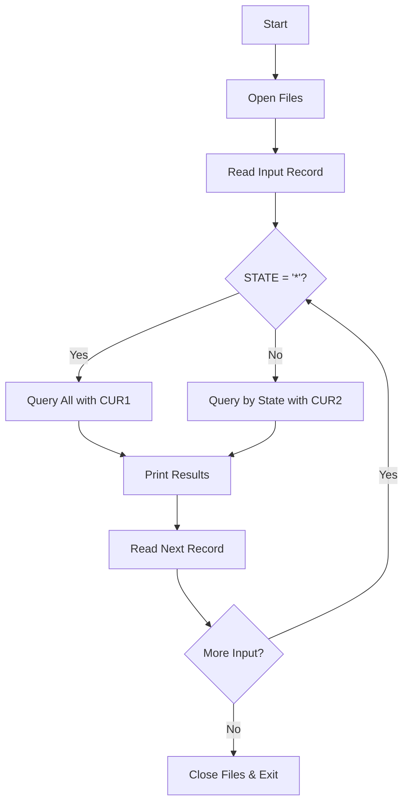
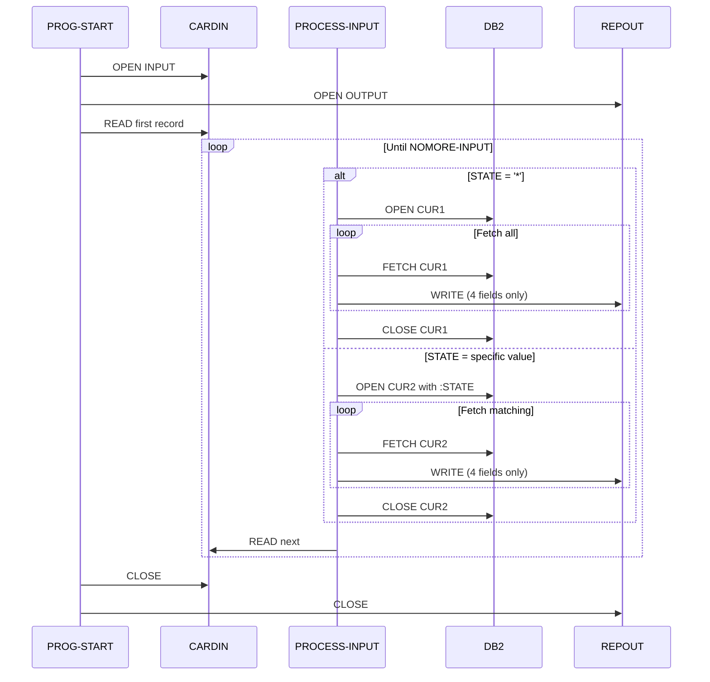

# CBLDB23 - Customer Query by State Filter

## Table of Contents

- [Overview](#overview)
- [Program Structure](#program-structure)
- [Data Structures](#data-structures)
- [Business Logic](#business-logic)
- [Java Modernization Guide](#java-modernization-guide)

## Overview

**Program ID**: CBLDB23  
**Author**: Otto B. Relational  
**Purpose**: Generate customer account reports filtered by state (ADDRESS3 field)  
**Complexity**: High  
**Database**: DB2 for z/OS

### Functionality

CBLDB23 is similar to CBLDB22 but filters on the ADDRESS3 field (state) instead of surname:
- **Wildcard search** (`*`): Returns all customer accounts
- **Specific state**: Returns only accounts from that state

### Key Differences from CBLDB22

| Feature | CBLDB22 | CBLDB23 |
|---------|---------|---------|
| Filter field | SURNAME | ADDRESS3 (State) |
| Input field name | LNAME | STATE |
| WHERE clause | `WHERE SURNAME = :LNAME` | `WHERE ADDRESS3 = :STATE` |
| Output columns | Full customer data | Partial data (no addresses/limit/balance) |

### Program Flow



## Program Structure

### Files and Datasets

| Component | Type | Assignment | Purpose |
|-----------|------|------------|---------|
| CARDIN | Input File | DA-S-CARDIN | Search criteria (80 chars) |
| REPOUT | Output File | UT-S-REPORT | Formatted report (120 chars) |
| Z#####T | DB2 Table | - | Customer accounts |

### Input File Structure (CARDIN)

```cobol
FD  CARDIN
    RECORD CONTAINS 80 CHARACTERS
    BLOCK CONTAINS 0 RECORDS
    RECORDING MODE F
    LABEL RECORDS ARE OMITTED.

01  CARDREC    PIC X(80).
```

**IOAREA Parsing**:
```cobol
01  IOAREA.
    02  STATE     PIC X(25).
    02  FILLER    PIC X(55).
```

### Output File Structure (REPOUT)

**Simplified Report Layout** (120 characters):

| Field | Picture | Description |
|-------|---------|-------------|
| ACCT-NO-O | X(8) | Account number |
| ACCT-LASTN-O | X(20) | Last name |
| ACCT-FIRSTN-O | X(15) | First name |
| ACCT-ADDR3-O | X(15) | State (ADDRESS3) |

> [!NOTE]
> Unlike CBLDB21/CBLDB22, this program outputs a simplified report without credit limits, balances, or full addresses.

## Data Structures

### Database Cursors

**CUR1 - All Records** (Unfiltered):
```cobol
EXEC SQL DECLARE CUR1 CURSOR FOR
    SELECT * FROM Z#####T
END-EXEC.
```

**CUR2 - Filtered by State**:
```cobol
EXEC SQL DECLARE CUR2 CURSOR FOR
    SELECT *
    FROM   Z#####T
    WHERE  ADDRESS3 = :STATE
END-EXEC.
```

### CUSTOMER-RECORD Structure

Same as CBLDB21 and CBLDB22 - full customer record with all fields.

## Business Logic

### Main Processing Logic

The program follows the same dual-cursor pattern as CBLDB22:



### Key Paragraphs

#### PROG-START

```cobol
PROG-START.
    OPEN INPUT  CARDIN.
    OPEN OUTPUT REPOUT.
    READ CARDIN RECORD INTO IOAREA
       AT END SET NOMORE-INPUT TO TRUE.
    PERFORM PROCESS-INPUT
       UNTIL NOMORE-INPUT.
PROG-END.
    CLOSE CARDIN REPOUT.
    GOBACK.
```

#### PROCESS-INPUT

```cobol
PROCESS-INPUT.
    IF STATE = '*'
       PERFORM GET-ALL
    ELSE
       PERFORM GET-SPECIFIC.
    READ CARDIN RECORD INTO IOAREA
       AT END SET NOMORE-INPUT TO TRUE.
```

#### PRINT-A-LINE

```cobol
PRINT-A-LINE.
    MOVE  ACCT-NO      TO  ACCT-NO-O.
    MOVE  ACCT-LASTN   TO  ACCT-LASTN-O.
    MOVE  ACCT-FIRSTN  TO  ACCT-FIRSTN-O.
    MOVE  ACCT-ADDR3   TO  ACCT-ADDR3-O.
    WRITE REPREC AFTER ADVANCING 2 LINES.
```

> [!IMPORTANT]
> Only 4 fields are written to the output, unlike CBLDB21/22 which write 6 fields including credit limits and balances.

## Java Modernization Guide

### Repository Interface

```java
@Repository
public interface CustomerRepository extends JpaRepository<Customer, String> {
    
    // Replaces CUR1
    List<Customer> findAll();
    
    // Replaces CUR2 - filter by state (ADDRESS3)
    List<Customer> findByAddress3(String state);
    
    // Or use query method for clarity
    @Query("SELECT c FROM Customer c WHERE c.address3 = :state")
    List<Customer> findCustomersByState(@Param("state") String state);
}
```

### Service Implementation

```java
@Service
public class StateReportService {
    
    @Autowired
    private CustomerRepository customerRepository;
    
    /**
     * Process state query file
     * Replaces CBLDB23 main logic
     */
    public void generateStateReport(Path inputFile, Path outputFile) 
            throws IOException {
        
        try (BufferedReader reader = Files.newBufferedReader(inputFile);
             BufferedWriter writer = Files.newBufferedWriter(outputFile)) {
            
            String line;
            while ((line = reader.readLine()) != null) {
                // Parse first 25 characters as state
                String state = parseState(line);
                
                List<Customer> customers;
                if ("*".equals(state)) {
                    customers = customerRepository.findAll();
                } else {
                    customers = customerRepository.findByAddress3(state);
                }
                
                // Write simplified report (only 4 fields)
                for (Customer customer : customers) {
                    String reportLine = formatStateReportLine(customer);
                    writer.write(reportLine);
                    writer.newLine();
                    writer.newLine();
                }
            }
        }
    }
    
    private String parseState(String line) {
        if (line == null || line.isEmpty()) {
            return "*";
        }
        return line.substring(0, Math.min(25, line.length())).trim();
    }
    
    /**
     * Format output line with only account, names, and state
     * Matches CBLDB23 output format
     */
    private String formatStateReportLine(Customer customer) {
        return String.format("%-8s %-20s %-15s %-15s",
            customer.getAccountNumber(),
            customer.getLastName(),
            customer.getFirstName(),
            customer.getAddress3()
        );
    }
}
```

### DTO for Simplified Output

If you want to optimize queries and only fetch needed fields:

```java
/**
 * Data Transfer Object for state report
 * Contains only fields needed for output
 */
public class StateReportDTO {
    private String accountNumber;
    private String lastName;
    private String firstName;
    private String state;
    
    public StateReportDTO(String accountNumber, String lastName,
                          String firstName, String state) {
        this.accountNumber = accountNumber;
        this.lastName = lastName;
        this.firstName = firstName;
        this.state = state;
    }
    
    // Getters
}

// Repository with projection
@Repository
public interface CustomerRepository extends JpaRepository<Customer, String> {
    
    @Query("SELECT new com.example.dto.StateReportDTO(" +
           "c.accountNumber, c.lastName, c.firstName, c.address3) " +
           "FROM Customer c WHERE c.address3 = :state")
    List<StateReportDTO> findStateReportByState(@Param("state") String state);
    
    @Query("SELECT new com.example.dto.StateReportDTO(" +
           "c.accountNumber, c.lastName, c.firstName, c.address3) " +
           "FROM Customer c")
    List<StateReportDTO> findAllForStateReport();
}
```

### Using Spring Data Projections (Alternative)

```java
/**
 * Interface-based projection
 * Spring Data automatically implements this
 */
public interface StateReportProjection {
    String getAccountNumber();
    String getLastName();
    String getFirstName();
    String getAddress3();
}

@Repository
public interface CustomerRepository extends JpaRepository<Customer, String> {
    
    List<StateReportProjection> findByAddress3(String state);
    
    @Query("SELECT c FROM Customer c")
    List<StateReportProjection> findAllProjected();
}
```

### Complete Example with Projections

```java
@Service
public class StateReportService {
    
    @Autowired
    private CustomerRepository customerRepository;
    
    public void generateStateReport(Path inputFile, Path outputFile) 
            throws IOException {
        
        try (BufferedReader reader = Files.newBufferedReader(inputFile);
             BufferedWriter writer = Files.newBufferedWriter(outputFile)) {
            
            String line;
            while ((line = reader.readLine()) != null) {
                String state = parseState(line);
                
                // Use projections for better performance
                List<StateReportProjection> customers;
                if ("*".equals(state)) {
                    customers = customerRepository.findAllProjected();
                } else {
                    customers = customerRepository.findByAddress3(state);
                }
                
                for (StateReportProjection customer : customers) {
                    writer.write(formatLine(customer));
                    writer.newLine();
                    writer.newLine();
                }
            }
        }
    }
    
    private String formatLine(StateReportProjection customer) {
        return String.format("%-8s %-20s %-15s %-15s",
            customer.getAccountNumber(),
            customer.getLastName(),
            customer.getFirstName(),
            customer.getAddress3()
        );
    }
}
```

### Performance Optimization

> [!TIP]
> When you only need a subset of fields, use projections or DTOs to reduce memory usage and network traffic.

**Benefits of Projections**:
- Less data transferred from database
- Reduced memory footprint
- Faster serialization
- Better performance for large datasets

### Testing

```java
@SpringBootTest
class StateReportServiceTest {
    
    @Autowired
    private StateReportService reportService;
    
    @MockBean
    private CustomerRepository customerRepository;
    
    @Test
    void testStateFilterQuery() throws IOException {
        // Arrange
        String testState = "Virginia";
        List<Customer> virginiaCustomers = createVirginiaCustomers();
        when(customerRepository.findByAddress3(testState))
            .thenReturn(virginiaCustomers);
        
        Path inputFile = createInputFile(testState + "\n");
        Path outputFile = Files.createTempFile("output", ".txt");
        
        // Act
        reportService.generateStateReport(inputFile, outputFile);
        
        // Assert
        List<String> lines = Files.readAllLines(outputFile);
        assertEquals(virginiaCustomers.size() * 2, lines.size());
        
        // Verify output contains state
        assertTrue(lines.stream()
            .filter(line -> !line.isBlank())
            .allMatch(line -> line.contains(testState)));
        
        // Cleanup
        Files.deleteIfExists(inputFile);
        Files.deleteIfExists(outputFile);
    }
    
    @Test
    void testWildcardQuery() throws IOException {
        // Similar to testStateFilterQuery but with "*"
        List<Customer> allCustomers = createMockCustomers();
        when(customerRepository.findAll()).thenReturn(allCustomers);
        
        Path inputFile = createInputFile("*\n");
        Path outputFile = Files.createTempFile("output", ".txt");
        
        reportService.generateStateReport(inputFile, outputFile);
        
        List<String> lines = Files.readAllLines(outputFile);
        assertEquals(allCustomers.size() * 2, lines.size());
        
        Files.deleteIfExists(inputFile);
        Files.deleteIfExists(outputFile);
    }
}
```

### Migration Checklist

- [ ] Create Customer entity (reuse from previous programs)
- [ ] Add `findByAddress3()` method to repository
- [ ] Create StateReportDTO or projection interface
- [ ] Implement StateReportService
- [ ] Create input file parser
- [ ] Implement simplified output formatter (4 fields only)
- [ ] Add error handling
- [ ] Write unit tests for state filtering
- [ ] Integration test with database
- [ ] Performance test with projections vs full entities

### Comparison with CBLDB22

| Aspect | CBLDB22 (Surname) | CBLDB23 (State) |
|--------|-------------------|-----------------|
| Filter field | SURNAME (20 char) | ADDRESS3 (15 char) |
| Input field | LNAME | STATE |
| Output fields | 6 (full record) | 4 (partial record) |
| Use case | Find by customer name | Geographic reporting |
| Performance | High selectivity | Variable (depends on state population) |

### Additional Use Cases

The state-based filtering pattern can be extended for:

1. **Geographic Analysis**
   - Customer distribution by state
   - Regional sales reports
   - Compliance reporting by jurisdiction

2. **Batch Processing**
   - State-by-state data exports
   - Regional data synchronization
   - Targeted marketing campaigns

3. **Modern Enhancements**
   ```java
   // Count customers by state
   long count = customerRepository.countByAddress3(state);
   
   // Get distinct states
   @Query("SELECT DISTINCT c.address3 FROM Customer c")
   List<String> findAllStates();
   
   // Group by state
   @Query("SELECT c.address3, COUNT(c) FROM Customer c GROUP BY c.address3")
   List<Object[]> countCustomersByState();
   ```

> [!NOTE]
> The simplified output format in CBLDB23 suggests this program may be used for summary reports or mailing lists rather than detailed financial analysis.
