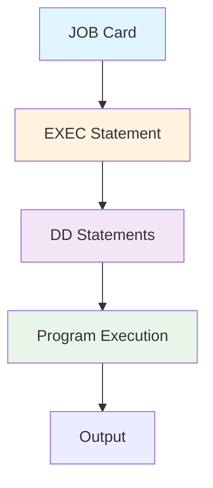
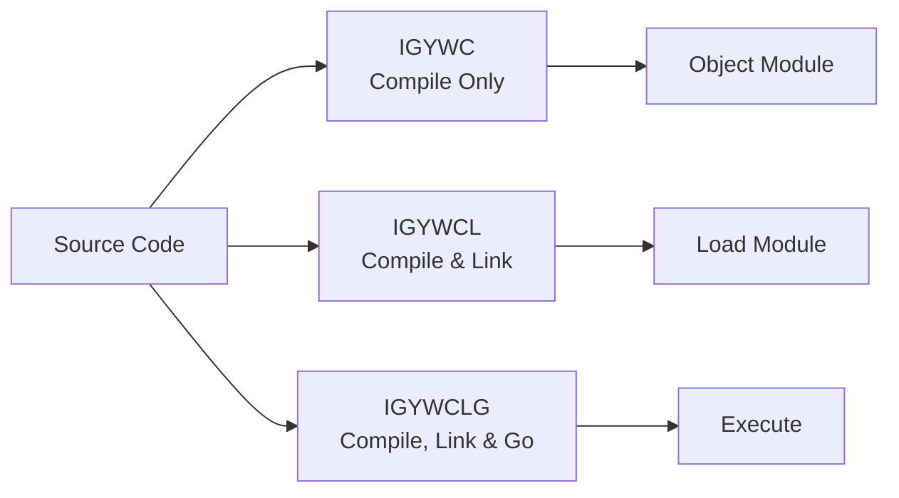

# JCL Scripts Documentation

## Table of Contents

- [Overview](#overview)
- [JCL Basics](#jcl-basics)
- [Script Categories](#script-categories)
- [Key JCL Procedures](#key-jcl-procedures)
- [Migration to Modern Job Control](#migration-to-modern-job-control)

## Overview

This directory contains documentation for the 40+ Job Control Language (JCL) scripts in the repository. JCL is IBM's scripting language for z/OS batch job control.

### What is JCL?

JCL (Job Control Language) is used on IBM mainframes to:
- Define batch jobs and their execution order
- Allocate system resources (memory, files, datasets)
- Compile, link, and execute programs
- Handle job dependencies and conditional execution
- Manage input/output datasets

### Basic JCL Structure



## JCL Basics

### JCL Statement Types

```jcl
//JOBNAME  JOB  parameters                 ← JOB card (required)
//STEPNAME EXEC PGM=programname            ← EXEC statement (execute)
//DDNAME   DD   DSN=dataset.name,DISP=SHR  ← DD statement (data definition)
```

### Sample JCL Breakdown

```jcl
//HELLO    JOB  1,NOTIFY=&SYSUID           ← Job name, accounting, notify
//*************************************************
//* This is a comment                           
//*************************************************
//STEP1    EXEC PGM=IEFBR14                ← Execute program IEFBR14
//SYSPRINT DD   SYSOUT=*                    ← Output to system printer
//SYSIN    DD   DUMMY                       ← No input
```

### Key Concepts

| Concept | Description | Example |
|---------|-------------|---------|
| **JOB** | Top-level job definition | `//MYJOB JOB 1` |
| **EXEC** | Execute a program or procedure | `EXEC PGM=COBPROG` |
| **DD** | Data Definition (file/dataset) | `DD DSN=MY.DATA` |
| **PROC** | Cataloged procedure (reusable) | `EXEC IGYWCLG` |
| **DISP** | Dataset disposition | `DISP=(NEW,CATLG)` |
| **SYSOUT** | System output class | `SYSOUT=*` |
| **DSN** | Dataset name | `DSN=USER.COBOL.SOURCE` |

## Script Categories

### Compilation Procedures (23 scripts)

JCL procedures for compiling COBOL programs:



#### Standard COBOL Procedures

| Procedure | Purpose | Steps | Output |
|-----------|---------|-------|--------|
| **IGYWC** | Compile only | 1. Compile | Object module |
| **IGYWCL** | Compile and link | 1. Compile<br/>2. Link-edit | Load module |
| **IGYWCLG** | Compile, link, and go | 1. Compile<br/>2. Link-edit<br/>3. Execute | Program output |

**Documentation:**
- [IGYWC.md](IGYWC.md) - Compile only
- [IGYWCL.md](IGYWCL.md) - Compile and link
- [IGYWCLG.md](IGYWCLG.md) - Compile, link, and execute

#### DB2 COBOL Procedures

| Procedure | Purpose | Additional Steps |
|-----------|---------|------------------|
| **DB2CBL** | DB2 precompile + compile | 1. DB2 precompile<br/>2. COBOL compile<br/>3. Link |
| **DB2JCL** | DB2 utilities | Run DB2 commands |
| **DSNUPROC** | DB2 program preparation | Full DB2 prep process |

**Documentation:**
- [DB2CBL.md](DB2CBL.md) - DB2 COBOL compilation
- [DB2SETUP.md](DB2SETUP.md) - Database setup
- [DSNUPROC.md](DSNUPROC.md) - DB2 utilities

### Execution Jobs (18 scripts)

Jobs that execute compiled programs:

**Pattern:**
```jcl
//JOBNAME  JOB  1,NOTIFY=&SYSUID
//STEP1    EXEC PGM=CBLDB21
//STEPLIB  DD   DSN=&SYSUID..LOAD,DISP=SHR
//REPOUT   DD   SYSOUT=*
//SYSOUT   DD   SYSOUT=*
```

### DB2 Operations (12 scripts)

Database-related JCL:

**Categories:**
1. **Setup**: Create tables, load data
   - CRETBL.jcl - Create tables
   - LOADTBL.jcl - Load data
   - DB2SETUP.jcl - Complete setup

2. **Compile & Bind**: Prepare DB2 programs
   - CBLDB21C.jcl - Compile CBLDB21
   - CBLDB22C.jcl - Compile CBLDB22
   - CBLDB23C.jcl - Compile CBLDB23

3. **Execute**: Run DB2 programs
   - CBLDB21R.jcl - Run CBLDB21
   - CBLDB22R.jcl - Run CBLDB22
   - CBLDB23R.jcl - Run CBLDB23

## Key JCL Procedures

### IGYWCLG - Compile, Link, and Go

```jcl
//HELLOCBL JOB  1,NOTIFY=&SYSUID
//COBRUN   EXEC IGYWCLG,SRC=HELLO
```

**What it does:**
1. Reads source from dataset
2. Compiles to object code
3. Links into load module
4. Executes the program

**Modern Equivalent:**
```bash
# Maven/Gradle build + execute
mvn clean package
java -jar target/hello-app.jar
```

### IGYWCL - Compile and Link

```jcl
//CBL0001J JOB 1,NOTIFY=&SYSUID
//COBRUN  EXEC IGYWCL
//COBOL.SYSIN  DD DSN=&SYSUID..CBL(CBL0001),DISP=SHR
//LKED.SYSLMOD DD DSN=&SYSUID..LOAD(CBL0001),DISP=SHR
```

**What it does:**
1. Compiles source code
2. Links into executable
3. Stores in load library

**Modern Equivalent:**
```bash
# Build only, no execution
mvn clean package -DskipTests
```

### DB2CBL - DB2 COBOL Preparation

```jcl
//COMPILE  EXEC DB2CBL,MBR=CBLDB21,PARM=('SQL,CODEPAGE(1047)')
//BIND.SYSTSIN  DD *,SYMBOLS=CNVTSYS
 DSN SYSTEM(DBCG)
 BIND PLAN(&SYSUID) PKLIST(&SYSUID..*) MEMBER(CBLDB21) -
      ACT(REP) ISO(CS) ENCODING(EBCDIC)
/*
```

**What it does:**
1. Precompile COBOL with embedded SQL
2. Compile preprocessed code
3. Link-edit
4. Bind to DB2 (create access plan)

**Modern Equivalent:**
```xml
<!-- Maven build with JPA -->
<build>
    <plugins>
        <plugin>
            <groupId>org.springframework.boot</groupId>
            <artifactId>spring-boot-maven-plugin</artifactId>
        </plugin>
    </plugins>
</build>
```

## Migration to Modern Job Control

### JCL → Shell Scripts

**JCL:**
```jcl
//REPORT   JOB  1,NOTIFY=&SYSUID
//STEP1    EXEC PGM=CBLDB21
//STEPLIB  DD   DSN=MYLIB.LOAD,DISP=SHR
//REPOUT   DD   DSN=REPORTS.OUTPUT,DISP=OLD
//SYSOUT   DD   SYSOUT=*
```

**Shell Script:**
```bash
#!/bin/bash
# report-job.sh

export JAVA_HOME=/usr/lib/jvm/java-17
export APP_HOME=/opt/myapp

# Execute the report
java -jar $APP_HOME/report-service.jar \
    --spring.profiles.active=production \
    --output.file=/data/reports/output.txt

# Check exit code
if [ $? -eq 0 ]; then
    echo "Report generated successfully"
    exit 0
else
    echo "Report generation failed"
    exit 1
fi
```

### JCL → Kubernetes CronJob

**JCL (scheduled batch):**
```jcl
// Runs at 2 AM daily via scheduler
//DAILYRPT JOB  1,NOTIFY=&SYSUID
//STEP1    EXEC PGM=CBLDB21
```

**Kubernetes:**
```yaml
apiVersion: batch/v1
kind: CronJob
metadata:
  name: daily-report
spec:
  schedule: "0 2 * * *"  # 2 AM daily
  jobTemplate:
    spec:
      template:
        spec:
          containers:
          - name: report-generator
            image: myapp/report-service:latest
            command: ["java"]
            args: ["-jar", "app.jar", "--job=daily-report"]
          restartPolicy: OnFailure
```

### JCL → Spring Batch

**JCL (multi-step job):**
```jcl
//BATCH    JOB  1
//STEP1    EXEC PGM=EXTRACT
//STEP2    EXEC PGM=TRANSFORM
//STEP3    EXEC PGM=LOAD
```

**Spring Batch:**
```java
@Configuration
@EnableBatchProcessing
public class BatchConfiguration {
    
    @Bean
    public Job etlJob(JobBuilderFactory jobs) {
        return jobs.get("etlJob")
            .start(extractStep())
            .next(transformStep())
            .next(loadStep())
            .build();
    }
    
    @Bean
    public Step extractStep(StepBuilderFactory steps) {
        return steps.get("extract")
            .tasklet(extractTasklet())
            .build();
    }
    
    @Bean
    public Step transformStep(StepBuilderFactory steps) {
        return steps.get("transform")
            .tasklet(transformTasklet())
            .build();
    }
    
    @Bean
    public Step loadStep(StepBuilderFactory steps) {
        return steps.get("load")
            .tasklet(loadTasklet())
            .build();
    }
}
```

### Comparison Table

| Aspect | JCL | Modern Equivalent |
|--------|-----|-------------------|
| Job Definition | JOB card | Shell script / K8s Job |
| Compilation | EXEC IGYWC | mvn compile |
| Execution | EXEC PGM= | java -jar |
| Scheduling | External scheduler | Cron / K8s CronJob |
| Dependencies | COND parameter | Script logic / workflow |
| File I/O | DD statements | File paths / config |
| Error Handling | COND codes | Exit codes / exceptions |
| Logging | SYSOUT | Log4j / SLF4J |
| Resources | REGION, TIME | Container limits |

## JCL Documentation Index

### Course #2 - Learning COBOL (22 files)

#### Procedures (3 files)
- [jclproc/IGYWC.md](IGYWC.md) - COBOL compile procedure
- [jclproc/IGYWCL.md](IGYWCL.md) - Compile and link procedure
- [jclproc/IGYWCLG.md](IGYWCLG.md) - Compile, link, and go procedure

#### Lab Jobs (19 files)
- HELLO.jcl - Simple hello world execution
- COBRUN.jcl - Generic COBOL run job
- CBL0001J.jcl through CBL0012J.jcl - Lab exercise jobs
- CBL0033J.jcl - Advanced lab job
- ADDAMT.jcl - Amount addition job
- PAYROL00.jcl, PAYROL0X.jcl - Payroll processing
- SRCHBINJ.jcl, SRCHSERJ.jcl - Search algorithms

### Course #3 - Advanced Topics (18 files)

#### DB2 Procedures (3 files)
- [jclproc/DB2CBL.md](DB2CBL.md) - DB2 COBOL compile procedure
- [jclproc/DB2JCL.md](DB2JCL.md) - DB2 utilities procedure  
- [jclproc/DSNUPROC.md](DSNUPROC.md) - DB2 program prep procedure

#### DB2 Setup (3 files)
- [DB2SETUP.md](DB2SETUP.md) - Complete DB2 environment setup
- [CRETBL.md](CRETBL.md) - Create database tables
- [LOADTBL.md](LOADTBL.md) - Load test data
- SELTBL.jcl - Select from tables
- DBRMLIB.jcl - DBRM library creation

#### DB2 Program Compilation (6 files)
- CBLDB21C.jcl - Compile and bind CBLDB21
- CBLDB22C.jcl - Compile and bind CBLDB22
- CBLDB23C.jcl - Compile and bind CBLDB23

#### DB2 Program Execution (3 files)
- CBLDB21R.jcl - Run CBLDB21 report
- CBLDB22R.jcl - Run CBLDB22 query
- CBLDB23R.jcl - Run CBLDB23 query

#### Debugging (1 file)
- [CBL0106J.md](CBL0106J.md) - Debug job for CBL0106

### Course #4 - Testing (2 files)
- DEPTPAY.JCL - Department payroll
- EMPPAY.JCL - Employee payroll

## Migration Strategy

### Phase 1: Document JCL Purpose

For each JCL script:
1. Identify what program it runs
2. Document inputs and outputs
3. Note dependencies
4. Record schedule (if any)

### Phase 2: Map to Modern Tools

| JCL Type | Modern Tool | Migration Effort |
|----------|-------------|------------------|
| Compile jobs | Maven/Gradle | Low |
| Execute jobs | Shell scripts | Low |
| Scheduled jobs | Cron/K8s | Medium |
| Multi-step jobs | Spring Batch | Medium-High |
| DB2 jobs | Liquibase/Flyway | Medium |

### Phase 3: Implement Replacements

1. Create build scripts (pom.xml / build.gradle)
2. Write execution scripts (bash / PowerShell)
3. Setup CI/CD pipelines
4. Implement job scheduling
5. Test thoroughly
6. Decommission JCL

> [!NOTE]
> Detailed documentation for specific JCL scripts is provided in individual files within this directory.

> [!TIP]
> Start migration with simple execution jobs (no compilation) before tackling complex multi-step procedures.
