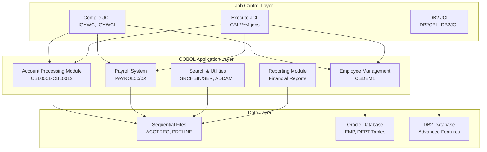
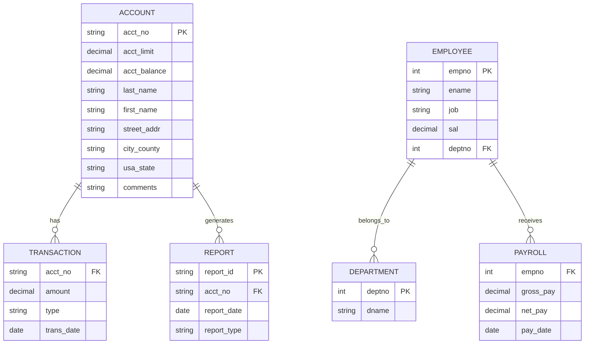
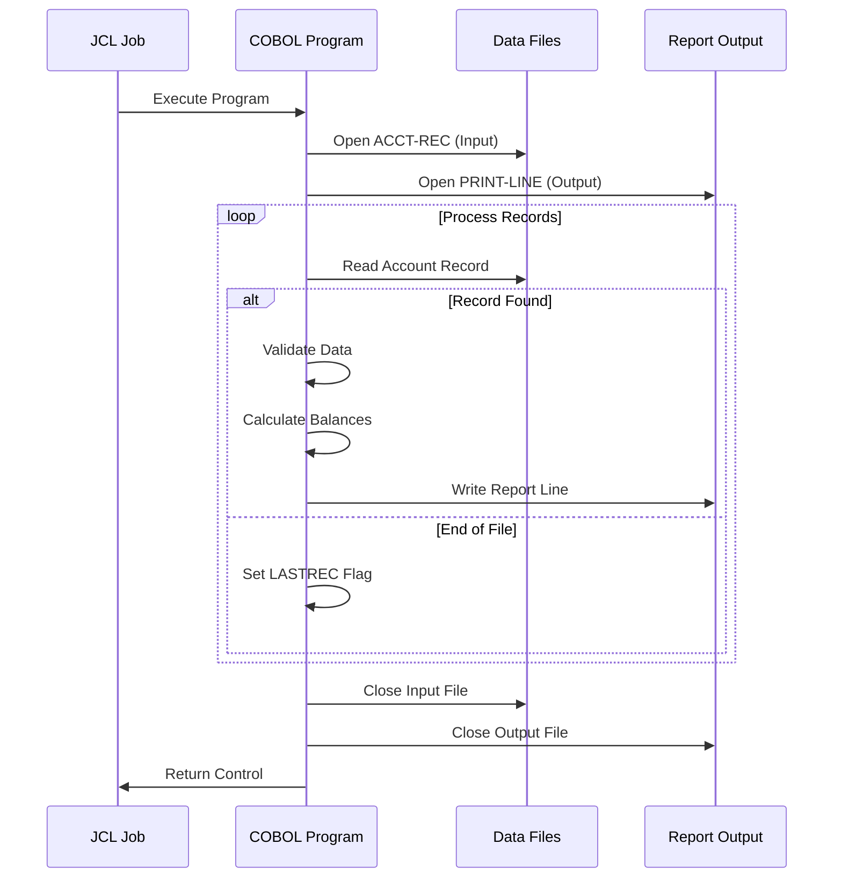
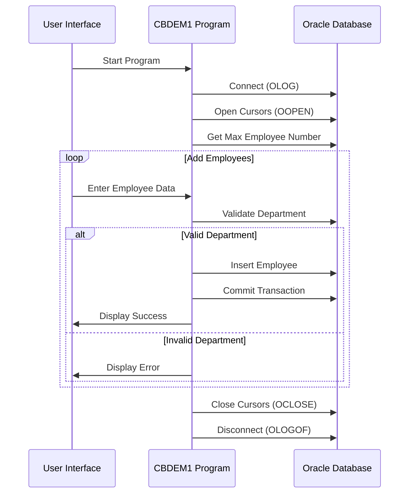
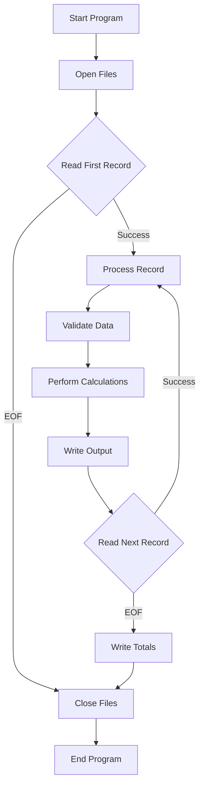
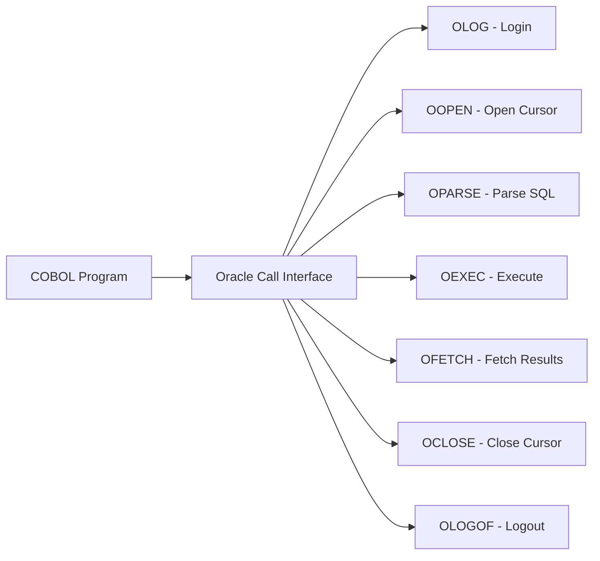

# Legacy System Architecture Analysis

## Overview
This document analyzes the existing COBOL application architecture, data flows, and system components to understand the current state before migration to Java Spring Boot.

## System Architecture Overview

## Data Architecture and Flow

### Primary Data Structures

## System Components Analysis

### 1. Account Processing System

### 2. Employee Management System (Oracle Integration)

### 3. File Processing Patterns

## Technology Stack Analysis

### Current COBOL Technology Stack
- **Language**: COBOL (Enterprise COBOL for z/OS)
- **Database**: Oracle Database, DB2 for z/OS
- **File System**: Sequential files (VSAM, flat files)
- **Job Control**: JCL (Job Control Language)
- **Runtime**: z/OS mainframe environment
- **Compilation**: IBM COBOL compiler (IGYWC procedures)

### Database Integration Patterns

#### Oracle Integration (CBDEM1)

#### File-based Processing

## Business Logic Patterns

### 1. Financial Calculations
- Account balance validation
- Credit limit checking
- Running totals and summaries
- Date-based reporting
- Currency formatting

### 2. Data Validation
- Account number format validation
- State code validation
- Department number validation
- Employee number generation
- Duplicate detection

### 3. Error Handling
- End-of-file detection
- Database error handling
- Data validation errors
- File operation errors
- Oracle-specific error handling

## Performance Characteristics

### Current System Performance
- **Batch Processing**: Sequential file processing
- **Memory Usage**: Fixed record layouts, minimal memory
- **Scalability**: Limited by mainframe resources
- **Throughput**: Optimized for batch operations

### Processing Volumes
- Account records: Variable, typically thousands
- Employee records: Smaller datasets
- Report generation: Daily/monthly batch cycles
- Search operations: Linear/binary search algorithms

## Integration Points

### External Systems
1. **Oracle Database**: Employee and department data
2. **DB2 Database**: Advanced reporting data
3. **File Systems**: Account master files, transaction files
4. **Print Systems**: Report output generation

### Data Exchange Formats
- Fixed-length records
- COMP-3 packed decimal fields
- Character data with EBCDIC encoding
- Sequential file organization

## Security Model

### Current Security Features
- Database user authentication (Oracle/DB2)
- File access controls through z/OS security
- Program-level authorization
- Limited audit trails

## Configuration Management

### Environment Management
- Development: Course environments
- Test: JCL-based testing
- Production: Mainframe batch scheduling

### Deployment Process
- COBOL compilation through JCL
- Load module management
- Dataset allocation and management
- Procedure library maintenance

## System Limitations

### Technical Constraints
1. **Platform Dependency**: z/OS mainframe only
2. **Language Limitations**: COBOL-specific features
3. **Database Integration**: Proprietary Oracle/DB2 interfaces
4. **User Interface**: Batch-only, no interactive UI
5. **Modern Integration**: Limited API capabilities

### Scalability Issues
1. **Single-threaded Processing**: Sequential batch only
2. **Memory Constraints**: Fixed allocation patterns
3. **Storage Limitations**: Dataset size restrictions
4. **Processing Windows**: Batch scheduling constraints

### Maintenance Challenges
1. **Skill Availability**: COBOL developer shortage
2. **Technology Age**: Legacy technology stack
3. **Integration Complexity**: Mainframe-centric
4. **Testing Limitations**: Limited automated testing

## Migration Readiness Assessment

### Well-Structured Components
- Clear separation of data and logic
- Consistent error handling patterns
- Modular program design
- Well-documented business rules

### Migration Challenges
- Proprietary database interfaces
- COBOL-specific data types
- Mainframe file system dependencies
- JCL job scheduling integration

### Migration Opportunities
- Clean business logic separation
- Clear data structures
- Consistent processing patterns
- Modular program architecture