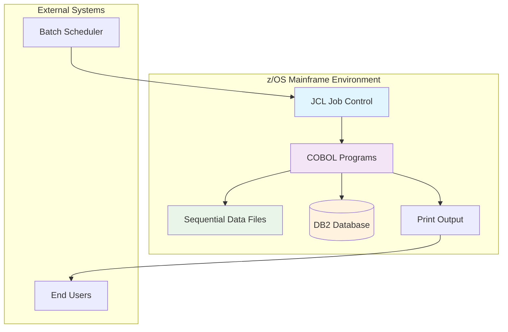
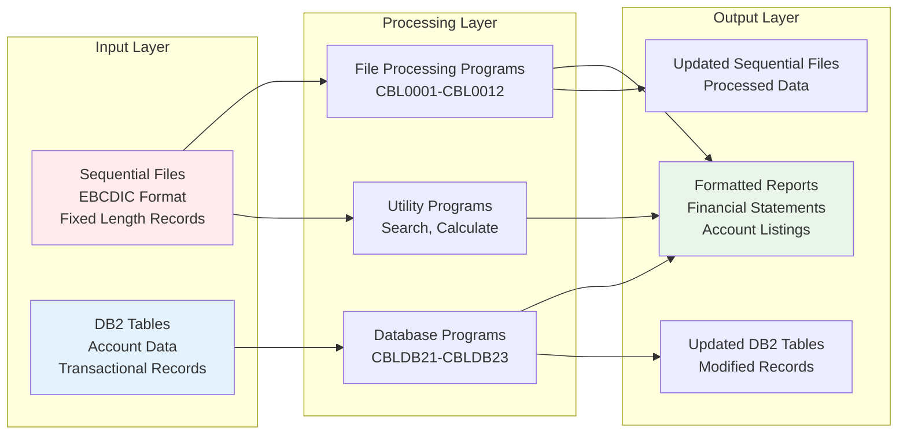
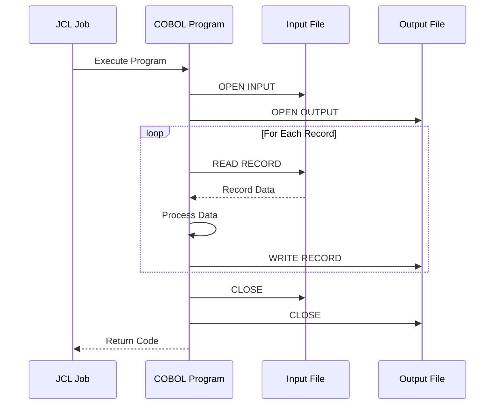
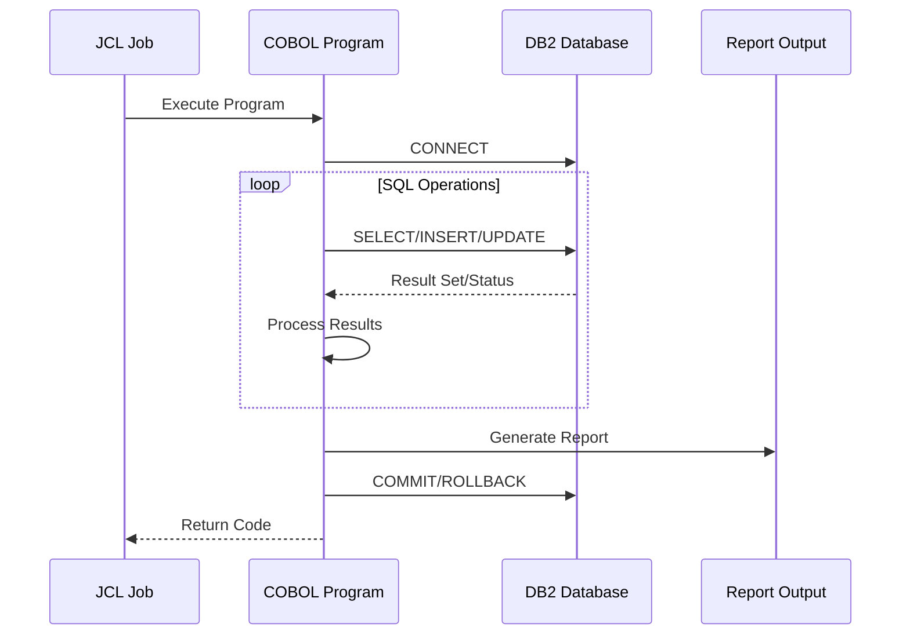
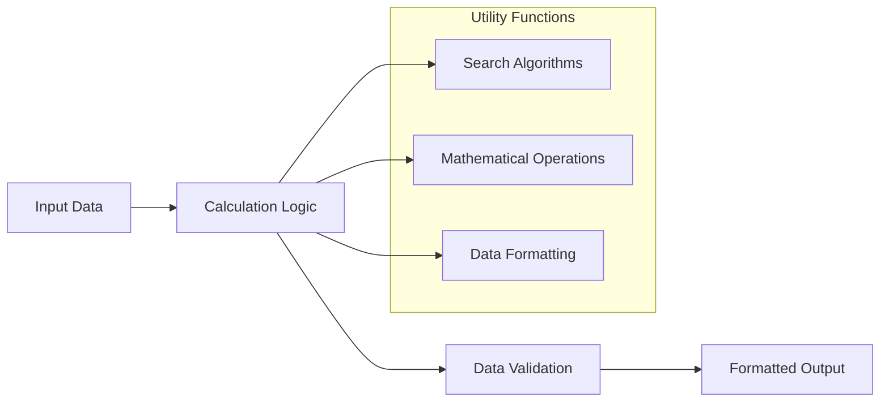
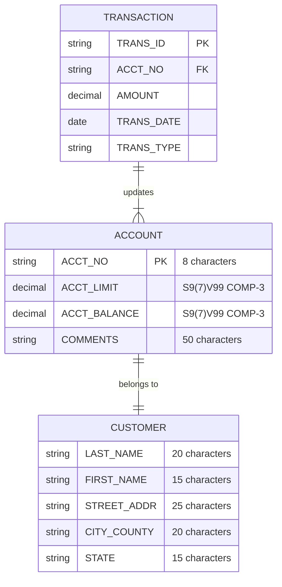
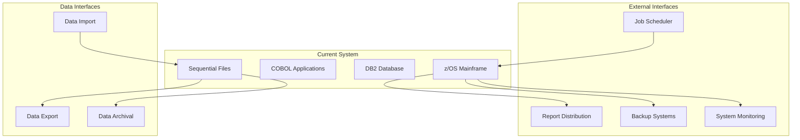
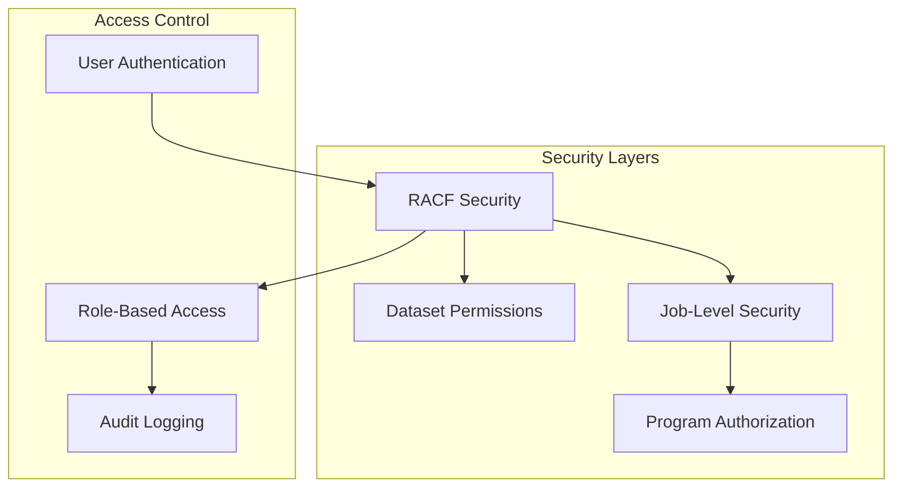

# System Architecture Analysis

This document provides a comprehensive analysis of the current COBOL/JCL system architecture and data flow patterns.

## Current System Architecture

### High-Level Architecture

### Current Processing Model

The existing system follows a traditional mainframe batch processing model:

1. **Job Submission**: JCL jobs are submitted to the z/OS job scheduler
2. **Compilation**: COBOL programs are compiled using IBM Enterprise COBOL
3. **Execution**: Compiled programs process sequential files and/or database records
4. **Output Generation**: Results are written to output files or printed reports

### Data Flow Architecture

## Program Classification and Architecture

### 1. Basic File Processing Programs

These programs follow the classic COBOL file processing pattern:

**Programs in this category:**
- CBL0001: Account record processing
- CBL0006: State filtering
- CBL0009-CBL0012: Financial reporting

### 2. Database Processing Programs

Advanced programs that interact with DB2 databases:

**Programs in this category:**
- CBLDB21: Basic DB2 operations
- CBLDB22: Advanced queries
- CBLDB23: Complex processing

### 3. Utility and Calculation Programs

Special-purpose programs for specific business functions:

**Programs in this category:**
- ADDAMT: Amount calculations
- SRCHBIN/SRCHSER: Search algorithms
- PAYROL00/PAYROL0X: Payroll calculations

## Data Architecture

### Data Storage Patterns

### File Processing Patterns

1. **Sequential File Access**
   - Files are processed record by record
   - Fixed-length records with EBCDIC encoding
   - Packed decimal (COMP-3) for numeric fields

2. **Database Access**
   - Embedded SQL in COBOL programs
   - DB2 database with standard SQL operations
   - Transaction management with COMMIT/ROLLBACK

3. **Report Generation**
   - Formatted output to SYSOUT
   - Header/detail/trailer patterns
   - Fixed-width columnar reports

## Integration Points

### External System Interfaces

## Performance Characteristics

### Current System Performance Profile

1. **Batch Processing Windows**
   - Most processing occurs during scheduled batch windows
   - Large volume processing capabilities
   - Sequential processing optimization

2. **Resource Utilization**
   - CPU-intensive operations for data processing
   - I/O-intensive for file operations
   - Memory usage optimized for record-at-a-time processing

3. **Scalability Limitations**
   - Vertical scaling only (more powerful mainframe hardware)
   - Limited concurrent processing
   - Batch-oriented processing model

## Security Model

### Current Security Architecture

### Security Features

1. **Authentication**: RACF-based user authentication
2. **Authorization**: Dataset and program-level permissions
3. **Auditing**: Job execution and data access logging
4. **Data Protection**: EBCDIC encoding and mainframe isolation

## Migration Implications

### Architecture Transformation Requirements

1. **Processing Model Change**
   - From batch-oriented to real-time capable
   - From sequential to random access patterns
   - From single-threaded to multi-threaded processing

2. **Data Access Transformation**
   - From file-based to database-centric
   - From EBCDIC to UTF-8 encoding
   - From fixed-length to variable-length records

3. **Integration Requirements**
   - RESTful API endpoints for external integration
   - Real-time data validation and processing
   - Event-driven architecture capabilities

4. **Scalability Requirements**
   - Horizontal scaling capabilities
   - Cloud-native deployment options
   - Microservices architecture readiness

---

*This architecture analysis provides the foundation for designing the target Spring Boot system architecture.*