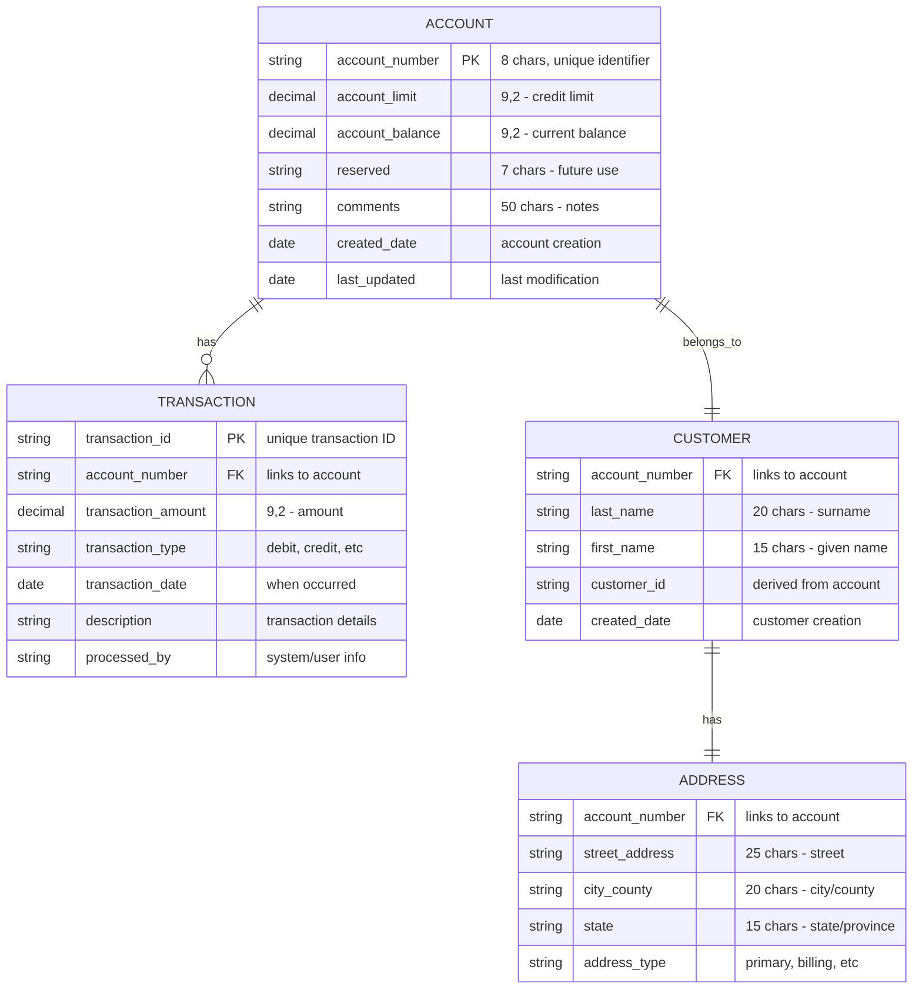
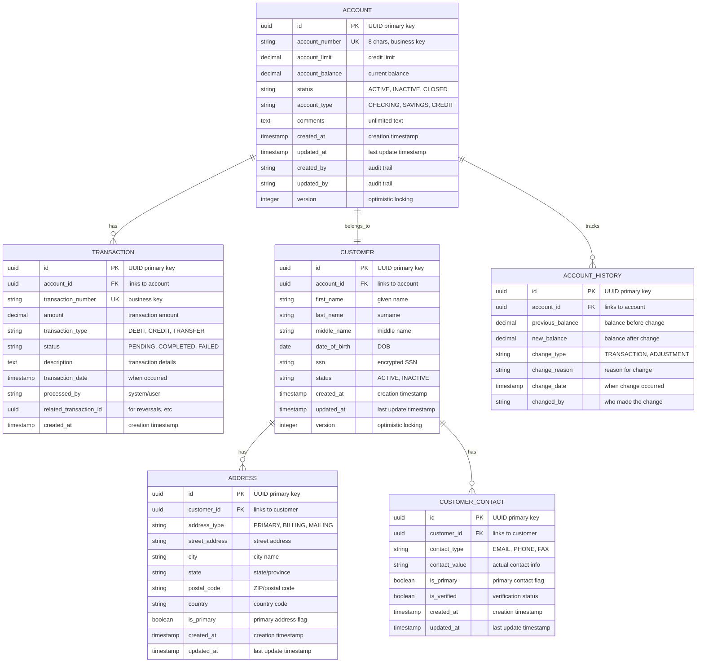

# Data Structures and Entity Analysis

This document provides detailed analysis of data structures found in the COBOL programs and their mapping to a modern database schema.

## COBOL Data Structure Analysis

### Primary Data Structures

#### 1. Account Record Structure (CBL0001-CBL0012)

```cobol
01  ACCT-FIELDS.
    05  ACCT-NO            PIC X(8).           -- Account Number
    05  ACCT-LIMIT         PIC S9(7)V99 COMP-3. -- Account Limit
    05  ACCT-BALANCE       PIC S9(7)V99 COMP-3. -- Account Balance
    05  LAST-NAME          PIC X(20).          -- Customer Last Name
    05  FIRST-NAME         PIC X(15).          -- Customer First Name
    05  CLIENT-ADDR.                           -- Address Group
        10  STREET-ADDR     PIC X(25).         -- Street Address
        10  CITY-COUNTY     PIC X(20).         -- City/County
        10  ADDRSTATE       PIC X(15).         -- State
    05  RESERVED           PIC X(7).           -- Reserved Field
    05  COMMENTS           PIC X(50).          -- Comments
```

#### 2. Print Record Structure (Output Format)

```cobol
01  PRINT-REC.
    05  ACCT-NO-O      PIC X(8).
    05  FILLER         PIC X(02) VALUE SPACES.
    05  LAST-NAME-O    PIC X(20).
    05  FILLER         PIC X(02) VALUE SPACES.
    05  FIRST-NAME-O   PIC X(15).
    05  FILLER         PIC X(02) VALUE SPACES.
    05  ACCT-LIMIT-O   PIC $$,$$$,$$9.99.
    05  FILLER         PIC X(02) VALUE SPACES.
    05  ACCT-BALANCE-O PIC $$,$$$,$$9.99.
    05  FILLER         PIC X(02) VALUE SPACES.
    05  COMMENTS-O     PIC X(50).
```

#### 3. DB2 Table Structure (CRETBL.jcl)

```sql
CREATE TABLE &SYSUID.T (
    ACCTNO    CHAR(8)        NOT NULL,
    LIMIT     DECIMAL(9,2),
    BALANCE   DECIMAL(9,2),
    SURNAME   CHAR(20)       NOT NULL,
    FIRSTN    CHAR(15)       NOT NULL,
    ADDRESS1  CHAR(25),
    ADDRESS2  CHAR(20),
    ADDRESS3  CHAR(15),
    RESERVED  CHAR(7),
    COMMENTS  CHAR(50),
    PRIMARY KEY(ACCTNO)
);
```

## Entity Relationship Model

### Current Data Model



### Enhanced Data Model for Spring Boot



## Data Type Mapping

### COBOL to Java/JPA Mapping

| COBOL Type | COBOL Example | Java Type | JPA Annotation | Notes |
|------------|---------------|-----------|----------------|-------|
| `PIC X(n)` | `PIC X(8)` | `String` | `@Column(length=8)` | Fixed-length character |
| `PIC 9(n)` | `PIC 9(3)` | `Integer` | `@Column` | Numeric integer |
| `PIC S9(n)V99 COMP-3` | `PIC S9(7)V99 COMP-3` | `BigDecimal` | `@Column(precision=9, scale=2)` | Packed decimal |
| `PIC $$,$$$,$$9.99` | Display format | `BigDecimal` | `@Column(precision=9, scale=2)` | Formatted currency |
| Group items | `05 CLIENT-ADDR` | Embedded class | `@Embedded` | Composite structure |

### Detailed Field Mappings

#### Account Entity Mapping

```java
@Entity
@Table(name = "accounts")
public class Account {
    @Id
    @GeneratedValue(strategy = GenerationType.UUID)
    private UUID id;
    
    @Column(name = "account_number", length = 8, unique = true, nullable = false)
    private String accountNumber;  // ACCT-NO PIC X(8)
    
    @Column(name = "account_limit", precision = 9, scale = 2)
    private BigDecimal accountLimit;  // ACCT-LIMIT PIC S9(7)V99 COMP-3
    
    @Column(name = "account_balance", precision = 9, scale = 2)
    private BigDecimal accountBalance;  // ACCT-BALANCE PIC S9(7)V99 COMP-3
    
    @Column(name = "comments", length = 1000)
    private String comments;  // COMMENTS PIC X(50) -> expanded
    
    @Column(name = "reserved", length = 7)
    private String reserved;  // RESERVED PIC X(7)
    
    // Audit fields (new)
    @CreationTimestamp
    @Column(name = "created_at", nullable = false)
    private LocalDateTime createdAt;
    
    @UpdateTimestamp
    @Column(name = "updated_at", nullable = false)
    private LocalDateTime updatedAt;
    
    @Version
    private Integer version;
    
    // Relationships
    @OneToOne(mappedBy = "account", cascade = CascadeType.ALL)
    private Customer customer;
    
    @OneToMany(mappedBy = "account", cascade = CascadeType.ALL, fetch = FetchType.LAZY)
    private List<Transaction> transactions = new ArrayList<>();
}
```

#### Customer Entity Mapping

```java
@Entity
@Table(name = "customers")
public class Customer {
    @Id
    @GeneratedValue(strategy = GenerationType.UUID)
    private UUID id;
    
    @Column(name = "first_name", length = 50, nullable = false)
    private String firstName;  // FIRST-NAME PIC X(15) -> expanded
    
    @Column(name = "last_name", length = 50, nullable = false)
    private String lastName;  // LAST-NAME PIC X(20) -> expanded
    
    @Embedded
    private Address address;  // CLIENT-ADDR group
    
    // Audit fields
    @CreationTimestamp
    @Column(name = "created_at", nullable = false)
    private LocalDateTime createdAt;
    
    @UpdateTimestamp
    @Column(name = "updated_at", nullable = false)
    private LocalDateTime updatedAt;
    
    @Version
    private Integer version;
    
    // Relationship
    @OneToOne
    @JoinColumn(name = "account_id", nullable = false)
    private Account account;
}
```

#### Address Embedded Class

```java
@Embeddable
public class Address {
    @Column(name = "street_address", length = 100)
    private String streetAddress;  // STREET-ADDR PIC X(25) -> expanded
    
    @Column(name = "city", length = 50)
    private String city;  // CITY-COUNTY PIC X(20) -> split/expanded
    
    @Column(name = "county", length = 50)
    private String county;  // extracted from CITY-COUNTY
    
    @Column(name = "state", length = 2)
    private String state;  // ADDRSTATE PIC X(15) -> standardized to 2-char code
    
    @Column(name = "postal_code", length = 10)
    private String postalCode;  // new field for ZIP codes
    
    @Column(name = "country", length = 2, nullable = false)
    private String country = "US";  // new field, defaulted
}
```

## Data Validation Rules

### Current COBOL Validation Patterns

1. **Account Number Validation**
   ```cobol
   IF ACCT-NO = SPACES OR ACCT-NO = LOW-VALUES
       PERFORM ERROR-ROUTINE
   END-IF
   ```

2. **Numeric Field Validation**
   ```cobol
   IF ACCT-LIMIT NOT NUMERIC
       MOVE ZERO TO ACCT-LIMIT
   END-IF
   ```

3. **State Code Validation** (CBL0006)
   ```cobol
   IF ADDRSTATE = 'Virginia' OR ADDRSTATE = 'VA'
       ADD 1 TO VIRGINIA-CLIENTS
   END-IF
   ```

### Spring Boot Validation Mapping

```java
@Entity
@Table(name = "accounts")
public class Account {
    @NotBlank(message = "Account number is required")
    @Pattern(regexp = "^[A-Z0-9]{8}$", message = "Account number must be 8 alphanumeric characters")
    @Column(name = "account_number", length = 8, unique = true, nullable = false)
    private String accountNumber;
    
    @DecimalMin(value = "0.00", message = "Account limit cannot be negative")
    @DecimalMax(value = "9999999.99", message = "Account limit exceeds maximum")
    @Digits(integer = 7, fraction = 2, message = "Invalid account limit format")
    @Column(name = "account_limit", precision = 9, scale = 2)
    private BigDecimal accountLimit;
    
    @DecimalMin(value = "-9999999.99", message = "Account balance below minimum")
    @DecimalMax(value = "9999999.99", message = "Account balance exceeds maximum")
    @Digits(integer = 7, fraction = 2, message = "Invalid account balance format")
    @Column(name = "account_balance", precision = 9, scale = 2)
    private BigDecimal accountBalance;
    
    @Size(max = 1000, message = "Comments cannot exceed 1000 characters")
    @Column(name = "comments", length = 1000)
    private String comments;
}
```

## Data Migration Considerations

### Character Set Conversion

1. **EBCDIC to UTF-8**
   - All character data needs conversion from EBCDIC to UTF-8
   - Special attention to special characters and symbols
   - Validation of character data integrity post-conversion

2. **Packed Decimal (COMP-3) Conversion**
   - Extract packed decimal values to standard decimal representation
   - Maintain precision and scale during conversion
   - Handle sign representation correctly

### Data Volume and Performance

1. **Expected Data Volumes**
   - Based on COBOL file processing patterns, estimate record counts
   - Account records: likely in thousands to hundreds of thousands
   - Transaction history: potentially millions of records

2. **Migration Strategy**
   - Batch processing for initial data load
   - Incremental updates during transition period
   - Data validation and reconciliation processes

### Data Quality Issues

1. **Common COBOL Data Issues**
   - Spaces in numeric fields
   - High-values and low-values in character fields
   - Inconsistent data formats
   - Missing or incomplete records

2. **Data Cleansing Requirements**
   - Standardize account numbers
   - Validate and standardize state codes
   - Clean up address data
   - Handle missing or default values appropriately

---

*This data structure analysis provides the foundation for designing the PostgreSQL database schema and JPA entity mappings for the Spring Boot application.*