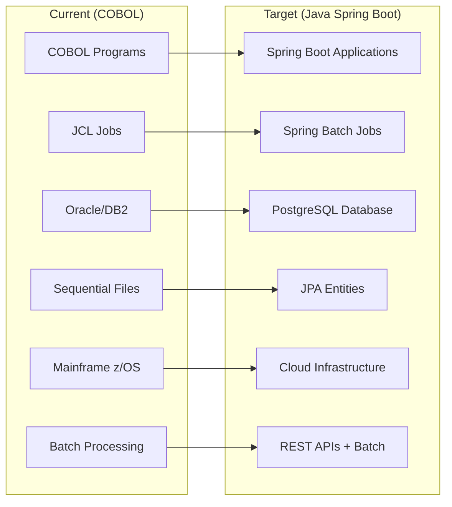
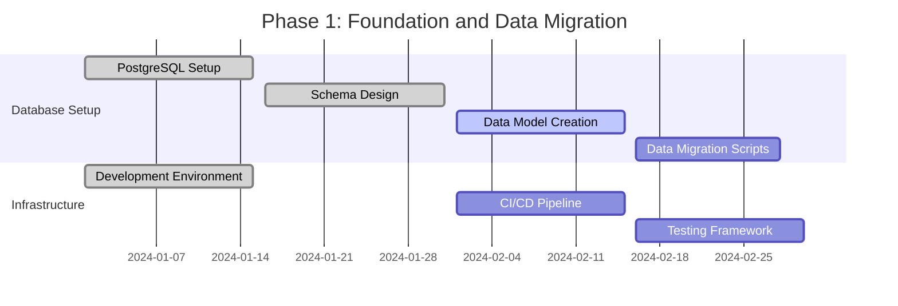
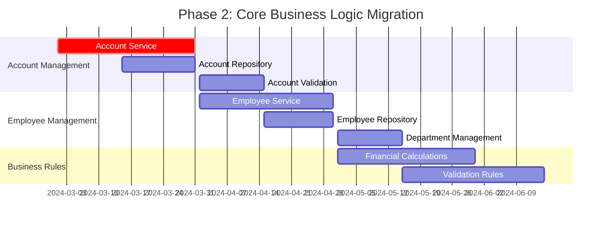
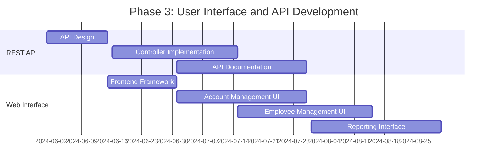
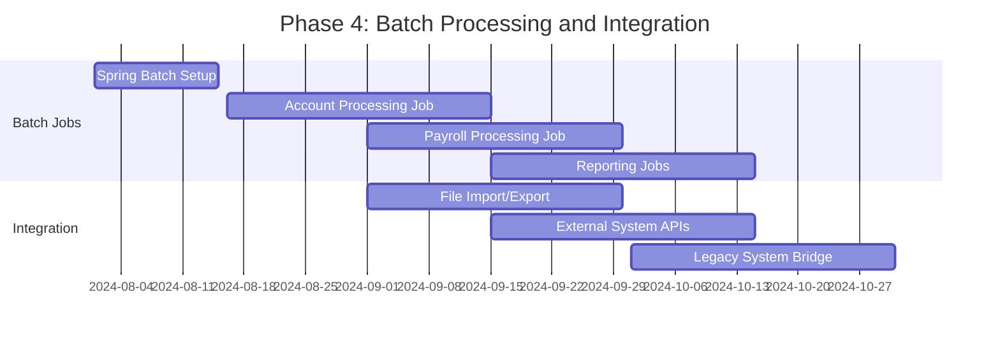
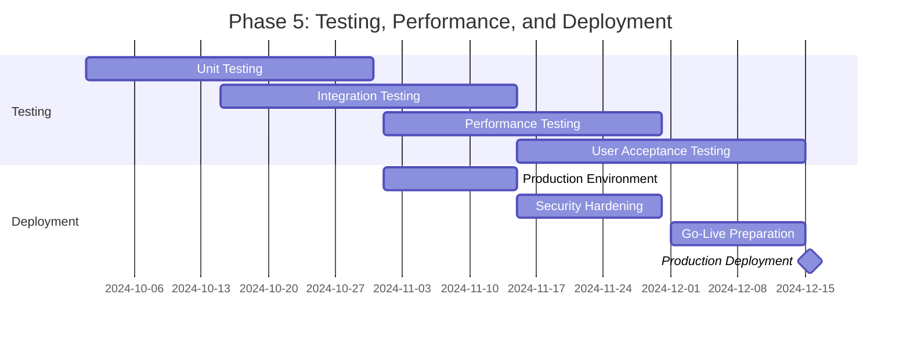

# COBOL to Java Spring Boot Migration Plan

## Executive Summary

This document outlines a comprehensive migration strategy to transform the existing COBOL application into a modern Java Spring Boot application with PostgreSQL database integration. The migration follows a phased approach to minimize risk and ensure business continuity.

## Migration Objectives

### Primary Goals
1. **Modernize Technology Stack**: Move from COBOL/mainframe to Java Spring Boot
2. **Improve Maintainability**: Leverage modern development practices and tools
3. **Enhance Scalability**: Enable cloud deployment and horizontal scaling
4. **Increase Agility**: Support faster development cycles and CI/CD
5. **Reduce Total Cost of Ownership**: Lower maintenance and infrastructure costs

### Success Criteria
- ✅ 100% functional equivalence with existing system
- ✅ Improved performance and response times
- ✅ Modern web-based user interface
- ✅ RESTful API architecture
- ✅ Comprehensive automated testing
- ✅ Cloud-ready deployment architecture

## Technology Mapping

### Current vs Target Technology Stack



| Component | Current Technology | Target Technology | Migration Strategy |
|-----------|-------------------|-------------------|-------------------|
| **Programming Language** | COBOL | Java 17+ | Rewrite business logic |
| **Application Framework** | None | Spring Boot 3.x | New framework adoption |
| **Database** | Oracle/DB2 | PostgreSQL 15+ | Schema migration + data migration |
| **Data Access** | Embedded SQL/OCI | Spring Data JPA | ORM mapping |
| **File Processing** | Sequential files | Database tables | Convert file structures to tables |
| **Job Scheduling** | JCL | Spring Batch | Batch job framework |
| **User Interface** | Batch reports | React/Angular SPA | New web interface |
| **API Layer** | None | Spring Web (REST) | RESTful API design |
| **Security** | Mainframe security | Spring Security | OAuth2/JWT implementation |
| **Deployment** | z/OS | Docker/Kubernetes | Containerization |
| **Configuration** | JCL parameters | Spring profiles | External configuration |

## Migration Phases

### Phase 1: Foundation and Data Migration (Months 1-3)



#### Deliverables
- **Database Schema**: PostgreSQL schema equivalent to COBOL data structures
- **Data Migration Tools**: ETL processes for data conversion
- **Development Environment**: Spring Boot project setup
- **CI/CD Pipeline**: Automated build and deployment
- **Testing Framework**: Unit and integration test infrastructure

#### Key Activities
1. **Database Design**
   - Convert COBOL data structures to PostgreSQL tables
   - Design relational schema for normalized data
   - Create indexes and constraints
   - Set up connection pooling and performance tuning

2. **Data Migration**
   - Extract data from existing systems
   - Transform COBOL data types to SQL data types
   - Load data into PostgreSQL with validation
   - Create data reconciliation reports

3. **Infrastructure Setup**
   - Set up Spring Boot project structure
   - Configure Maven/Gradle build system
   - Implement logging and monitoring
   - Set up development and testing databases

### Phase 2: Core Business Logic Migration (Months 3-6)



#### Deliverables
- **Account Management Module**: Complete account CRUD operations
- **Employee Management Module**: Employee and department management
- **Business Rules Engine**: Financial calculations and validations
- **Data Access Layer**: JPA repositories and services
- **REST API Layer**: RESTful endpoints for core operations

#### Key Activities
1. **Account Processing System (CBL0001-CBL0012 migration)**
   ```java
   @Entity
   @Table(name = "accounts")
   public class Account {
       @Id
       private String accountNumber;
       
       @Column(precision = 10, scale = 2)
       private BigDecimal accountLimit;
       
       @Column(precision = 10, scale = 2)
       private BigDecimal accountBalance;
       
       private String lastName;
       private String firstName;
       
       @Embedded
       private Address clientAddress;
       
       private String comments;
   }
   
   @Service
   public class AccountService {
       public List<Account> processAccounts() {
           return accountRepository.findAll()
               .stream()
               .map(this::validateAndProcess)
               .collect(Collectors.toList());
       }
   }
   ```

2. **Employee Management System (CBDEM1 migration)**
   ```java
   @Entity
   @Table(name = "employees")
   public class Employee {
       @Id
       @GeneratedValue(strategy = GenerationType.IDENTITY)
       private Long employeeNumber;
       
       private String employeeName;
       private String job;
       
       @Column(precision = 10, scale = 2)
       private BigDecimal salary;
       
       @ManyToOne
       @JoinColumn(name = "department_id")
       private Department department;
   }
   ```

3. **Business Rules Implementation**
   - Port COBOL financial calculations
   - Implement validation logic
   - Create business rule configuration
   - Add audit trail functionality

### Phase 3: User Interface and API Development (Months 6-8)



#### Deliverables
- **REST API**: Complete RESTful API with OpenAPI documentation
- **Web Application**: Modern single-page application
- **Reporting System**: Web-based reporting with export capabilities
- **API Security**: Authentication and authorization
- **User Management**: Role-based access control

#### Key Activities
1. **REST API Development**
   ```java
   @RestController
   @RequestMapping("/api/accounts")
   public class AccountController {
       
       @GetMapping
       public ResponseEntity<List<AccountDto>> getAllAccounts() {
           return ResponseEntity.ok(accountService.getAllAccounts());
       }
       
       @PostMapping
       public ResponseEntity<AccountDto> createAccount(@Valid @RequestBody CreateAccountRequest request) {
           return ResponseEntity.ok(accountService.createAccount(request));
       }
   }
   ```

2. **Web Interface Development**
   - React/Angular frontend application
   - Responsive design for desktop and mobile
   - Real-time data updates
   - Export functionality for reports

### Phase 4: Batch Processing and Integration (Months 8-10)



#### Deliverables
- **Spring Batch Jobs**: Equivalent batch processing capabilities
- **File Processing**: Import/export functionality
- **Integration Layer**: APIs for external system integration
- **Monitoring and Alerting**: Job monitoring and error handling
- **Scheduling System**: Automated job scheduling

#### Key Activities
1. **Batch Job Implementation**
   ```java
   @Configuration
   @EnableBatchProcessing
   public class AccountProcessingJobConfig {
       
       @Bean
       public Job accountProcessingJob() {
           return jobBuilderFactory.get("accountProcessingJob")
               .incrementer(new RunIdIncrementer())
               .start(processAccountsStep())
               .build();
       }
       
       @Bean
       public Step processAccountsStep() {
           return stepBuilderFactory.get("processAccountsStep")
               .<Account, ProcessedAccount>chunk(100)
               .reader(accountReader())
               .processor(accountProcessor())
               .writer(accountWriter())
               .build();
       }
   }
   ```

2. **Integration Services**
   - File-based data exchange
   - REST API integrations
   - Message queue integration
   - Legacy system connectors

### Phase 5: Testing, Performance, and Deployment (Months 10-12)



#### Deliverables
- **Comprehensive Test Suite**: Unit, integration, and performance tests
- **Production Environment**: Secure, scalable production deployment
- **Documentation**: Technical and user documentation
- **Training Materials**: User and administrator training
- **Go-Live Support**: Production support and monitoring

## Risk Analysis and Mitigation

### High-Risk Areas

| Risk | Impact | Probability | Mitigation Strategy |
|------|--------|-------------|-------------------|
| **Data Migration Errors** | High | Medium | Extensive testing, rollback procedures, data validation |
| **Business Logic Complexity** | High | Medium | Incremental migration, thorough testing, business user validation |
| **Performance Degradation** | Medium | Low | Performance testing, optimization, caching strategies |
| **Integration Failures** | Medium | Medium | API contracts, integration testing, fallback mechanisms |
| **User Adoption** | Medium | Low | Training programs, phased rollout, user feedback |

### Mitigation Strategies

1. **Data Migration Risks**
   - Implement data validation checkpoints
   - Create automated data reconciliation
   - Maintain parallel systems during transition
   - Develop rollback procedures

2. **Technical Risks**
   - Prototype critical components early
   - Implement comprehensive monitoring
   - Create performance benchmarks
   - Establish code review processes

3. **Business Risks**
   - Involve business users in testing
   - Implement feature flags for gradual rollout
   - Maintain legacy system as backup
   - Create detailed rollback plans

## Success Metrics and KPIs

### Performance Metrics
- **Response Time**: < 200ms for API calls
- **Throughput**: Handle 10x current transaction volume
- **Availability**: 99.9% uptime
- **Batch Processing**: Complete nightly jobs within 4-hour window

### Business Metrics
- **Feature Parity**: 100% functional equivalence
- **User Satisfaction**: > 4.0/5.0 rating
- **Development Velocity**: 50% faster feature delivery
- **Maintenance Cost**: 40% reduction in annual maintenance cost

### Technical Metrics
- **Code Coverage**: > 80% test coverage
- **Security Compliance**: Pass all security audits
- **Documentation**: 100% API documentation coverage
- **Deployment Frequency**: Daily deployments capability

## Timeline and Resource Requirements

### Project Timeline
- **Total Duration**: 12 months
- **Key Milestones**: 5 major phases
- **Parallel Activities**: Infrastructure and development work
- **Buffer Time**: 20% contingency built into each phase

### Resource Requirements
- **Development Team**: 6-8 developers
- **DevOps/Infrastructure**: 2 engineers
- **QA/Testing**: 3 testers
- **Business Analysts**: 2 analysts
- **Project Management**: 1 project manager
- **Total Effort**: ~24 person-months

### Budget Considerations
- **Development Team**: Primary cost component
- **Infrastructure**: Cloud hosting and tools
- **Third-party Software**: Database licenses, monitoring tools
- **Training**: Team upskilling and user training
- **Contingency**: 15% buffer for unforeseen costs

## Recommendations

### Immediate Actions (Month 1)
1. **Team Formation**: Assemble development team with Spring Boot expertise
2. **Environment Setup**: Create development and testing environments
3. **Stakeholder Alignment**: Confirm requirements and success criteria
4. **Risk Assessment**: Detailed analysis of identified risks

### Best Practices
1. **Incremental Migration**: Migrate modules incrementally to reduce risk
2. **Parallel Operations**: Run old and new systems in parallel during transition
3. **Continuous Testing**: Implement automated testing at every level
4. **User Involvement**: Engage business users throughout the process
5. **Documentation**: Maintain comprehensive documentation throughout

### Future Considerations
1. **Cloud Migration**: Plan for eventual cloud deployment
2. **Microservices**: Consider microservices architecture for future scalability
3. **AI/ML Integration**: Opportunities for intelligent features
4. **Mobile Access**: Mobile application development
5. **Real-time Processing**: Stream processing capabilities