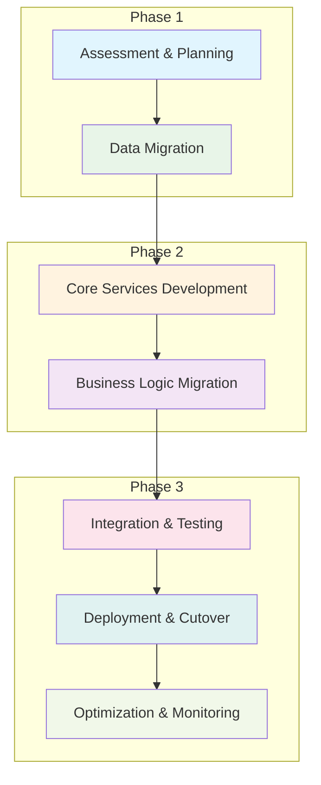
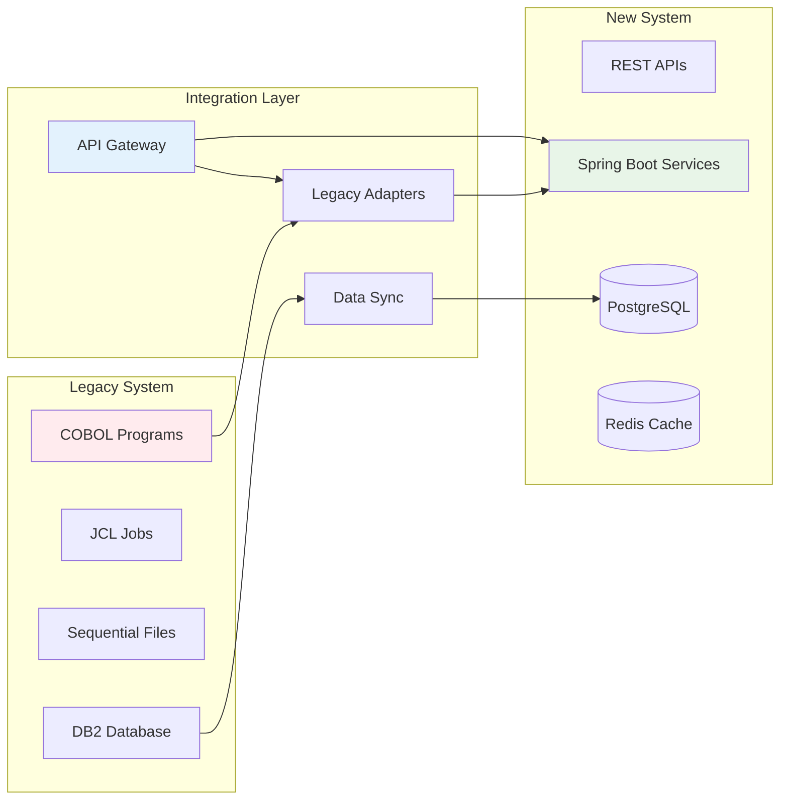
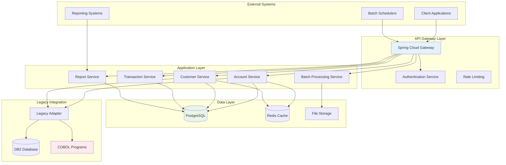
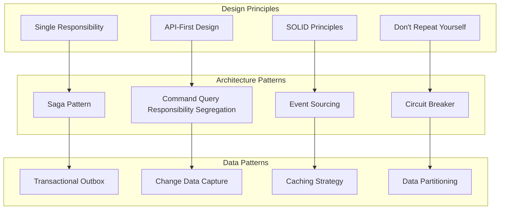
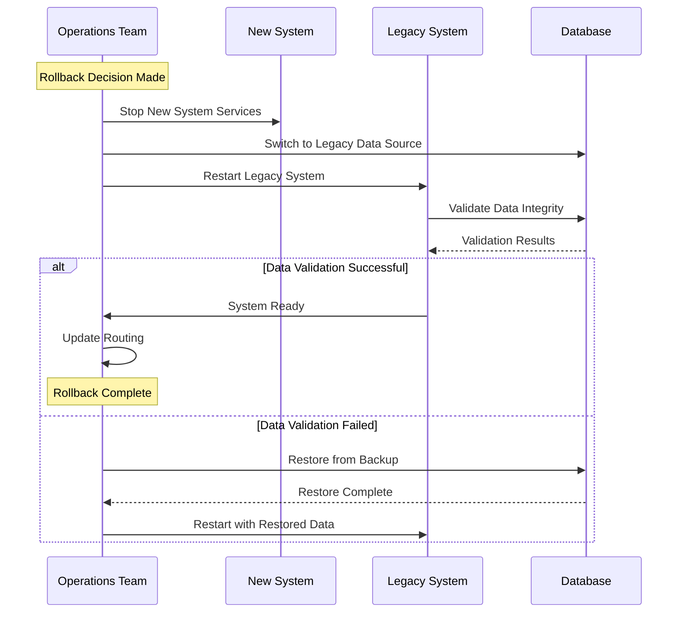
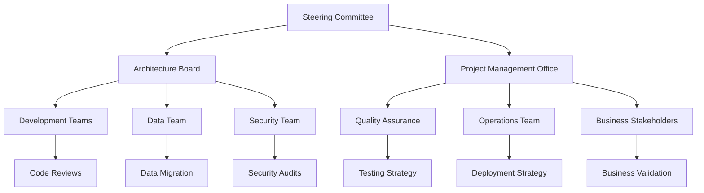

# Migration Strategy

This document outlines the comprehensive strategy for migrating the COBOL/JCL application to a modern Spring Boot-based Java application.

## Migration Overview

### Strategic Objectives

1. **Modernization**: Transform legacy mainframe application to cloud-native Spring Boot architecture
2. **Business Continuity**: Ensure zero disruption to business operations during migration
3. **Scalability**: Enable horizontal scaling and modern deployment patterns
4. **Maintainability**: Improve code maintainability and reduce technical debt
5. **Integration**: Enable modern API-based integration capabilities
6. **Cost Optimization**: Reduce operational costs and licensing fees

### Migration Approach

We will employ a **Phased Rewrite Strategy** with the following principles:

- **Incremental Migration**: Migrate functionality in phases to minimize risk
- **Parallel Running**: Run old and new systems side-by-side during transition
- **Data-First Approach**: Establish shared data layer before migrating applications
- **Service-Oriented Design**: Break monolithic COBOL programs into microservices
- **API-First Design**: Design RESTful APIs to replace batch processing interfaces

## Migration Methodology

### Recommended Migration Pattern: Strangler Fig

We will implement the **Strangler Fig Pattern** to gradually replace the legacy system:

## Technical Strategy

### Architecture Evolution

#### Current State
- **Platform**: IBM z/OS Mainframe
- **Language**: Enterprise COBOL
- **Database**: DB2 for z/OS
- **Processing**: Batch-oriented with JCL
- **Integration**: File-based interfaces

#### Target State
- **Platform**: Cloud-native (Docker containers)
- **Framework**: Spring Boot 3.x with Java 17+
- **Database**: PostgreSQL with connection pooling
- **Processing**: REST APIs with batch processing capabilities
- **Integration**: RESTful APIs and event-driven messaging

#### Transitional Architecture

### Service Decomposition Strategy

#### Microservices Architecture

Based on the COBOL program analysis, we will create the following microservices:

1. **Account Management Service**
   - Account CRUD operations
   - Account validation and business rules
   - Account status management
   - **Source Programs**: CBL0001, CBL0009, CBL0010, CBL0011, CBL0012

2. **Customer Management Service**
   - Customer profile management
   - Address management
   - Customer validation
   - **Source Programs**: CBL0006 (state filtering), customer-related operations

3. **Transaction Processing Service**
   - Transaction creation and processing
   - Balance updates
   - Transaction history
   - **Source Programs**: Financial calculation programs

4. **Reporting Service**
   - Report generation
   - Data formatting and presentation
   - Historical data analysis
   - **Source Programs**: All reporting-related COBOL programs

5. **Batch Processing Service**
   - File processing capabilities
   - Scheduled batch operations
   - Data import/export
   - **Source Programs**: File processing patterns from all COBOL programs

#### Service Design Principles

## Risk Assessment and Mitigation

### High-Risk Areas

1. **Data Migration Risks**
   - **Risk**: Data corruption during EBCDIC to UTF-8 conversion
   - **Mitigation**: Comprehensive data validation and reconciliation processes
   - **Testing**: Side-by-side comparison of legacy and new data

2. **Business Logic Complexity**
   - **Risk**: Misunderstanding or missing complex COBOL business rules
   - **Mitigation**: Detailed business logic documentation and stakeholder validation
   - **Testing**: Comprehensive unit and integration testing

3. **Performance Degradation**
   - **Risk**: New system may not match mainframe performance
   - **Mitigation**: Performance testing and optimization from day one
   - **Monitoring**: Continuous performance monitoring and alerting

4. **Integration Challenges**
   - **Risk**: Breaking existing system integrations
   - **Mitigation**: Maintaining backward compatibility during transition
   - **Strategy**: Gradual cutover with rollback capabilities

### Risk Mitigation Matrix

| Risk Category | Probability | Impact | Mitigation Strategy | Contingency Plan |
|---------------|-------------|--------|-------------------|------------------|
| Data Loss | Low | High | Automated backups, validation checksums | Full data restore procedures |
| Performance Issues | Medium | Medium | Load testing, performance optimization | Horizontal scaling, caching |
| Business Logic Errors | Medium | High | Extensive testing, business validation | Rollback to legacy system |
| Integration Failures | High | Medium | API versioning, backward compatibility | Adapter pattern implementation |
| Security Vulnerabilities | Low | High | Security testing, code reviews | Security patches, monitoring |

## Success Criteria

### Technical Success Metrics

1. **Performance Metrics**
   - Response time ≤ 200ms for 95% of API calls
   - Throughput ≥ 1000 transactions per second
   - System availability ≥ 99.9%
   - Data consistency 100%

2. **Quality Metrics**
   - Code coverage ≥ 85%
   - Zero critical security vulnerabilities
   - Technical debt ratio ≤ 5%
   - Documentation coverage ≥ 90%

3. **Operational Metrics**
   - Deployment frequency: daily releases
   - Lead time for changes ≤ 1 day
   - Mean time to recovery ≤ 1 hour
   - Change failure rate ≤ 15%

### Business Success Metrics

1. **Functional Parity**
   - 100% of current COBOL functionality replicated
   - All reports generated with same accuracy
   - No loss of business data or capabilities

2. **User Experience**
   - Improved response times for end users
   - New self-service capabilities through APIs
   - Enhanced reporting and analytics capabilities

3. **Cost Benefits**
   - 30% reduction in operational costs
   - 50% reduction in maintenance effort
   - Improved developer productivity

## Rollback Strategy

### Rollback Triggers

1. **Technical Triggers**
   - System performance below acceptable thresholds
   - Data integrity issues detected
   - Critical functionality failures
   - Security breaches

2. **Business Triggers**
   - Business process disruption
   - Regulatory compliance issues
   - Stakeholder concerns about system stability

### Rollback Procedures

## Decision Points and Governance

### Key Decision Points

1. **Technology Stack Decisions**
   - Java version selection (17 vs 21)
   - Spring Boot version strategy
   - Database migration approach
   - Cloud platform selection

2. **Architecture Decisions**
   - Microservices vs monolithic approach
   - API design standards
   - Data storage strategy
   - Integration patterns

3. **Migration Sequence Decisions**
   - Which services to migrate first
   - Data migration timing
   - Testing strategy
   - Cutover approach

### Governance Structure

### Change Management Process

1. **Change Request Initiation**
   - Requirement gathering and analysis
   - Impact assessment
   - Resource estimation

2. **Change Approval Process**
   - Technical review by architecture board
   - Business approval from stakeholders
   - Risk assessment and mitigation planning

3. **Change Implementation**
   - Development and testing
   - Staged deployment
   - Monitoring and validation

4. **Change Closure**
   - Success criteria validation
   - Documentation updates
   - Lessons learned capture

---

*This migration strategy provides the framework for successfully transforming the COBOL/JCL application to a modern Spring Boot architecture while minimizing risk and ensuring business continuity.*