# Migration Timeline and Planning Diagrams

## Overview
This document provides detailed timeline visualization and planning diagrams for the COBOL to Java Spring Boot migration project.

## Master Project Timeline

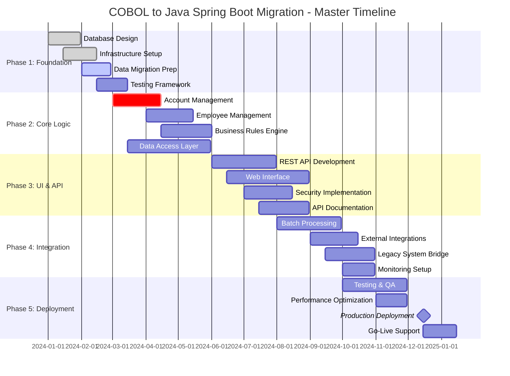

## Detailed Phase Breakdown

### Phase 1: Foundation and Data Migration (3 months)

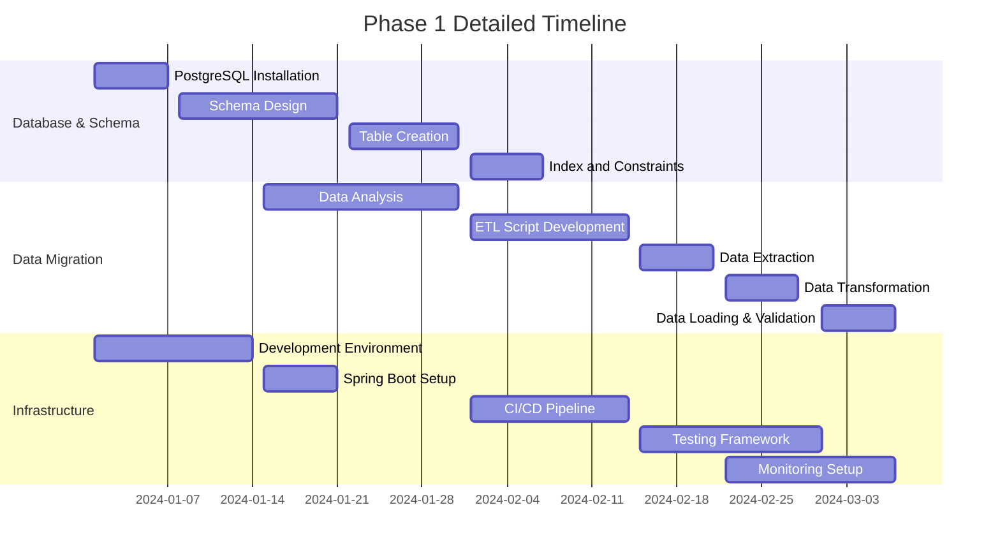

### Phase 2: Core Business Logic Migration (3 months)

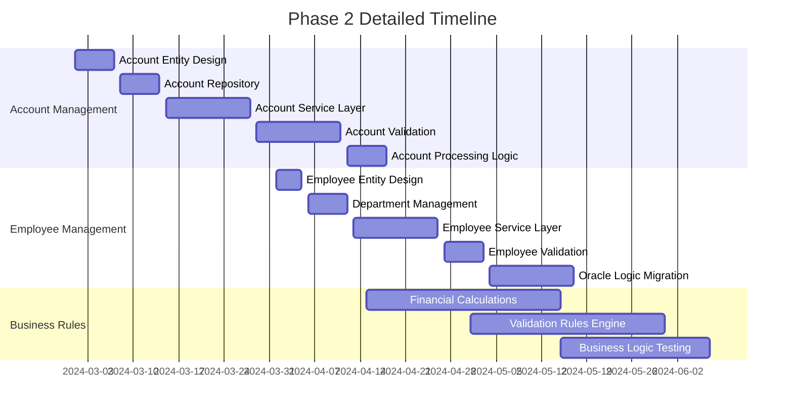

### Phase 3: User Interface and API Development (2.5 months)

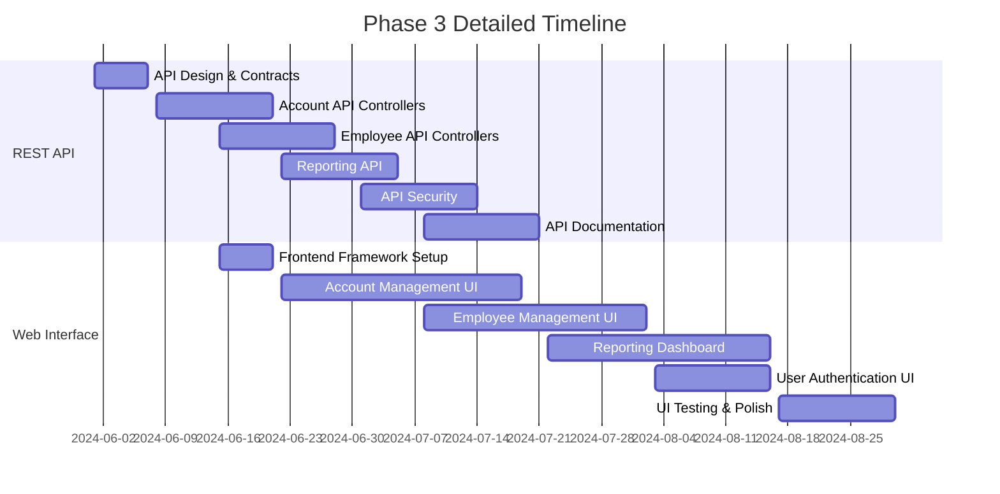

### Phase 4: Batch Processing and Integration (2.5 months)

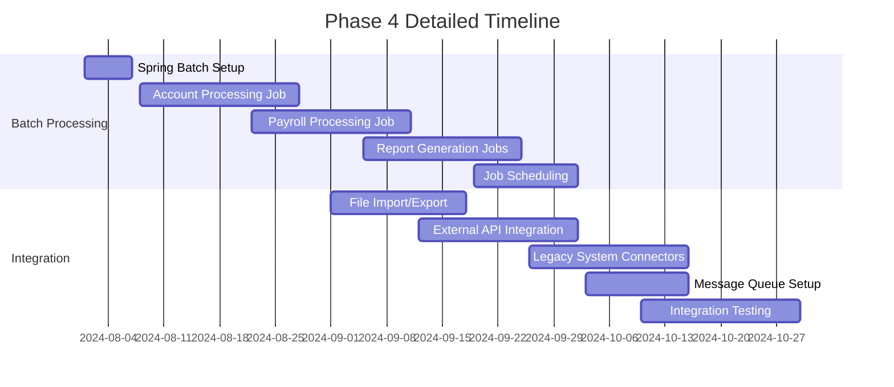

### Phase 5: Testing, Performance, and Deployment (2 months)

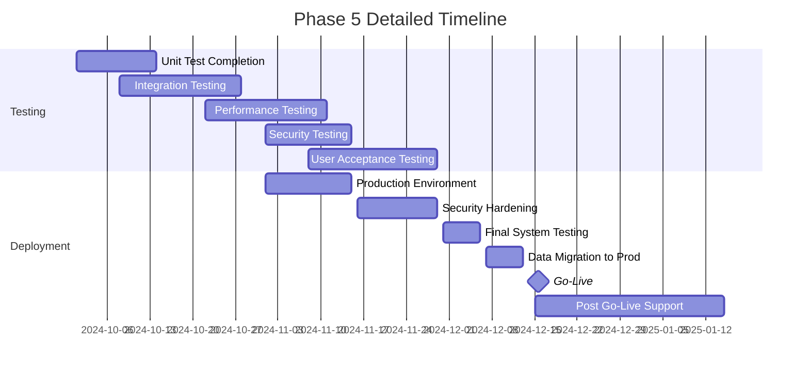

## Resource Allocation Timeline

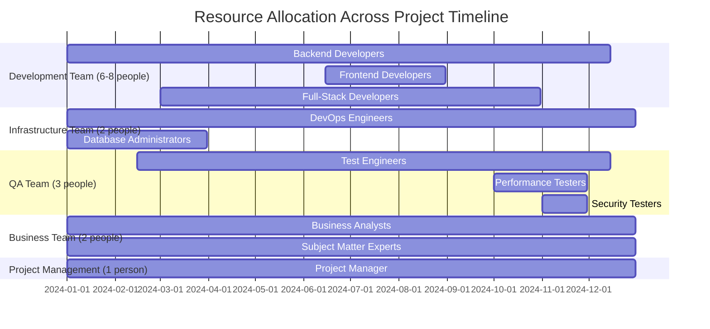

## Critical Path Analysis

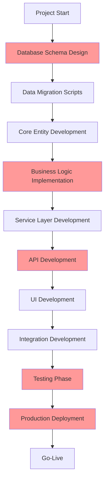

## Risk Timeline and Mitigation

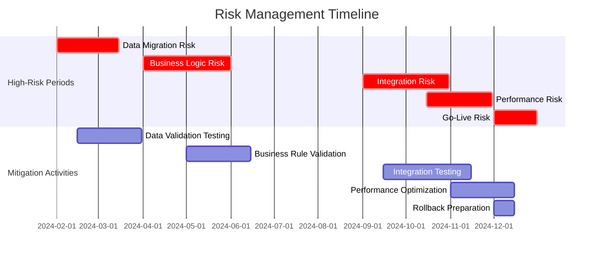

## Milestone Dependencies

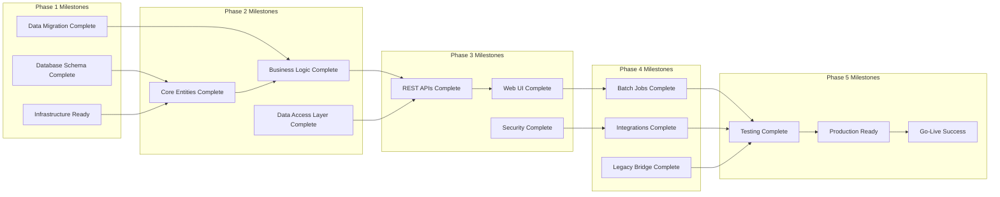

## Testing Timeline

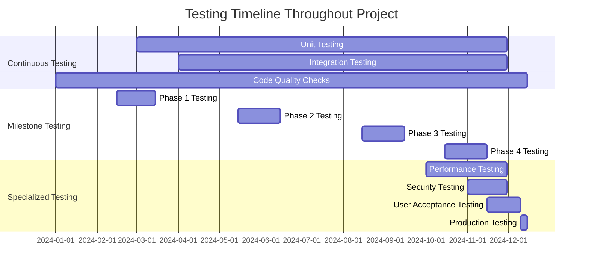

## Deployment Strategy Timeline

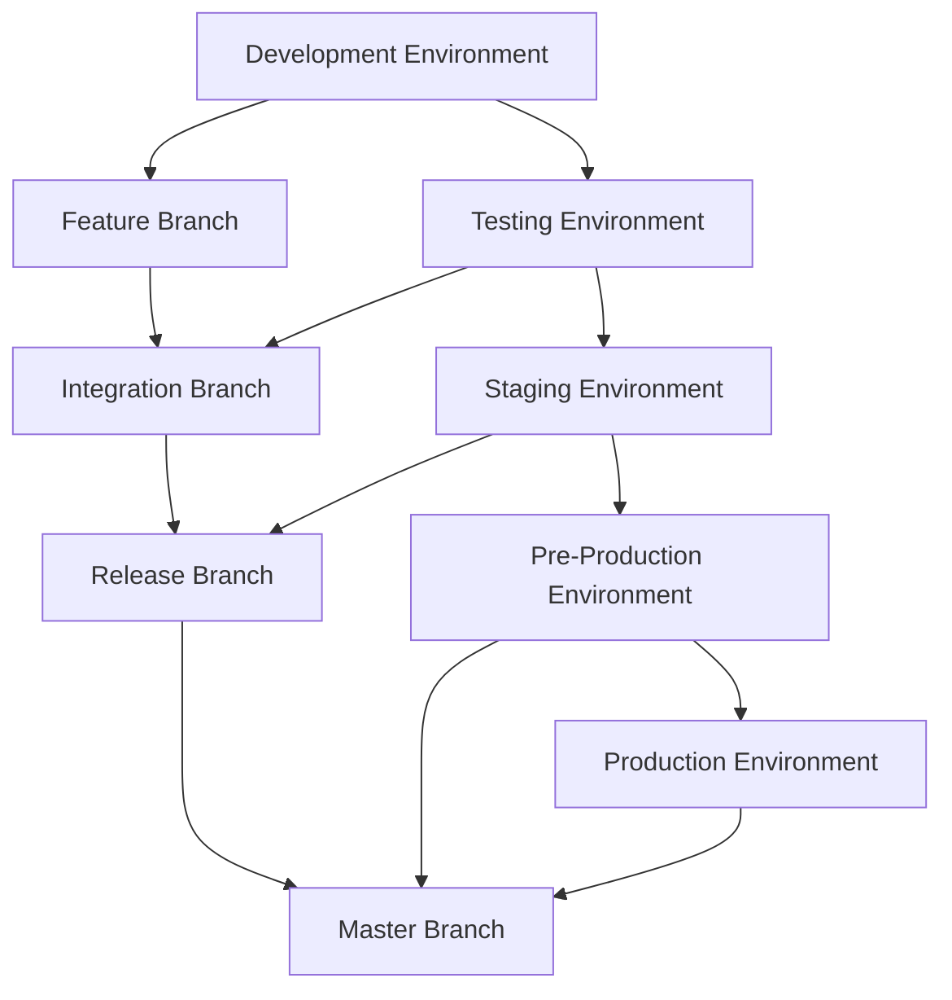

## Communication and Reporting Schedule

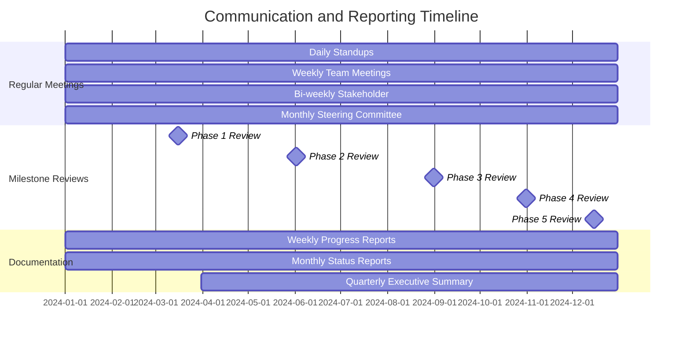

## Success Criteria Timeline

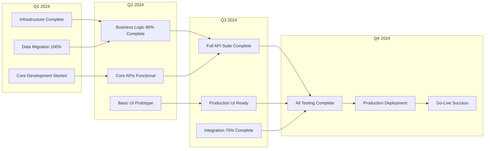