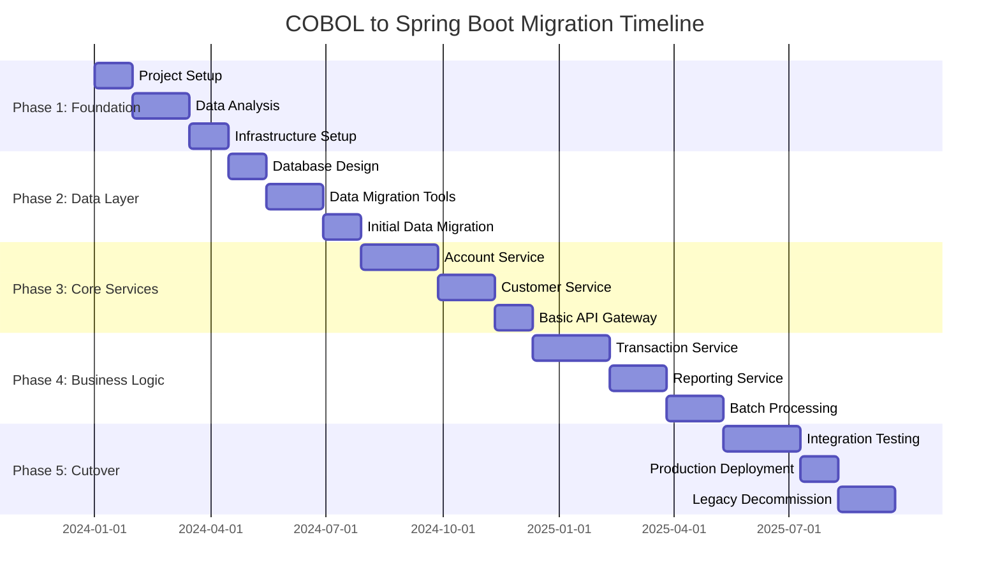
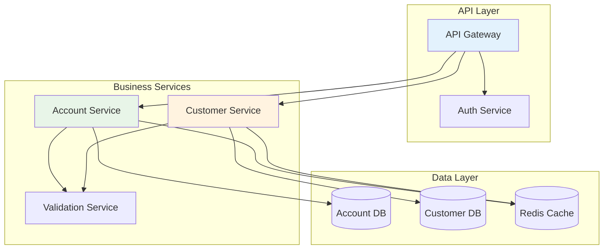
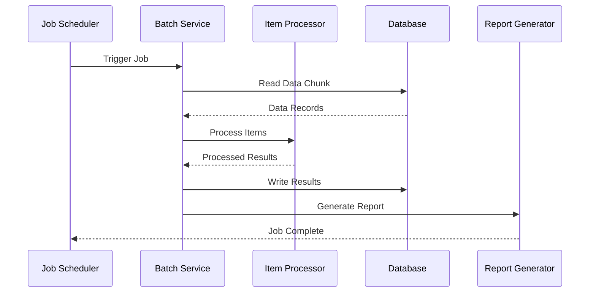
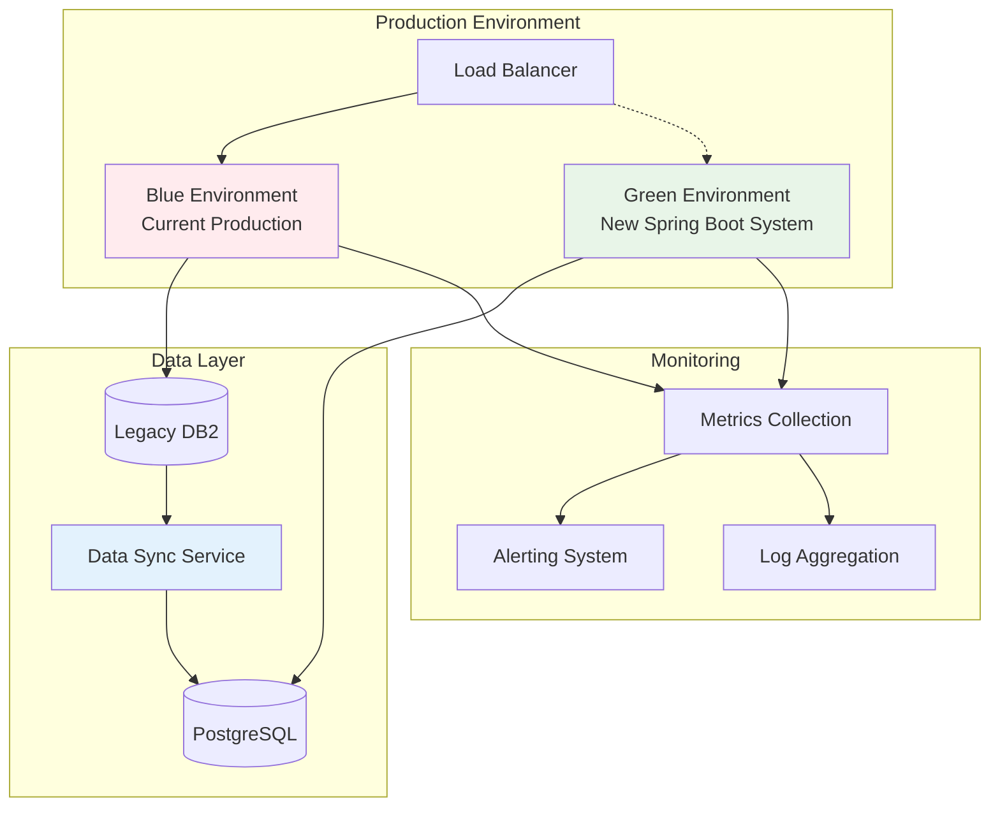
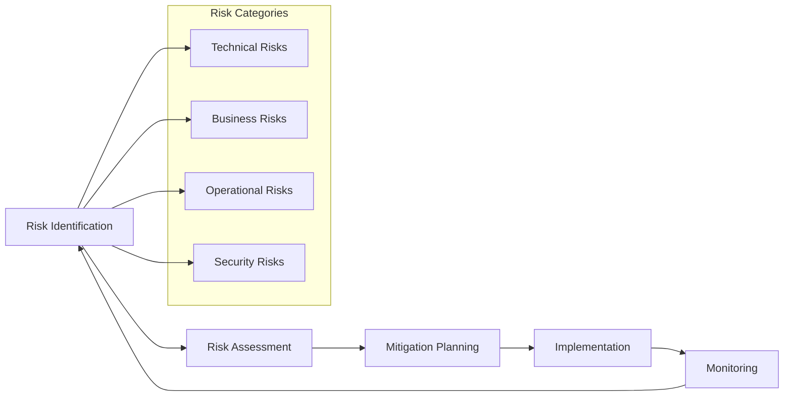

# Migration Phases and Implementation Timeline

This document provides a detailed phase-by-phase plan for migrating the COBOL/JCL application to Spring Boot, including timelines, deliverables, and success criteria.

## Overview

The migration will be executed in **5 phases** over approximately **12-18 months**, with each phase building upon the previous one while maintaining system stability and business continuity.

## Phase Timeline



---

## Phase 1: Foundation and Analysis (3.5 months)

### Objectives
- Establish project foundation and development environment
- Complete detailed analysis of existing COBOL programs
- Set up modern development infrastructure
- Create data migration strategy

### Key Activities

#### 1.1 Project Setup (Month 1)
- **Team Assembly**: Assemble cross-functional team
- **Environment Setup**: Development, testing, and staging environments
- **Tool Selection**: Finalize technology stack and tools
- **Documentation**: Establish documentation standards and repositories

#### 1.2 Comprehensive Analysis (Month 1.5)
- **Code Analysis**: Deep dive into all 62 COBOL/JCL files
- **Business Rules Extraction**: Document implicit business logic
- **Data Flow Mapping**: Map data flows between programs
- **Integration Points**: Identify external system dependencies

#### 1.3 Infrastructure Foundation (Month 1)
- **Cloud Infrastructure**: Set up AWS/Azure/GCP environment
- **CI/CD Pipeline**: Establish build and deployment automation
- **Monitoring Setup**: Application and infrastructure monitoring
- **Security Framework**: Authentication, authorization, and audit trails

### Deliverables
- [ ] Development environment setup
- [ ] Comprehensive business requirements document
- [ ] Technical architecture design
- [ ] Data migration strategy document
- [ ] Project plan and resource allocation
- [ ] Quality assurance framework

### Success Criteria
- All COBOL programs analyzed and documented
- Development environment operational
- Team trained on new technology stack
- Clear understanding of business requirements

---

## Phase 2: Data Layer Foundation (3.5 months)

### Objectives
- Design and implement PostgreSQL database schema
- Develop data migration tools and processes
- Establish data validation and reconciliation procedures
- Create shared data access layer

### Key Activities

#### 2.1 Database Design (Month 1)
- **Schema Design**: Create normalized PostgreSQL schema
- **Entity Mapping**: Map COBOL data structures to JPA entities
- **Index Strategy**: Design indexes for performance
- **Audit Framework**: Implement data audit and versioning

#### 2.2 Data Migration Development (Month 1.5)
- **ETL Tools**: Develop EBCDIC to UTF-8 conversion tools
- **Data Validators**: Create data validation and cleansing utilities
- **Migration Scripts**: Develop incremental migration procedures
- **Reconciliation Tools**: Build data comparison and validation tools

#### 2.3 Initial Migration (Month 1)
- **Test Data Migration**: Migrate sample datasets
- **Validation**: Verify data integrity and accuracy
- **Performance Testing**: Test migration performance and optimization
- **Rollback Procedures**: Develop and test rollback mechanisms

### Technical Implementation

#### Database Schema Creation
```sql
-- Core account management schema
CREATE TABLE accounts (
    id UUID PRIMARY KEY DEFAULT gen_random_uuid(),
    account_number VARCHAR(8) UNIQUE NOT NULL,
    account_limit DECIMAL(9,2),
    account_balance DECIMAL(9,2),
    status VARCHAR(20) DEFAULT 'ACTIVE',
    comments TEXT,
    created_at TIMESTAMP DEFAULT CURRENT_TIMESTAMP,
    updated_at TIMESTAMP DEFAULT CURRENT_TIMESTAMP,
    version INTEGER DEFAULT 1
);

CREATE TABLE customers (
    id UUID PRIMARY KEY DEFAULT gen_random_uuid(),
    account_id UUID NOT NULL REFERENCES accounts(id),
    first_name VARCHAR(50) NOT NULL,
    last_name VARCHAR(50) NOT NULL,
    date_of_birth DATE,
    status VARCHAR(20) DEFAULT 'ACTIVE',
    created_at TIMESTAMP DEFAULT CURRENT_TIMESTAMP,
    updated_at TIMESTAMP DEFAULT CURRENT_TIMESTAMP,
    version INTEGER DEFAULT 1
);

-- Additional tables for addresses, transactions, etc.
```

#### JPA Entity Framework
```java
@Entity
@Table(name = "accounts")
@EntityListeners(AuditingEntityListener.class)
public class Account {
    @Id
    @GeneratedValue(strategy = GenerationType.UUID)
    private UUID id;
    
    @Column(name = "account_number", length = 8, unique = true)
    @NotBlank
    @Pattern(regexp = "^[A-Z0-9]{8}$")
    private String accountNumber;
    
    // Additional fields with validation annotations
}
```

### Deliverables
- [ ] PostgreSQL database schema
- [ ] JPA entity models with validation
- [ ] Data migration utilities
- [ ] Data quality validation tools
- [ ] Migration performance benchmarks
- [ ] Data reconciliation reports

### Success Criteria
- Database schema supports all COBOL data requirements
- Data migration tools handle EBCDIC conversion accurately
- 100% data validation pass rate
- Migration performance meets requirements (< 4 hours for full dataset)

---

## Phase 3: Core Services Development (4.5 months)

### Objectives
- Develop core microservices for account and customer management
- Implement REST API layer
- Set up API gateway and security
- Establish service integration patterns

### Key Activities

#### 3.1 Account Management Service (Month 2)
- **Service Development**: Implement account CRUD operations
- **Business Logic**: Port COBOL account management rules
- **API Design**: RESTful API endpoints
- **Testing**: Unit and integration tests

#### 3.2 Customer Management Service (Month 1.5)
- **Service Development**: Customer profile management
- **Address Management**: Embedded address handling
- **Data Validation**: Customer-specific business rules
- **API Integration**: Link with account service

#### 3.3 API Gateway and Security (Month 1)
- **Gateway Setup**: Spring Cloud Gateway configuration
- **Authentication**: JWT-based authentication
- **Authorization**: Role-based access control
- **Rate Limiting**: API usage protection

### Service Architecture



### API Design Examples

#### Account Service APIs
```yaml
# Account Management APIs
/api/v1/accounts:
  GET:    # List accounts with pagination
  POST:   # Create new account
  
/api/v1/accounts/{accountNumber}:
  GET:    # Get account details
  PUT:    # Update account
  DELETE: # Deactivate account
  
/api/v1/accounts/{accountNumber}/balance:
  GET:    # Get current balance
  POST:   # Update balance (internal API)
  
/api/v1/accounts/{accountNumber}/transactions:
  GET:    # Get account transaction history
  POST:   # Create new transaction
```

### Deliverables
- [ ] Account management microservice
- [ ] Customer management microservice  
- [ ] API gateway configuration
- [ ] Authentication and authorization framework
- [ ] Service integration tests
- [ ] API documentation (OpenAPI/Swagger)

### Success Criteria
- All core CRUD operations functional
- API response times < 200ms for 95% of requests
- 100% test coverage for business logic
- Security requirements fully implemented

---

## Phase 4: Business Logic and Advanced Features (5 months)

### Objectives
- Implement transaction processing capabilities
- Develop reporting and analytics services
- Create batch processing framework
- Port complex COBOL business logic

### Key Activities

#### 4.1 Transaction Processing Service (Month 2)
- **Transaction Engine**: Implement transaction processing logic
- **Balance Management**: Real-time balance updates
- **Transaction History**: Comprehensive audit trail
- **Business Rules**: Port COBOL financial calculation logic

#### 4.2 Reporting Service (Month 1.5)
- **Report Generation**: Replicate COBOL report formats
- **Data Aggregation**: Financial summaries and totals
- **Export Capabilities**: PDF, Excel, CSV formats
- **Scheduling**: Automated report generation

#### 4.3 Batch Processing Framework (Month 1.5)
- **Spring Batch**: Implement batch processing capabilities
- **File Processing**: Handle sequential file operations
- **Scheduled Jobs**: Replace JCL job scheduling
- **Error Handling**: Comprehensive error recovery

### Business Logic Migration

#### Financial Calculations (CBL0009-CBL0012)
```java
@Service
public class AccountCalculationService {
    
    public FinancialSummary calculateAccountSummary(String accountNumber) {
        // Port COBOL financial calculation logic
        Account account = accountRepository.findByAccountNumber(accountNumber);
        
        BigDecimal totalLimit = account.getAccountLimit();
        BigDecimal currentBalance = account.getAccountBalance();
        BigDecimal availableCredit = totalLimit.subtract(currentBalance);
        
        return FinancialSummary.builder()
            .accountNumber(accountNumber)
            .totalLimit(totalLimit)
            .currentBalance(currentBalance)
            .availableCredit(availableCredit)
            .build();
    }
}
```

#### State Processing Logic (CBL0006)
```java
@Service
public class CustomerAnalyticsService {
    
    public Map<String, Long> getCustomerCountByState() {
        // Port COBOL state filtering logic
        return customerRepository.findAll()
            .stream()
            .collect(Collectors.groupingBy(
                customer -> customer.getAddress().getState(),
                Collectors.counting()
            ));
    }
}
```

### Batch Processing Framework



### Deliverables
- [ ] Transaction processing service
- [ ] Reporting and analytics service
- [ ] Batch processing framework
- [ ] Business rule validation engine
- [ ] Performance optimization features
- [ ] Comprehensive test suite

### Success Criteria
- All COBOL business logic successfully ported
- Transaction processing maintains data consistency
- Batch jobs complete within acceptable timeframes
- Reports match legacy system output exactly

---

## Phase 5: Integration and Cutover (4.5 months)

### Objectives
- Complete end-to-end integration testing
- Perform production deployment
- Execute parallel running period
- Decommission legacy system

### Key Activities

#### 5.1 Integration Testing (Month 2)
- **End-to-End Testing**: Complete system integration tests
- **Performance Testing**: Load and stress testing
- **Security Testing**: Comprehensive security validation
- **User Acceptance Testing**: Business stakeholder validation

#### 5.2 Production Deployment (Month 1)
- **Blue-Green Deployment**: Zero-downtime deployment strategy
- **Monitoring Setup**: Production monitoring and alerting
- **Backup Procedures**: Data backup and recovery testing
- **Documentation**: Operations runbooks and procedures

#### 5.3 Parallel Running (Month 1)
- **Dual System Operation**: Run both systems simultaneously
- **Data Reconciliation**: Continuous data comparison
- **Performance Monitoring**: System performance analysis
- **Issue Resolution**: Address any discrepancies

#### 5.4 Legacy Decommission (Month 0.5)
- **Final Cutover**: Switch all traffic to new system
- **Legacy Shutdown**: Graceful shutdown of COBOL system
- **Data Archival**: Archive legacy data as required
- **Project Closure**: Final documentation and handover

### Deployment Strategy



### Testing Strategy

#### Performance Testing Scenarios
1. **Load Testing**: Normal production load simulation
2. **Stress Testing**: Peak load handling capabilities
3. **Volume Testing**: Large dataset processing
4. **Endurance Testing**: Long-running operation stability

#### Data Validation Testing
1. **Data Integrity**: Compare legacy vs new system data
2. **Calculation Accuracy**: Verify financial calculations
3. **Report Accuracy**: Compare report outputs
4. **Transaction Consistency**: Verify transaction processing

### Deliverables
- [ ] Complete integration test suite
- [ ] Production deployment procedures
- [ ] Monitoring and alerting configuration
- [ ] Data reconciliation reports
- [ ] Performance benchmarks
- [ ] Go-live readiness assessment
- [ ] Legacy system decommission plan

### Success Criteria
- Zero data loss during migration
- Performance requirements met or exceeded
- All stakeholder acceptance criteria satisfied
- Successful production cutover with minimal downtime
- Legacy system successfully decommissioned

---

## Risk Management Across Phases

### Phase-Specific Risks

| Phase | Primary Risks | Mitigation Strategies |
|-------|---------------|----------------------|
| Phase 1 | Incomplete requirements, team readiness | Detailed analysis, comprehensive training |
| Phase 2 | Data corruption, performance issues | Extensive testing, backup procedures |
| Phase 3 | Service integration failures | Comprehensive testing, circuit breakers |
| Phase 4 | Business logic errors, performance | Stakeholder validation, load testing |
| Phase 5 | Production issues, data inconsistency | Parallel running, rollback procedures |

### Continuous Risk Monitoring



---

## Resource Requirements

### Team Composition

| Role | Phase 1 | Phase 2 | Phase 3 | Phase 4 | Phase 5 |
|------|---------|---------|---------|---------|---------|
| Project Manager | 1 | 1 | 1 | 1 | 1 |
| Solution Architect | 1 | 1 | 1 | 1 | 1 |
| Senior Java Developer | 2 | 3 | 4 | 5 | 3 |
| Database Developer | 1 | 2 | 1 | 1 | 1 |
| DevOps Engineer | 1 | 1 | 2 | 2 | 2 |
| QA Engineer | 1 | 2 | 3 | 4 | 3 |
| Business Analyst | 2 | 1 | 1 | 2 | 1 |
| COBOL SME | 1 | 1 | 1 | 2 | 1 |

### Budget Estimates

- **Total Project Duration**: 18 months
- **Team Size**: 8-12 resources
- **Estimated Cost**: $2.4M - $3.2M
- **Infrastructure**: $50K - $100K
- **Tooling and Licenses**: $75K - $125K

---

*This phased approach ensures systematic migration while maintaining business continuity and minimizing risks throughout the transformation process.*