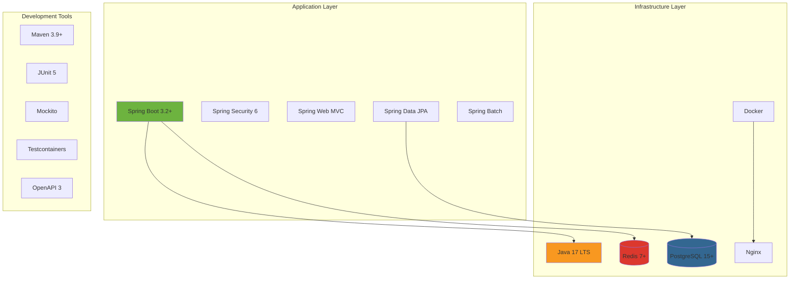
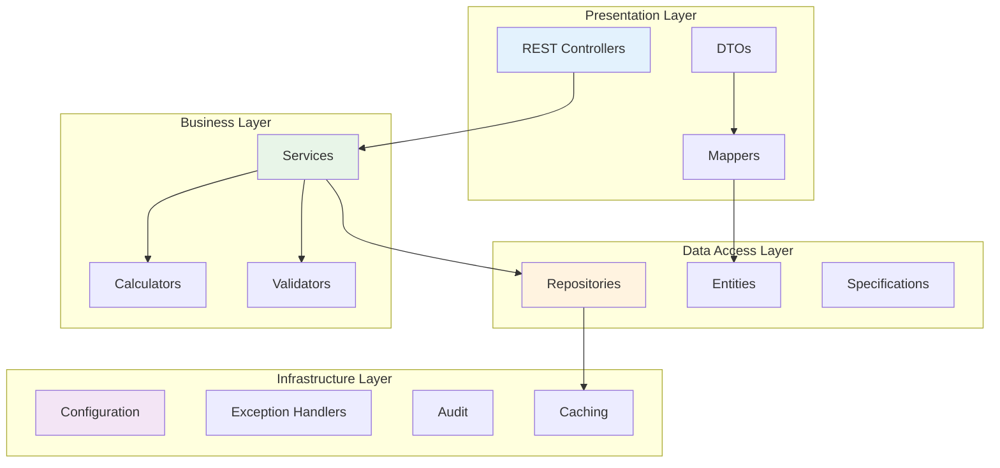

# Technical Approach for Spring Boot Implementation

This document provides detailed technical specifications for implementing the Spring Boot application, including architecture patterns, code examples, and best practices.

## Technology Stack

### Core Framework Stack



### Technology Justification

| Technology | Version | Justification |
|------------|---------|---------------|
| **Java** | 17 LTS | Long-term support, modern language features, performance improvements |
| **Spring Boot** | 3.2+ | Production-ready framework, extensive ecosystem, auto-configuration |
| **PostgreSQL** | 15+ | ACID compliance, JSON support, excellent performance, open source |
| **Redis** | 7+ | High-performance caching, session management, pub/sub capabilities |
| **Docker** | Latest | Containerization for consistent deployments and scaling |

## Application Architecture

### Layered Architecture Pattern



### Package Structure

```
com.company.accounts
├── controller/          # REST controllers
├── service/            # Business logic services
├── repository/         # Data access repositories
├── entity/             # JPA entities
├── dto/                # Data transfer objects
├── mapper/             # Entity-DTO mappers
├── validator/          # Custom validators
├── config/             # Configuration classes
├── exception/          # Exception handling
├── util/               # Utility classes
└── batch/              # Batch processing jobs
```

## Entity Design and Implementation

### Core Entity Models

#### Account Entity
```java
@Entity
@Table(name = "accounts", indexes = {
    @Index(name = "idx_account_number", columnList = "account_number"),
    @Index(name = "idx_account_status", columnList = "status"),
    @Index(name = "idx_account_created", columnList = "created_at")
})
@EntityListeners(AuditingEntityListener.class)
@Data
@Builder
@NoArgsConstructor
@AllArgsConstructor
public class Account {
    
    @Id
    @GeneratedValue(strategy = GenerationType.UUID)
    private UUID id;
    
    @Column(name = "account_number", length = 8, unique = true, nullable = false)
    @NotBlank(message = "Account number is required")
    @Pattern(regexp = "^[A-Z0-9]{8}$", message = "Account number must be 8 alphanumeric characters")
    private String accountNumber;
    
    @Column(name = "account_limit", precision = 9, scale = 2)
    @DecimalMin(value = "0.00", message = "Account limit cannot be negative")
    @Digits(integer = 7, fraction = 2, message = "Invalid account limit format")
    private BigDecimal accountLimit;
    
    @Column(name = "account_balance", precision = 9, scale = 2, nullable = false)
    @Digits(integer = 7, fraction = 2, message = "Invalid account balance format")
    private BigDecimal accountBalance;
    
    @Enumerated(EnumType.STRING)
    @Column(name = "status", length = 20, nullable = false)
    private AccountStatus status = AccountStatus.ACTIVE;
    
    @Enumerated(EnumType.STRING)
    @Column(name = "account_type", length = 20, nullable = false)
    private AccountType accountType = AccountType.CHECKING;
    
    @Column(name = "comments", length = 1000)
    @Size(max = 1000, message = "Comments cannot exceed 1000 characters")
    private String comments;
    
    @Column(name = "reserved", length = 7)
    private String reserved;
    
    // Audit fields
    @CreatedDate
    @Column(name = "created_at", nullable = false)
    private LocalDateTime createdAt;
    
    @LastModifiedDate
    @Column(name = "updated_at", nullable = false)
    private LocalDateTime updatedAt;
    
    @CreatedBy
    @Column(name = "created_by", length = 50)
    private String createdBy;
    
    @LastModifiedBy
    @Column(name = "updated_by", length = 50)
    private String updatedBy;
    
    @Version
    private Integer version;
    
    // Relationships
    @OneToOne(mappedBy = "account", cascade = CascadeType.ALL, fetch = FetchType.LAZY)
    private Customer customer;
    
    @OneToMany(mappedBy = "account", cascade = CascadeType.ALL, fetch = FetchType.LAZY)
    @OrderBy("transactionDate DESC")
    private List<Transaction> transactions = new ArrayList<>();
    
    // Business methods
    public void updateBalance(BigDecimal amount) {
        this.accountBalance = this.accountBalance.add(amount);
        this.updatedAt = LocalDateTime.now();
    }
    
    public BigDecimal getAvailableCredit() {
        if (accountLimit == null) return BigDecimal.ZERO;
        return accountLimit.subtract(accountBalance);
    }
    
    public boolean isOverLimit() {
        return accountLimit != null && accountBalance.compareTo(accountLimit) > 0;
    }
}
```

#### Customer Entity
```java
@Entity
@Table(name = "customers", indexes = {
    @Index(name = "idx_customer_name", columnList = "last_name, first_name"),
    @Index(name = "idx_customer_status", columnList = "status")
})
@EntityListeners(AuditingEntityListener.class)
@Data
@Builder
@NoArgsConstructor
@AllArgsConstructor
public class Customer {
    
    @Id
    @GeneratedValue(strategy = GenerationType.UUID)
    private UUID id;
    
    @Column(name = "first_name", length = 50, nullable = false)
    @NotBlank(message = "First name is required")
    @Size(max = 50, message = "First name cannot exceed 50 characters")
    private String firstName;
    
    @Column(name = "last_name", length = 50, nullable = false)
    @NotBlank(message = "Last name is required")
    @Size(max = 50, message = "Last name cannot exceed 50 characters")
    private String lastName;
    
    @Column(name = "middle_name", length = 50)
    @Size(max = 50, message = "Middle name cannot exceed 50 characters")
    private String middleName;
    
    @Column(name = "date_of_birth")
    @Past(message = "Date of birth must be in the past")
    private LocalDate dateOfBirth;
    
    @Column(name = "ssn", length = 100) // Encrypted
    @Pattern(regexp = "^\\d{3}-\\d{2}-\\d{4}$", message = "Invalid SSN format")
    private String ssn;
    
    @Enumerated(EnumType.STRING)
    @Column(name = "status", length = 20, nullable = false)
    private CustomerStatus status = CustomerStatus.ACTIVE;
    
    @Embedded
    private Address address;
    
    // Audit fields
    @CreatedDate
    @Column(name = "created_at", nullable = false)
    private LocalDateTime createdAt;
    
    @LastModifiedDate
    @Column(name = "updated_at", nullable = false)
    private LocalDateTime updatedAt;
    
    @Version
    private Integer version;
    
    // Relationship
    @OneToOne
    @JoinColumn(name = "account_id", nullable = false)
    private Account account;
    
    @OneToMany(mappedBy = "customer", cascade = CascadeType.ALL, fetch = FetchType.LAZY)
    private List<CustomerContact> contacts = new ArrayList<>();
    
    // Business methods
    public String getFullName() {
        StringBuilder sb = new StringBuilder();
        sb.append(firstName);
        if (middleName != null && !middleName.isEmpty()) {
            sb.append(" ").append(middleName);
        }
        sb.append(" ").append(lastName);
        return sb.toString();
    }
}
```

## Service Layer Implementation

### Account Service
```java
@Service
@Transactional
@Slf4j
public class AccountService {
    
    private final AccountRepository accountRepository;
    private final CustomerRepository customerRepository;
    private final AccountMapper accountMapper;
    private final AccountValidator accountValidator;
    private final NotificationService notificationService;
    
    public AccountService(AccountRepository accountRepository,
                         CustomerRepository customerRepository,
                         AccountMapper accountMapper,
                         AccountValidator accountValidator,
                         NotificationService notificationService) {
        this.accountRepository = accountRepository;
        this.customerRepository = customerRepository;
        this.accountMapper = accountMapper;
        this.accountValidator = accountValidator;
        this.notificationService = notificationService;
    }
    
    @Transactional(readOnly = true)
    public Page<AccountDto> getAllAccounts(Pageable pageable, AccountFilter filter) {
        log.debug("Retrieving accounts with filter: {}", filter);
        
        Specification<Account> spec = AccountSpecifications.withFilter(filter);
        Page<Account> accounts = accountRepository.findAll(spec, pageable);
        
        return accounts.map(accountMapper::toDto);
    }
    
    @Transactional(readOnly = true)
    @Cacheable(value = "accounts", key = "#accountNumber")
    public AccountDto getAccountByNumber(String accountNumber) {
        log.debug("Retrieving account: {}", accountNumber);
        
        Account account = accountRepository.findByAccountNumber(accountNumber)
            .orElseThrow(() -> new AccountNotFoundException("Account not found: " + accountNumber));
        
        return accountMapper.toDto(account);
    }
    
    public AccountDto createAccount(CreateAccountRequest request) {
        log.info("Creating new account for customer: {} {}", 
                request.getFirstName(), request.getLastName());
        
        // Validate request
        accountValidator.validateCreateRequest(request);
        
        // Generate unique account number
        String accountNumber = generateAccountNumber();
        
        // Create account entity
        Account account = Account.builder()
            .accountNumber(accountNumber)
            .accountLimit(request.getAccountLimit())
            .accountBalance(BigDecimal.ZERO)
            .accountType(request.getAccountType())
            .status(AccountStatus.ACTIVE)
            .comments(request.getComments())
            .build();
        
        // Create customer entity
        Customer customer = Customer.builder()
            .firstName(request.getFirstName())
            .lastName(request.getLastName())
            .middleName(request.getMiddleName())
            .dateOfBirth(request.getDateOfBirth())
            .ssn(encryptSsn(request.getSsn()))
            .status(CustomerStatus.ACTIVE)
            .address(request.getAddress())
            .account(account)
            .build();
        
        account.setCustomer(customer);
        
        // Save entities
        Account savedAccount = accountRepository.save(account);
        
        // Send notification
        notificationService.sendAccountCreatedNotification(savedAccount);
        
        log.info("Account created successfully: {}", accountNumber);
        return accountMapper.toDto(savedAccount);
    }
    
    public AccountDto updateAccountBalance(String accountNumber, BigDecimal amount, 
                                         String transactionType) {
        log.info("Updating balance for account: {} by amount: {}", accountNumber, amount);
        
        Account account = accountRepository.findByAccountNumberForUpdate(accountNumber)
            .orElseThrow(() -> new AccountNotFoundException("Account not found: " + accountNumber));
        
        // Validate business rules
        accountValidator.validateBalanceUpdate(account, amount, transactionType);
        
        // Update balance
        BigDecimal oldBalance = account.getAccountBalance();
        account.updateBalance(amount);
        
        // Check for overlimit condition
        if (account.isOverLimit()) {
            notificationService.sendOverlimitNotification(account);
        }
        
        Account savedAccount = accountRepository.save(account);
        
        // Create audit record
        createBalanceChangeAudit(account, oldBalance, amount, transactionType);
        
        log.info("Balance updated for account: {} from {} to {}", 
                accountNumber, oldBalance, account.getAccountBalance());
        
        return accountMapper.toDto(savedAccount);
    }
    
    private String generateAccountNumber() {
        // Implementation to generate unique 8-character account number
        String prefix = "AC";
        String suffix = String.format("%06d", 
            ThreadLocalRandom.current().nextInt(100000, 999999));
        return prefix + suffix;
    }
    
    private String encryptSsn(String ssn) {
        // Implementation for SSN encryption
        // Use AES encryption with application-specific key
        return ssnEncryption.encrypt(ssn);
    }
    
    private void createBalanceChangeAudit(Account account, BigDecimal oldBalance, 
                                        BigDecimal amount, String changeType) {
        // Implementation for audit trail
        AccountHistory history = AccountHistory.builder()
            .account(account)
            .previousBalance(oldBalance)
            .newBalance(account.getAccountBalance())
            .changeAmount(amount)
            .changeType(changeType)
            .changeDate(LocalDateTime.now())
            .changedBy(getCurrentUser())
            .build();
        
        accountHistoryRepository.save(history);
    }
}
```

## Data Access Layer

### Repository Pattern with Specifications

#### Account Repository
```java
@Repository
public interface AccountRepository extends JpaRepository<Account, UUID>, 
                                         JpaSpecificationExecutor<Account> {
    
    Optional<Account> findByAccountNumber(String accountNumber);
    
    @Lock(LockModeType.PESSIMISTIC_WRITE)
    @Query("SELECT a FROM Account a WHERE a.accountNumber = :accountNumber")
    Optional<Account> findByAccountNumberForUpdate(@Param("accountNumber") String accountNumber);
    
    @Query("SELECT a FROM Account a JOIN FETCH a.customer WHERE a.accountNumber = :accountNumber")
    Optional<Account> findByAccountNumberWithCustomer(@Param("accountNumber") String accountNumber);
    
    @Query("""
        SELECT a FROM Account a 
        WHERE a.status = :status 
        AND a.createdAt BETWEEN :startDate AND :endDate
        """)
    List<Account> findAccountsCreatedBetween(@Param("status") AccountStatus status,
                                           @Param("startDate") LocalDateTime startDate,
                                           @Param("endDate") LocalDateTime endDate);
    
    @Modifying
    @Query("UPDATE Account a SET a.status = :status WHERE a.accountNumber = :accountNumber")
    int updateAccountStatus(@Param("accountNumber") String accountNumber, 
                           @Param("status") AccountStatus status);
    
    // Custom query for financial reporting (porting COBOL logic)
    @Query("""
        SELECT new com.company.accounts.dto.FinancialSummaryDto(
            COUNT(a),
            SUM(a.accountLimit),
            SUM(a.accountBalance),
            AVG(a.accountBalance)
        )
        FROM Account a 
        WHERE a.status = 'ACTIVE'
        """)
    FinancialSummaryDto getFinancialSummary();
}
```

#### Specification Pattern for Dynamic Queries
```java
@Component
public class AccountSpecifications {
    
    public static Specification<Account> withFilter(AccountFilter filter) {
        return Specification.where(hasAccountNumber(filter.getAccountNumber()))
            .and(hasStatus(filter.getStatus()))
            .and(hasAccountType(filter.getAccountType()))
            .and(createdBetween(filter.getCreatedFrom(), filter.getCreatedTo()))
            .and(hasCustomerName(filter.getCustomerName()))
            .and(hasState(filter.getState()));
    }
    
    private static Specification<Account> hasAccountNumber(String accountNumber) {
        return (root, query, cb) -> {
            if (accountNumber == null || accountNumber.isEmpty()) {
                return null;
            }
            return cb.like(cb.upper(root.get("accountNumber")), 
                          "%" + accountNumber.toUpperCase() + "%");
        };
    }
    
    private static Specification<Account> hasStatus(AccountStatus status) {
        return (root, query, cb) -> {
            if (status == null) {
                return null;
            }
            return cb.equal(root.get("status"), status);
        };
    }
    
    private static Specification<Account> hasState(String state) {
        return (root, query, cb) -> {
            if (state == null || state.isEmpty()) {
                return null;
            }
            Join<Account, Customer> customerJoin = root.join("customer");
            return cb.equal(cb.upper(customerJoin.get("address").get("state")), 
                           state.toUpperCase());
        };
    }
    
    private static Specification<Account> createdBetween(LocalDateTime from, LocalDateTime to) {
        return (root, query, cb) -> {
            if (from == null && to == null) {
                return null;
            }
            if (from != null && to != null) {
                return cb.between(root.get("createdAt"), from, to);
            }
            if (from != null) {
                return cb.greaterThanOrEqualTo(root.get("createdAt"), from);
            }
            return cb.lessThanOrEqualTo(root.get("createdAt"), to);
        };
    }
}
```

## Business Logic Migration

### COBOL to Java Logic Mapping

#### Financial Calculations (CBL0009-CBL0012)
```java
@Component
public class FinancialCalculationService {
    
    // Port of COBOL COMPUTE GROSS-PAY = HOURS * RATE logic
    public BigDecimal calculateGrossPay(BigDecimal hours, BigDecimal rate) {
        if (hours == null || rate == null) {
            return BigDecimal.ZERO;
        }
        
        return hours.multiply(rate)
                   .setScale(2, RoundingMode.HALF_UP);
    }
    
    // Port of COBOL limit and balance totaling logic
    public FinancialTotals calculateAccountTotals(List<Account> accounts) {
        BigDecimal totalLimits = BigDecimal.ZERO;
        BigDecimal totalBalances = BigDecimal.ZERO;
        
        for (Account account : accounts) {
            if (account.getAccountLimit() != null) {
                totalLimits = totalLimits.add(account.getAccountLimit());
            }
            if (account.getAccountBalance() != null) {
                totalBalances = totalBalances.add(account.getAccountBalance());
            }
        }
        
        return FinancialTotals.builder()
            .totalLimits(totalLimits)
            .totalBalances(totalBalances)
            .accountCount(accounts.size())
            .averageBalance(calculateAverageBalance(accounts))
            .build();
    }
    
    // Port of COBOL state filtering logic (CBL0006)
    public Map<String, CustomerCount> getCustomerCountsByState(List<Customer> customers) {
        return customers.stream()
            .filter(customer -> customer.getAddress() != null)
            .filter(customer -> customer.getAddress().getState() != null)
            .collect(Collectors.groupingBy(
                customer -> customer.getAddress().getState().toUpperCase(),
                Collectors.collectingAndThen(
                    Collectors.counting(),
                    count -> CustomerCount.builder()
                        .count(count)
                        .percentage(calculatePercentage(count, customers.size()))
                        .build()
                )
            ));
    }
    
    private BigDecimal calculateAverageBalance(List<Account> accounts) {
        if (accounts.isEmpty()) {
            return BigDecimal.ZERO;
        }
        
        BigDecimal sum = accounts.stream()
            .filter(account -> account.getAccountBalance() != null)
            .map(Account::getAccountBalance)
            .reduce(BigDecimal.ZERO, BigDecimal::add);
        
        return sum.divide(BigDecimal.valueOf(accounts.size()), 2, RoundingMode.HALF_UP);
    }
    
    private BigDecimal calculatePercentage(Long count, int total) {
        if (total == 0) {
            return BigDecimal.ZERO;
        }
        
        return BigDecimal.valueOf(count)
                        .multiply(BigDecimal.valueOf(100))
                        .divide(BigDecimal.valueOf(total), 2, RoundingMode.HALF_UP);
    }
}
```

## REST API Implementation

### Controller Layer
```java
@RestController
@RequestMapping("/api/v1/accounts")
@Validated
@Slf4j
public class AccountController {
    
    private final AccountService accountService;
    
    @GetMapping
    @Operation(summary = "Get all accounts", description = "Retrieve paginated list of accounts")
    @ApiResponses({
        @ApiResponse(responseCode = "200", description = "Accounts retrieved successfully"),
        @ApiResponse(responseCode = "400", description = "Invalid request parameters"),
        @ApiResponse(responseCode = "500", description = "Internal server error")
    })
    public ResponseEntity<PagedResponse<AccountDto>> getAllAccounts(
            @PageableDefault(size = 20, sort = "createdAt", direction = Sort.Direction.DESC) 
            Pageable pageable,
            @Valid AccountFilter filter) {
        
        log.info("Retrieving accounts with pagination: {}", pageable);
        
        Page<AccountDto> accounts = accountService.getAllAccounts(pageable, filter);
        PagedResponse<AccountDto> response = PagedResponse.of(accounts);
        
        return ResponseEntity.ok(response);
    }
    
    @GetMapping("/{accountNumber}")
    @Operation(summary = "Get account by number", description = "Retrieve account details by account number")
    public ResponseEntity<AccountDto> getAccount(
            @PathVariable @Pattern(regexp = "^[A-Z0-9]{8}$") String accountNumber) {
        
        log.info("Retrieving account: {}", accountNumber);
        
        AccountDto account = accountService.getAccountByNumber(accountNumber);
        return ResponseEntity.ok(account);
    }
    
    @PostMapping
    @Operation(summary = "Create new account", description = "Create a new account with customer information")
    public ResponseEntity<AccountDto> createAccount(@Valid @RequestBody CreateAccountRequest request) {
        
        log.info("Creating new account for: {} {}", request.getFirstName(), request.getLastName());
        
        AccountDto account = accountService.createAccount(request);
        
        URI location = ServletUriComponentsBuilder
            .fromCurrentRequest()
            .path("/{accountNumber}")
            .buildAndExpand(account.getAccountNumber())
            .toUri();
        
        return ResponseEntity.created(location).body(account);
    }
    
    @PutMapping("/{accountNumber}/balance")
    @Operation(summary = "Update account balance", description = "Update account balance with specified amount")
    public ResponseEntity<AccountDto> updateBalance(
            @PathVariable @Pattern(regexp = "^[A-Z0-9]{8}$") String accountNumber,
            @Valid @RequestBody UpdateBalanceRequest request) {
        
        log.info("Updating balance for account: {} by amount: {}", accountNumber, request.getAmount());
        
        AccountDto account = accountService.updateAccountBalance(
            accountNumber, 
            request.getAmount(), 
            request.getTransactionType()
        );
        
        return ResponseEntity.ok(account);
    }
    
    @GetMapping("/{accountNumber}/summary")
    @Operation(summary = "Get account financial summary", description = "Get financial summary for account")
    public ResponseEntity<AccountSummaryDto> getAccountSummary(
            @PathVariable @Pattern(regexp = "^[A-Z0-9]{8}$") String accountNumber) {
        
        log.info("Retrieving financial summary for account: {}", accountNumber);
        
        AccountSummaryDto summary = accountService.getAccountSummary(accountNumber);
        return ResponseEntity.ok(summary);
    }
}
```

## Configuration and Infrastructure

### Application Configuration
```java
@Configuration
@EnableJpaRepositories(basePackages = "com.company.accounts.repository")
@EnableJpaAuditing
@EnableCaching
@EnableScheduling
public class ApplicationConfig {
    
    @Bean
    @Primary
    @ConfigurationProperties("spring.datasource")
    public DataSource dataSource() {
        return DataSourceBuilder.create()
            .type(HikariDataSource.class)
            .build();
    }
    
    @Bean
    public RedisTemplate<String, Object> redisTemplate(RedisConnectionFactory connectionFactory) {
        RedisTemplate<String, Object> template = new RedisTemplate<>();
        template.setConnectionFactory(connectionFactory);
        template.setDefaultSerializer(new GenericJackson2JsonRedisSerializer());
        template.setKeySerializer(new StringRedisSerializer());
        return template;
    }
    
    @Bean
    public CacheManager cacheManager(RedisConnectionFactory connectionFactory) {
        RedisCacheConfiguration config = RedisCacheConfiguration.defaultCacheConfig()
            .entryTtl(Duration.ofMinutes(30))
            .serializeKeysWith(RedisSerializationContext.SerializationPair
                .fromSerializer(new StringRedisSerializer()))
            .serializeValuesWith(RedisSerializationContext.SerializationPair
                .fromSerializer(new GenericJackson2JsonRedisSerializer()));
        
        return RedisCacheManager.builder(connectionFactory)
            .cacheDefaults(config)
            .build();
    }
    
    @Bean
    public AuditorAware<String> auditorProvider() {
        return () -> {
            Authentication authentication = SecurityContextHolder.getContext().getAuthentication();
            if (authentication == null || !authentication.isAuthenticated()) {
                return Optional.of("system");
            }
            return Optional.of(authentication.getName());
        };
    }
}
```

### Security Configuration
```java
@Configuration
@EnableWebSecurity
@EnableMethodSecurity
public class SecurityConfig {
    
    @Bean
    public SecurityFilterChain filterChain(HttpSecurity http) throws Exception {
        return http
            .csrf(csrf -> csrf.disable())
            .sessionManagement(session -> session.sessionCreationPolicy(SessionCreationPolicy.STATELESS))
            .authorizeHttpRequests(auth -> auth
                .requestMatchers("/api/v1/public/**").permitAll()
                .requestMatchers("/actuator/health").permitAll()
                .requestMatchers(HttpMethod.GET, "/api/v1/accounts/**").hasAnyRole("USER", "ADMIN")
                .requestMatchers(HttpMethod.POST, "/api/v1/accounts/**").hasRole("ADMIN")
                .requestMatchers(HttpMethod.PUT, "/api/v1/accounts/**").hasRole("ADMIN")
                .anyRequest().authenticated()
            )
            .oauth2ResourceServer(oauth2 -> oauth2.jwt(Customizer.withDefaults()))
            .build();
    }
    
    @Bean
    public JwtDecoder jwtDecoder() {
        return JwtDecoders.fromIssuerLocation("https://your-auth-server.com");
    }
}
```

---

*This technical approach provides a comprehensive foundation for implementing the Spring Boot application with modern Java best practices and patterns.*