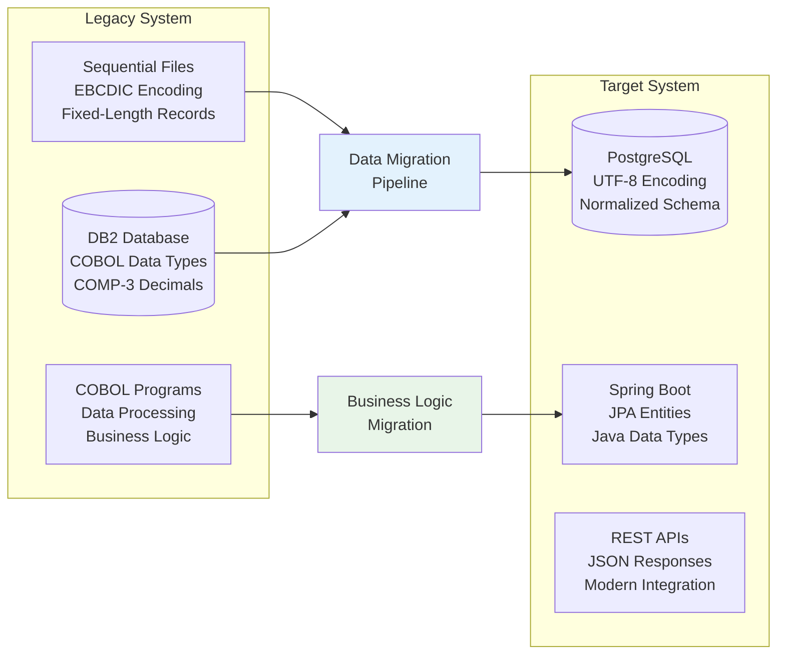
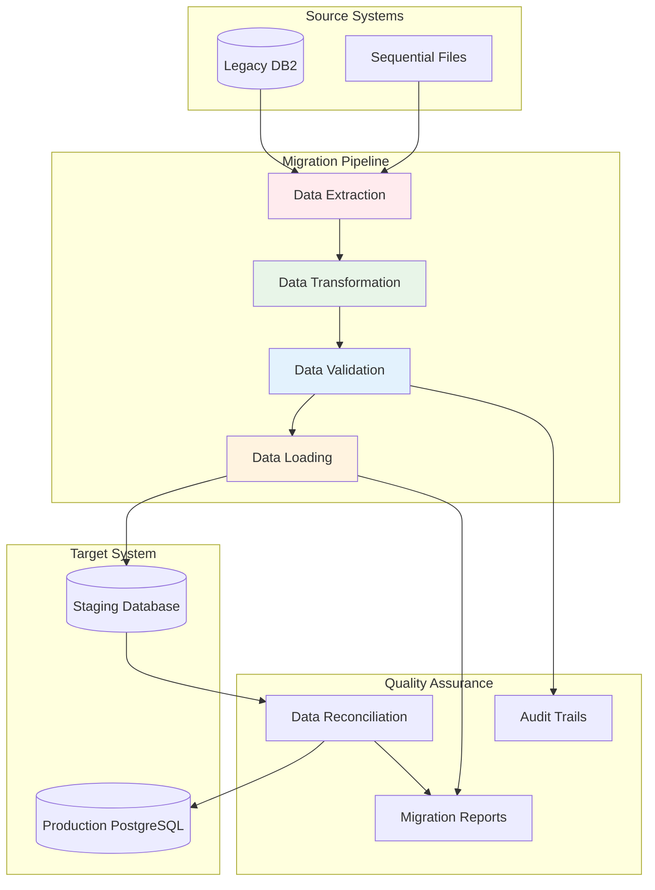
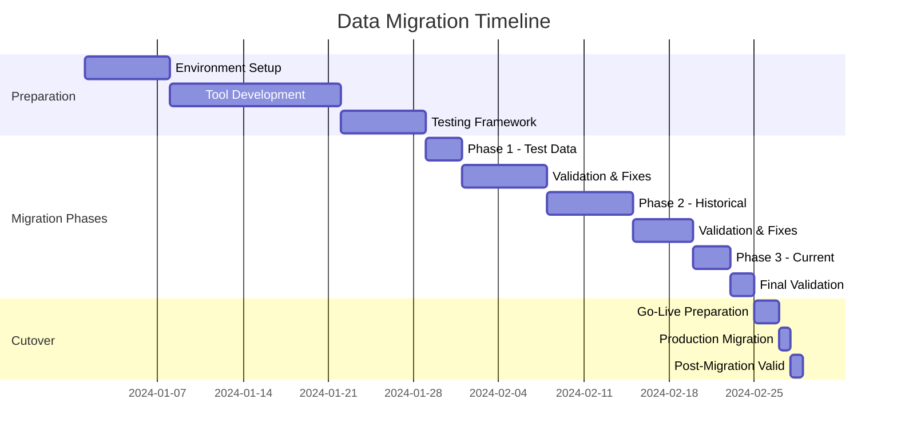

# Data Migration Strategy and Implementation

This document outlines the comprehensive strategy for migrating data from the legacy COBOL/DB2 system to the new PostgreSQL database.

## Migration Overview

### Current Data Landscape



### Data Migration Challenges

1. **Character Set Conversion**: EBCDIC → UTF-8
2. **Data Type Transformation**: COMP-3 → BigDecimal, PIC X(n) → VARCHAR
3. **Record Structure**: Fixed-length → Variable-length
4. **Data Validation**: Legacy data quality issues
5. **Volume Processing**: Large dataset migration
6. **Business Continuity**: Zero-downtime migration

## Migration Architecture

### Data Pipeline Architecture



## Data Transformation Rules

### Character Set Conversion

#### EBCDIC to UTF-8 Mapping

| COBOL Type | Source Format | Target Format | Conversion Rule |
|------------|---------------|---------------|-----------------|
| `PIC X(n)` | EBCDIC | UTF-8 VARCHAR | Character set conversion with validation |
| `PIC 9(n)` | EBCDIC Numeric | INTEGER/BIGINT | Parse and validate numeric content |
| `PIC S9(n)V99 COMP-3` | Packed Decimal | DECIMAL(p,s) | Unpack and convert to standard decimal |
| Group Items | Nested Structure | JSON/Embedded | Flatten or embed based on design |

#### Conversion Implementation

```java
@Component
public class DataConversionService {
    
    private final CharsetDecoder ebcdicDecoder;
    private final CharsetEncoder utf8Encoder;
    
    public DataConversionService() {
        this.ebcdicDecoder = Charset.forName("IBM037").newDecoder()
            .onMalformedInput(CodingErrorAction.REPORT)
            .onUnmappableCharacter(CodingErrorAction.REPORT);
        this.utf8Encoder = StandardCharsets.UTF_8.newEncoder();
    }
    
    public String convertEbcdicToUtf8(byte[] ebcdicData) throws ConversionException {
        try {
            ByteBuffer ebcdicBuffer = ByteBuffer.wrap(ebcdicData);
            CharBuffer charBuffer = ebcdicDecoder.decode(ebcdicBuffer);
            ByteBuffer utf8Buffer = utf8Encoder.encode(charBuffer);
            
            return new String(utf8Buffer.array(), StandardCharsets.UTF_8).trim();
        } catch (CharacterCodingException e) {
            throw new ConversionException("Failed to convert EBCDIC to UTF-8", e);
        }
    }
    
    public BigDecimal convertComp3ToDecimal(byte[] comp3Data, int precision, int scale) 
            throws ConversionException {
        try {
            // Implementation for COMP-3 packed decimal conversion
            StringBuilder digits = new StringBuilder();
            boolean isNegative = false;
            
            for (int i = 0; i < comp3Data.length; i++) {
                byte b = comp3Data[i];
                
                if (i == comp3Data.length - 1) {
                    // Last byte contains final digit and sign
                    int digit = (b & 0xF0) >> 4;
                    if (digit <= 9) {
                        digits.append(digit);
                    }
                    
                    int sign = b & 0x0F;
                    isNegative = (sign == 0x0D); // Negative sign
                } else {
                    // Regular bytes contain two digits
                    int highDigit = (b & 0xF0) >> 4;
                    int lowDigit = b & 0x0F;
                    
                    if (highDigit <= 9) digits.append(highDigit);
                    if (lowDigit <= 9) digits.append(lowDigit);
                }
            }
            
            if (digits.length() == 0) {
                return BigDecimal.ZERO;
            }
            
            BigDecimal result = new BigDecimal(digits.toString());
            if (scale > 0) {
                result = result.movePointLeft(scale);
            }
            
            return isNegative ? result.negate() : result;
            
        } catch (Exception e) {
            throw new ConversionException("Failed to convert COMP-3 to decimal", e);
        }
    }
}
```

### Record Structure Transformation

#### Account Record Mapping

```java
@Component
public class AccountRecordMapper {
    
    private final DataConversionService conversionService;
    
    public Account mapCobolRecordToEntity(CobolAccountRecord cobolRecord) {
        return Account.builder()
            .accountNumber(cleanAccountNumber(cobolRecord.getAccountNo()))
            .accountLimit(convertToDecimal(cobolRecord.getAccountLimit()))
            .accountBalance(convertToDecimal(cobolRecord.getAccountBalance()))
            .comments(cleanComments(cobolRecord.getComments()))
            .reserved(cobolRecord.getReserved())
            .status(AccountStatus.ACTIVE)
            .accountType(determineAccountType(cobolRecord))
            .createdAt(LocalDateTime.now())
            .build();
    }
    
    public Customer mapCobolCustomerToEntity(CobolAccountRecord cobolRecord) {
        Address address = Address.builder()
            .streetAddress(cleanAddress(cobolRecord.getStreetAddr()))
            .city(extractCity(cobolRecord.getCityCounty()))
            .county(extractCounty(cobolRecord.getCityCounty()))
            .state(standardizeState(cobolRecord.getAddrState()))
            .country("US")
            .build();
        
        return Customer.builder()
            .firstName(cleanName(cobolRecord.getFirstName()))
            .lastName(cleanName(cobolRecord.getLastName()))
            .address(address)
            .status(CustomerStatus.ACTIVE)
            .createdAt(LocalDateTime.now())
            .build();
    }
    
    private String cleanAccountNumber(String accountNo) {
        if (accountNo == null) return null;
        return accountNo.trim().replaceAll("[^A-Z0-9]", "");
    }
    
    private BigDecimal convertToDecimal(byte[] comp3Data) {
        if (comp3Data == null || comp3Data.length == 0) {
            return BigDecimal.ZERO;
        }
        return conversionService.convertComp3ToDecimal(comp3Data, 7, 2);
    }
    
    private String standardizeState(String state) {
        if (state == null) return null;
        
        String cleaned = state.trim().toUpperCase();
        
        // Map common state name variations to standard codes
        Map<String, String> stateMap = Map.of(
            "VIRGINIA", "VA",
            "CALIFORNIA", "CA",
            "NEW YORK", "NY",
            "TEXAS", "TX",
            "FLORIDA", "FL"
        );
        
        return stateMap.getOrDefault(cleaned, cleaned.length() > 2 ? null : cleaned);
    }
}
```

## Migration Pipeline Implementation

### Extract Phase

#### Database Extraction
```java
@Component
public class DataExtractionService {
    
    private final DB2DataSource legacyDataSource;
    private final MigrationMetricsService metricsService;
    
    @Transactional(readOnly = true)
    public List<CobolAccountRecord> extractAccountsInBatches(int batchSize, int offset) {
        String sql = """
            SELECT ACCTNO, LIMIT, BALANCE, SURNAME, FIRSTN, 
                   ADDRESS1, ADDRESS2, ADDRESS3, RESERVED, COMMENTS
            FROM ACCOUNT_TABLE 
            ORDER BY ACCTNO
            OFFSET ? ROWS FETCH NEXT ? ROWS ONLY
            """;
        
        try (Connection conn = legacyDataSource.getConnection();
             PreparedStatement stmt = conn.prepareStatement(sql)) {
            
            stmt.setInt(1, offset);
            stmt.setInt(2, batchSize);
            
            List<CobolAccountRecord> records = new ArrayList<>();
            
            try (ResultSet rs = stmt.executeQuery()) {
                while (rs.next()) {
                    CobolAccountRecord record = mapResultSetToRecord(rs);
                    records.add(record);
                }
            }
            
            metricsService.recordExtractedRecords(records.size());
            return records;
            
        } catch (SQLException e) {
            throw new DataExtractionException("Failed to extract account records", e);
        }
    }
    
    private CobolAccountRecord mapResultSetToRecord(ResultSet rs) throws SQLException {
        return CobolAccountRecord.builder()
            .accountNo(rs.getString("ACCTNO"))
            .accountLimit(rs.getBytes("LIMIT"))
            .accountBalance(rs.getBytes("BALANCE"))
            .lastName(rs.getString("SURNAME"))
            .firstName(rs.getString("FIRSTN"))
            .streetAddr(rs.getString("ADDRESS1"))
            .cityCounty(rs.getString("ADDRESS2"))
            .addrState(rs.getString("ADDRESS3"))
            .reserved(rs.getString("RESERVED"))
            .comments(rs.getString("COMMENTS"))
            .build();
    }
}
```

#### File Extraction
```java
@Component
public class SequentialFileReader {
    
    private final DataConversionService conversionService;
    
    public List<CobolAccountRecord> readFixedLengthFile(String filePath) throws IOException {
        List<CobolAccountRecord> records = new ArrayList<>();
        
        try (FileInputStream fis = new FileInputStream(filePath)) {
            byte[] recordBuffer = new byte[RECORD_LENGTH];
            
            while (fis.read(recordBuffer) == RECORD_LENGTH) {
                CobolAccountRecord record = parseFixedLengthRecord(recordBuffer);
                if (isValidRecord(record)) {
                    records.add(record);
                }
            }
        }
        
        return records;
    }
    
    private CobolAccountRecord parseFixedLengthRecord(byte[] recordData) {
        ByteBuffer buffer = ByteBuffer.wrap(recordData);
        
        // Parse fixed-length fields based on COBOL copybook
        return CobolAccountRecord.builder()
            .accountNo(extractField(buffer, 0, 8))
            .accountLimit(extractComp3Field(buffer, 8, 5))
            .accountBalance(extractComp3Field(buffer, 13, 5))
            .lastName(extractField(buffer, 18, 20))
            .firstName(extractField(buffer, 38, 15))
            .streetAddr(extractField(buffer, 53, 25))
            .cityCounty(extractField(buffer, 78, 20))
            .addrState(extractField(buffer, 98, 15))
            .reserved(extractField(buffer, 113, 7))
            .comments(extractField(buffer, 120, 50))
            .build();
    }
    
    private String extractField(ByteBuffer buffer, int offset, int length) {
        byte[] fieldData = new byte[length];
        buffer.position(offset);
        buffer.get(fieldData);
        return conversionService.convertEbcdicToUtf8(fieldData);
    }
    
    private byte[] extractComp3Field(ByteBuffer buffer, int offset, int length) {
        byte[] fieldData = new byte[length];
        buffer.position(offset);
        buffer.get(fieldData);
        return fieldData;
    }
}
```

### Transform and Load Phase

#### Data Transformation Service
```java
@Service
@Transactional
public class DataTransformationService {
    
    private final AccountRecordMapper accountMapper;
    private final DataValidationService validationService;
    private final AccountRepository accountRepository;
    private final CustomerRepository customerRepository;
    
    public MigrationResult transformAndLoadBatch(List<CobolAccountRecord> cobolRecords) {
        MigrationResult result = new MigrationResult();
        
        for (CobolAccountRecord cobolRecord : cobolRecords) {
            try {
                // Transform record
                Account account = accountMapper.mapCobolRecordToEntity(cobolRecord);
                Customer customer = accountMapper.mapCobolCustomerToEntity(cobolRecord);
                
                // Validate transformed data
                ValidationResult validation = validationService.validateAccountAndCustomer(account, customer);
                
                if (validation.hasErrors()) {
                    result.addValidationFailure(cobolRecord.getAccountNo(), validation.getErrors());
                    continue;
                }
                
                // Apply data corrections if needed
                applyDataCorrections(account, customer, validation.getWarnings());
                
                // Link entities
                customer.setAccount(account);
                account.setCustomer(customer);
                
                // Save to database
                Account savedAccount = accountRepository.save(account);
                
                result.addSuccessfulRecord(savedAccount.getAccountNumber());
                
            } catch (Exception e) {
                result.addProcessingError(cobolRecord.getAccountNo(), e.getMessage());
            }
        }
        
        return result;
    }
    
    private void applyDataCorrections(Account account, Customer customer, List<String> warnings) {
        // Apply common data corrections based on known legacy data issues
        
        // Standardize account numbers
        if (account.getAccountNumber() != null) {
            account.setAccountNumber(account.getAccountNumber().toUpperCase());
        }
        
        // Handle null/empty values
        if (account.getAccountLimit() == null || account.getAccountLimit().compareTo(BigDecimal.ZERO) < 0) {
            account.setAccountLimit(BigDecimal.ZERO);
        }
        
        // Standardize names
        if (customer.getFirstName() != null) {
            customer.setFirstName(WordUtils.capitalizeFully(customer.getFirstName().trim()));
        }
        if (customer.getLastName() != null) {
            customer.setLastName(WordUtils.capitalizeFully(customer.getLastName().trim()));
        }
        
        // Handle address corrections
        if (customer.getAddress() != null) {
            Address address = customer.getAddress();
            if (address.getState() != null) {
                address.setState(address.getState().toUpperCase().substring(0, 
                    Math.min(2, address.getState().length())));
            }
        }
    }
}
```

## Data Validation and Quality Assurance

### Validation Framework

```java
@Component
public class DataValidationService {
    
    private final Set<DataValidator> validators;
    
    public ValidationResult validateAccountAndCustomer(Account account, Customer customer) {
        ValidationResult result = new ValidationResult();
        
        for (DataValidator validator : validators) {
            ValidationResult validatorResult = validator.validate(account, customer);
            result.merge(validatorResult);
        }
        
        return result;
    }
}

@Component
public class AccountNumberValidator implements DataValidator {
    
    @Override
    public ValidationResult validate(Account account, Customer customer) {
        ValidationResult result = new ValidationResult();
        
        String accountNumber = account.getAccountNumber();
        
        if (accountNumber == null || accountNumber.trim().isEmpty()) {
            result.addError("Account number is required");
            return result;
        }
        
        if (!accountNumber.matches("^[A-Z0-9]{8}$")) {
            result.addError("Account number must be 8 alphanumeric characters");
        }
        
        // Check for duplicate account numbers
        if (accountRepository.existsByAccountNumber(accountNumber)) {
            result.addError("Account number already exists: " + accountNumber);
        }
        
        return result;
    }
}

@Component
public class FinancialDataValidator implements DataValidator {
    
    @Override
    public ValidationResult validate(Account account, Customer customer) {
        ValidationResult result = new ValidationResult();
        
        // Validate account limit
        if (account.getAccountLimit() != null) {
            if (account.getAccountLimit().compareTo(BigDecimal.ZERO) < 0) {
                result.addError("Account limit cannot be negative");
            }
            if (account.getAccountLimit().compareTo(new BigDecimal("9999999.99")) > 0) {
                result.addError("Account limit exceeds maximum allowed value");
            }
        }
        
        // Validate account balance
        if (account.getAccountBalance() != null) {
            if (account.getAccountBalance().compareTo(new BigDecimal("-9999999.99")) < 0) {
                result.addError("Account balance below minimum allowed value");
            }
            if (account.getAccountBalance().compareTo(new BigDecimal("9999999.99")) > 0) {
                result.addError("Account balance exceeds maximum allowed value");
            }
        }
        
        // Business rule validations
        if (account.getAccountLimit() != null && account.getAccountBalance() != null) {
            BigDecimal overlimitAmount = account.getAccountBalance().subtract(account.getAccountLimit());
            if (overlimitAmount.compareTo(BigDecimal.ZERO) > 0) {
                result.addWarning("Account is over limit by: " + overlimitAmount);
            }
        }
        
        return result;
    }
}
```

## Data Reconciliation

### Reconciliation Service

```java
@Service
public class DataReconciliationService {
    
    private final LegacyDataService legacyDataService;
    private final AccountRepository accountRepository;
    private final CustomerRepository customerRepository;
    
    public ReconciliationReport performFullReconciliation() {
        ReconciliationReport report = new ReconciliationReport();
        
        // Count reconciliation
        performCountReconciliation(report);
        
        // Data reconciliation
        performDataReconciliation(report);
        
        // Financial reconciliation
        performFinancialReconciliation(report);
        
        return report;
    }
    
    private void performCountReconciliation(ReconciliationReport report) {
        long legacyAccountCount = legacyDataService.getAccountCount();
        long newAccountCount = accountRepository.count();
        
        report.setLegacyAccountCount(legacyAccountCount);
        report.setNewAccountCount(newAccountCount);
        report.setCountDifference(newAccountCount - legacyAccountCount);
        
        if (legacyAccountCount != newAccountCount) {
            report.addIssue("Account count mismatch: Legacy=" + legacyAccountCount + 
                           ", New=" + newAccountCount);
        }
    }
    
    private void performDataReconciliation(ReconciliationReport report) {
        List<String> legacyAccountNumbers = legacyDataService.getAllAccountNumbers();
        
        for (String accountNumber : legacyAccountNumbers) {
            try {
                LegacyAccountData legacyData = legacyDataService.getAccountData(accountNumber);
                Optional<Account> newAccount = accountRepository.findByAccountNumber(accountNumber);
                
                if (newAccount.isEmpty()) {
                    report.addMissingAccount(accountNumber);
                    continue;
                }
                
                validateAccountData(report, accountNumber, legacyData, newAccount.get());
                
            } catch (Exception e) {
                report.addReconciliationError(accountNumber, e.getMessage());
            }
        }
    }
    
    private void validateAccountData(ReconciliationReport report, String accountNumber,
                                   LegacyAccountData legacyData, Account newAccount) {
        
        // Validate account balance
        BigDecimal legacyBalance = legacyData.getBalance();
        BigDecimal newBalance = newAccount.getAccountBalance();
        
        if (legacyBalance.compareTo(newBalance) != 0) {
            report.addDataMismatch(accountNumber, "balance", 
                                 legacyBalance.toString(), newBalance.toString());
        }
        
        // Validate account limit
        BigDecimal legacyLimit = legacyData.getLimit();
        BigDecimal newLimit = newAccount.getAccountLimit();
        
        if (legacyLimit != null && newLimit != null && legacyLimit.compareTo(newLimit) != 0) {
            report.addDataMismatch(accountNumber, "limit", 
                                 legacyLimit.toString(), newLimit.toString());
        }
        
        // Validate customer names
        if (!Objects.equals(legacyData.getLastName().trim(), 
                           newAccount.getCustomer().getLastName())) {
            report.addDataMismatch(accountNumber, "lastName", 
                                 legacyData.getLastName(), newAccount.getCustomer().getLastName());
        }
    }
    
    private void performFinancialReconciliation(ReconciliationReport report) {
        // Aggregate financial totals
        BigDecimal legacyTotalBalance = legacyDataService.getTotalBalance();
        BigDecimal newTotalBalance = accountRepository.getTotalBalance();
        
        report.setLegacyTotalBalance(legacyTotalBalance);
        report.setNewTotalBalance(newTotalBalance);
        
        BigDecimal balanceDifference = newTotalBalance.subtract(legacyTotalBalance);
        report.setBalanceDifference(balanceDifference);
        
        if (balanceDifference.abs().compareTo(new BigDecimal("0.01")) > 0) {
            report.addIssue("Total balance mismatch: " + balanceDifference);
        }
    }
}
```

## Migration Execution Strategy

### Incremental Migration Approach



### Migration Job Implementation

```java
@Component
public class MigrationJobRunner {
    
    private final DataExtractionService extractionService;
    private final DataTransformationService transformationService;
    private final DataReconciliationService reconciliationService;
    private final MigrationMetricsService metricsService;
    
    @Async
    public CompletableFuture<MigrationJobResult> runMigrationJob(MigrationJobConfig config) {
        MigrationJobResult result = new MigrationJobResult();
        result.setStartTime(LocalDateTime.now());
        
        try {
            int batchSize = config.getBatchSize();
            int offset = 0;
            int totalProcessed = 0;
            
            while (true) {
                // Extract batch
                List<CobolAccountRecord> records = extractionService
                    .extractAccountsInBatches(batchSize, offset);
                
                if (records.isEmpty()) {
                    break;
                }
                
                // Transform and load
                MigrationResult batchResult = transformationService
                    .transformAndLoadBatch(records);
                
                result.mergeBatchResult(batchResult);
                
                totalProcessed += records.size();
                offset += batchSize;
                
                // Update progress
                metricsService.updateMigrationProgress(totalProcessed, result);
                
                // Throttling to avoid overwhelming the system
                if (config.getThrottleMillis() > 0) {
                    Thread.sleep(config.getThrottleMillis());
                }
            }
            
            // Perform reconciliation
            ReconciliationReport reconciliation = reconciliationService
                .performFullReconciliation();
            result.setReconciliationReport(reconciliation);
            
            result.setStatus(MigrationStatus.COMPLETED);
            
        } catch (Exception e) {
            result.setStatus(MigrationStatus.FAILED);
            result.setErrorMessage(e.getMessage());
        } finally {
            result.setEndTime(LocalDateTime.now());
        }
        
        return CompletableFuture.completedFuture(result);
    }
}
```

---

*This data migration strategy ensures accurate, reliable, and verifiable migration of all legacy data to the new PostgreSQL database while maintaining data integrity and business continuity.*