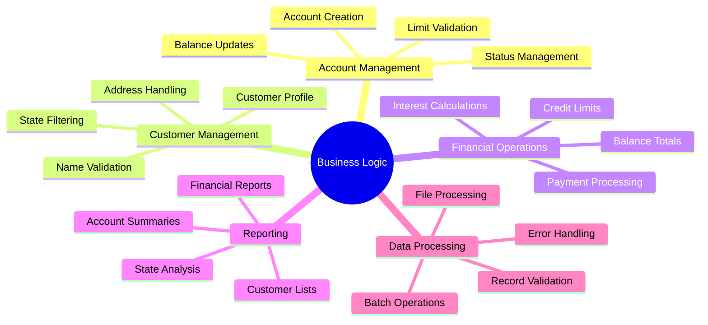

# Business Logic Mapping

This document provides detailed mapping of COBOL business logic to Java Spring Boot services, ensuring all functionality is preserved during migration.

## Business Logic Analysis

### COBOL Program Business Rules Summary

Based on the analysis of all COBOL programs, the following business logic patterns have been identified:



## Program-by-Program Logic Mapping

### File Processing Programs (CBL0001-CBL0012)

#### CBL0001: Basic Account Processing

**COBOL Logic:**
```cobol
OPEN-FILES.
    OPEN INPUT  ACCT-REC.
    OPEN OUTPUT PRINT-LINE.

read-NEXT-RECORD.
    PERFORM READ-RECORD
    PERFORM UNTIL LASTREC = 'Y'
        PERFORM WRITE-RECORD
        PERFORM READ-RECORD
    END-PERFORM.

WRITE-RECORD.
    MOVE ACCT-NO      TO  ACCT-NO-O.
    MOVE ACCT-LIMIT   TO  ACCT-LIMIT-O.
    MOVE ACCT-BALANCE TO  ACCT-BALANCE-O.
    MOVE LAST-NAME    TO  LAST-NAME-O.
    MOVE FIRST-NAME   TO  FIRST-NAME-O.
    MOVE COMMENTS     TO  COMMENTS-O.
    WRITE PRINT-REC.
```

**Java Implementation:**
```java
@Service
public class AccountProcessingService {
    
    private final AccountRepository accountRepository;
    private final ReportGenerationService reportService;
    
    /**
     * Equivalent to CBL0001 - Basic account processing and report generation
     */
    public AccountProcessingReport processAllAccounts() {
        List<Account> accounts = accountRepository.findAllActiveAccounts();
        
        List<AccountReportLine> reportLines = accounts.stream()
            .map(this::mapAccountToReportLine)
            .collect(Collectors.toList());
        
        return AccountProcessingReport.builder()
            .reportLines(reportLines)
            .totalRecords(reportLines.size())
            .generatedAt(LocalDateTime.now())
            .build();
    }
    
    private AccountReportLine mapAccountToReportLine(Account account) {
        Customer customer = account.getCustomer();
        
        return AccountReportLine.builder()
            .accountNumber(account.getAccountNumber())
            .accountLimit(formatCurrency(account.getAccountLimit()))
            .accountBalance(formatCurrency(account.getAccountBalance()))
            .lastName(customer.getLastName())
            .firstName(customer.getFirstName())
            .comments(account.getComments())
            .build();
    }
    
    private String formatCurrency(BigDecimal amount) {
        if (amount == null) return "$0.00";
        
        DecimalFormat formatter = new DecimalFormat("$#,##0.00");
        return formatter.format(amount);
    }
}
```

#### CBL0006: State Filtering Logic

**COBOL Logic:**
```cobol
IS-STATE-VIRGINIA.
    IF ADDRSTATE = 'Virginia' OR ADDRSTATE = 'VA'
        ADD 1 TO VIRGINIA-CLIENTS
    END-IF.

CLOSE-STOP.
    WRITE PRINT-REC FROM CLIENTS-PER-STATE.
```

**Java Implementation:**
```java
@Service
public class CustomerAnalyticsService {
    
    private final CustomerRepository customerRepository;
    
    /**
     * Equivalent to CBL0006 - State-based customer filtering and counting
     */
    public Map<String, CustomerStateAnalytics> analyzeCustomersByState() {
        List<Customer> allCustomers = customerRepository.findAllActive();
        
        Map<String, Long> stateCounts = allCustomers.stream()
            .filter(customer -> customer.getAddress() != null)
            .filter(customer -> customer.getAddress().getState() != null)
            .collect(Collectors.groupingBy(
                customer -> normalizeStateName(customer.getAddress().getState()),
                Collectors.counting()
            ));
        
        return stateCounts.entrySet().stream()
            .collect(Collectors.toMap(
                Map.Entry::getKey,
                entry -> CustomerStateAnalytics.builder()
                    .stateName(entry.getKey())
                    .customerCount(entry.getValue())
                    .percentage(calculatePercentage(entry.getValue(), allCustomers.size()))
                    .build()
            ));
    }
    
    private String normalizeStateName(String state) {
        if (state == null || state.trim().isEmpty()) {
            return "UNKNOWN";
        }
        
        String normalized = state.trim().toUpperCase();
        
        // Handle Virginia variations as in COBOL
        if ("VIRGINIA".equals(normalized) || "VA".equals(normalized)) {
            return "VIRGINIA";
        }
        
        return normalized;
    }
    
    private BigDecimal calculatePercentage(Long count, int total) {
        if (total == 0) return BigDecimal.ZERO;
        
        return BigDecimal.valueOf(count)
                        .multiply(BigDecimal.valueOf(100))
                        .divide(BigDecimal.valueOf(total), 2, RoundingMode.HALF_UP);
    }
}
```

#### CBL0009-CBL0012: Financial Calculations

**COBOL Logic:**
```cobol
LIMIT-BALANCE-TOTAL.
    COMPUTE TLIMIT = TLIMIT + ACCT-LIMIT.
    COMPUTE TBALANCE = TBALANCE + ACCT-BALANCE.

WRITE-TOTALS.
    MOVE TLIMIT    TO  TLIMIT-O.
    MOVE TBALANCE  TO  TBALANCE-O.
    WRITE PRINT-REC FROM TRAILER-2.
```

**Java Implementation:**
```java
@Service
public class FinancialCalculationService {
    
    private final AccountRepository accountRepository;
    
    /**
     * Equivalent to CBL0009-CBL0012 - Financial totals and calculations
     */
    public FinancialSummaryReport calculateFinancialSummary(FinancialReportRequest request) {
        LocalDateTime reportDate = LocalDateTime.now();
        
        // Get accounts based on criteria
        List<Account> accounts = getAccountsForReport(request);
        
        // Calculate totals (equivalent to COBOL COMPUTE statements)
        BigDecimal totalLimits = accounts.stream()
            .filter(account -> account.getAccountLimit() != null)
            .map(Account::getAccountLimit)
            .reduce(BigDecimal.ZERO, BigDecimal::add);
        
        BigDecimal totalBalances = accounts.stream()
            .filter(account -> account.getAccountBalance() != null)
            .map(Account::getAccountBalance)
            .reduce(BigDecimal.ZERO, BigDecimal::add);
        
        BigDecimal averageBalance = calculateAverageBalance(accounts);
        BigDecimal averageLimit = calculateAverageLimit(accounts);
        
        return FinancialSummaryReport.builder()
            .reportDate(reportDate)
            .accountCount(accounts.size())
            .totalLimits(totalLimits)
            .totalBalances(totalBalances)
            .averageBalance(averageBalance)
            .averageLimit(averageLimit)
            .creditUtilization(calculateCreditUtilization(totalBalances, totalLimits))
            .accounts(mapAccountsToSummary(accounts))
            .build();
    }
    
    private BigDecimal calculateAverageBalance(List<Account> accounts) {
        if (accounts.isEmpty()) return BigDecimal.ZERO;
        
        BigDecimal sum = accounts.stream()
            .filter(account -> account.getAccountBalance() != null)
            .map(Account::getAccountBalance)
            .reduce(BigDecimal.ZERO, BigDecimal::add);
        
        return sum.divide(BigDecimal.valueOf(accounts.size()), 2, RoundingMode.HALF_UP);
    }
    
    private BigDecimal calculateCreditUtilization(BigDecimal totalBalances, BigDecimal totalLimits) {
        if (totalLimits.compareTo(BigDecimal.ZERO) == 0) {
            return BigDecimal.ZERO;
        }
        
        return totalBalances.divide(totalLimits, 4, RoundingMode.HALF_UP)
                          .multiply(BigDecimal.valueOf(100));
    }
}
```

### Database Programs (CBLDB21-CBLDB23)

#### CBLDB21: Basic DB2 Operations

**COBOL Logic:**
```cobol
EXEC SQL
    SELECT ACCTNO, LIMIT, BALANCE, SURNAME, FIRSTN, COMMENTS
    FROM ACCOUNT_TABLE
    WHERE ACCTNO = :WS-ACCTNO
END-EXEC.

IF SQLCODE = 0
    PERFORM WRITE-ACCOUNT-RECORD
ELSE
    PERFORM SQL-ERROR-ROUTINE
END-IF.
```

**Java Implementation:**
```java
@Service
@Transactional
public class DatabaseOperationService {
    
    private final AccountRepository accountRepository;
    private final TransactionTemplate transactionTemplate;
    
    /**
     * Equivalent to CBLDB21 - Basic database operations with error handling
     */
    public AccountDto retrieveAccountWithErrorHandling(String accountNumber) {
        try {
            Optional<Account> accountOpt = accountRepository.findByAccountNumber(accountNumber);
            
            if (accountOpt.isPresent()) {
                return mapToAccountDto(accountOpt.get());
            } else {
                throw new AccountNotFoundException("Account not found: " + accountNumber);
            }
            
        } catch (DataAccessException e) {
            // Equivalent to SQL-ERROR-ROUTINE
            handleDatabaseError(e, accountNumber);
            throw new DatabaseOperationException("Database error retrieving account", e);
        }
    }
    
    /**
     * Equivalent to CBLDB22 - Advanced queries with joins
     */
    @Transactional(readOnly = true)
    public List<AccountCustomerDto> retrieveAccountsWithCustomerInfo(AccountSearchCriteria criteria) {
        try {
            Specification<Account> spec = buildSearchSpecification(criteria);
            List<Account> accounts = accountRepository.findAll(spec);
            
            return accounts.stream()
                .map(this::mapToAccountCustomerDto)
                .collect(Collectors.toList());
                
        } catch (DataAccessException e) {
            handleDatabaseError(e, "account search");
            throw new DatabaseOperationException("Database error in account search", e);
        }
    }
    
    /**
     * Equivalent to CBLDB23 - Complex processing with transactions
     */
    @Transactional
    public TransactionResult processAccountUpdate(AccountUpdateRequest request) {
        return transactionTemplate.execute(status -> {
            try {
                // Begin transaction (equivalent to COBOL EXEC SQL BEGIN)
                Account account = accountRepository.findByAccountNumberForUpdate(request.getAccountNumber())
                    .orElseThrow(() -> new AccountNotFoundException("Account not found"));
                
                // Perform updates
                updateAccountFields(account, request);
                
                // Validate business rules
                validateBusinessRules(account);
                
                // Save changes
                Account savedAccount = accountRepository.save(account);
                
                // Commit transaction (equivalent to COBOL EXEC SQL COMMIT)
                return TransactionResult.success(mapToAccountDto(savedAccount));
                
            } catch (Exception e) {
                // Rollback transaction (equivalent to COBOL EXEC SQL ROLLBACK)
                status.setRollbackOnly();
                throw new DatabaseOperationException("Transaction failed", e);
            }
        });
    }
    
    private void handleDatabaseError(DataAccessException e, String operation) {
        log.error("Database error during {}: {}", operation, e.getMessage());
        
        // Map SQL error codes to business exceptions
        if (e instanceof DataIntegrityViolationException) {
            throw new BusinessRuleViolationException("Data integrity violation", e);
        } else if (e instanceof QueryTimeoutException) {
            throw new SystemUnavailableException("Database timeout", e);
        } else {
            throw new DatabaseOperationException("Unexpected database error", e);
        }
    }
}
```

### Payroll and Calculation Programs

#### PAYROL00/PAYROL0X: Payroll Calculations

**COBOL Logic:**
```cobol
MOVE 19 TO HOURS.
MOVE 23 TO RATE.
COMPUTE GROSS-PAY = HOURS * RATE.

DISPLAY "Hours Worked: " HOURS.
DISPLAY "Hourly Rate: " RATE.
DISPLAY "Gross Pay: " GROSS-PAY.
```

**Java Implementation:**
```java
@Service
public class PayrollCalculationService {
    
    /**
     * Equivalent to PAYROL00/PAYROL0X - Basic payroll calculations
     */
    public PayrollCalculationResult calculateGrossPay(PayrollRequest request) {
        validatePayrollRequest(request);
        
        BigDecimal hours = request.getHoursWorked();
        BigDecimal rate = request.getHourlyRate();
        
        // Equivalent to COBOL COMPUTE GROSS-PAY = HOURS * RATE
        BigDecimal grossPay = hours.multiply(rate)
                                  .setScale(2, RoundingMode.HALF_UP);
        
        // Calculate additional fields
        BigDecimal overtimeHours = calculateOvertimeHours(hours);
        BigDecimal overtimePay = calculateOvertimePay(overtimeHours, rate);
        BigDecimal totalPay = grossPay.add(overtimePay);
        
        return PayrollCalculationResult.builder()
            .employeeName(request.getEmployeeName())
            .hoursWorked(hours)
            .hourlyRate(rate)
            .regularPay(grossPay)
            .overtimeHours(overtimeHours)
            .overtimePay(overtimePay)
            .totalPay(totalPay)
            .calculationDate(LocalDateTime.now())
            .build();
    }
    
    private BigDecimal calculateOvertimeHours(BigDecimal totalHours) {
        BigDecimal standardHours = new BigDecimal("40");
        
        if (totalHours.compareTo(standardHours) > 0) {
            return totalHours.subtract(standardHours);
        }
        
        return BigDecimal.ZERO;
    }
    
    private BigDecimal calculateOvertimePay(BigDecimal overtimeHours, BigDecimal rate) {
        if (overtimeHours.compareTo(BigDecimal.ZERO) > 0) {
            BigDecimal overtimeRate = rate.multiply(new BigDecimal("1.5"));
            return overtimeHours.multiply(overtimeRate)
                               .setScale(2, RoundingMode.HALF_UP);
        }
        
        return BigDecimal.ZERO;
    }
    
    private void validatePayrollRequest(PayrollRequest request) {
        if (request.getHoursWorked() == null || request.getHoursWorked().compareTo(BigDecimal.ZERO) < 0) {
            throw new ValidationException("Hours worked must be non-negative");
        }
        
        if (request.getHourlyRate() == null || request.getHourlyRate().compareTo(BigDecimal.ZERO) <= 0) {
            throw new ValidationException("Hourly rate must be positive");
        }
        
        if (request.getHoursWorked().compareTo(new BigDecimal("168")) > 0) {
            throw new ValidationException("Hours worked cannot exceed 168 per week");
        }
    }
}
```

## Business Rule Implementation

### Data Validation Rules

#### Account Validation
```java
@Component
public class AccountBusinessRules {
    
    /**
     * Port of COBOL account validation logic
     */
    public void validateAccountCreation(Account account) {
        // Account number validation (equivalent to COBOL PIC X(8) validation)
        validateAccountNumber(account.getAccountNumber());
        
        // Limit validation (equivalent to COBOL numeric field validation)
        validateAccountLimit(account.getAccountLimit());
        
        // Balance validation
        validateAccountBalance(account.getAccountBalance());
        
        // Business rule: New accounts cannot be over limit
        if (isAccountOverLimit(account)) {
            throw new BusinessRuleViolationException(
                "New account cannot have balance exceeding limit");
        }
    }
    
    public void validateBalanceUpdate(Account account, BigDecimal amount) {
        if (amount == null) {
            throw new ValidationException("Transaction amount cannot be null");
        }
        
        BigDecimal newBalance = account.getAccountBalance().add(amount);
        
        // Business rule: Account balance cannot go below minimum
        if (newBalance.compareTo(new BigDecimal("-10000.00")) < 0) {
            throw new BusinessRuleViolationException(
                "Account balance cannot go below minimum threshold");
        }
        
        // Business rule: Warn if account goes over limit
        if (account.getAccountLimit() != null && 
            newBalance.compareTo(account.getAccountLimit()) > 0) {
            // Log warning but don't prevent transaction
            log.warn("Account {} will be over limit after transaction", 
                    account.getAccountNumber());
        }
    }
    
    private void validateAccountNumber(String accountNumber) {
        if (accountNumber == null || accountNumber.trim().isEmpty()) {
            throw new ValidationException("Account number is required");
        }
        
        if (!accountNumber.matches("^[A-Z0-9]{8}$")) {
            throw new ValidationException(
                "Account number must be exactly 8 alphanumeric characters");
        }
    }
    
    private void validateAccountLimit(BigDecimal limit) {
        if (limit != null) {
            if (limit.compareTo(BigDecimal.ZERO) < 0) {
                throw new ValidationException("Account limit cannot be negative");
            }
            
            if (limit.compareTo(new BigDecimal("999999.99")) > 0) {
                throw new ValidationException("Account limit exceeds maximum allowed");
            }
        }
    }
    
    private boolean isAccountOverLimit(Account account) {
        if (account.getAccountLimit() == null || account.getAccountBalance() == null) {
            return false;
        }
        
        return account.getAccountBalance().compareTo(account.getAccountLimit()) > 0;
    }
}
```

### Customer Validation Rules

```java
@Component
public class CustomerBusinessRules {
    
    /**
     * Port of COBOL customer validation logic
     */
    public void validateCustomerData(Customer customer) {
        validateNames(customer);
        validateAddress(customer.getAddress());
        validateDateOfBirth(customer.getDateOfBirth());
    }
    
    private void validateNames(Customer customer) {
        if (customer.getFirstName() == null || customer.getFirstName().trim().isEmpty()) {
            throw new ValidationException("First name is required");
        }
        
        if (customer.getLastName() == null || customer.getLastName().trim().isEmpty()) {
            throw new ValidationException("Last name is required");
        }
        
        // Equivalent to COBOL PIC X(20) validation
        if (customer.getFirstName().length() > 50) {
            throw new ValidationException("First name cannot exceed 50 characters");
        }
        
        if (customer.getLastName().length() > 50) {
            throw new ValidationException("Last name cannot exceed 50 characters");
        }
    }
    
    private void validateAddress(Address address) {
        if (address == null) {
            throw new ValidationException("Address is required");
        }
        
        if (address.getState() != null) {
            String state = address.getState().trim().toUpperCase();
            
            // Validate state code (equivalent to COBOL state validation)
            if (!isValidStateCode(state)) {
                throw new ValidationException("Invalid state code: " + state);
            }
        }
    }
    
    private boolean isValidStateCode(String state) {
        Set<String> validStates = Set.of(
            "AL", "AK", "AZ", "AR", "CA", "CO", "CT", "DE", "FL", "GA",
            "HI", "ID", "IL", "IN", "IA", "KS", "KY", "LA", "ME", "MD",
            "MA", "MI", "MN", "MS", "MO", "MT", "NE", "NV", "NH", "NJ",
            "NM", "NY", "NC", "ND", "OH", "OK", "OR", "PA", "RI", "SC",
            "SD", "TN", "TX", "UT", "VT", "VA", "WA", "WV", "WI", "WY"
        );
        
        return validStates.contains(state);
    }
}
```

## Error Handling Translation

### COBOL Error Patterns to Java Exceptions

```java
@Component
public class ErrorHandlingService {
    
    /**
     * Equivalent to COBOL file handling errors
     */
    public void handleFileProcessingError(Exception e, String fileName) {
        if (e instanceof FileNotFoundException) {
            // Equivalent to COBOL FILE STATUS 35
            throw new FileProcessingException("File not found: " + fileName, e);
        } else if (e instanceof IOException) {
            // Equivalent to COBOL FILE STATUS 30
            throw new FileProcessingException("I/O error processing file: " + fileName, e);
        } else {
            // Equivalent to COBOL general file error
            throw new FileProcessingException("Unexpected error processing file: " + fileName, e);
        }
    }
    
    /**
     * Equivalent to COBOL SQL error handling
     */
    public void handleSqlError(DataAccessException e, String operation) {
        String sqlState = extractSqlState(e);
        
        switch (sqlState) {
            case "23000": // Integrity constraint violation
                throw new DataIntegrityException("Data integrity violation during " + operation, e);
            case "08S01": // Connection failure
                throw new DatabaseConnectionException("Database connection lost during " + operation, e);
            case "40001": // Deadlock
                throw new DatabaseDeadlockException("Deadlock detected during " + operation, e);
            default:
                throw new DatabaseOperationException("SQL error during " + operation + ": " + sqlState, e);
        }
    }
    
    private String extractSqlState(DataAccessException e) {
        // Extract SQL state from exception
        Throwable cause = e.getCause();
        if (cause instanceof SQLException) {
            return ((SQLException) cause).getSQLState();
        }
        return "UNKNOWN";
    }
}
```

## Performance Optimization

### Batch Processing Patterns

```java
@Service
public class BatchProcessingService {
    
    private final AccountRepository accountRepository;
    private final JdbcTemplate jdbcTemplate;
    
    /**
     * Equivalent to COBOL batch processing with performance optimization
     */
    @Transactional
    public BatchProcessingResult processBatchUpdate(List<AccountUpdateRequest> requests) {
        BatchProcessingResult result = new BatchProcessingResult();
        
        // Process in chunks to avoid memory issues (equivalent to COBOL file processing)
        List<List<AccountUpdateRequest>> chunks = Lists.partition(requests, 1000);
        
        for (List<AccountUpdateRequest> chunk : chunks) {
            try {
                // Use batch operations for better performance
                batchUpdateAccounts(chunk);
                result.addSuccessfulChunk(chunk.size());
                
            } catch (Exception e) {
                // Handle errors gracefully
                result.addFailedChunk(chunk.size(), e.getMessage());
            }
        }
        
        return result;
    }
    
    private void batchUpdateAccounts(List<AccountUpdateRequest> requests) {
        String sql = """
            UPDATE accounts 
            SET account_balance = ?, updated_at = CURRENT_TIMESTAMP, version = version + 1
            WHERE account_number = ? AND version = ?
            """;
        
        List<Object[]> batchArgs = requests.stream()
            .map(req -> new Object[]{
                req.getNewBalance(),
                req.getAccountNumber(),
                req.getVersion()
            })
            .collect(Collectors.toList());
        
        jdbcTemplate.batchUpdate(sql, batchArgs);
    }
}
```

---

*This business logic mapping ensures that all COBOL functionality is accurately translated to Java while maintaining business rules, data integrity, and performance characteristics.*