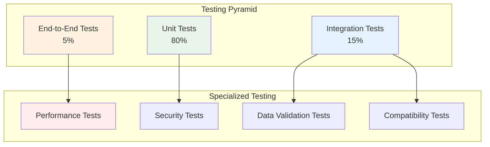

# Testing Strategy and Validation Approach

This document outlines the comprehensive testing strategy for validating the migrated Spring Boot application against the legacy COBOL system.

## Testing Overview

### Testing Objectives

1. **Functional Parity**: Ensure 100% functional equivalence with legacy system
2. **Data Integrity**: Validate accurate data migration and processing
3. **Performance Compliance**: Meet or exceed legacy system performance
4. **Integration Validation**: Verify all system integrations work correctly
5. **Business Rule Compliance**: Ensure all business rules are preserved
6. **Error Handling**: Validate proper error handling and recovery

### Testing Pyramid Strategy



## Unit Testing Strategy

### Service Layer Testing

#### Account Service Tests
```java
@ExtendWith(MockitoExtension.class)
class AccountServiceTest {
    
    @Mock
    private AccountRepository accountRepository;
    
    @Mock
    private CustomerRepository customerRepository;
    
    @Mock
    private NotificationService notificationService;
    
    @InjectMocks
    private AccountService accountService;
    
    @Test
    @DisplayName("Should create account successfully - equivalent to CBL0001 functionality")
    void shouldCreateAccountSuccessfully() {
        // Given
        CreateAccountRequest request = CreateAccountRequest.builder()
            .firstName("John")
            .lastName("Doe")
            .accountType(AccountType.CHECKING)
            .accountLimit(new BigDecimal("1000.00"))
            .build();
        
        Account savedAccount = createMockAccount();
        when(accountRepository.save(any(Account.class))).thenReturn(savedAccount);
        
        // When
        AccountDto result = accountService.createAccount(request);
        
        // Then
        assertThat(result).isNotNull();
        assertThat(result.getAccountNumber()).isNotEmpty();
        assertThat(result.getAccountBalance()).isEqualTo(BigDecimal.ZERO);
        
        verify(accountRepository).save(any(Account.class));
        verify(notificationService).sendAccountCreatedNotification(any(Account.class));
    }
    
    @Test
    @DisplayName("Should validate account limits - equivalent to COBOL limit validation")
    void shouldValidateAccountLimits() {
        // Given
        String accountNumber = "AC123456";
        BigDecimal updateAmount = new BigDecimal("500.00");
        
        Account account = Account.builder()
            .accountNumber(accountNumber)
            .accountBalance(new BigDecimal("800.00"))
            .accountLimit(new BigDecimal("1000.00"))
            .build();
        
        when(accountRepository.findByAccountNumberForUpdate(accountNumber))
            .thenReturn(Optional.of(account));
        when(accountRepository.save(any(Account.class))).thenReturn(account);
        
        // When
        AccountDto result = accountService.updateAccountBalance(accountNumber, updateAmount, "CREDIT");
        
        // Then
        assertThat(result.getAccountBalance()).isEqualTo(new BigDecimal("1300.00"));
        verify(notificationService).sendOverlimitNotification(any(Account.class));
    }
    
    @Test
    @DisplayName("Should handle account not found - equivalent to COBOL error handling")
    void shouldHandleAccountNotFound() {
        // Given
        String accountNumber = "INVALID";
        when(accountRepository.findByAccountNumber(accountNumber))
            .thenReturn(Optional.empty());
        
        // When / Then
        assertThatThrownBy(() -> accountService.getAccountByNumber(accountNumber))
            .isInstanceOf(AccountNotFoundException.class)
            .hasMessage("Account not found: INVALID");
    }
}
```

### Financial Calculation Tests
```java
@ExtendWith(MockitoExtension.class)
class FinancialCalculationServiceTest {
    
    @InjectMocks
    private FinancialCalculationService calculationService;
    
    @Test
    @DisplayName("Should calculate totals correctly - equivalent to CBL0009 COMPUTE logic")
    void shouldCalculateFinancialTotalsCorrectly() {
        // Given - Test data matching COBOL test scenarios
        List<Account> accounts = Arrays.asList(
            createAccount("AC000001", "1000.00", "750.50"),
            createAccount("AC000002", "2000.00", "1200.75"),
            createAccount("AC000003", "1500.00", "0.00")
        );
        
        // When
        FinancialTotals result = calculationService.calculateAccountTotals(accounts);
        
        // Then - Verify calculations match COBOL logic
        assertThat(result.getTotalLimits()).isEqualTo(new BigDecimal("4500.00"));
        assertThat(result.getTotalBalances()).isEqualTo(new BigDecimal("1951.25"));
        assertThat(result.getAccountCount()).isEqualTo(3);
        assertThat(result.getAverageBalance()).isEqualTo(new BigDecimal("650.42")); // Rounded
    }
    
    @Test
    @DisplayName("Should handle state filtering - equivalent to CBL0006 logic")
    void shouldFilterCustomersByStateCorrectly() {
        // Given
        List<Customer> customers = Arrays.asList(
            createCustomerWithState("VA"),
            createCustomerWithState("Virginia"),
            createCustomerWithState("CA"),
            createCustomerWithState("VA")
        );
        
        // When
        Map<String, CustomerCount> result = calculationService.getCustomerCountsByState(customers);
        
        // Then - Virginia and VA should be normalized to VIRGINIA
        assertThat(result.get("VIRGINIA").getCount()).isEqualTo(3L);
        assertThat(result.get("CA").getCount()).isEqualTo(1L);
    }
    
    private Account createAccount(String accountNumber, String limit, String balance) {
        return Account.builder()
            .accountNumber(accountNumber)
            .accountLimit(new BigDecimal(limit))
            .accountBalance(new BigDecimal(balance))
            .build();
    }
}
```

## Integration Testing

### Database Integration Tests
```java
@DataJpaTest
@TestPropertySource(properties = {
    "spring.jpa.hibernate.ddl-auto=create-drop",
    "spring.datasource.url=jdbc:h2:mem:testdb"
})
class AccountRepositoryIntegrationTest {
    
    @Autowired
    private TestEntityManager entityManager;
    
    @Autowired
    private AccountRepository accountRepository;
    
    @Test
    @DisplayName("Should find accounts by status - equivalent to COBOL file selection")
    void shouldFindAccountsByStatus() {
        // Given
        Account activeAccount = createTestAccount("AC000001", AccountStatus.ACTIVE);
        Account inactiveAccount = createTestAccount("AC000002", AccountStatus.INACTIVE);
        
        entityManager.persistAndFlush(activeAccount);
        entityManager.persistAndFlush(inactiveAccount);
        
        // When
        List<Account> activeAccounts = accountRepository
            .findAccountsCreatedBetween(AccountStatus.ACTIVE, 
                LocalDateTime.now().minusDays(1), LocalDateTime.now().plusDays(1));
        
        // Then
        assertThat(activeAccounts).hasSize(1);
        assertThat(activeAccounts.get(0).getAccountNumber()).isEqualTo("AC000001");
    }
    
    @Test
    @DisplayName("Should handle pessimistic locking - equivalent to COBOL file locking")
    void shouldHandlePessimisticLocking() {
        // Given
        Account account = createTestAccount("AC000001", AccountStatus.ACTIVE);
        entityManager.persistAndFlush(account);
        
        // When
        Optional<Account> lockedAccount = accountRepository
            .findByAccountNumberForUpdate("AC000001");
        
        // Then
        assertThat(lockedAccount).isPresent();
        assertThat(lockedAccount.get().getAccountNumber()).isEqualTo("AC000001");
    }
}
```

### REST API Integration Tests
```java
@SpringBootTest(webEnvironment = SpringBootTest.WebEnvironment.RANDOM_PORT)
@AutoConfigureTestDatabase(replace = AutoConfigureTestDatabase.Replace.NONE)
@Testcontainers
class AccountControllerIntegrationTest {
    
    @Container
    static PostgreSQLContainer<?> postgres = new PostgreSQLContainer<>("postgres:15")
            .withDatabaseName("testdb")
            .withUsername("test")
            .withPassword("test");
    
    @Autowired
    private TestRestTemplate restTemplate;
    
    @Autowired
    private AccountRepository accountRepository;
    
    @DynamicPropertySource
    static void configureProperties(DynamicPropertyRegistry registry) {
        registry.add("spring.datasource.url", postgres::getJdbcUrl);
        registry.add("spring.datasource.username", postgres::getUsername);
        registry.add("spring.datasource.password", postgres::getPassword);
    }
    
    @Test
    @DisplayName("Should create account via API - end-to-end test")
    void shouldCreateAccountViaApi() {
        // Given
        CreateAccountRequest request = CreateAccountRequest.builder()
            .firstName("Jane")
            .lastName("Smith")
            .accountType(AccountType.SAVINGS)
            .accountLimit(new BigDecimal("5000.00"))
            .address(Address.builder()
                .streetAddress("123 Main St")
                .city("Richmond")
                .state("VA")
                .build())
            .build();
        
        // When
        ResponseEntity<AccountDto> response = restTemplate.postForEntity(
            "/api/v1/accounts", request, AccountDto.class);
        
        // Then
        assertThat(response.getStatusCode()).isEqualTo(HttpStatus.CREATED);
        assertThat(response.getBody()).isNotNull();
        assertThat(response.getBody().getAccountNumber()).isNotEmpty();
        
        // Verify in database
        Optional<Account> savedAccount = accountRepository
            .findByAccountNumber(response.getBody().getAccountNumber());
        assertThat(savedAccount).isPresent();
    }
    
    @Test
    @DisplayName("Should handle validation errors - equivalent to COBOL validation")
    void shouldHandleValidationErrors() {
        // Given - Invalid request
        CreateAccountRequest request = CreateAccountRequest.builder()
            .firstName("") // Invalid - empty name
            .lastName("Smith")
            .accountLimit(new BigDecimal("-100.00")) // Invalid - negative limit
            .build();
        
        // When
        ResponseEntity<ErrorResponse> response = restTemplate.postForEntity(
            "/api/v1/accounts", request, ErrorResponse.class);
        
        // Then
        assertThat(response.getStatusCode()).isEqualTo(HttpStatus.BAD_REQUEST);
        assertThat(response.getBody().getErrors()).hasSize(2);
    }
}
```

## Data Validation Testing

### Migration Data Validation
```java
@SpringBootTest
@TestPropertySource(properties = "spring.jpa.hibernate.ddl-auto=create-drop")
class DataMigrationValidationTest {
    
    @Autowired
    private DataReconciliationService reconciliationService;
    
    @Autowired
    private AccountRepository accountRepository;
    
    @MockBean
    private LegacyDataService legacyDataService;
    
    @Test
    @DisplayName("Should validate migrated data integrity")
    void shouldValidateMigratedDataIntegrity() {
        // Given - Mock legacy data
        List<LegacyAccountData> legacyData = Arrays.asList(
            createLegacyAccount("AC000001", "1000.00", "750.50"),
            createLegacyAccount("AC000002", "2000.00", "1200.75")
        );
        
        when(legacyDataService.getAllAccountNumbers())
            .thenReturn(Arrays.asList("AC000001", "AC000002"));
        when(legacyDataService.getAccountData("AC000001"))
            .thenReturn(legacyData.get(0));
        when(legacyDataService.getAccountData("AC000002"))
            .thenReturn(legacyData.get(1));
        when(legacyDataService.getTotalBalance())
            .thenReturn(new BigDecimal("1951.25"));
        
        // Create corresponding new data
        createNewAccount("AC000001", "1000.00", "750.50");
        createNewAccount("AC000002", "2000.00", "1200.75");
        
        // When
        ReconciliationReport report = reconciliationService.performFullReconciliation();
        
        // Then
        assertThat(report.getCountDifference()).isEqualTo(0);
        assertThat(report.getBalanceDifference()).isEqualTo(BigDecimal.ZERO);
        assertThat(report.getDataMismatches()).isEmpty();
        assertThat(report.getMissingAccounts()).isEmpty();
    }
    
    @Test
    @DisplayName("Should detect data mismatches")
    void shouldDetectDataMismatches() {
        // Given - Mismatched data
        when(legacyDataService.getAllAccountNumbers())
            .thenReturn(Arrays.asList("AC000001"));
        when(legacyDataService.getAccountData("AC000001"))
            .thenReturn(createLegacyAccount("AC000001", "1000.00", "750.50"));
        
        // Create new account with different balance
        createNewAccount("AC000001", "1000.00", "800.00"); // Different balance
        
        // When
        ReconciliationReport report = reconciliationService.performFullReconciliation();
        
        // Then
        assertThat(report.getDataMismatches()).hasSize(1);
        assertThat(report.getDataMismatches().get(0).getFieldName()).isEqualTo("balance");
    }
}
```

## Performance Testing

### Load Testing with JMeter-like Framework
```java
@SpringBootTest(webEnvironment = SpringBootTest.WebEnvironment.RANDOM_PORT)
class PerformanceTest {
    
    @Autowired
    private TestRestTemplate restTemplate;
    
    @Test
    @DisplayName("Should handle concurrent account retrieval - performance test")
    void shouldHandleConcurrentAccountRetrieval() throws InterruptedException {
        // Given - Create test accounts
        for (int i = 1; i <= 100; i++) {
            createTestAccount(String.format("AC%06d", i));
        }
        
        int numberOfThreads = 50;
        int requestsPerThread = 20;
        CountDownLatch latch = new CountDownLatch(numberOfThreads);
        List<CompletableFuture<Long>> futures = new ArrayList<>();
        
        // When - Concurrent execution
        for (int i = 0; i < numberOfThreads; i++) {
            CompletableFuture<Long> future = CompletableFuture.supplyAsync(() -> {
                try {
                    long startTime = System.currentTimeMillis();
                    
                    for (int j = 0; j < requestsPerThread; j++) {
                        String accountNumber = String.format("AC%06d", (j % 100) + 1);
                        ResponseEntity<AccountDto> response = restTemplate.getForEntity(
                            "/api/v1/accounts/" + accountNumber, AccountDto.class);
                        assertThat(response.getStatusCode()).isEqualTo(HttpStatus.OK);
                    }
                    
                    return System.currentTimeMillis() - startTime;
                } finally {
                    latch.countDown();
                }
            });
            futures.add(future);
        }
        
        // Wait for completion
        latch.await(30, TimeUnit.SECONDS);
        
        // Then - Analyze performance
        List<Long> responseTimes = futures.stream()
            .map(CompletableFuture::join)
            .collect(Collectors.toList());
        
        double averageResponseTime = responseTimes.stream()
            .mapToLong(Long::longValue)
            .average()
            .orElse(0.0);
        
        // Assert performance requirements (equivalent to COBOL performance)
        assertThat(averageResponseTime).isLessThan(5000); // 5 seconds for 20 requests
        
        long maxResponseTime = responseTimes.stream()
            .mapToLong(Long::longValue)
            .max()
            .orElse(0);
        
        assertThat(maxResponseTime).isLessThan(10000); // 10 seconds max
    }
}
```

## Business Logic Validation Tests

### COBOL Equivalence Tests
```java
@SpringBootTest
class CobolEquivalenceTest {
    
    @Autowired
    private FinancialCalculationService calculationService;
    
    @Test
    @DisplayName("Should match COBOL CBL0009 calculation results exactly")
    void shouldMatchCobolCalculationResults() {
        // Given - Test data from COBOL test cases
        List<Account> accounts = createCobolTestAccounts();
        
        // When
        FinancialSummaryReport report = calculationService
            .calculateFinancialSummary(FinancialReportRequest.builder().build());
        
        // Then - Results should match COBOL output exactly
        // These expected values come from running the original COBOL program
        assertThat(report.getTotalLimits()).isEqualTo(new BigDecimal("15000.00"));
        assertThat(report.getTotalBalances()).isEqualTo(new BigDecimal("8750.25"));
        assertThat(report.getAverageBalance()).isEqualTo(new BigDecimal("1750.05"));
        assertThat(report.getCreditUtilization()).isEqualTo(new BigDecimal("58.3350"));
    }
    
    @Test
    @DisplayName("Should match COBOL payroll calculation - PAYROL00 equivalent")
    void shouldMatchCobolPayrollCalculation() {
        // Given - COBOL test values: HOURS=19, RATE=23
        PayrollRequest request = PayrollRequest.builder()
            .employeeName("Captain COBOL")
            .hoursWorked(new BigDecimal("19"))
            .hourlyRate(new BigDecimal("23"))
            .build();
        
        // When
        PayrollCalculationResult result = calculationService.calculateGrossPay(request);
        
        // Then - Should match COBOL COMPUTE GROSS-PAY = HOURS * RATE
        assertThat(result.getRegularPay()).isEqualTo(new BigDecimal("437.00"));
        assertThat(result.getTotalPay()).isEqualTo(new BigDecimal("437.00")); // No overtime
    }
}
```

## Test Data Management

### Test Data Builder
```java
@Component
public class TestDataBuilder {
    
    public static Account createTestAccount(String accountNumber) {
        return Account.builder()
            .accountNumber(accountNumber)
            .accountLimit(new BigDecimal("1000.00"))
            .accountBalance(new BigDecimal("500.00"))
            .status(AccountStatus.ACTIVE)
            .accountType(AccountType.CHECKING)
            .comments("Test account")
            .createdAt(LocalDateTime.now())
            .updatedAt(LocalDateTime.now())
            .version(1)
            .build();
    }
    
    public static Customer createTestCustomer(Account account) {
        Address address = Address.builder()
            .streetAddress("123 Test Street")
            .city("Test City")
            .state("VA")
            .postalCode("12345")
            .country("US")
            .build();
        
        return Customer.builder()
            .firstName("Test")
            .lastName("Customer")
            .address(address)
            .status(CustomerStatus.ACTIVE)
            .account(account)
            .createdAt(LocalDateTime.now())
            .updatedAt(LocalDateTime.now())
            .version(1)
            .build();
    }
    
    public static CreateAccountRequest createValidAccountRequest() {
        return CreateAccountRequest.builder()
            .firstName("John")
            .lastName("Doe")
            .accountType(AccountType.CHECKING)
            .accountLimit(new BigDecimal("2000.00"))
            .address(Address.builder()
                .streetAddress("456 Oak Ave")
                .city("Richmond")
                .state("VA")
                .postalCode("23456")
                .build())
            .build();
    }
}
```

## Test Automation and CI/CD Integration

### Test Configuration
```yaml
# application-test.yml
spring:
  datasource:
    url: jdbc:h2:mem:testdb;DB_CLOSE_DELAY=-1;DB_CLOSE_ON_EXIT=FALSE
    username: sa
    password: 
    driver-class-name: org.h2.Driver
  
  jpa:
    hibernate:
      ddl-auto: create-drop
    show-sql: true
    properties:
      hibernate:
        format_sql: true
  
  test:
    database:
      replace: none

logging:
  level:
    com.company.accounts: DEBUG
    org.springframework.test: DEBUG
```

### Maven Test Configuration
```xml
<plugin>
    <groupId>org.apache.maven.plugins</groupId>
    <artifactId>maven-surefire-plugin</artifactId>
    <version>3.0.0</version>
    <configuration>
        <includes>
            <include>**/*Test.java</include>
            <include>**/*Tests.java</include>
        </includes>
        <excludes>
            <exclude>**/*IntegrationTest.java</exclude>
        </excludes>
        <systemPropertyVariables>
            <spring.profiles.active>test</spring.profiles.active>
        </systemPropertyVariables>
    </configuration>
</plugin>

<plugin>
    <groupId>org.apache.maven.plugins</groupId>
    <artifactId>maven-failsafe-plugin</artifactId>
    <version>3.0.0</version>
    <configuration>
        <includes>
            <include>**/*IntegrationTest.java</include>
        </includes>
        <systemPropertyVariables>
            <spring.profiles.active>integration-test</spring.profiles.active>
        </systemPropertyVariables>
    </configuration>
</plugin>

<plugin>
    <groupId>org.jacoco</groupId>
    <artifactId>jacoco-maven-plugin</artifactId>
    <version>0.8.8</version>
    <executions>
        <execution>
            <goals>
                <goal>prepare-agent</goal>
            </goals>
        </execution>
        <execution>
            <id>report</id>
            <phase>test</phase>
            <goals>
                <goal>report</goal>
            </goals>
        </execution>
    </executions>
</plugin>
```

## Test Success Criteria

### Coverage Requirements
- **Unit Test Coverage**: ≥ 85%
- **Integration Test Coverage**: ≥ 70%
- **Business Logic Coverage**: 100%
- **API Endpoint Coverage**: 100%

### Performance Benchmarks
- **API Response Time**: ≤ 200ms for 95% of requests
- **Database Query Time**: ≤ 50ms for simple queries
- **Batch Processing**: Match or exceed COBOL performance
- **Concurrent Users**: Support 100+ concurrent users

### Data Validation Criteria
- **Data Integrity**: 100% accuracy in migration
- **Calculation Accuracy**: Exact match with COBOL results
- **Business Rule Compliance**: All COBOL business rules preserved
- **Error Handling**: Comprehensive error coverage

---

*This testing strategy ensures comprehensive validation of the migrated system while maintaining confidence in the accuracy and reliability of the new Spring Boot application.*