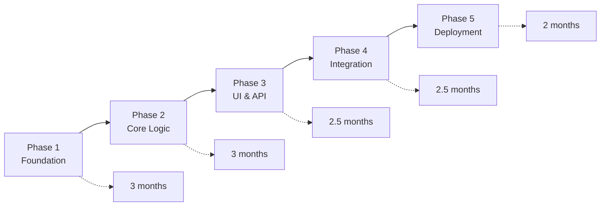

# COBOL to Java Spring Boot Migration Documentation

## Overview

This directory contains comprehensive migration documentation for transforming the existing COBOL application into a modern Java Spring Boot application with PostgreSQL database integration.

## Documentation Structure

### 📋 [01-file-inventory.md](./01-file-inventory.md)
**Complete inventory of all COBOL and JCL files**
- Categorized listing of 66 COBOL/JCL files
- Purpose and description for each file
- Data structure analysis
- Migration priority classification
- File dependencies mapping

### 🏗️ [02-legacy-architecture.md](./02-legacy-architecture.md)
**Legacy system architecture analysis**
- Current system architecture diagrams
- Data flow analysis with ERD
- Technology stack breakdown
- Business logic patterns identification
- Performance characteristics
- Integration points and security model
- System limitations and migration opportunities

### 📈 [03-migration-plan.md](./03-migration-plan.md)
**Comprehensive migration strategy and plan**
- Technology mapping (COBOL → Java Spring Boot)
- 5-phase migration approach (12 months)
- Detailed deliverables and activities
- Risk analysis and mitigation strategies
- Success metrics and KPIs
- Resource requirements and budget considerations

### 📅 [04-timeline-diagrams.md](./04-timeline-diagrams.md)
**Detailed project timeline and planning diagrams**
- Master project timeline with Gantt charts
- Phase-by-phase detailed breakdowns
- Resource allocation timeline
- Critical path analysis
- Risk management timeline
- Testing and deployment strategies

## Migration Summary

### Current State
- **66 COBOL/JCL files** across multiple functional areas
- **Mainframe z/OS environment** with Oracle/DB2 databases
- **Batch processing model** with sequential file handling
- **Financial and employee management** core business logic

### Target State
- **Java Spring Boot 3.x** microservices architecture
- **PostgreSQL 15+** database with JPA/Hibernate
- **RESTful APIs** with modern web interface
- **Cloud-ready deployment** with Docker/Kubernetes
- **Comprehensive testing** and CI/CD pipeline

### Migration Approach

## Key Components to Migrate

### 🏦 Financial System
- **Account Management** (CBL0001-CBL0012)
- **Financial Calculations** and reporting
- **Balance processing** and validation
- **State-based reporting** (Virginia clients)

### 👥 Employee Management
- **Employee CRUD operations** (CBDEM1)
- **Department management**
- **Oracle database integration**
- **Employee number generation**

### 🔍 Utility Systems
- **Search algorithms** (Binary/Sequential)
- **Payroll processing** (PAYROL00/0X)
- **Amount addition utilities** (ADDAMT)

### 🗄️ Database Integration
- **Oracle connectivity** patterns
- **DB2 advanced operations** (CBLDB21-23)
- **File-to-database** transformation
- **Batch job scheduling**

## Technology Transformation

| Component | From | To |
|-----------|------|-----|
| **Language** | COBOL | Java 17+ |
| **Framework** | None | Spring Boot 3.x |
| **Database** | Oracle/DB2 | PostgreSQL 15+ |
| **Data Access** | Embedded SQL | Spring Data JPA |
| **File Processing** | Sequential Files | Database Tables |
| **Job Control** | JCL | Spring Batch |
| **Interface** | Batch Reports | React/Angular SPA |
| **API** | None | RESTful APIs |
| **Deployment** | z/OS Mainframe | Docker/Kubernetes |

## Migration Benefits

### 🚀 Technical Benefits
- **Modern Technology Stack**: Latest Java and Spring Boot features
- **Cloud Scalability**: Horizontal scaling and cloud deployment
- **API-First Design**: RESTful APIs for integration
- **Automated Testing**: Comprehensive test coverage
- **CI/CD Pipeline**: Automated deployment and delivery

### 💼 Business Benefits
- **Reduced Maintenance Costs**: 40% reduction in annual costs
- **Faster Development**: 50% improvement in feature delivery
- **Improved User Experience**: Modern web interface
- **Better Integration**: Standard APIs for external systems
- **Enhanced Security**: Modern security practices

### 👥 Operational Benefits
- **Skill Availability**: Larger Java developer pool
- **Development Tools**: Modern IDEs and debugging tools
- **Monitoring**: Advanced APM and logging capabilities
- **Documentation**: Auto-generated API documentation
- **Testing**: Automated unit and integration testing

## Project Timeline

### 📅 **12-Month Migration Schedule**

| Phase | Duration | Key Deliverables |
|-------|----------|------------------|
| **Phase 1** | 3 months | Database schema, data migration, infrastructure |
| **Phase 2** | 3 months | Core business logic, data access layer |
| **Phase 3** | 2.5 months | REST APIs, web interface, security |
| **Phase 4** | 2.5 months | Batch processing, integrations |
| **Phase 5** | 2 months | Testing, optimization, deployment |

### 🎯 **Key Milestones**
- **Month 3**: Data migration complete
- **Month 6**: Core business logic functional
- **Month 8.5**: User interface ready
- **Month 10.5**: Integration complete
- **Month 12**: Production go-live

## Risk Management

### ⚠️ **High-Risk Areas**
1. **Data Migration Integrity**: Comprehensive validation and rollback procedures
2. **Business Logic Complexity**: Incremental migration with thorough testing
3. **Performance Requirements**: Optimization and caching strategies
4. **Integration Points**: API contracts and fallback mechanisms

### 🛡️ **Mitigation Strategies**
- **Parallel System Operation**: Run old and new systems simultaneously
- **Incremental Rollout**: Phase-by-phase deployment
- **Comprehensive Testing**: Unit, integration, and performance testing
- **Rollback Procedures**: Quick recovery mechanisms

## Success Metrics

### 📊 **Performance Targets**
- **Response Time**: < 200ms for API calls
- **Throughput**: 10x current transaction volume
- **Availability**: 99.9% uptime
- **Batch Processing**: 4-hour window completion

### 📈 **Business Targets**
- **Functional Parity**: 100% feature equivalence
- **User Satisfaction**: > 4.0/5.0 rating
- **Development Velocity**: 50% improvement
- **Cost Reduction**: 40% maintenance savings

## Getting Started

### 📋 **Prerequisites**
1. Review all documentation files in sequence
2. Understand current COBOL system architecture
3. Validate business requirements and success criteria
4. Assemble development team with Spring Boot expertise

### 🔧 **Next Steps**
1. **Environment Setup**: Development and testing infrastructure
2. **Team Formation**: Assign roles and responsibilities
3. **Stakeholder Alignment**: Confirm scope and timeline
4. **Risk Assessment**: Detailed analysis of project risks

## Documentation Maintenance

This documentation should be updated as the migration progresses:

- **Weekly**: Update progress and timeline adjustments
- **Monthly**: Revise risk assessments and mitigation strategies
- **Quarterly**: Update architecture decisions and technical choices
- **Milestone**: Document lessons learned and best practices

## Contact and Support

For questions about this migration documentation or project:

- **Project Manager**: [To be assigned]
- **Technical Lead**: [To be assigned]
- **Business Analyst**: [To be assigned]

---

*This documentation represents the initial migration analysis and planning. It will be updated throughout the project lifecycle to reflect current status and decisions.*