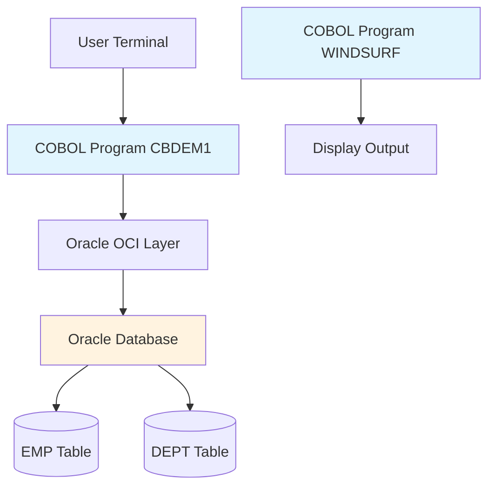
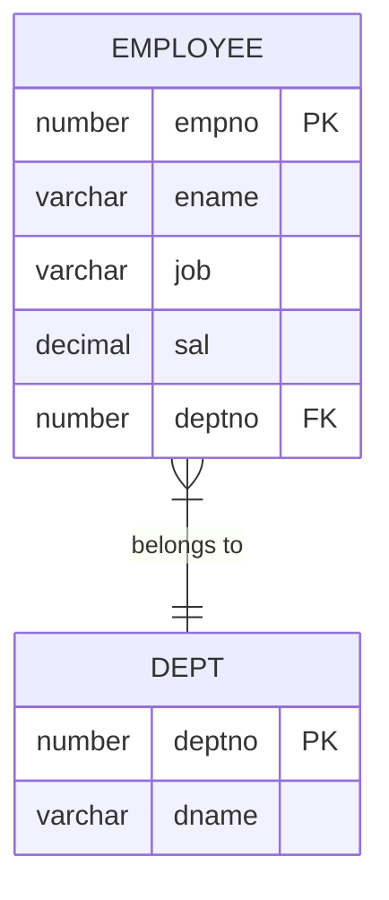
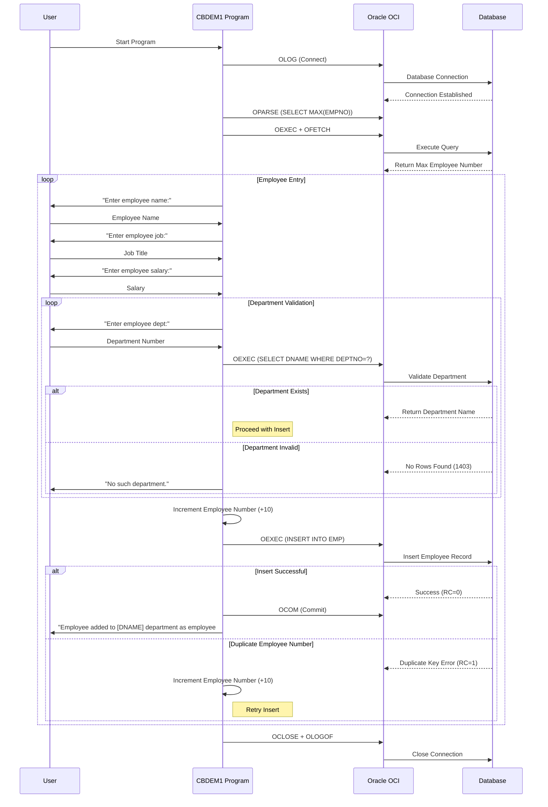

# Technical Analysis: COBOL Application Architecture

This document provides a detailed technical analysis of the current COBOL application architecture, focusing on the main business programs and their data structures.

## Current System Architecture

### Overview
The current system follows a traditional mainframe architecture with direct database connectivity:



### Key Characteristics
- **Single-user interactive programs**: Users interact directly with COBOL programs via terminal
- **Direct database connectivity**: Programs use Oracle Call Interface (OCI) for database operations
- **Cursor-based operations**: SQL operations use cursors with explicit parsing, binding, and fetching
- **Procedural programming**: Traditional COBOL structured programming approach
- **Manual error handling**: Explicit checking of return codes and error handling

## Program Analysis

### CBDEM1.COB - Employee Management System

#### Purpose
Primary business application for managing employee records. Provides interactive interface for adding new employees to the personnel database with data validation and integrity checks.

#### Key Functionality
1. **Employee Data Entry**: Interactive prompts for employee details (name, job, salary, department)
2. **Automatic Employee Number Generation**: Uses MAX(EMPNO) + 10 for new employee numbers
3. **Department Validation**: Verifies department exists before adding employee
4. **Duplicate Handling**: Automatically increments employee number if duplicates occur
5. **Database Transaction Management**: Uses explicit commit operations

#### Data Structures

##### Working Storage Section - Key Variables
```cobol
77   EMPNO              PIC S9(9) COMP.      // Employee Number (Integer, 4 bytes)
77   ENAME              PIC X(12).           // Employee Name (12 chars)
77   JOB                PIC X(12).           // Job Title (12 chars) 
77   SAL                PIC X(10).           // Salary (10 chars, stored as string)
77   DEPTNO             PIC X(10).           // Department Number (10 chars)
77   DNAME              PIC X(15).           // Department Name (15 chars)
```

##### Oracle Connection Variables
```cobol
01  LDA.                                     // Logon Data Area
    02   LDA-V2RC       PIC S9(4) COMP.      // V2 Return Code
    02   FILLER         PIC X(10).           // Reserved
    02   LDA-RC         PIC S9(4) COMP.      // Return Code
    02   FILLER         PIC X(50).           // Reserved

01  CURSOR-1.                               // Cursor 1 (INSERT operations)
    02   C-V2RC         PIC S9(4) COMP.      // V2 Return Code
    02   C-TYPE         PIC S9(4) COMP.      // Cursor Type
    02   C-ROWS         PIC S9(9) COMP.      // Number of Rows
    02   C-OFFS         PIC S9(4) COMP.      // Offset
    02   C-FNC          PIC S9(4) COMP.      // Function Code
    02   C-RC           PIC S9(4) COMP.      // Return Code
    02   FILLER         PIC X(50).           // Reserved
```

#### Database Operations

##### SQL Statements Used
```sql
-- Get maximum employee number for auto-generation
SELECT NVL(MAX(EMPNO),0) FROM EMP

-- Validate department exists and get department name
SELECT DNAME FROM DEPT WHERE DEPTNO=:1

-- Insert new employee record
INSERT INTO EMP (EMPNO,ENAME,JOB,SAL,DEPTNO) 
VALUES (:EMPNO,:ENAME,:JOB,:SAL,:DEPTNO)

-- Describe employee table columns (for metadata)
SELECT ENAME,JOB FROM EMP
```

##### Database Interaction Pattern
1. **Connection**: `OLOG` call with username/password
2. **Cursor Management**: `OOPEN` to create cursors
3. **SQL Parsing**: `OPARSE` to prepare SQL statements  
4. **Parameter Binding**: `OBNDRV`/`OBNDRN` for parameter substitution
5. **Execution**: `OEXEC` to execute statements
6. **Data Retrieval**: `OFETCH` for SELECT operations
7. **Transaction Control**: `OCOM` for commits, `OROL` for rollbacks
8. **Cleanup**: `OCLOSE` cursors, `OLOGOF` disconnect

#### Critical Code Excerpts

##### Employee Number Generation
```cobol
*----------------------------------------------------------
* RETRIEVE THE CURRENT MAXIMUM EMPLOYEE NUMBER.
*----------------------------------------------------------
CALL "OPARSE" USING CURSOR-1, SQL-SELMAX, SQL-SELMAX-L,
      ZERO-A, TWO.
CALL "ODEFIN" USING CURSOR-1, ONE, EMPNO, FOUR,
      INTEGER, ZERO-A, ZERO-B, FMT, ZERO-A, ZERO-A,
      ZERO-B, ZERO-B.
CALL "OEXEC" USING CURSOR-1.   
CALL "OFETCH" USING CURSOR-1.
```

##### Department Validation
```cobol
*----------------------------------------------------------
* CHECK FOR A VALID DEPARTMENT NUMBER BY EXECUTING
* THE SELECT STATEMENT.
*----------------------------------------------------------
CALL "OEXEC" USING CURSOR-2.
MOVE SPACES TO DNAME.
CALL "OFETCH" USING CURSOR-2.
IF C-RC IN CURSOR-2 = 0 THEN GO TO ADD-ROW.
IF C-RC IN CURSOR-2 = 1403
   DISPLAY "No such department."
   GO TO ASK-DPT.
```

### WINDSURF.COB - Session Tracking System

#### Purpose
Display-only program for windsurf session performance tracking. Shows session details, rider information, and performance metrics.

#### Key Features
- **Static Data Display**: Hardcoded session data with performance metrics
- **No Database Operations**: Pure display program without external data sources
- **Performance Metrics**: Speed measurements, distance tracking, time splits

#### Data Structures
```cobol
01  WINDSURF-SESSION.
    05  SESSION-INFO.
        10  RIDER-NAME          PIC X(30)    VALUE 'Damien Henry'.
        10  SESSION-DATE        PIC X(10)    VALUE '31/07/2023'.
        10  SESSION-LOCATION    PIC X(30)    VALUE 'Pont-Mahe'.
        10  SESSION-TYPE        PIC X(10)    VALUE 'Slalom'.
    
    05  PERFORMANCE-METRICS.
        10  MAX-2S             PIC 99V99    VALUE 31.93.  // Max speed 2-second
        10  VMAX               PIC 99V99    VALUE 31.98.  // Overall max speed
        10  AVG-10S            PIC 99V99    VALUE 30.44.  // Average 10-second
        
        10  DISTANCE-MARKS.
            15  MARK-100M      PIC 99V99    VALUE 30.54.
            15  MARK-250M      PIC 99V99    VALUE 30.87.
            15  MARK-500M      PIC 99V99    VALUE 30.02.
```

## Database Schema Analysis

Based on the COBOL programs, the current database schema includes:

### EMP (Employee) Table
```sql
CREATE TABLE EMP (
    EMPNO    NUMBER(9) PRIMARY KEY,        -- Employee Number
    ENAME    VARCHAR2(12) NOT NULL,        -- Employee Name  
    JOB      VARCHAR2(12),                 -- Job Title
    SAL      NUMBER(10,2),                 -- Salary (inferred from usage)
    DEPTNO   NUMBER(10) REFERENCES DEPT    -- Department Number
);
```

### DEPT (Department) Table
```sql
CREATE TABLE DEPT (
    DEPTNO   NUMBER(10) PRIMARY KEY,       -- Department Number
    DNAME    VARCHAR2(15) NOT NULL         -- Department Name
);
```

### Entity Relationship Diagram



## User Flow Analysis

### Add Employee Process - Sequence Diagram



## Key Migration Challenges

### Technical Challenges
1. **Cursor-based Operations**: COBOL uses explicit cursors vs JPA's implicit result handling
2. **Error Code Handling**: Oracle return codes vs Java exceptions
3. **Data Type Mapping**: COBOL PIC clauses vs Java/PostgreSQL types
4. **Transaction Management**: Manual commits vs Spring's declarative transactions
5. **User Interface**: Terminal-based vs Web/REST API

### Data Type Mapping

| COBOL Type | Example | Java Type | PostgreSQL Type |
|------------|---------|-----------|-----------------|
| `PIC S9(9) COMP` | Employee Number | `Integer` | `INTEGER` |
| `PIC X(12)` | Employee Name | `String` | `VARCHAR(12)` |
| `PIC 99V99` | Decimal values | `BigDecimal` | `DECIMAL(4,2)` |
| `PIC X(10)` | Department ID | `String` | `VARCHAR(10)` |

### Business Logic Considerations
1. **Employee Number Generation**: Current +10 increment logic needs preservation
2. **Department Validation**: Foreign key constraints vs explicit validation
3. **User Interaction Flow**: Interactive prompts vs REST API requests
4. **Error Messages**: Maintain equivalent user feedback

## Recommendations for Spring Boot Migration

### Architecture Patterns
1. **Repository Pattern**: Replace OCI calls with JPA repositories
2. **Service Layer**: Encapsulate business logic (employee number generation, validation)
3. **Controller Layer**: RESTful endpoints for employee management
4. **Entity Mapping**: JPA entities for EMP and DEPT tables
5. **Exception Handling**: Replace return code checking with exception handling

### Data Access Strategy
1. **Spring Data JPA**: Automatic query generation for basic operations
2. **Custom Queries**: For complex operations like MAX(EMPNO) + 10
3. **Transaction Management**: `@Transactional` annotations
4. **Connection Pooling**: HikariCP for efficient connection management

### Testing Strategy
1. **Unit Tests**: Service layer business logic validation
2. **Integration Tests**: Repository layer database operations
3. **Data Migration Tests**: Validate equivalent behavior between systems
4. **Contract Tests**: API compatibility during parallel running

---

*This technical analysis provides the foundation for designing a modern Spring Boot application that maintains functional equivalence with the existing COBOL system while leveraging contemporary Java development practices.*