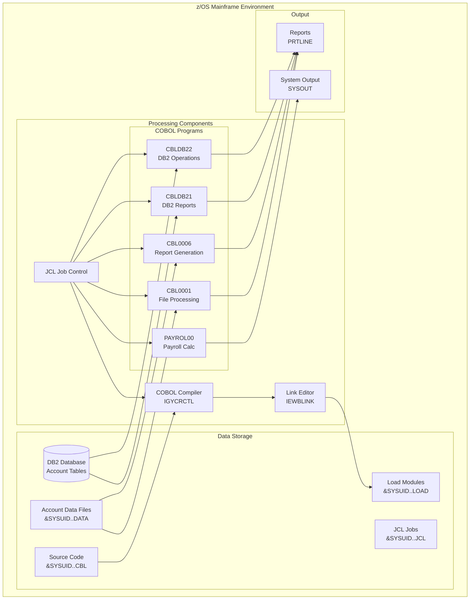
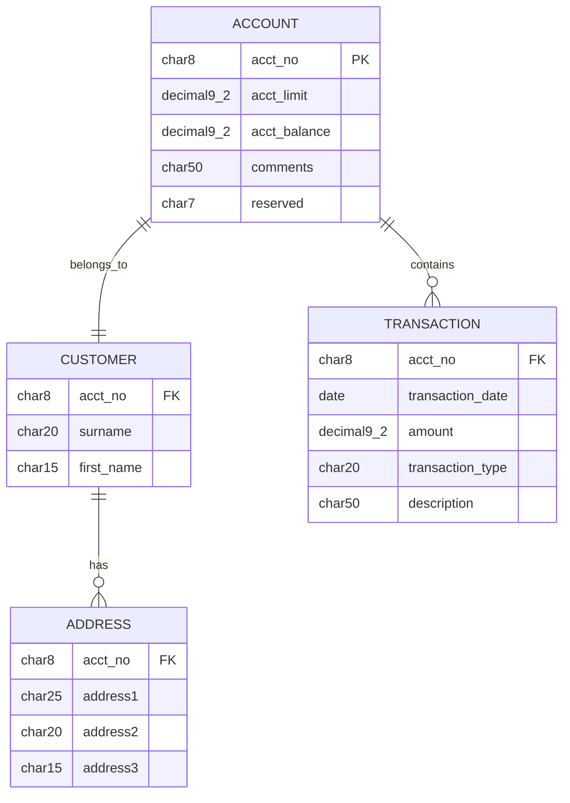
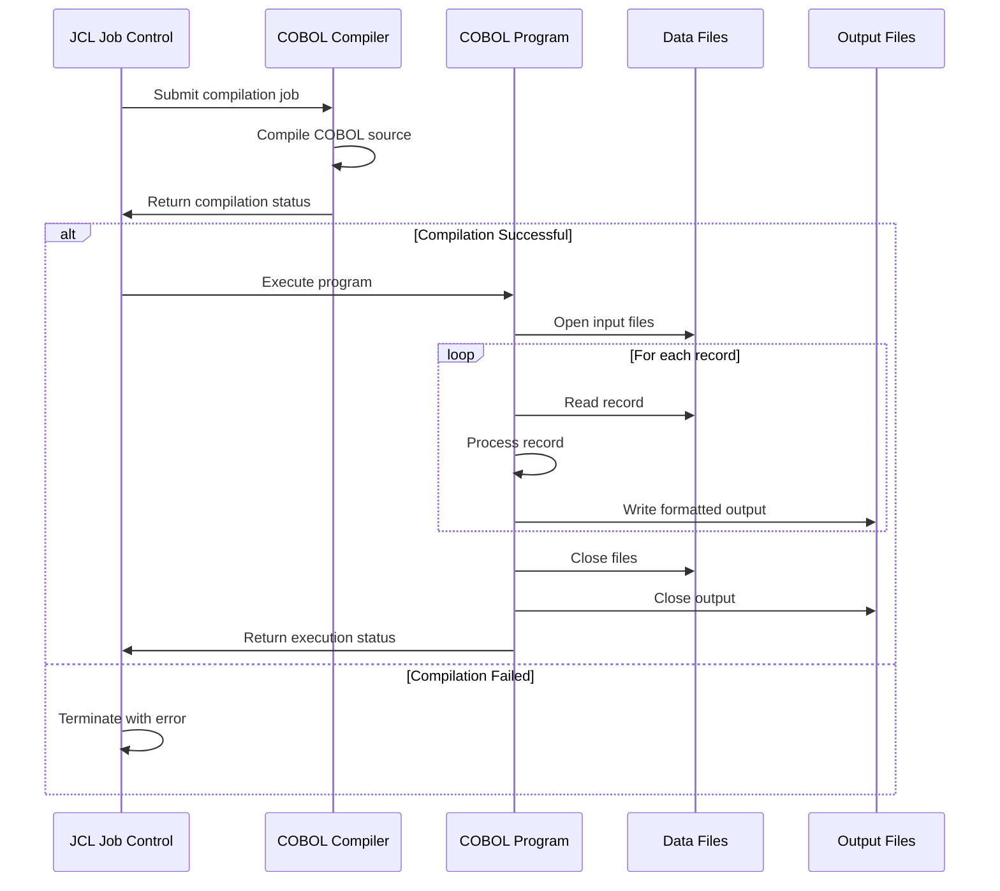
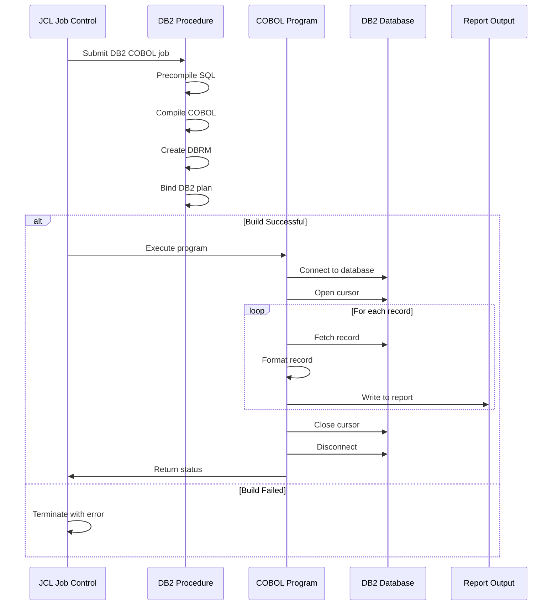
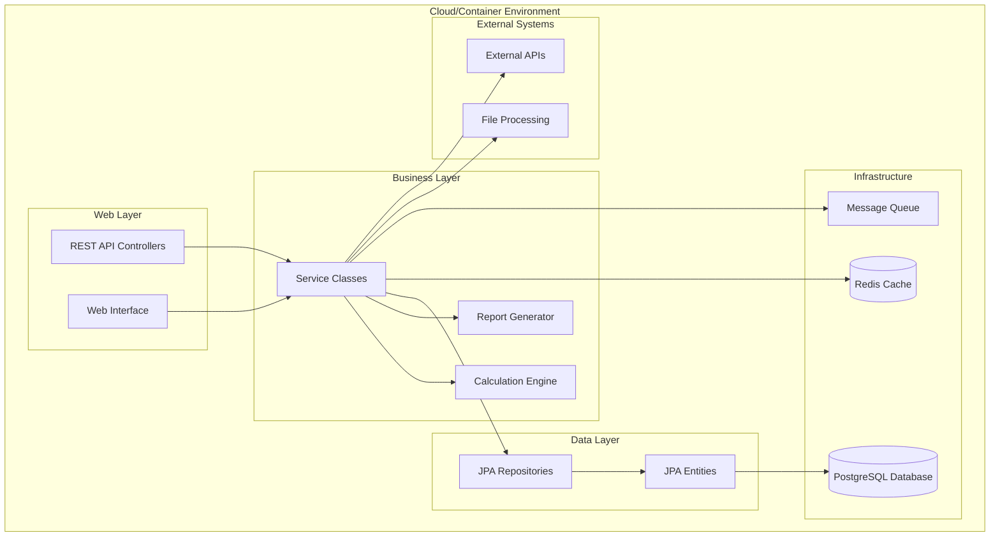
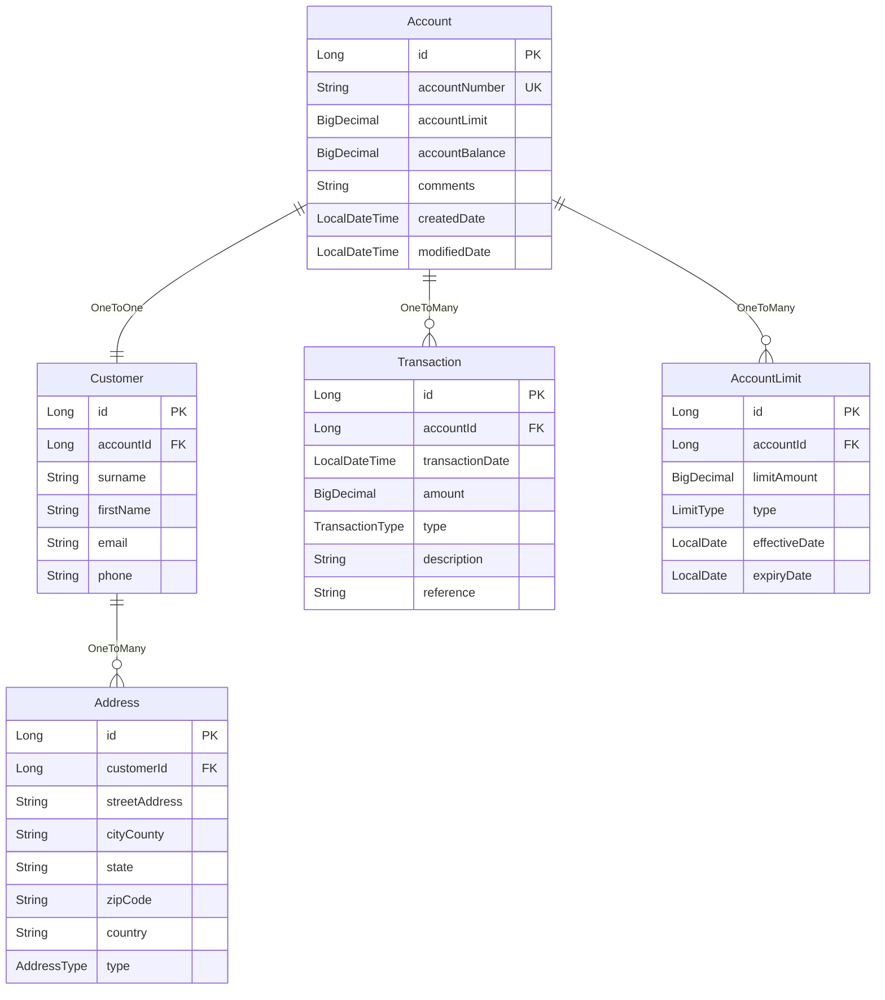
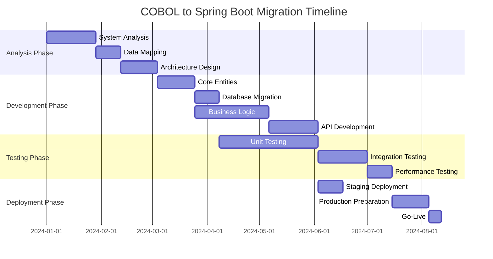
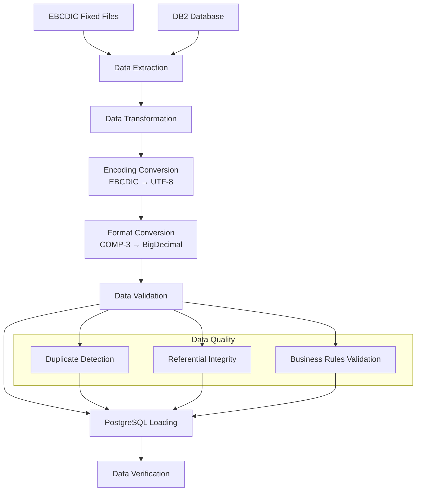
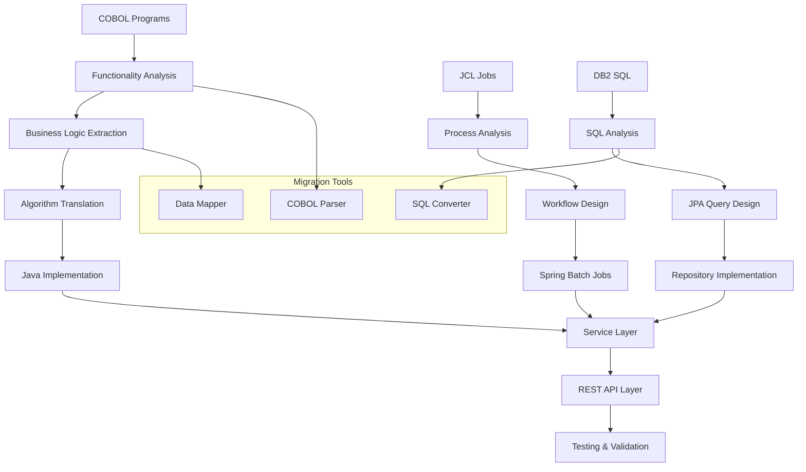
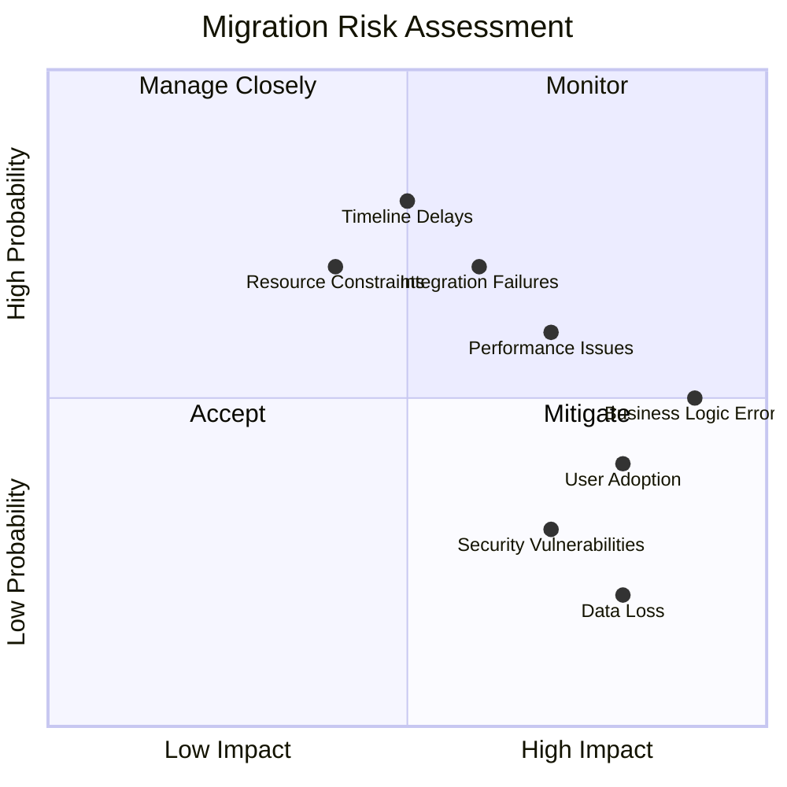

# System Architecture and Migration Diagrams

This document contains Mermaid diagrams illustrating the current COBOL system architecture, data flows, and migration planning.

## Current System Architecture

### Overall System Architecture

### Database Entity Relationship Diagram

## Current System Processing Flow

### File Processing Sequence

### Database Processing Sequence

## Target Spring Boot Architecture

### Target System Architecture

### Target Entity Relationship (JPA)

## Migration Phase Diagrams

### Migration Phases Overview

### Data Migration Strategy

### Application Migration Strategy

## Risk Assessment Diagram

### Migration Risk Matrix
