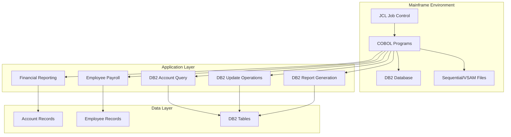
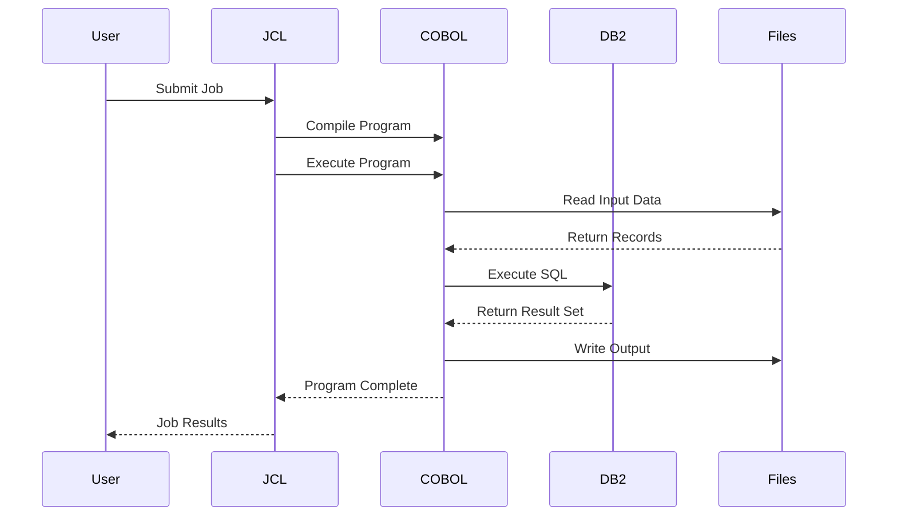
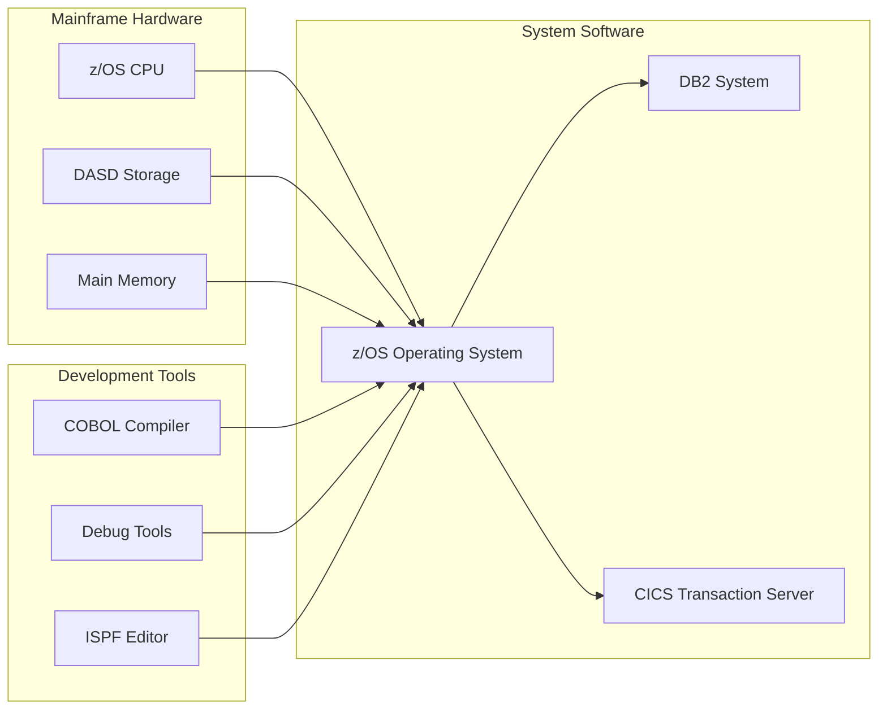

# Current Architecture Overview

## System Architecture

The current COBOL application system is built on traditional mainframe architecture with the following key components:

### High-Level Architecture

## Current System Components

### 1. COBOL Programs

| Program | Purpose | Data Access |
|---------|---------|-------------|
| CBL0011 | Financial reporting and account analysis | Sequential file processing |
| EMPPAY | Employee payroll calculations | Working storage records |
| CBLDB21 | Database query operations | DB2 SQL SELECT |
| CBLDB22 | Database update operations | DB2 SQL INSERT/UPDATE |
| CBLDB23 | Database report generation | DB2 SQL with cursors |

### 2. Job Control Language (JCL)

JCL manages the execution environment and coordinates:
- Program compilation with IGYWC/IGYWCL/IGYWCLG procedures
- Data set allocation and management
- Program execution sequence
- Error handling and conditional processing

### 3. Data Management

#### File Types:
- **Sequential Files**: EBCDIC-encoded binary data with packed decimal fields
- **VSAM Files**: Indexed sequential access for account records
- **DB2 Tables**: Relational data for advanced operations

#### Data Characteristics:
- **EBCDIC Encoding**: Legacy character encoding
- **COMP-3 (Packed Decimal)**: Space-efficient numeric storage
- **Fixed-length Records**: Predictable data structure layouts

## Process Flow

## Key Characteristics

### Strengths
- **Reliability**: Proven mainframe stability and transaction processing
- **Performance**: Optimized for high-volume batch processing
- **Data Integrity**: Strong ACID compliance with DB2
- **Mature Ecosystem**: Well-established development and operational procedures

### Challenges
- **Legacy Technology**: Limited developer talent pool
- **Maintenance Complexity**: Aging codebase with limited documentation
- **Scalability Constraints**: Vertical scaling limitations
- **Integration Difficulties**: Challenges interfacing with modern systems
- **Cost**: High mainframe licensing and operational expenses

## Technology Stack

| Component | Technology | Version | Usage |
|-----------|------------|---------|-------|
| Programming Language | Enterprise COBOL | v6.3 | Application logic |
| Database | DB2 for z/OS | v12 | Data persistence |
| Operating System | z/OS | 2.4 | Runtime environment |
| Job Control | JCL | - | Batch processing |
| Data Format | EBCDIC/COMP-3 | - | Data storage |

## Infrastructure Dependencies

This current architecture serves as the baseline for understanding the migration scope and complexity involved in modernizing to cloud-native Java applications.