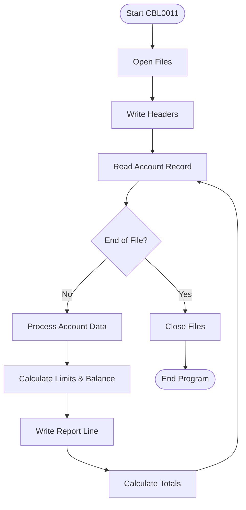
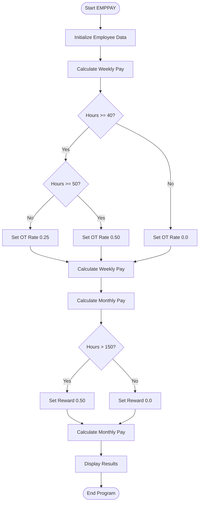
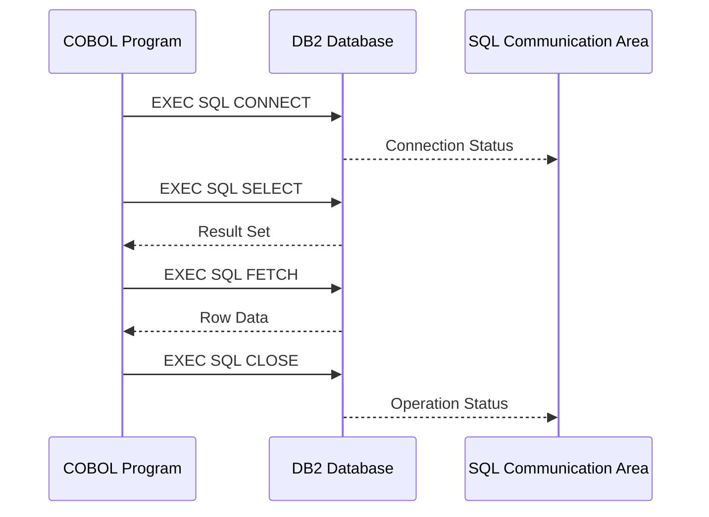
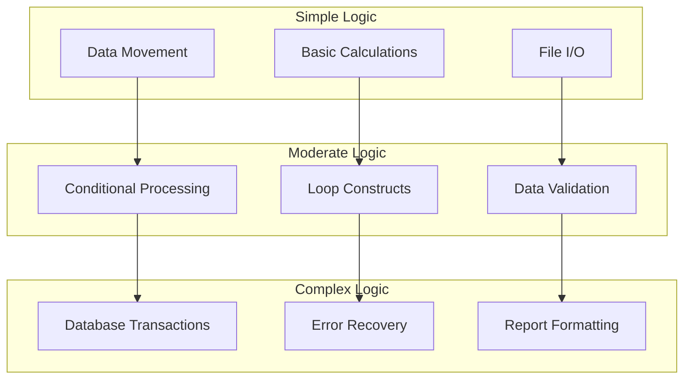

# COBOL Code Analysis

## Program Structure Overview

The COBOL applications follow the traditional four-division structure with specific patterns for data processing and business logic implementation.

## Program Inventory

### 1. CBL0011 - Financial Reporting System



#### Key Features:
- **File Processing**: Sequential account record processing
- **Report Generation**: Financial reports with formatted output
- **Data Validation**: Account limit and balance verification
- **Error Handling**: End-of-file detection and processing

#### Data Structures:
```cobol
01  ACCT-FIELDS.
    05  ACCT-NO            PIC X(8).
    05  ACCT-LIMIT         PIC S9(7)V99 COMP-3.
    05  ACCT-BALANCE       PIC S9(7)V99 COMP-3.
    05  LAST-NAME          PIC X(20).
    05  FIRST-NAME         PIC X(15).
    05  CLIENT-ADDR.
        10  STREET-ADDR    PIC X(25).
        10  CITY-COUNTY    PIC X(20).
        10  USA-STATE      PIC X(15).
```

### 2. EMPPAY - Employee Payroll System



#### Key Features:
- **Payroll Calculations**: Overtime and bonus computations
- **Business Rules**: Conditional logic for pay rates
- **Data Display**: Formatted output for payroll reports

### 3. Database-Integrated Programs (CBLDB21-23)

```mermaid
graph TB
    subgraph "CBLDB21 - Query Operations"
        Q1[Connect to DB2]
        Q2[Execute SELECT]
        Q3[Fetch Cursor Results]
        Q4[Format Output]
        Q5[Close Cursor]
    end
    
    subgraph "CBLDB22 - Update Operations"
        U1[Connect to DB2]
        U2[Begin Transaction]
        U3[Execute INSERT/UPDATE]
        U4[Commit/Rollback]
        U5[Error Handling]
    end
    
    subgraph "CBLDB23 - Report Generation"
        R1[Connect to DB2]
        R2[Execute Complex Query]
        R3[Process Result Set]
        R4[Generate Report]
        R5[Close Connection]
    end
    
    Q1 --> Q2 --> Q3 --> Q4 --> Q5
    U1 --> U2 --> U3 --> U4 --> U5
    R1 --> R2 --> R3 --> R4 --> R5
```



## Code Patterns and Characteristics

### Common COBOL Patterns

1. **File Processing Pattern**:
```cobol
OPEN-FILES.
    OPEN INPUT  INPUT-FILE.
    OPEN OUTPUT OUTPUT-FILE.

READ-LOOP.
    READ INPUT-FILE
        AT END MOVE 'Y' TO EOF-FLAG.
    IF EOF-FLAG NOT = 'Y'
        PERFORM PROCESS-RECORD
        GO TO READ-LOOP.

CLOSE-FILES.
    CLOSE INPUT-FILE.
    CLOSE OUTPUT-FILE.
```

2. **Data Validation Pattern**:
```cobol
VALIDATE-DATA.
    IF ACCT-BALANCE > ACCT-LIMIT
        PERFORM ERROR-HANDLING
    ELSE
        PERFORM PROCESS-ACCOUNT.
```

3. **Calculation Pattern**:
```cobol
COMPUTE EMP-PAY-WEEK =
    (EMP-HOURS * EMP-HOURLY-RATE) * (1 + EMP-OT-RATE).
```

### Data Type Usage

| COBOL Data Type | Usage | Java Equivalent |
|----------------|--------|-----------------|
| PIC X(n) | Character strings | String |
| PIC 9(n) | Unsigned numeric | Integer/Long |
| PIC S9(n) | Signed numeric | Integer/Long |
| PIC 9(n)V99 | Decimal numbers | BigDecimal |
| PIC S9(n)V99 COMP-3 | Packed decimal | BigDecimal |

### Database Integration Patterns



## Complexity Analysis

### Code Metrics

| Program | Lines of Code | Procedures | File I/O | DB Operations |
|---------|---------------|------------|----------|---------------|
| CBL0011 | ~150 | 8 | 2 files | None |
| EMPPAY | ~55 | 4 | None | None |
| CBLDB21 | ~200 | 12 | 1 file | SELECT queries |
| CBLDB22 | ~180 | 10 | 1 file | INSERT/UPDATE |
| CBLDB23 | ~220 | 15 | 1 file | Complex queries |

### Business Logic Complexity



## Migration Considerations

### Direct Translation Challenges

1. **PERFORM Statements**: COBOL's PERFORM doesn't map directly to Java methods
2. **GO TO Logic**: Structured programming conversion required
3. **File Processing**: Stream-based processing vs. object-oriented approaches
4. **Data Validation**: COBOL's intrinsic validation vs. Java validation frameworks

### Modernization Opportunities

1. **Object-Oriented Design**: Convert procedural code to OOP patterns
2. **Exception Handling**: Replace error flags with proper exception handling
3. **Data Access Layer**: Abstract database operations into repositories
4. **Business Logic Separation**: Extract business rules into service classes
5. **Configuration Management**: Externalize hardcoded values

## Code Quality Assessment

### Maintainability Issues
- Limited documentation and comments
- Monolithic program structure
- Hardcoded values and business rules
- Complex nested conditionals
- Legacy error handling patterns

### Positive Aspects
- Clear data structure definitions
- Consistent naming conventions
- Logical program flow
- Proper file handling
- Transaction management in DB2 operations

This analysis provides the foundation for understanding the complexity and scope of converting COBOL programs to modern Java applications with Spring Boot.