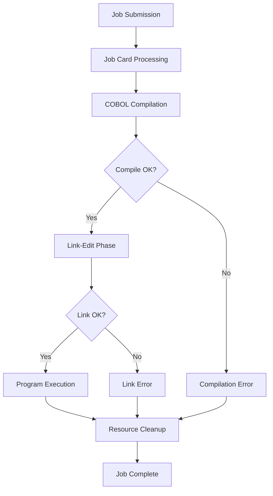
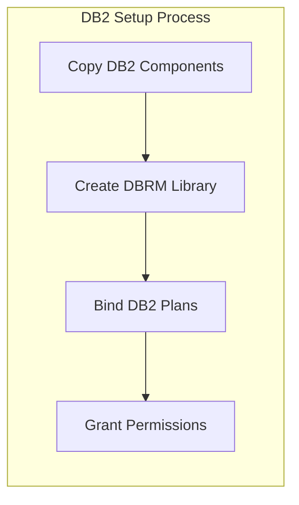
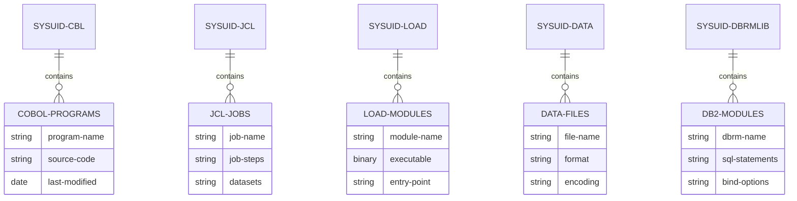
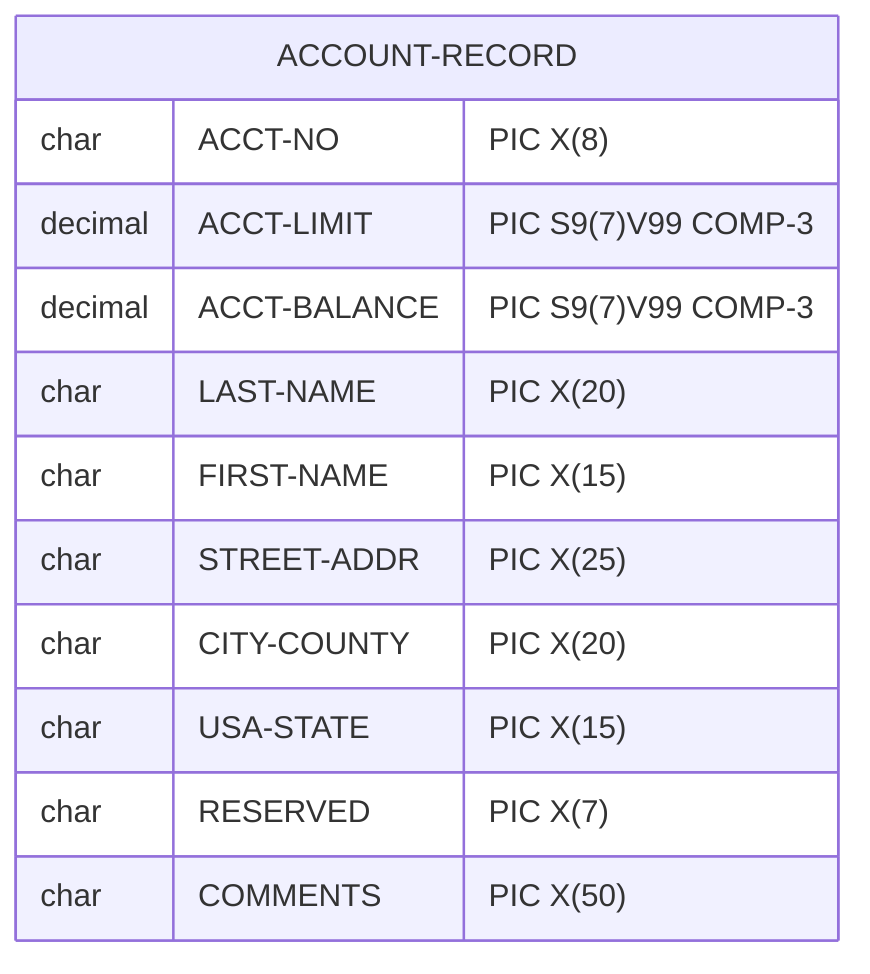
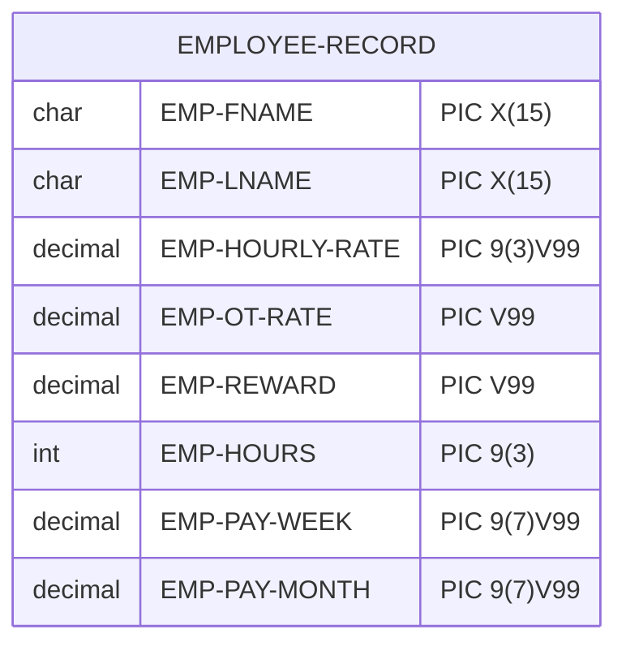
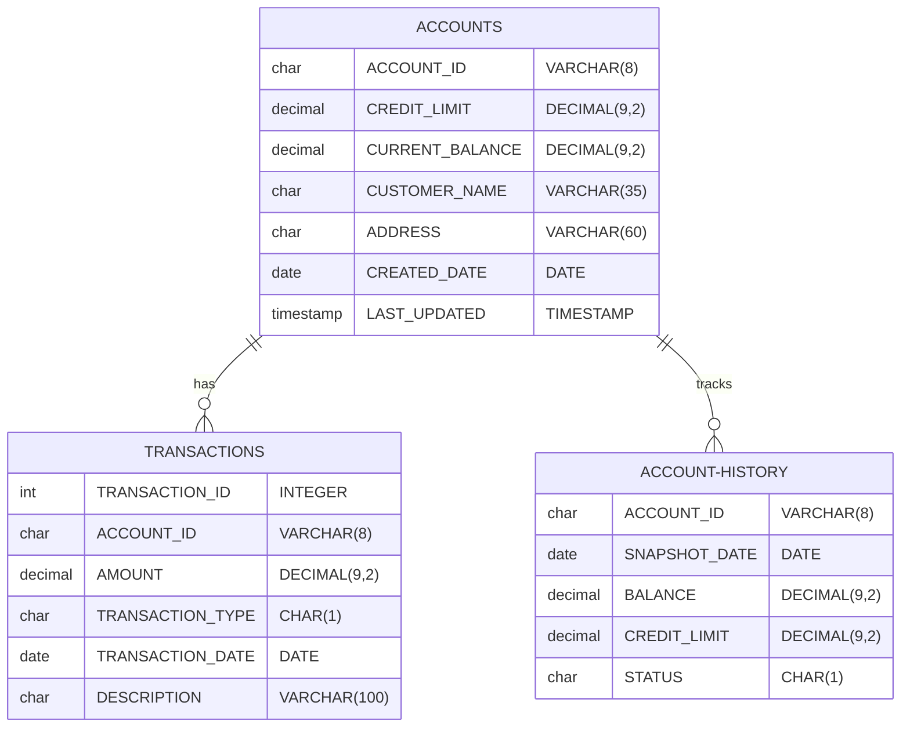
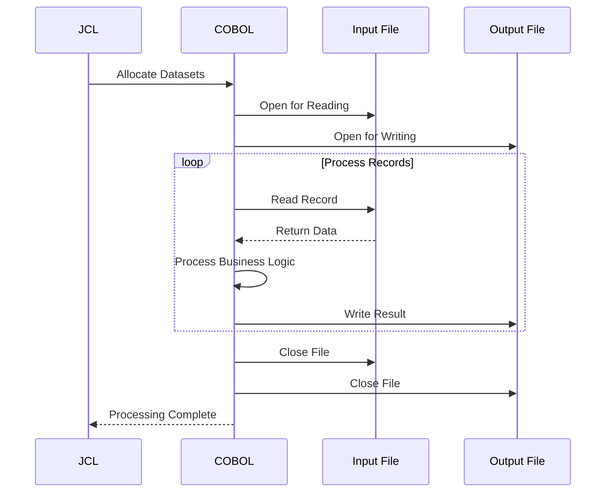
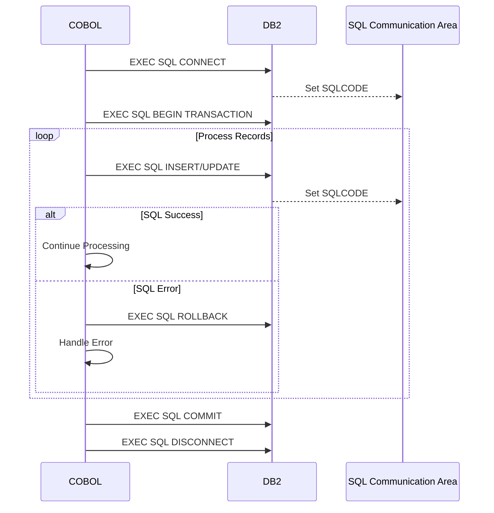
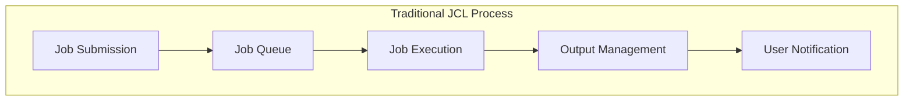
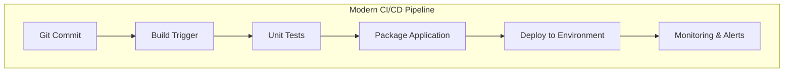

# JCL and Data Structures

## Job Control Language (JCL) Analysis

JCL orchestrates the execution environment for COBOL programs, managing compilation, linking, and execution phases.

### JCL Execution Flow



### JCL Components Analysis

#### 1. Job Definition (CBL0003J.jcl)
```jcl
//CBL0003J JOB 1,NOTIFY=&SYSUID
//COBRUN  EXEC IGYWCL
//COBOL.SYSIN  DD DSN=&SYSUID..CBL(CBL0001),DISP=SHR
//LKED.SYSLMOD DD DSN=&SYSUID..LOAD(CBL0001),DISP=SHR
//RUN     EXEC PGM=CBL0001
//STEPLIB   DD DSN=&SYSUID..LOAD,DISP=SHR
//ACCTREX   DD DSN=&SYSUID..DATA,DISP=SHR
//PRTLINE   DD SYSOUT=*,OUTLIM=15000
```

#### 2. DB2 Setup (DB2SETUP.jcl)


### Data Dataset Organization



## Data Structures and Formats

### 1. Account Records (CBL0011)



#### Data Characteristics:
- **Record Length**: Fixed at 177 bytes
- **Encoding**: EBCDIC for character fields
- **Numeric Format**: COMP-3 (Packed Decimal) for monetary amounts
- **Alignment**: No padding between fields

### 2. Employee Records (EMPPAY)



### 3. DB2 Table Structures



## Data Processing Patterns

### 1. Sequential File Processing



### 2. Database Transaction Processing



## Data Format Conversion Requirements

### EBCDIC to ASCII Conversion

| COBOL Format | Description | Java Equivalent |
|--------------|-------------|-----------------|
| PIC X(n) EBCDIC | Character data | String (UTF-8) |
| PIC 9(n) DISPLAY | Numeric display | Integer/Long |
| PIC S9(n)V99 COMP-3 | Packed decimal | BigDecimal |
| PIC X(n) DBCS | Double-byte chars | String (Unicode) |

### Sample Data Conversion

#### COBOL Record Layout:
```cobol
01  ACCOUNT-RECORD.
    05  ACCT-NO            PIC X(8).          * 8 bytes
    05  ACCT-LIMIT         PIC S9(7)V99 COMP-3. * 5 bytes  
    05  ACCT-BALANCE       PIC S9(7)V99 COMP-3. * 5 bytes
    05  CUSTOMER-NAME      PIC X(35).         * 35 bytes
    05  ADDRESS            PIC X(60).         * 60 bytes
    05  STATUS-CODE        PIC X(1).          * 1 byte
```

#### Java Equivalent:
```java
public class AccountRecord {
    private String accountNumber;        // VARCHAR(8)
    private BigDecimal creditLimit;      // DECIMAL(9,2)
    private BigDecimal currentBalance;   // DECIMAL(9,2)
    private String customerName;         // VARCHAR(35)
    private String address;              // VARCHAR(60)
    private char statusCode;             // CHAR(1)
}
```

## JCL to Modern DevOps Translation

### Current JCL Workflow



### Modern CI/CD Equivalent



## Migration Mapping

### JCL Step to Docker/Kubernetes Translation

| JCL Concept | Modern Equivalent | Implementation |
|-------------|------------------|----------------|
| Job Step | Docker Container | Microservice pod |
| Dataset Allocation | Volume Mount | Persistent volumes |
| SYSIN/SYSOUT | Standard I/O | Log aggregation |
| Conditional Execution | Workflow Logic | Pipeline conditions |
| Resource Management | Resource Limits | Kubernetes resources |
| Error Handling | Exception Handling | Circuit breakers |

### Data Access Pattern Migration

| COBOL Pattern | Spring Boot Equivalent |
|---------------|------------------------|
| File I/O | Repository Pattern |
| EXEC SQL | JPA/Hibernate |
| Working Storage | Service Layer State |
| COPY Members | Configuration Classes |
| CALL Programs | Service Interfaces |

This analysis provides the foundation for understanding how traditional mainframe job control and data management translates to modern cloud-native architectures.