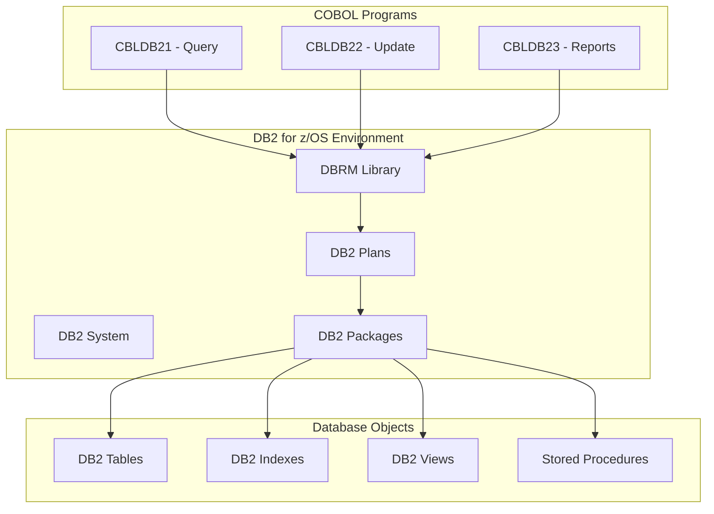
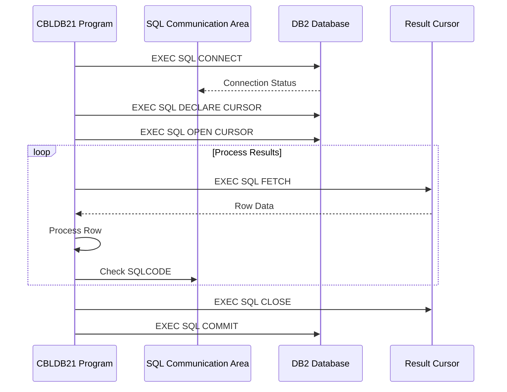
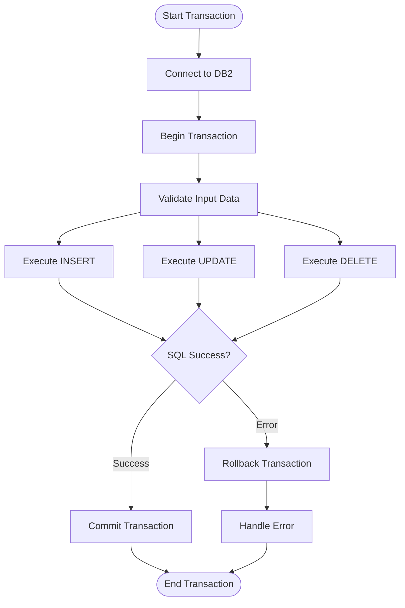
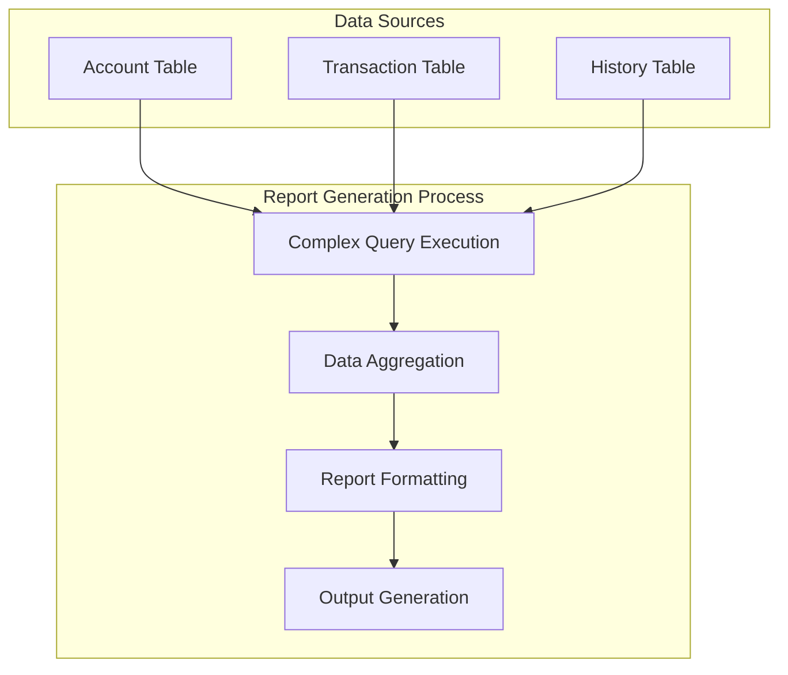
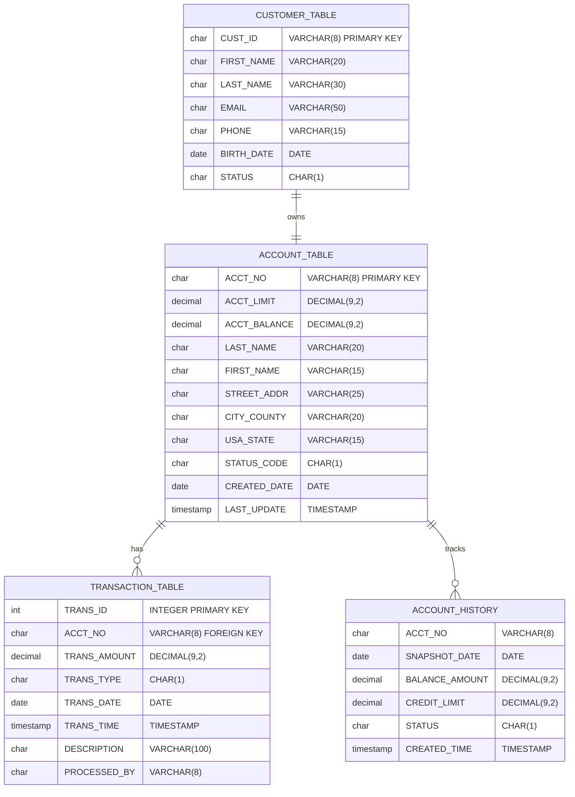
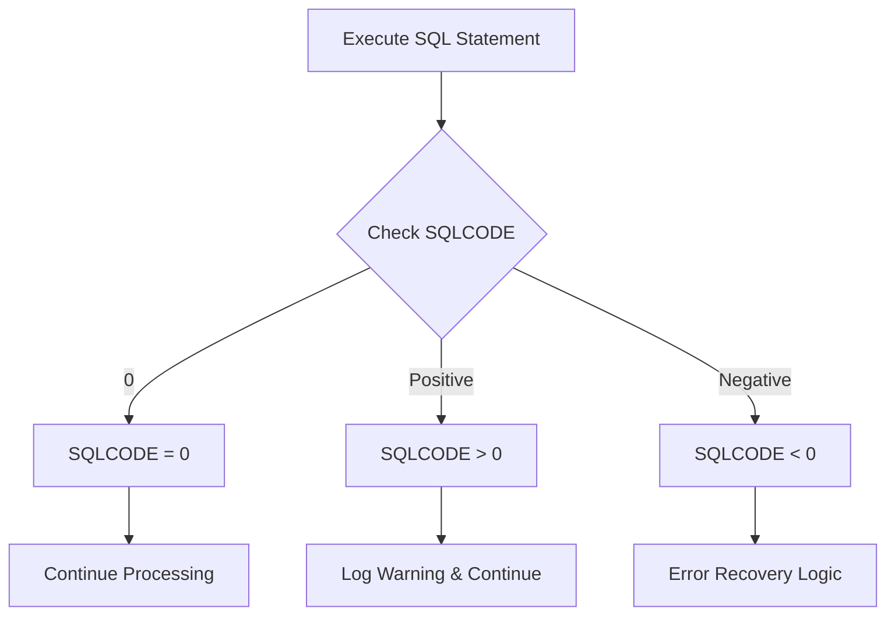
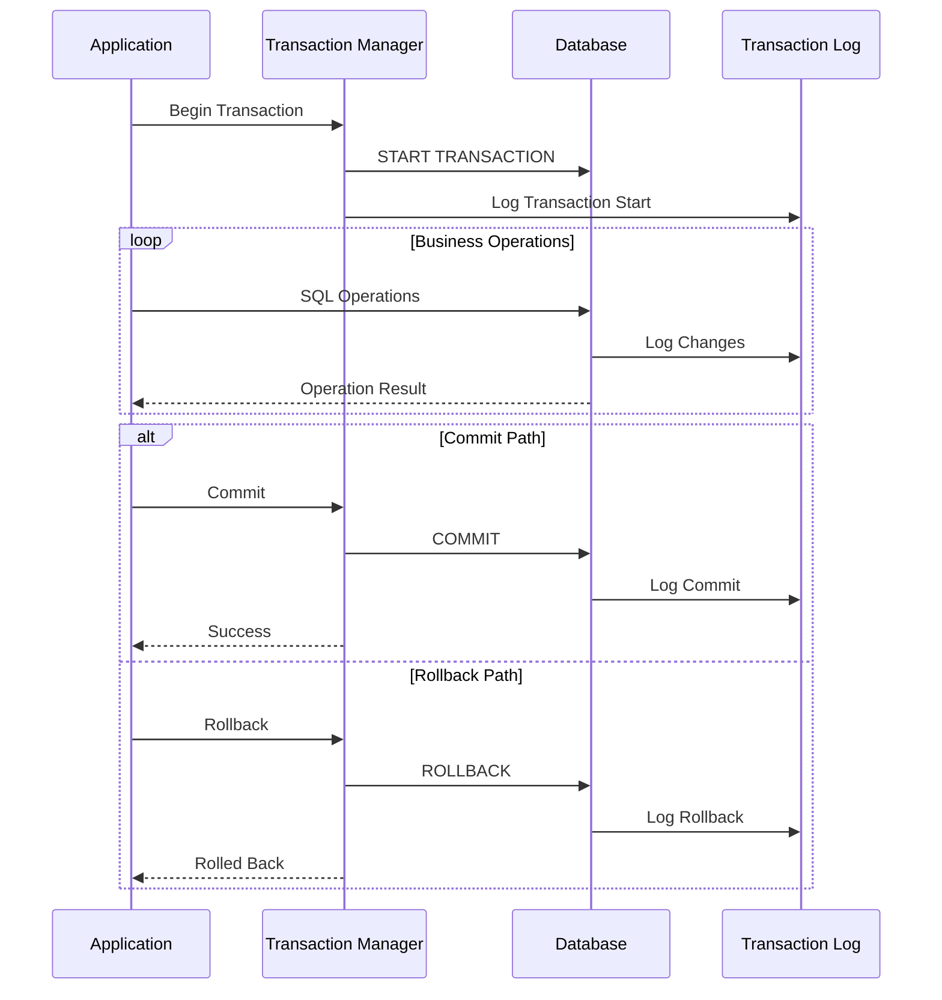

# Database Integration Analysis

## DB2 Integration Overview

The current system uses DB2 for z/OS with embedded SQL in COBOL programs for database operations. This section analyzes the database integration patterns and migration requirements.

## Current DB2 Architecture



## SQL Integration Patterns

### 1. CBLDB21 - Database Query Operations



#### Sample SQL Operations:
```cobol
EXEC SQL
    SELECT ACCT_NO, ACCT_LIMIT, ACCT_BALANCE, LAST_NAME
    FROM ACCOUNT_TABLE
    WHERE ACCT_BALANCE > :WS-BALANCE-THRESHOLD
END-EXEC.

EXEC SQL
    DECLARE ACCT_CURSOR CURSOR FOR
    SELECT * FROM ACCOUNT_TABLE
    WHERE ACCT_STATUS = 'A'
    ORDER BY ACCT_NO
END-EXEC.
```

### 2. CBLDB22 - Database Update Operations



#### Sample Update Operations:
```cobol
EXEC SQL
    INSERT INTO ACCOUNT_TABLE
    (ACCT_NO, ACCT_LIMIT, ACCT_BALANCE, LAST_NAME, FIRST_NAME)
    VALUES (:WS-ACCT-NO, :WS-ACCT-LIMIT, :WS-ACCT-BALANCE,
            :WS-LAST-NAME, :WS-FIRST-NAME)
END-EXEC.

EXEC SQL
    UPDATE ACCOUNT_TABLE
    SET ACCT_BALANCE = :WS-NEW-BALANCE,
        LAST_UPDATE_DATE = CURRENT_DATE
    WHERE ACCT_NO = :WS-ACCT-NO
END-EXEC.
```

### 3. CBLDB23 - Report Generation



## Database Schema Analysis

### Current DB2 Table Structures



## Error Handling Patterns

### SQLCA (SQL Communication Area) Analysis



### Common Error Handling Pattern:
```cobol
EXEC SQL
    SELECT COUNT(*) INTO :WS-COUNT
    FROM ACCOUNT_TABLE
    WHERE ACCT_NO = :WS-ACCOUNT-NUMBER
END-EXEC.

EVALUATE SQLCODE
    WHEN 0
        CONTINUE
    WHEN 100
        MOVE 'RECORD NOT FOUND' TO ERROR-MESSAGE
        PERFORM ERROR-ROUTINE
    WHEN OTHER
        MOVE 'DATABASE ERROR' TO ERROR-MESSAGE
        PERFORM FATAL-ERROR-ROUTINE
END-EVALUATE.
```

## Transaction Management

### Transaction Boundaries



## Performance Considerations

### Current Optimization Strategies

1. **Cursor Processing**: Used for large result sets
2. **Index Usage**: Strategic indexing on frequently queried columns
3. **Lock Management**: Appropriate isolation levels
4. **Buffer Pool Management**: Optimized for workload patterns

### Sample Performance Pattern:
```cobol
EXEC SQL
    DECLARE ACCT_CURSOR CURSOR WITH HOLD FOR
    SELECT ACCT_NO, ACCT_BALANCE
    FROM ACCOUNT_TABLE
    WHERE STATUS = 'A'
    ORDER BY ACCT_NO
    OPTIMIZE FOR 1000 ROWS
END-EXEC.
```

## Migration Requirements to Modern Database

### DB2 to PostgreSQL/MySQL Migration

| DB2 Feature | Modern Equivalent | Implementation |
|-------------|------------------|----------------|
| COMP-3 Data | DECIMAL/NUMERIC | BigDecimal in Java |
| EBCDIC Strings | UTF-8 Strings | String conversion |
| Date/Time Functions | SQL Standard Functions | Database-specific functions |
| Stored Procedures | JPA/Hibernate Queries | Repository methods |
| Cursors | Result Set Processing | Stream processing |
| SQLCA Error Handling | Exception Handling | Try-catch blocks |

### Data Type Mapping

| DB2 Type | PostgreSQL | MySQL | Java Type |
|----------|------------|-------|-----------|
| CHAR(n) | CHAR(n) | CHAR(n) | String |
| VARCHAR(n) | VARCHAR(n) | VARCHAR(n) | String |
| DECIMAL(p,s) | DECIMAL(p,s) | DECIMAL(p,s) | BigDecimal |
| INTEGER | INTEGER | INT | Integer |
| SMALLINT | SMALLINT | SMALLINT | Short |
| DATE | DATE | DATE | LocalDate |
| TIMESTAMP | TIMESTAMP | TIMESTAMP | LocalDateTime |
| CLOB | TEXT | TEXT | String/Clob |

### Modern Database Architecture

```mermaid
graph TB
    subgraph "Modern Database Tier"
        POOL[Connection Pool]
        CACHE[Query Cache]
        DB[Database (PostgreSQL/MySQL)]
        REPLICA[Read Replicas]
    end
    
    subgraph "Application Tier"
        SERVICE[Service Layer]
        REPO[Repository Layer]
        JPA[JPA/Hibernate]
        DS[Data Source]
    end
    
    SERVICE --> REPO
    REPO --> JPA
    JPA --> DS
    DS --> POOL
    POOL --> DB
    POOL --> REPLICA
    
    DB --> CACHE
    REPLICA --> CACHE
```

## Spring Boot Integration Pattern

### Repository Layer Design

```java
@Repository
public interface AccountRepository extends JpaRepository<Account, String> {
    
    @Query("SELECT a FROM Account a WHERE a.balance > :threshold")
    List<Account> findAccountsAboveBalance(@Param("threshold") BigDecimal threshold);
    
    @Query("SELECT a FROM Account a WHERE a.status = 'A' ORDER BY a.accountNumber")
    Page<Account> findActiveAccounts(Pageable pageable);
    
    @Modifying
    @Query("UPDATE Account a SET a.balance = :balance, a.lastUpdate = CURRENT_TIMESTAMP WHERE a.accountNumber = :accountNumber")
    int updateAccountBalance(@Param("accountNumber") String accountNumber, 
                           @Param("balance") BigDecimal balance);
}
```

### Service Layer Transaction Management

```java
@Service
@Transactional
public class AccountService {
    
    @Autowired
    private AccountRepository accountRepository;
    
    public void processAccountUpdate(AccountUpdateRequest request) {
        try {
            Account account = accountRepository.findById(request.getAccountNumber())
                .orElseThrow(() -> new AccountNotFoundException("Account not found"));
            
            account.setBalance(request.getNewBalance());
            account.setLastUpdate(LocalDateTime.now());
            
            accountRepository.save(account);
            
        } catch (Exception e) {
            // Exception handling replaces SQLCODE checking
            throw new AccountProcessingException("Failed to update account", e);
        }
    }
}
```

This database integration analysis provides the foundation for migrating from DB2 embedded SQL to modern ORM-based database access patterns in Spring Boot applications.