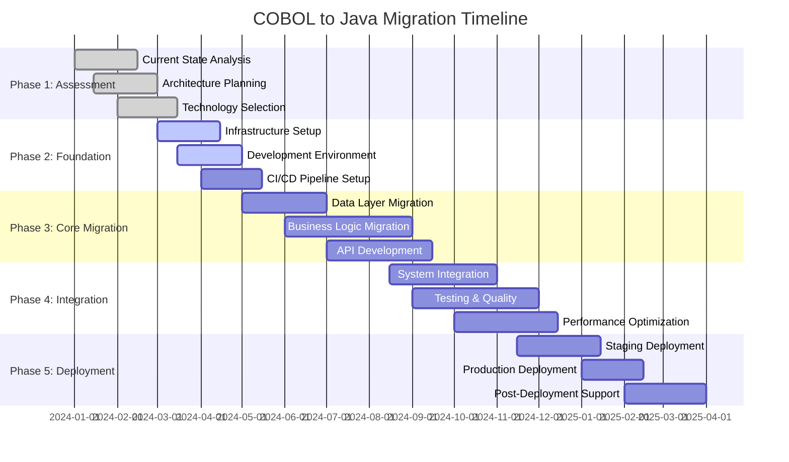
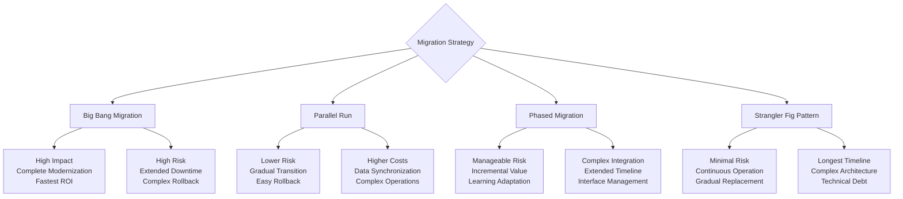
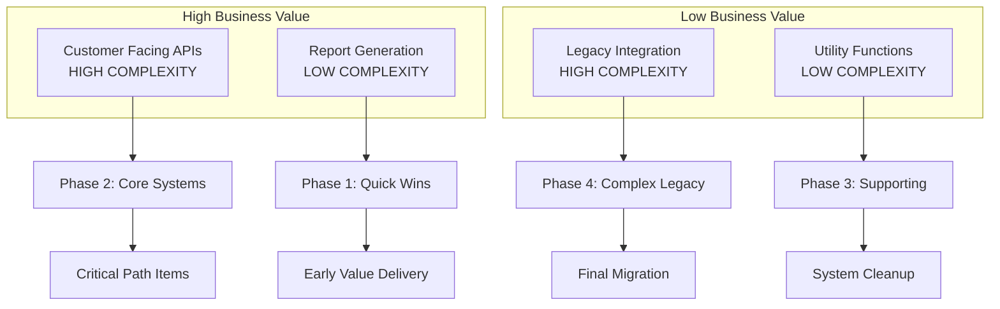
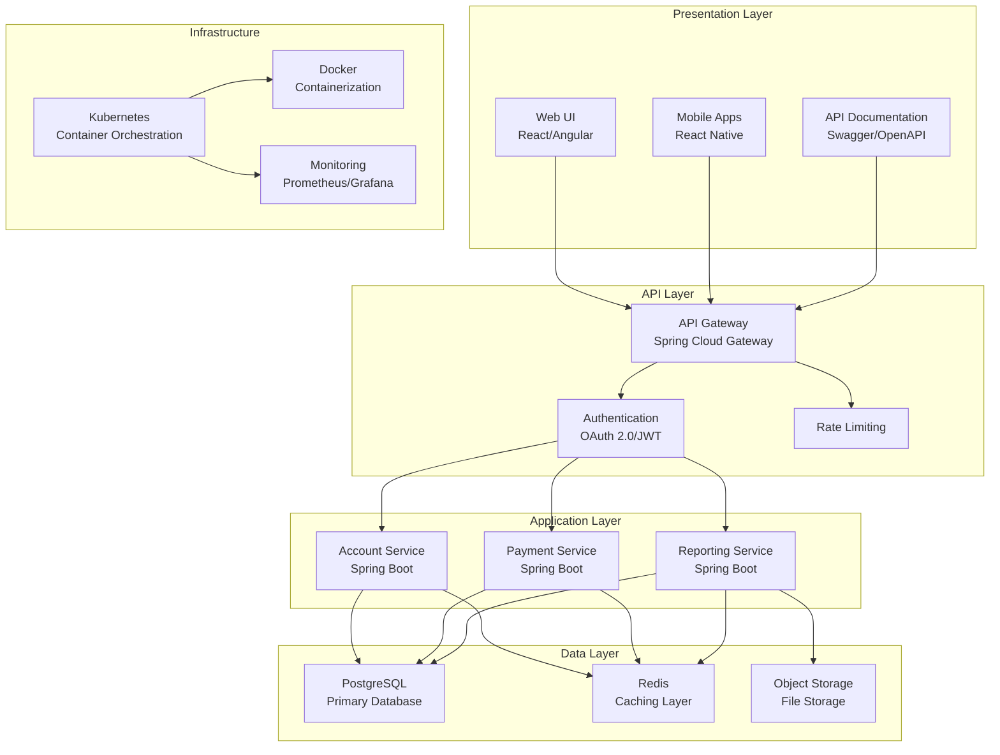
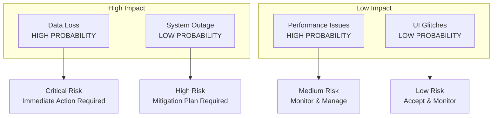
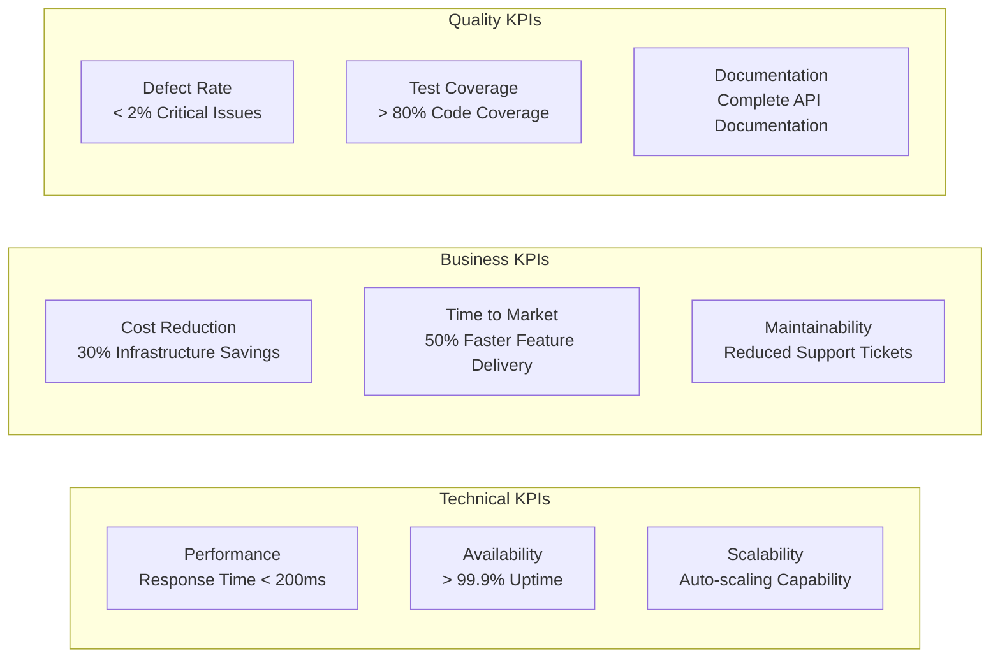
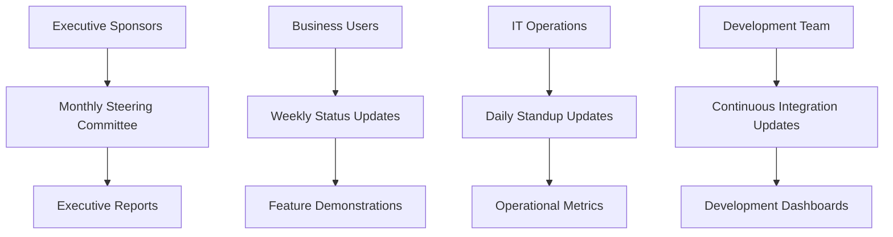

# Migration Strategy

## Overview

The migration from COBOL mainframe applications to Java/Spring Boot microservices represents a comprehensive modernization initiative. This strategy outlines a phased approach to minimize risk while maximizing business value.

## Migration Approach

### 1. Migration Phases



### 2. Migration Strategy Options



## Recommended Approach: Strangler Fig Pattern

The Strangler Fig pattern is recommended for this migration, allowing gradual replacement of COBOL components while maintaining system availability.

### Strangler Fig Implementation

```mermaid
graph TB
    subgraph "Phase 1: Coexistence"
        LEGACY[Legacy COBOL System]
        PROXY[API Gateway/Proxy]
        NEW_SERVICE1[Account Service (Java)]
    end
    
    subgraph "Phase 2: Partial Migration"  
        LEGACY2[Legacy COBOL System]
        PROXY2[API Gateway/Proxy]
        NEW_SERVICE2[Account Service (Java)]
        NEW_SERVICE3[Payment Service (Java)]
    end
    
    subgraph "Phase 3: Full Migration"
        PROXY3[API Gateway/Proxy]
        NEW_SERVICE4[Account Service (Java)]
        NEW_SERVICE5[Payment Service (Java)]
        NEW_SERVICE6[Reporting Service (Java)]
    end
    
    CLIENT[Client Applications]
    
    CLIENT --> PROXY
    CLIENT --> PROXY2
    CLIENT --> PROXY3
    
    PROXY --> LEGACY
    PROXY --> NEW_SERVICE1
    
    PROXY2 --> LEGACY2
    PROXY2 --> NEW_SERVICE2
    PROXY2 --> NEW_SERVICE3
    
    PROXY3 --> NEW_SERVICE4
    PROXY3 --> NEW_SERVICE5
    PROXY3 --> NEW_SERVICE6
```

## Component Migration Priorities

### 1. Migration Priority Matrix



### 2. Component Migration Order

| Priority | Component | Complexity | Business Value | Timeline |
|----------|-----------|------------|----------------|----------|
| 1 | Report Generation (CBL0011) | Low | High | Month 1-2 |
| 2 | Employee Payroll (EMPPAY) | Low | Medium | Month 2-3 |
| 3 | Account Query Service (CBLDB21) | Medium | High | Month 3-5 |
| 4 | Account Update Service (CBLDB22) | Medium | High | Month 4-6 |
| 5 | Complex Reporting (CBLDB23) | High | Medium | Month 6-8 |
| 6 | JCL Batch Processing | High | Low | Month 8-10 |

## Technology Stack Selection

### Target Architecture



### Technology Justification

| Technology | Purpose | Justification |
|------------|---------|---------------|
| Spring Boot | Microservices Framework | Enterprise-ready, extensive ecosystem |
| PostgreSQL | Primary Database | ACID compliance, JSON support, performance |
| Redis | Caching Layer | High performance, distributed caching |
| Docker | Containerization | Consistent deployment, resource isolation |
| Kubernetes | Orchestration | Auto-scaling, service discovery, resilience |
| React | Frontend Framework | Component-based, extensive community |

## Risk Management

### Risk Assessment Matrix



### Risk Mitigation Strategies

| Risk Category | Mitigation Strategy |
|---------------|-------------------|
| Data Migration | Comprehensive backup, validation scripts, rollback procedures |
| Performance Degradation | Load testing, performance monitoring, gradual rollout |
| Integration Failures | API contracts, integration testing, circuit breakers |
| Team Readiness | Training programs, mentoring, gradual skill transition |
| Business Disruption | Parallel running, feature flags, gradual cutover |

## Success Criteria

### Key Performance Indicators (KPIs)



### Acceptance Criteria

1. **Functional Parity**: All COBOL functionality replicated in Java services
2. **Performance Standards**: Response times meet or exceed current system
3. **Data Integrity**: Zero data loss during migration
4. **Security Compliance**: Meet current security and audit requirements
5. **Operational Readiness**: Monitoring, alerting, and support procedures in place

## Change Management

### Stakeholder Communication Plan



### Training and Support Strategy

1. **Java Development Training**: For COBOL developers transitioning to Java
2. **Cloud Platform Training**: Kubernetes and containerization concepts
3. **DevOps Practices**: CI/CD pipeline management and monitoring
4. **Business User Training**: New interface and feature training
5. **Support Documentation**: Comprehensive operational runbooks

## Next Steps

1. **Detailed Planning**: Create detailed migration plans for each component
2. **Environment Setup**: Establish development and testing environments
3. **Proof of Concept**: Build pilot service to validate approach
4. **Team Formation**: Assemble cross-functional migration teams
5. **Tooling Selection**: Finalize development and deployment toolchain

This migration strategy provides the framework for successfully transitioning from legacy COBOL systems to modern cloud-native Java applications while minimizing risk and maximizing business value.