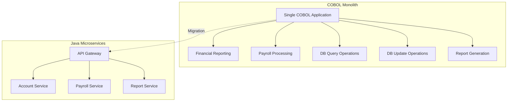
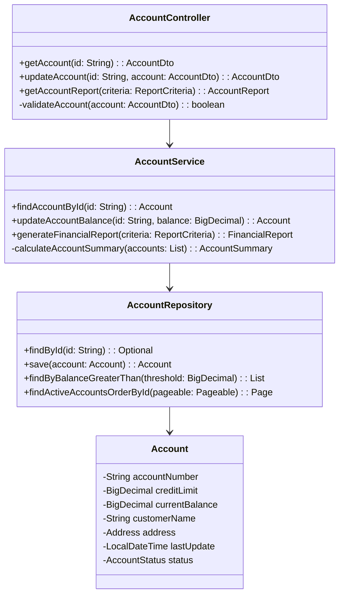
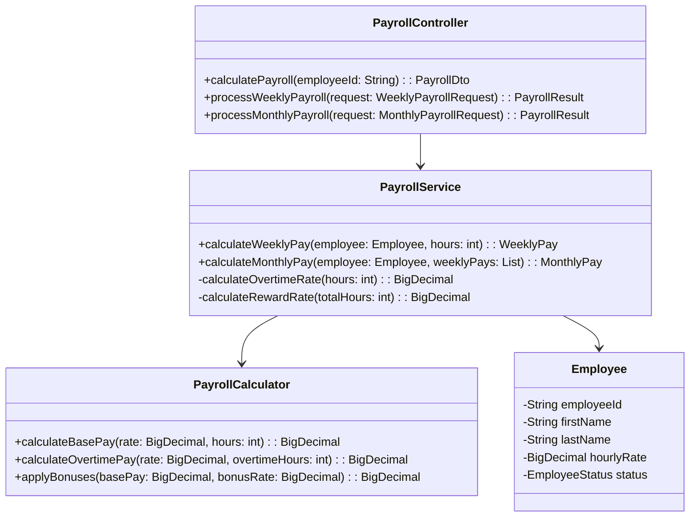
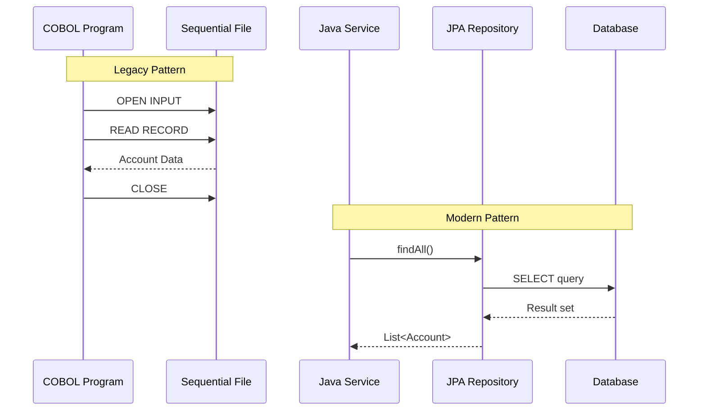
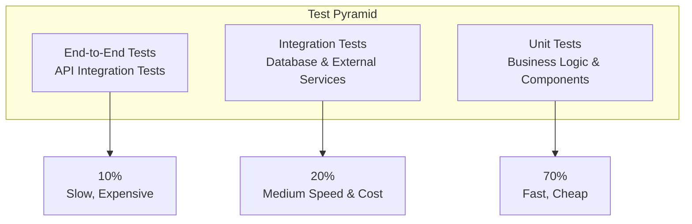
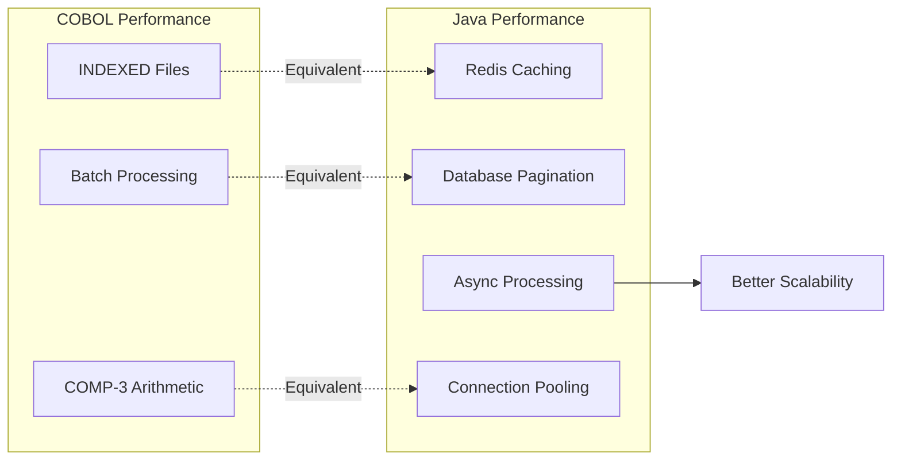

# Java/Spring Boot Conversion

## COBOL to Java Transformation Guide

This document provides detailed guidance for converting COBOL programs to Java/Spring Boot applications, including code patterns, data structure mapping, and architectural considerations.

## Architectural Transformation

### From Monolithic to Microservices



## Service Decomposition Strategy

### 1. Account Management Service (CBL0011, CBLDB21, CBLDB22)



#### COBOL to Java Conversion Example

**COBOL (CBL0011 excerpt):**
```cobol
01  ACCT-FIELDS.
    05  ACCT-NO            PIC X(8).
    05  ACCT-LIMIT         PIC S9(7)V99 COMP-3.
    05  ACCT-BALANCE       PIC S9(7)V99 COMP-3.
    05  LAST-NAME          PIC X(20).
    05  FIRST-NAME         PIC X(15).

READ-ACCOUNT-FILE.
    READ ACCT-REC
        AT END MOVE 'Y' TO LASTREC.
    IF LASTREC NOT = 'Y'
        PERFORM PROCESS-ACCOUNT-RECORD.
```

**Java (Spring Boot equivalent):**
```java
@Entity
@Table(name = "accounts")
public class Account {
    @Id
    private String accountNumber;       // PIC X(8)
    
    @Column(precision = 9, scale = 2)
    private BigDecimal creditLimit;     // PIC S9(7)V99 COMP-3
    
    @Column(precision = 9, scale = 2)
    private BigDecimal currentBalance;  // PIC S9(7)V99 COMP-3
    
    private String lastName;            // PIC X(20)
    private String firstName;           // PIC X(15)
    
    // Constructors, getters, setters
}

@Service
public class AccountService {
    
    @Autowired
    private AccountRepository accountRepository;
    
    public List<AccountDto> processAllAccounts() {
        return accountRepository.findAll()
            .stream()
            .map(this::processAccount)
            .collect(Collectors.toList());
    }
    
    private AccountDto processAccount(Account account) {
        // Business logic equivalent to PERFORM PROCESS-ACCOUNT-RECORD
        return AccountDto.from(account);
    }
}
```

### 2. Payroll Service (EMPPAY)



#### COBOL to Java Business Logic Conversion

**COBOL (EMPPAY logic):**
```cobol
PAYMENT-WEEKLY.
    IF  EMP-HOURS >= 40
        MOVE .25 TO  EMP-OT-RATE
    ELSE IF EMP-HOURS >= 50
        MOVE .50 TO EMP-OT-RATE
    ELSE
        MOVE ZERO TO EMP-OT-RATE.
    COMPUTE EMP-PAY-WEEK =
        (EMP-HOURS * EMP-HOURLY-RATE) * (1 + EMP-OT-RATE).
```

**Java (Spring Boot equivalent):**
```java
@Service
public class PayrollService {
    
    public WeeklyPayroll calculateWeeklyPay(Employee employee, int hoursWorked) {
        BigDecimal overtimeRate = calculateOvertimeRate(hoursWorked);
        BigDecimal basePay = employee.getHourlyRate().multiply(BigDecimal.valueOf(hoursWorked));
        BigDecimal overtimeMultiplier = BigDecimal.ONE.add(overtimeRate);
        BigDecimal weeklyPay = basePay.multiply(overtimeMultiplier);
        
        return WeeklyPayroll.builder()
            .employeeId(employee.getId())
            .hoursWorked(hoursWorked)
            .basePay(basePay)
            .overtimeRate(overtimeRate)
            .totalPay(weeklyPay)
            .build();
    }
    
    private BigDecimal calculateOvertimeRate(int hours) {
        if (hours >= 50) {
            return new BigDecimal("0.50");
        } else if (hours >= 40) {
            return new BigDecimal("0.25");
        } else {
            return BigDecimal.ZERO;
        }
    }
}
```

## Data Access Layer Transformation

### From COBOL File I/O to JPA Repository



#### Repository Pattern Implementation

```java
@Repository
public interface AccountRepository extends JpaRepository<Account, String> {
    
    // Equivalent to COBOL file processing with criteria
    @Query("SELECT a FROM Account a WHERE a.currentBalance > :threshold ORDER BY a.accountNumber")
    List<Account> findAccountsAboveThreshold(@Param("threshold") BigDecimal threshold);
    
    // Pagination support for large datasets (equivalent to batch processing)
    @Query("SELECT a FROM Account a WHERE a.status = 'ACTIVE'")
    Page<Account> findActiveAccounts(Pageable pageable);
    
    // Custom update operations (equivalent to COBOL UPDATE logic)
    @Modifying
    @Query("UPDATE Account a SET a.currentBalance = :balance, a.lastUpdate = CURRENT_TIMESTAMP WHERE a.accountNumber = :accountNumber")
    int updateAccountBalance(@Param("accountNumber") String accountNumber, @Param("balance") BigDecimal balance);
}
```

## Configuration and Properties Management

### Externalized Configuration

Replace COBOL hardcoded values with Spring Boot configuration:

**application.yml:**
```yaml
# Database configuration
spring:
  datasource:
    url: jdbc:postgresql://localhost:5432/accounts
    username: ${DB_USERNAME:accountuser}
    password: ${DB_PASSWORD:password}
  
  jpa:
    hibernate:
      ddl-auto: validate
    show-sql: false
    properties:
      hibernate:
        format_sql: true

# Application-specific configuration
app:
  payroll:
    overtime:
      threshold-40: 0.25
      threshold-50: 0.50
    reward:
      threshold: 150
      rate: 0.50
  
  account:
    report:
      max-records: 1000
      timeout: 30s
```

**Configuration Classes:**
```java
@ConfigurationProperties(prefix = "app.payroll")
@Data
public class PayrollConfig {
    private OvertimeConfig overtime = new OvertimeConfig();
    private RewardConfig reward = new RewardConfig();
    
    @Data
    public static class OvertimeConfig {
        private BigDecimal threshold40 = new BigDecimal("0.25");
        private BigDecimal threshold50 = new BigDecimal("0.50");
    }
    
    @Data
    public static class RewardConfig {
        private int threshold = 150;
        private BigDecimal rate = new BigDecimal("0.50");
    }
}
```

## Error Handling Transformation

### From COBOL Error Codes to Java Exceptions

```mermaid
graph TB
    subgraph "COBOL Error Handling"
        SQLCODE[Check SQLCODE]
        ERROR_FLAG[Set Error Flags]
        ERROR_ROUTINE[PERFORM ERROR-ROUTINE]
    end
    
    subgraph "Java Exception Handling"
        TRY_CATCH[Try-Catch Blocks]
        CUSTOM_EX[Custom Exceptions]
        GLOBAL_HANDLER[@ControllerAdvice]
    end
    
    SQLCODE -.->|Transform| TRY_CATCH
    ERROR_FLAG -.->|Transform| CUSTOM_EX
    ERROR_ROUTINE -.->|Transform| GLOBAL_HANDLER
```

#### Exception Handling Implementation

```java
// Custom Business Exceptions
public class AccountNotFoundException extends BusinessException {
    public AccountNotFoundException(String accountNumber) {
        super("Account not found: " + accountNumber);
    }
}

public class InsufficientFundsException extends BusinessException {
    public InsufficientFundsException(String accountNumber, BigDecimal requestedAmount) {
        super(String.format("Insufficient funds for account %s. Requested: %s", 
                           accountNumber, requestedAmount));
    }
}

// Global Exception Handler
@ControllerAdvice
public class GlobalExceptionHandler {
    
    @ExceptionHandler(AccountNotFoundException.class)
    @ResponseStatus(HttpStatus.NOT_FOUND)
    public ErrorResponse handleAccountNotFound(AccountNotFoundException ex) {
        return ErrorResponse.builder()
            .code("ACCOUNT_NOT_FOUND")
            .message(ex.getMessage())
            .timestamp(LocalDateTime.now())
            .build();
    }
    
    @ExceptionHandler(InsufficientFundsException.class)
    @ResponseStatus(HttpStatus.BAD_REQUEST)
    public ErrorResponse handleInsufficientFunds(InsufficientFundsException ex) {
        return ErrorResponse.builder()
            .code("INSUFFICIENT_FUNDS")
            .message(ex.getMessage())
            .timestamp(LocalDateTime.now())
            .build();
    }
}
```

## Testing Strategy

### Test Pyramid for Migrated Services



#### Test Implementation Examples

```java
// Unit Test
@ExtendWith(MockitoExtension.class)
class PayrollServiceTest {
    
    @Mock
    private PayrollConfig payrollConfig;
    
    @InjectMocks
    private PayrollService payrollService;
    
    @Test
    void shouldCalculateOvertimeCorrectly() {
        // Given
        Employee employee = createTestEmployee();
        int hoursWorked = 45;
        
        when(payrollConfig.getOvertime().getThreshold40())
            .thenReturn(new BigDecimal("0.25"));
        
        // When
        WeeklyPayroll result = payrollService.calculateWeeklyPay(employee, hoursWorked);
        
        // Then
        assertThat(result.getOvertimeRate()).isEqualTo(new BigDecimal("0.25"));
    }
}

// Integration Test
@SpringBootTest
@Testcontainers
class AccountServiceIntegrationTest {
    
    @Container
    static PostgreSQLContainer<?> postgres = new PostgreSQLContainer<>("postgres:14")
            .withDatabaseName("testdb")
            .withUsername("test")
            .withPassword("test");
    
    @Autowired
    private AccountService accountService;
    
    @Test
    void shouldRetrieveAccountFromDatabase() {
        // Given
        String accountNumber = "12345678";
        
        // When
        Account account = accountService.findAccountById(accountNumber);
        
        // Then
        assertThat(account.getAccountNumber()).isEqualTo(accountNumber);
    }
}
```

## Performance Considerations

### Optimization Strategies



#### Performance Implementation

```java
@Service
public class AccountService {
    
    // Caching expensive operations
    @Cacheable(value = "accounts", key = "#accountNumber")
    public Account findAccountById(String accountNumber) {
        return accountRepository.findById(accountNumber)
            .orElseThrow(() -> new AccountNotFoundException(accountNumber));
    }
    
    // Pagination for large datasets
    public Page<Account> findAccountsWithPagination(int page, int size) {
        Pageable pageable = PageRequest.of(page, size);
        return accountRepository.findAll(pageable);
    }
    
    // Async processing for batch operations
    @Async
    public CompletableFuture<List<PayrollResult>> processPayrollBatch(List<Employee> employees) {
        List<PayrollResult> results = employees.parallelStream()
            .map(this::processEmployee)
            .collect(Collectors.toList());
        
        return CompletableFuture.completedFuture(results);
    }
}
```

## API Design

### RESTful API Design

```java
@RestController
@RequestMapping("/api/v1/accounts")
@Validated
public class AccountController {
    
    @Autowired
    private AccountService accountService;
    
    @GetMapping("/{accountNumber}")
    public ResponseEntity<AccountDto> getAccount(
            @PathVariable @Pattern(regexp = "\\d{8}") String accountNumber) {
        Account account = accountService.findAccountById(accountNumber);
        return ResponseEntity.ok(AccountDto.from(account));
    }
    
    @PutMapping("/{accountNumber}/balance")
    public ResponseEntity<AccountDto> updateBalance(
            @PathVariable String accountNumber,
            @RequestBody @Valid BalanceUpdateRequest request) {
        Account updatedAccount = accountService.updateAccountBalance(
            accountNumber, request.getNewBalance());
        return ResponseEntity.ok(AccountDto.from(updatedAccount));
    }
    
    @PostMapping("/{accountNumber}/reports")
    public ResponseEntity<FinancialReportDto> generateReport(
            @PathVariable String accountNumber,
            @RequestBody @Valid ReportCriteria criteria) {
        FinancialReport report = accountService.generateFinancialReport(
            accountNumber, criteria);
        return ResponseEntity.ok(FinancialReportDto.from(report));
    }
}
```

This comprehensive conversion guide provides the foundation for transforming COBOL applications into modern, maintainable Java/Spring Boot microservices while preserving business logic and improving system architecture.