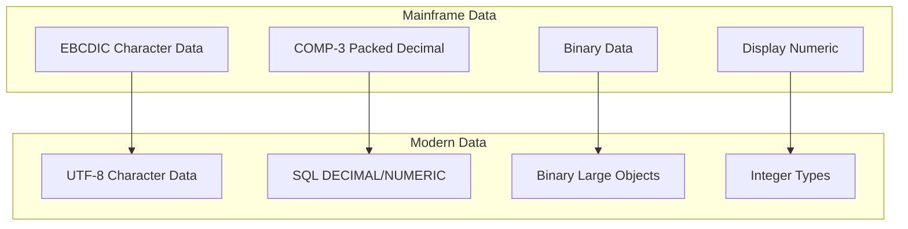
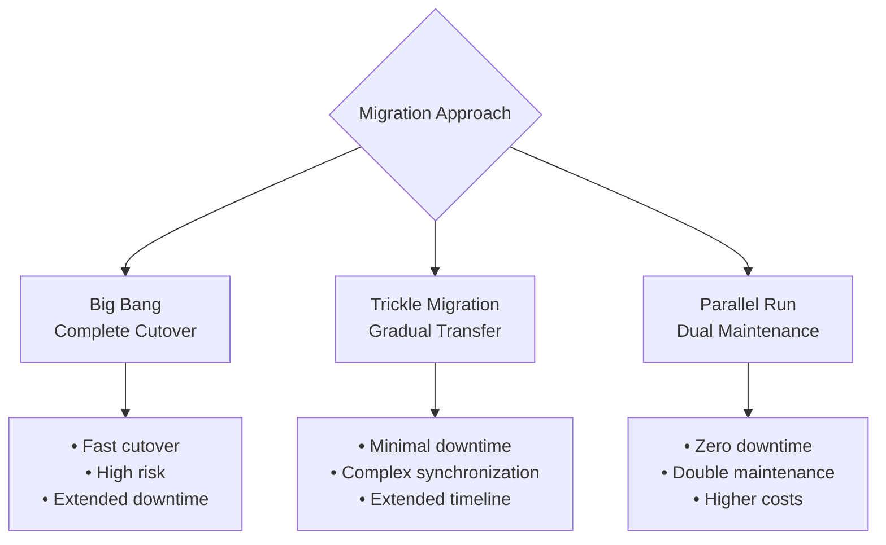
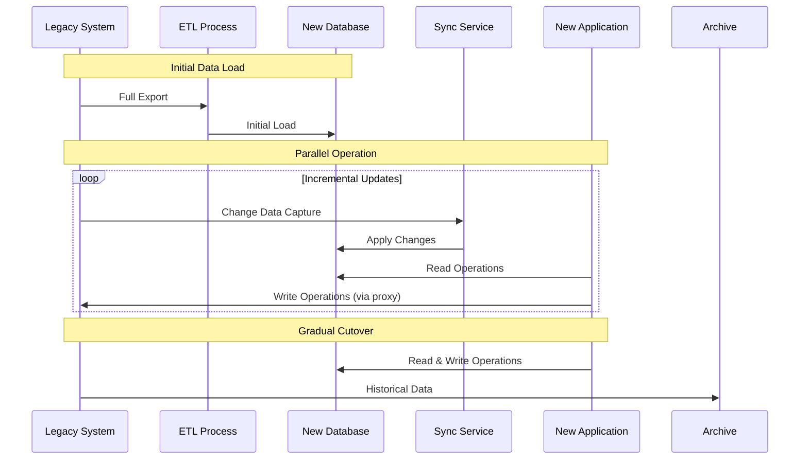
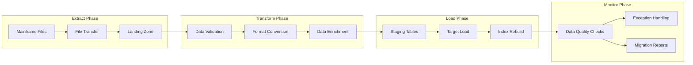
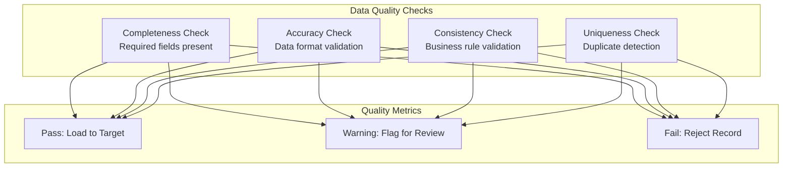
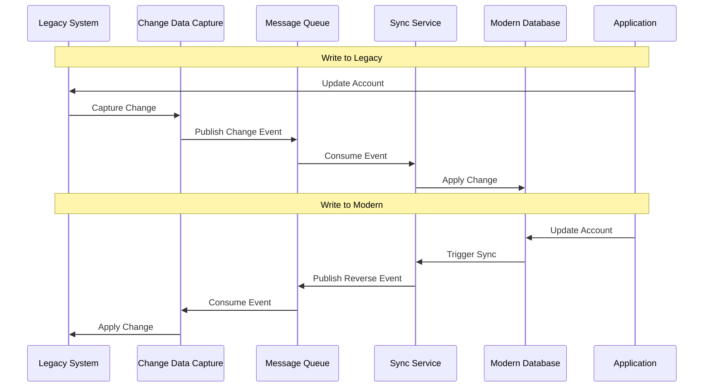
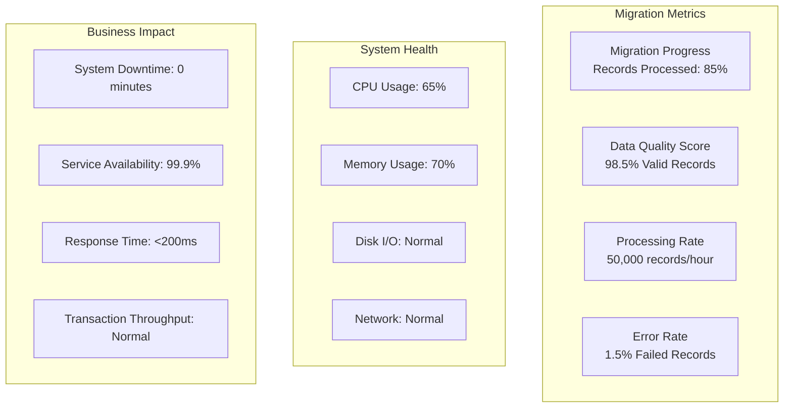
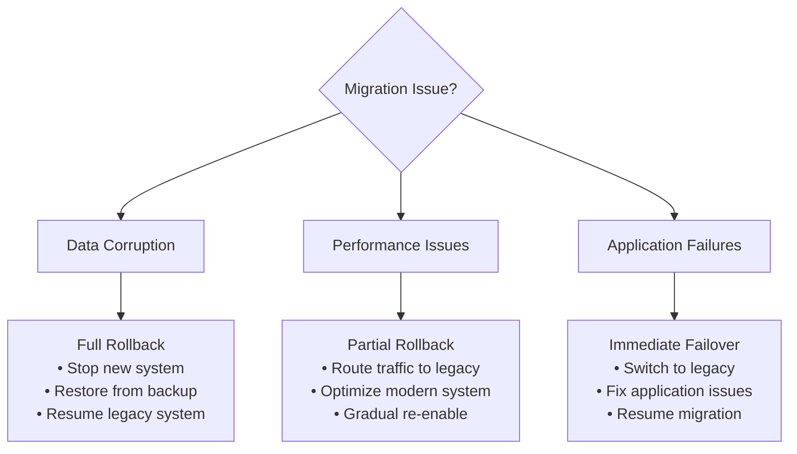

# Data Migration

## Overview

Data migration from mainframe EBCDIC/COMP-3 formats to modern UTF-8/SQL databases requires careful planning and execution to ensure data integrity and minimize downtime.

## Current Data Landscape

### Data Types and Encoding



### Data Volume Assessment

| Data Category | Current Volume | Growth Rate | Migration Priority |
|---------------|----------------|-------------|-------------------|
| Account Records | 2.5 million | 5% annually | High |
| Transaction History | 50 million | 15% annually | High |
| Employee Records | 50,000 | 2% annually | Medium |
| Audit Logs | 100 million | 20% annually | Low |
| Reference Data | 500,000 | 1% annually | High |

## Data Migration Strategy

### Migration Approach Options



### Recommended: Parallel Run with Gradual Cutover



## Data Structure Migration

### Account Records Transformation

#### COBOL Structure
```cobol
01  ACCT-FIELDS.
    05  ACCT-NO            PIC X(8).
    05  ACCT-LIMIT         PIC S9(7)V99 COMP-3.
    05  ACCT-BALANCE       PIC S9(7)V99 COMP-3.
    05  LAST-NAME          PIC X(20).
    05  FIRST-NAME         PIC X(15).
    05  CLIENT-ADDR.
        10  STREET-ADDR    PIC X(25).
        10  CITY-COUNTY    PIC X(20).
        10  USA-STATE      PIC X(15).
    05  RESERVED           PIC X(7).
    05  COMMENTS           PIC X(50).
```

#### Modern Database Schema
```sql
CREATE TABLE accounts (
    account_number VARCHAR(8) PRIMARY KEY,
    credit_limit DECIMAL(9,2) NOT NULL,
    current_balance DECIMAL(9,2) NOT NULL DEFAULT 0.00,
    last_name VARCHAR(20) NOT NULL,
    first_name VARCHAR(15) NOT NULL,
    street_address VARCHAR(25),
    city_county VARCHAR(20),
    state_code VARCHAR(15),
    comments TEXT,
    created_date TIMESTAMP NOT NULL DEFAULT CURRENT_TIMESTAMP,
    last_updated TIMESTAMP NOT NULL DEFAULT CURRENT_TIMESTAMP,
    status CHAR(1) NOT NULL DEFAULT 'A',
    version INTEGER NOT NULL DEFAULT 1
);

CREATE INDEX idx_accounts_name ON accounts(last_name, first_name);
CREATE INDEX idx_accounts_balance ON accounts(current_balance);
CREATE INDEX idx_accounts_status ON accounts(status);
```

### Data Type Conversion Matrix

| COBOL Type | Example | Target SQL Type | Conversion Logic |
|------------|---------|-----------------|------------------|
| PIC X(n) | Character | VARCHAR(n) | EBCDIC → UTF-8 |
| PIC 9(n) | Unsigned | INTEGER/BIGINT | Direct conversion |
| PIC S9(n) | Signed | INTEGER/BIGINT | Sign handling |
| PIC 9(n)V99 | Decimal display | DECIMAL(n+2,2) | Implied decimal |
| PIC S9(n)V99 COMP-3 | Packed decimal | DECIMAL(n+2,2) | Unpack + convert |
| PIC X(n) COMP | Binary | BYTEA/BLOB | Binary preservation |

## ETL Pipeline Implementation

### Architecture Overview



### ETL Implementation with Apache Kafka

```java
// Data Pipeline Configuration
@Configuration
public class DataMigrationConfig {
    
    @Bean
    public KafkaTemplate<String, AccountRecord> kafkaTemplate() {
        return new KafkaTemplate<>(producerFactory());
    }
    
    @Bean
    public ConsumerFactory<String, AccountRecord> consumerFactory() {
        Map<String, Object> props = new HashMap<>();
        props.put(ConsumerConfig.BOOTSTRAP_SERVERS_CONFIG, "localhost:9092");
        props.put(ConsumerConfig.GROUP_ID_CONFIG, "data-migration");
        props.put(ConsumerConfig.KEY_DESERIALIZER_CLASS_CONFIG, StringDeserializer.class);
        props.put(ConsumerConfig.VALUE_DESERIALIZER_CLASS_CONFIG, JsonDeserializer.class);
        return new DefaultKafkaConsumerFactory<>(props);
    }
}

// Data Extractor Service
@Service
public class MainframeDataExtractor {
    
    @Scheduled(fixedDelay = 60000) // Every minute
    public void extractChangedData() {
        List<RawAccountRecord> changedRecords = fetchChangedRecords();
        
        changedRecords.forEach(record -> {
            AccountRecord converted = convertToModernFormat(record);
            kafkaTemplate.send("account-changes", record.getAccountNumber(), converted);
        });
    }
    
    private AccountRecord convertToModernFormat(RawAccountRecord raw) {
        return AccountRecord.builder()
            .accountNumber(ebcdicToUtf8(raw.getAccountNumber()))
            .creditLimit(comp3ToDecimal(raw.getCreditLimit()))
            .currentBalance(comp3ToDecimal(raw.getCurrentBalance()))
            .lastName(ebcdicToUtf8(raw.getLastName()).trim())
            .firstName(ebcdicToUtf8(raw.getFirstName()).trim())
            .build();
    }
}
```

## Data Quality and Validation

### Validation Framework



### Validation Implementation

```java
@Component
public class DataQualityValidator {
    
    public ValidationResult validate(AccountRecord record) {
        List<ValidationError> errors = new ArrayList<>();
        
        // Completeness checks
        if (StringUtils.isEmpty(record.getAccountNumber())) {
            errors.add(ValidationError.of("MISSING_ACCOUNT_NUMBER", "Account number is required"));
        }
        
        // Accuracy checks
        if (record.getAccountNumber() != null && !record.getAccountNumber().matches("\\d{8}")) {
            errors.add(ValidationError.of("INVALID_ACCOUNT_FORMAT", "Account number must be 8 digits"));
        }
        
        // Consistency checks
        if (record.getCurrentBalance().compareTo(record.getCreditLimit()) > 0) {
            errors.add(ValidationError.of("BALANCE_EXCEEDS_LIMIT", "Balance cannot exceed credit limit"));
        }
        
        return ValidationResult.builder()
            .isValid(errors.isEmpty())
            .errors(errors)
            .record(record)
            .build();
    }
}

// Data Quality Metrics
@Service
public class DataQualityMetrics {
    
    private final MeterRegistry meterRegistry;
    
    public void recordValidationResult(ValidationResult result) {
        if (result.isValid()) {
            meterRegistry.counter("data.validation.passed").increment();
        } else {
            meterRegistry.counter("data.validation.failed").increment();
            result.getErrors().forEach(error -> 
                meterRegistry.counter("data.validation.error", "type", error.getCode()).increment()
            );
        }
    }
}
```

## Change Data Capture (CDC)

### CDC Implementation with Debezium

```yaml
# Debezium connector configuration
apiVersion: kafka.strimzi.io/v1beta2
kind: KafkaConnector
metadata:
  name: mainframe-cdc-connector
spec:
  class: io.debezium.connector.db2.Db2Connector
  tasksMax: 1
  config:
    database.hostname: mainframe-db2.company.com
    database.port: 50000
    database.user: debezium
    database.password: ${DB_PASSWORD}
    database.dbname: ACCOUNTS
    database.server.name: mainframe-accounts
    table.include.list: SCHEMA.ACCOUNT_TABLE,SCHEMA.TRANSACTION_TABLE
    database.history.kafka.bootstrap.servers: kafka:9092
    database.history.kafka.topic: mainframe.cdc.history
```

### CDC Event Processing

```java
@Component
@KafkaListener(topics = "mainframe-accounts.SCHEMA.ACCOUNT_TABLE")
public class AccountCDCProcessor {
    
    @Autowired
    private AccountSyncService accountSyncService;
    
    @KafkaHandler
    public void handleAccountChange(
        @Payload ChangeEvent<AccountCDCRecord> changeEvent,
        @Header KafkaHeaders headers) {
        
        switch (changeEvent.getOperation()) {
            case CREATE:
                accountSyncService.createAccount(changeEvent.getAfter());
                break;
            case UPDATE:
                accountSyncService.updateAccount(changeEvent.getBefore(), changeEvent.getAfter());
                break;
            case DELETE:
                accountSyncService.deleteAccount(changeEvent.getBefore());
                break;
        }
    }
}
```

## Data Synchronization

### Bi-directional Sync During Transition



### Conflict Resolution Strategy

```java
@Service
public class ConflictResolutionService {
    
    public AccountRecord resolveConflict(
            AccountRecord legacyRecord, 
            AccountRecord modernRecord) {
        
        // Timestamp-based resolution (last write wins)
        if (legacyRecord.getLastUpdated().isAfter(modernRecord.getLastUpdated())) {
            return legacyRecord;
        } else if (modernRecord.getLastUpdated().isAfter(legacyRecord.getLastUpdated())) {
            return modernRecord;
        }
        
        // Field-level resolution for simultaneous updates
        return AccountRecord.builder()
            .accountNumber(legacyRecord.getAccountNumber())
            .creditLimit(resolveNumericField(
                legacyRecord.getCreditLimit(), 
                modernRecord.getCreditLimit(),
                legacyRecord.getLastUpdated(),
                modernRecord.getLastUpdated()))
            .currentBalance(resolveNumericField(
                legacyRecord.getCurrentBalance(),
                modernRecord.getCurrentBalance(),
                legacyRecord.getLastUpdated(),
                modernRecord.getLastUpdated()))
            .build();
    }
}
```

## Migration Monitoring and Reporting

### Migration Dashboard



### Monitoring Implementation

```java
@Component
public class MigrationMonitor {
    
    private final MeterRegistry meterRegistry;
    private final AtomicLong recordsProcessed = new AtomicLong(0);
    private final AtomicLong recordsFailed = new AtomicLong(0);
    
    @EventListener
    public void handleRecordProcessed(RecordProcessedEvent event) {
        recordsProcessed.incrementAndGet();
        meterRegistry.gauge("migration.records.processed", recordsProcessed.get());
        
        if (event.isFailed()) {
            recordsFailed.incrementAndGet();
            meterRegistry.gauge("migration.records.failed", recordsFailed.get());
        }
    }
    
    @Scheduled(fixedRate = 60000)
    public void reportProgress() {
        long processed = recordsProcessed.get();
        long failed = recordsFailed.get();
        double successRate = (processed - failed) / (double) processed * 100;
        
        log.info("Migration Progress - Processed: {}, Failed: {}, Success Rate: {}%", 
                processed, failed, String.format("%.2f", successRate));
    }
}
```

## Rollback Strategy

### Rollback Scenarios and Procedures



### Rollback Implementation

```java
@Service
public class RollbackService {
    
    @Autowired
    private BackupService backupService;
    
    @Autowired
    private RoutingService routingService;
    
    public void executeRollback(RollbackType type, String reason) {
        log.warn("Initiating rollback - Type: {}, Reason: {}", type, reason);
        
        switch (type) {
            case FULL:
                executeFullRollback();
                break;
            case PARTIAL:
                executePartialRollback();
                break;
            case FAILOVER:
                executeFailover();
                break;
        }
        
        notificationService.sendRollbackAlert(type, reason);
    }
    
    private void executeFullRollback() {
        // 1. Stop processing new data
        dataProcessingService.stop();
        
        // 2. Restore database from backup
        backupService.restoreLatestBackup();
        
        // 3. Route all traffic to legacy system
        routingService.routeAllToLegacy();
        
        // 4. Verify legacy system health
        healthCheckService.verifyLegacySystemHealth();
    }
}
```

This comprehensive data migration strategy ensures reliable, monitored, and reversible data transformation from legacy mainframe formats to modern cloud-native databases.