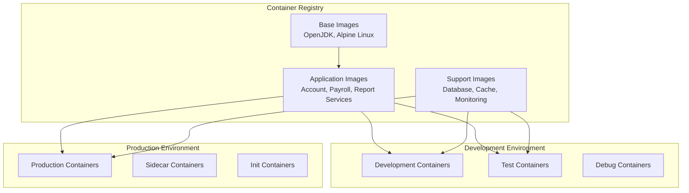
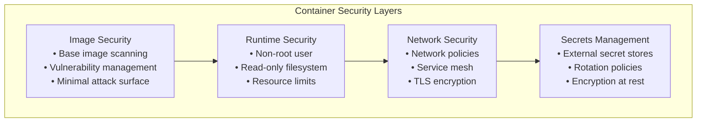
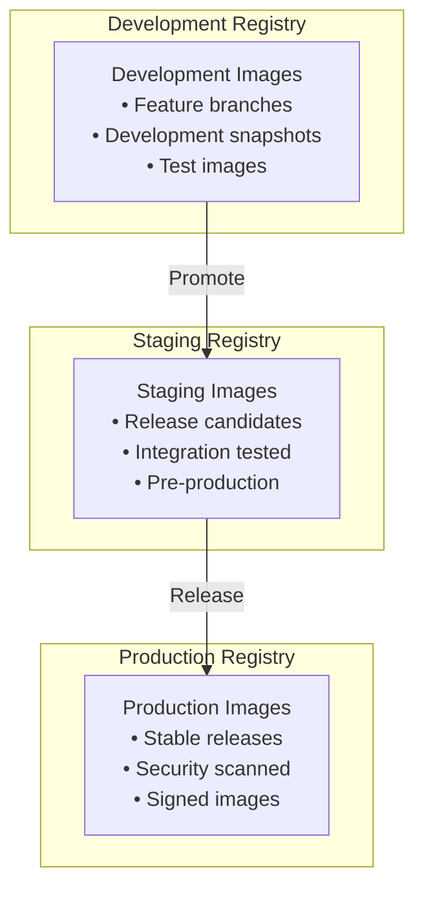

# Docker Implementation

## Containerization Strategy

Docker containerization provides a consistent, portable deployment model for migrated Java applications, replacing traditional mainframe job scheduling with modern container orchestration.

## Container Architecture Overview



## Multi-Stage Docker Build Strategy

### Base Image Standardization

```dockerfile
# Base application image
FROM eclipse-temurin:17-jre-alpine as base

# Security updates and required packages
RUN apk update && \
    apk add --no-cache \
    curl \
    wget \
    bash \
    tzdata \
    && rm -rf /var/cache/apk/*

# Create non-root user for security
RUN addgroup -g 1001 appgroup && \
    adduser -u 1001 -G appgroup -D -s /bin/bash appuser

# Set timezone
ENV TZ=UTC
RUN ln -snf /usr/share/zoneinfo/$TZ /etc/localtime && echo $TZ > /etc/timezone

# Create application directories
RUN mkdir -p /app/config /app/logs /app/data && \
    chown -R appuser:appgroup /app

WORKDIR /app
USER appuser
```

### Account Service Dockerfile

```dockerfile
# Multi-stage build for Account Service
FROM maven:3.9-eclipse-temurin-17 as builder

# Copy source code
WORKDIR /build
COPY pom.xml .
COPY src ./src

# Build application
RUN mvn clean package -DskipTests

# Production image
FROM base as production

LABEL maintainer="migration-team@company.com" \
      version="1.0.0" \
      description="Account Service - Migrated from COBOL CBL0011"

# Copy built JAR
COPY --from=builder /build/target/account-service-*.jar /app/account-service.jar

# Configuration
ENV SPRING_PROFILES_ACTIVE=docker
ENV JAVA_OPTS="-Xmx512m -Xms256m"
ENV SERVER_PORT=8080

# Health check
HEALTHCHECK --interval=30s --timeout=10s --start-period=60s --retries=3 \
    CMD curl -f http://localhost:8080/actuator/health || exit 1

# Expose port
EXPOSE 8080

# Entry point
ENTRYPOINT ["sh", "-c", "java $JAVA_OPTS -jar account-service.jar"]
```

### Payroll Service Dockerfile

```dockerfile
# Multi-stage build for Payroll Service
FROM maven:3.9-eclipse-temurin-17 as builder

WORKDIR /build
COPY pom.xml .
COPY src ./src

# Build with specific profile for payroll calculations
RUN mvn clean package -Ppayroll-production -DskipTests

# Production image
FROM base as production

LABEL maintainer="migration-team@company.com" \
      version="1.0.0" \
      description="Payroll Service - Migrated from COBOL EMPPAY"

COPY --from=builder /build/target/payroll-service-*.jar /app/payroll-service.jar

# Payroll-specific configuration
ENV SPRING_PROFILES_ACTIVE=docker,payroll
ENV JAVA_OPTS="-Xmx1g -Xms512m -XX:+UseG1GC"
ENV SERVER_PORT=8081

# Health check with payroll-specific endpoint
HEALTHCHECK --interval=30s --timeout=15s --start-period=90s --retries=3 \
    CMD curl -f http://localhost:8081/actuator/health/payroll || exit 1

EXPOSE 8081

ENTRYPOINT ["sh", "-c", "java $JAVA_OPTS -jar payroll-service.jar"]
```

## Container Composition with Docker Compose

### Development Environment

```yaml
# docker-compose.dev.yml
version: '3.8'

services:
  # Database
  postgres:
    image: postgres:15-alpine
    container_name: accounts-db
    environment:
      POSTGRES_DB: accounts
      POSTGRES_USER: accountuser
      POSTGRES_PASSWORD: devpassword
    volumes:
      - postgres_data:/var/lib/postgresql/data
      - ./scripts/init.sql:/docker-entrypoint-initdb.d/init.sql
    ports:
      - "5432:5432"
    networks:
      - app-network
    healthcheck:
      test: ["CMD-SHELL", "pg_isready -U accountuser -d accounts"]
      interval: 10s
      timeout: 5s
      retries: 5

  # Redis Cache
  redis:
    image: redis:7-alpine
    container_name: accounts-cache
    command: redis-server --appendonly yes
    volumes:
      - redis_data:/data
    ports:
      - "6379:6379"
    networks:
      - app-network
    healthcheck:
      test: ["CMD", "redis-cli", "ping"]
      interval: 10s
      timeout: 5s
      retries: 3

  # Account Service
  account-service:
    build:
      context: ./account-service
      dockerfile: Dockerfile
    container_name: account-service
    environment:
      SPRING_PROFILES_ACTIVE: docker,dev
      SPRING_DATASOURCE_URL: jdbc:postgresql://postgres:5432/accounts
      SPRING_DATASOURCE_USERNAME: accountuser
      SPRING_DATASOURCE_PASSWORD: devpassword
      SPRING_REDIS_HOST: redis
      SPRING_REDIS_PORT: 6379
    ports:
      - "8080:8080"
    networks:
      - app-network
    depends_on:
      postgres:
        condition: service_healthy
      redis:
        condition: service_healthy
    volumes:
      - ./logs:/app/logs
      - ./config:/app/config

  # Payroll Service
  payroll-service:
    build:
      context: ./payroll-service
      dockerfile: Dockerfile
    container_name: payroll-service
    environment:
      SPRING_PROFILES_ACTIVE: docker,dev
      SPRING_DATASOURCE_URL: jdbc:postgresql://postgres:5432/accounts
      SPRING_DATASOURCE_USERNAME: accountuser
      SPRING_DATASOURCE_PASSWORD: devpassword
      ACCOUNT_SERVICE_URL: http://account-service:8080
    ports:
      - "8081:8081"
    networks:
      - app-network
    depends_on:
      - account-service

  # API Gateway
  api-gateway:
    image: nginx:alpine
    container_name: api-gateway
    volumes:
      - ./nginx/nginx.conf:/etc/nginx/nginx.conf
    ports:
      - "80:80"
    networks:
      - app-network
    depends_on:
      - account-service
      - payroll-service

networks:
  app-network:
    driver: bridge

volumes:
  postgres_data:
  redis_data:
```

### Production Environment

```yaml
# docker-compose.prod.yml
version: '3.8'

services:
  account-service:
    image: company-registry/account-service:${VERSION:-latest}
    deploy:
      replicas: 3
      resources:
        limits:
          cpus: '1'
          memory: 1G
        reservations:
          cpus: '0.5'
          memory: 512M
      restart_policy:
        condition: on-failure
        delay: 5s
        max_attempts: 3
    environment:
      SPRING_PROFILES_ACTIVE: production
      SPRING_DATASOURCE_URL: jdbc:postgresql://prod-db:5432/accounts
      SPRING_DATASOURCE_USERNAME_FILE: /run/secrets/db_username
      SPRING_DATASOURCE_PASSWORD_FILE: /run/secrets/db_password
      JAVA_OPTS: "-Xmx800m -Xms400m -XX:+UseG1GC -XX:MaxGCPauseMillis=200"
    secrets:
      - db_username
      - db_password
    networks:
      - app-network
      - db-network
    logging:
      driver: "fluentd"
      options:
        fluentd-address: fluentd:24224
        tag: account-service

  payroll-service:
    image: company-registry/payroll-service:${VERSION:-latest}
    deploy:
      replicas: 2
      resources:
        limits:
          cpus: '1.5'
          memory: 1.5G
        reservations:
          cpus: '0.75'
          memory: 768M
    environment:
      SPRING_PROFILES_ACTIVE: production
      JAVA_OPTS: "-Xmx1200m -Xms600m -XX:+UseG1GC"
    secrets:
      - db_username
      - db_password
    networks:
      - app-network
      - db-network

secrets:
  db_username:
    external: true
  db_password:
    external: true

networks:
  app-network:
    driver: overlay
    attachable: true
  db-network:
    driver: overlay
    external: true
```

## Container Security Best Practices

### Security Configuration



### Secure Dockerfile Example

```dockerfile
# Security-hardened Dockerfile
FROM eclipse-temurin:17-jre-alpine as production

# Security updates
RUN apk update && apk upgrade && \
    apk add --no-cache dumb-init && \
    rm -rf /var/cache/apk/* /tmp/*

# Create non-privileged user
RUN addgroup -g 10001 -S appgroup && \
    adduser -u 10001 -S appuser -G appgroup

# Set up application directory with proper permissions
RUN mkdir -p /app && \
    chown -R appuser:appgroup /app && \
    chmod -R 750 /app

# Copy application
COPY --chown=appuser:appgroup target/app.jar /app/

# Switch to non-root user
USER appuser
WORKDIR /app

# Use dumb-init for proper signal handling
ENTRYPOINT ["dumb-init", "--"]
CMD ["java", "-jar", "app.jar"]

# Security labels
LABEL security.scan="enabled" \
      security.policy="restricted"
```

## Container Monitoring and Logging

### Logging Configuration

```yaml
# docker-compose.logging.yml
version: '3.8'

services:
  elasticsearch:
    image: docker.elastic.co/elasticsearch/elasticsearch:8.8.0
    container_name: elasticsearch
    environment:
      - discovery.type=single-node
      - "ES_JAVA_OPTS=-Xms1g -Xmx1g"
      - xpack.security.enabled=false
    volumes:
      - elasticsearch_data:/usr/share/elasticsearch/data
    ports:
      - "9200:9200"
    networks:
      - logging

  logstash:
    image: docker.elastic.co/logstash/logstash:8.8.0
    container_name: logstash
    volumes:
      - ./logstash/pipeline:/usr/share/logstash/pipeline
      - ./logstash/config:/usr/share/logstash/config
    ports:
      - "5044:5044"
      - "9600:9600"
    networks:
      - logging
    depends_on:
      - elasticsearch

  kibana:
    image: docker.elastic.co/kibana/kibana:8.8.0
    container_name: kibana
    environment:
      - ELASTICSEARCH_HOSTS=http://elasticsearch:9200
    ports:
      - "5601:5601"
    networks:
      - logging
    depends_on:
      - elasticsearch

  filebeat:
    image: docker.elastic.co/beats/filebeat:8.8.0
    container_name: filebeat
    user: root
    volumes:
      - ./filebeat/filebeat.yml:/usr/share/filebeat/filebeat.yml:ro
      - /var/lib/docker/containers:/var/lib/docker/containers:ro
      - /var/run/docker.sock:/var/run/docker.sock:ro
    networks:
      - logging
    depends_on:
      - logstash

networks:
  logging:
    driver: bridge

volumes:
  elasticsearch_data:
```

### Monitoring Stack

```yaml
# docker-compose.monitoring.yml
version: '3.8'

services:
  prometheus:
    image: prom/prometheus:latest
    container_name: prometheus
    command:
      - '--config.file=/etc/prometheus/prometheus.yml'
      - '--storage.tsdb.path=/prometheus'
      - '--web.console.libraries=/etc/prometheus/console_libraries'
      - '--web.console.templates=/etc/prometheus/consoles'
      - '--web.enable-lifecycle'
    ports:
      - "9090:9090"
    volumes:
      - ./prometheus/prometheus.yml:/etc/prometheus/prometheus.yml
      - prometheus_data:/prometheus
    networks:
      - monitoring

  grafana:
    image: grafana/grafana:latest
    container_name: grafana
    ports:
      - "3000:3000"
    environment:
      - GF_SECURITY_ADMIN_USER=admin
      - GF_SECURITY_ADMIN_PASSWORD=admin123
    volumes:
      - grafana_data:/var/lib/grafana
      - ./grafana/provisioning:/etc/grafana/provisioning
    networks:
      - monitoring
    depends_on:
      - prometheus

  alertmanager:
    image: prom/alertmanager:latest
    container_name: alertmanager
    ports:
      - "9093:9093"
    volumes:
      - ./alertmanager/alertmanager.yml:/etc/alertmanager/alertmanager.yml
    networks:
      - monitoring

volumes:
  prometheus_data:
  grafana_data:

networks:
  monitoring:
    driver: bridge
```

## Container Registry and CI/CD Integration

### Container Registry Strategy



### CI/CD Pipeline Integration

```yaml
# .github/workflows/docker-build.yml
name: Docker Build and Deploy

on:
  push:
    branches: [main, develop]
  pull_request:
    branches: [main]

jobs:
  build:
    runs-on: ubuntu-latest
    
    steps:
    - uses: actions/checkout@v3
    
    - name: Set up JDK 17
      uses: actions/setup-java@v3
      with:
        java-version: '17'
        distribution: 'temurin'
    
    - name: Build application
      run: ./mvnw clean package -DskipTests
    
    - name: Set up Docker Buildx
      uses: docker/setup-buildx-action@v2
    
    - name: Log in to Container Registry
      uses: docker/login-action@v2
      with:
        registry: company-registry.azurecr.io
        username: ${{ secrets.REGISTRY_USERNAME }}
        password: ${{ secrets.REGISTRY_PASSWORD }}
    
    - name: Build and push Docker image
      uses: docker/build-push-action@v4
      with:
        context: .
        push: true
        tags: |
          company-registry.azurecr.io/account-service:${{ github.sha }}
          company-registry.azurecr.io/account-service:latest
        cache-from: type=gha
        cache-to: type=gha,mode=max
    
    - name: Run security scan
      uses: aquasecurity/trivy-action@master
      with:
        image-ref: company-registry.azurecr.io/account-service:${{ github.sha }}
        format: 'sarif'
        output: 'trivy-results.sarif'
    
    - name: Upload Trivy scan results
      uses: github/codeql-action/upload-sarif@v2
      if: always()
      with:
        sarif_file: 'trivy-results.sarif'

  deploy:
    needs: build
    runs-on: ubuntu-latest
    if: github.ref == 'refs/heads/main'
    
    steps:
    - name: Deploy to staging
      run: |
        # Deployment commands for staging environment
        echo "Deploying to staging..."
    
    - name: Run smoke tests
      run: |
        # Smoke test commands
        echo "Running smoke tests..."
    
    - name: Deploy to production
      if: success()
      run: |
        # Production deployment commands
        echo "Deploying to production..."
```

## Performance Optimization

### Container Resource Management

```yaml
# Resource limits and optimization
version: '3.8'

services:
  account-service:
    image: company-registry/account-service:latest
    deploy:
      resources:
        limits:
          cpus: '1.5'
          memory: 2G
        reservations:
          cpus: '0.5'
          memory: 1G
    environment:
      # JVM tuning for containerized environment
      JAVA_OPTS: >-
        -XX:+UseContainerSupport
        -XX:MaxRAMPercentage=75.0
        -XX:+UseG1GC
        -XX:MaxGCPauseMillis=200
        -XX:+UseStringDeduplication
        -XX:+ExitOnOutOfMemoryError
        -Djava.security.egd=file:/dev/./urandom
    healthcheck:
      test: ["CMD", "curl", "-f", "http://localhost:8080/actuator/health"]
      interval: 30s
      timeout: 10s
      retries: 3
      start_period: 40s
```

This Docker implementation strategy provides a comprehensive foundation for containerizing migrated COBOL applications, ensuring security, scalability, and operational excellence in modern cloud environments.