# Container Architecture

## Microservices Architecture Overview

The containerized architecture transforms monolithic COBOL programs into a distributed microservices ecosystem, providing improved scalability, maintainability, and deployment flexibility.

## High-Level Architecture

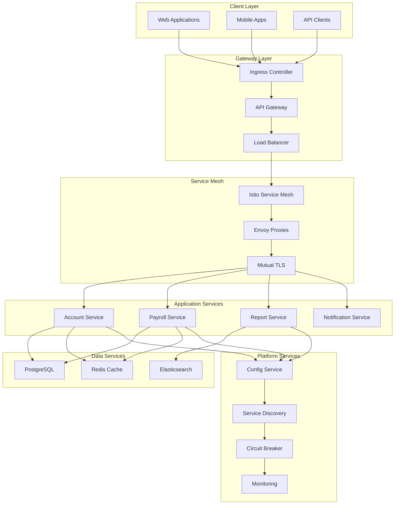

## Service Decomposition Strategy

### Domain-Driven Design Approach

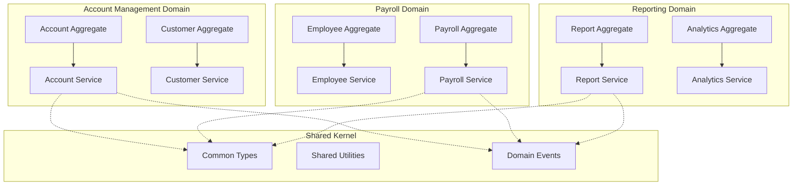

## Container Design Patterns

### 1. Sidecar Pattern

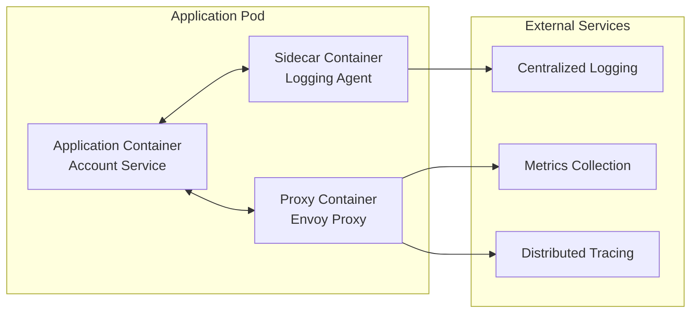

**Implementation Example:**
```yaml
apiVersion: v1
kind: Pod
metadata:
  name: account-service-pod
spec:
  containers:
  # Main application container
  - name: account-service
    image: company-registry/account-service:latest
    ports:
    - containerPort: 8080
    resources:
      limits:
        memory: "1Gi"
        cpu: "500m"
      requests:
        memory: "512Mi"
        cpu: "250m"
    
  # Sidecar: Logging agent
  - name: filebeat
    image: docker.elastic.co/beats/filebeat:8.8.0
    volumeMounts:
    - name: app-logs
      mountPath: /app/logs
    - name: filebeat-config
      mountPath: /usr/share/filebeat/filebeat.yml
      subPath: filebeat.yml
    
  # Sidecar: Monitoring agent
  - name: prometheus-exporter
    image: prom/jmx-exporter:latest
    ports:
    - containerPort: 9090
    volumeMounts:
    - name: jmx-config
      mountPath: /opt/jmx_prometheus_javaagent.yml
      subPath: config.yml
  
  volumes:
  - name: app-logs
    emptyDir: {}
  - name: filebeat-config
    configMap:
      name: filebeat-config
  - name: jmx-config
    configMap:
      name: jmx-config
```

### 2. Ambassador Pattern

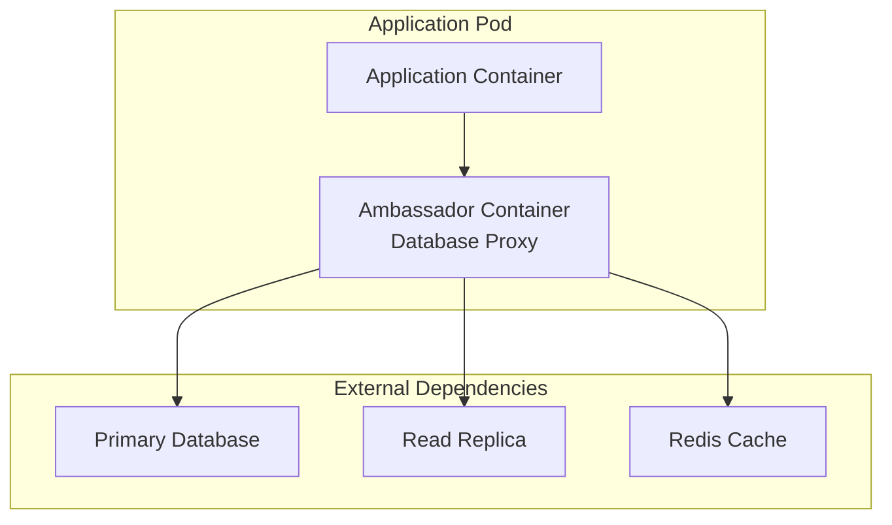

**Database Connection Proxy:**
```yaml
apiVersion: v1
kind: Pod
metadata:
  name: payroll-service-pod
spec:
  containers:
  - name: payroll-service
    image: company-registry/payroll-service:latest
    env:
    - name: DATABASE_URL
      value: "jdbc:postgresql://localhost:5432/payroll"
    
  - name: db-ambassador
    image: haproxy:alpine
    ports:
    - containerPort: 5432
    volumeMounts:
    - name: haproxy-config
      mountPath: /usr/local/etc/haproxy/haproxy.cfg
      subPath: haproxy.cfg
  
  volumes:
  - name: haproxy-config
    configMap:
      name: db-proxy-config
```

### 3. Adapter Pattern

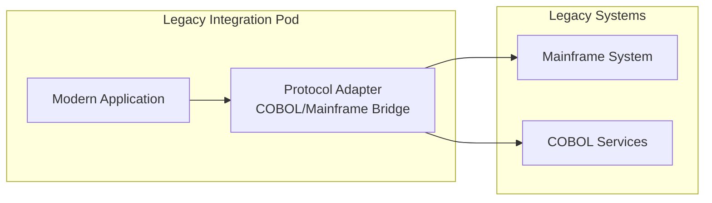

## Service Communication Patterns

### 1. Synchronous Communication

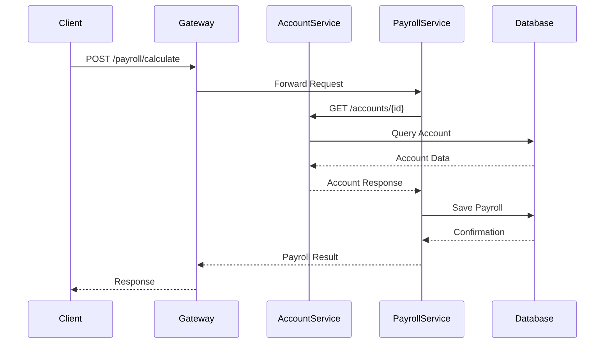

### 2. Asynchronous Communication

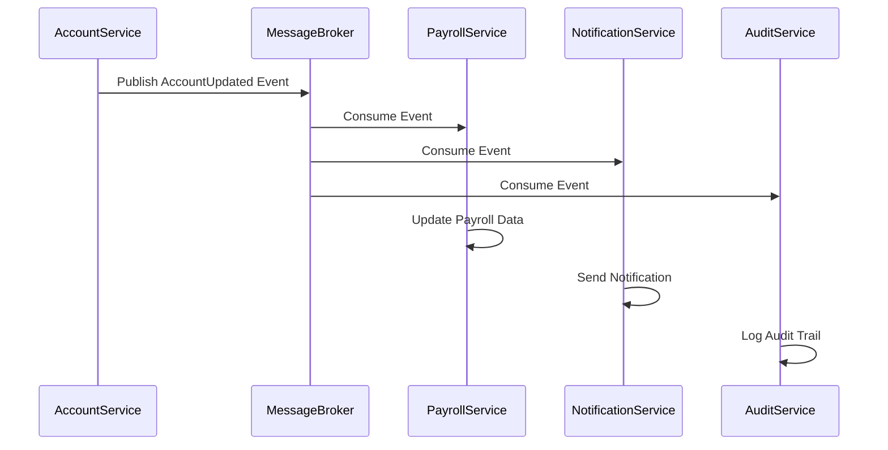

### Event-Driven Architecture Implementation

```yaml
# Kafka cluster for event streaming
apiVersion: kafka.strimzi.io/v1beta2
kind: Kafka
metadata:
  name: event-cluster
spec:
  kafka:
    version: 3.5.0
    replicas: 3
    listeners:
      - name: plain
        port: 9092
        type: internal
        tls: false
      - name: tls
        port: 9093
        type: internal
        tls: true
    config:
      offsets.topic.replication.factor: 3
      transaction.state.log.replication.factor: 3
      transaction.state.log.min.isr: 2
      default.replication.factor: 3
      min.insync.replicas: 2
    storage:
      type: persistent-claim
      size: 100Gi
      class: fast-ssd
  zookeeper:
    replicas: 3
    storage:
      type: persistent-claim
      size: 10Gi
      class: fast-ssd
```

## Data Management Patterns

### 1. Database per Service

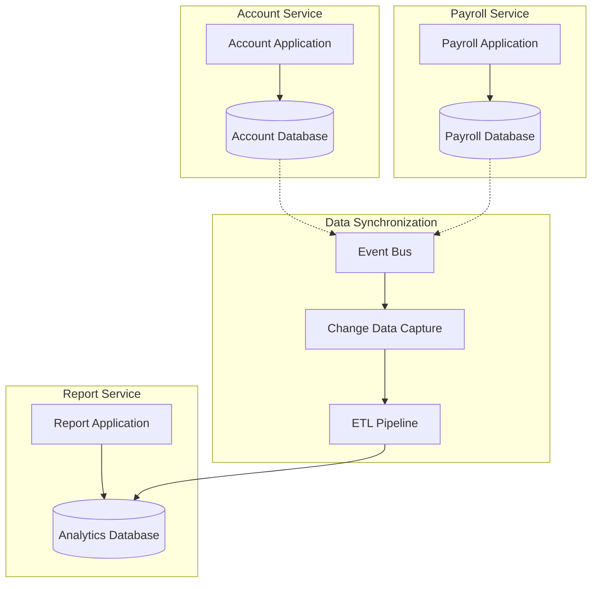

### 2. CQRS (Command Query Responsibility Segregation)

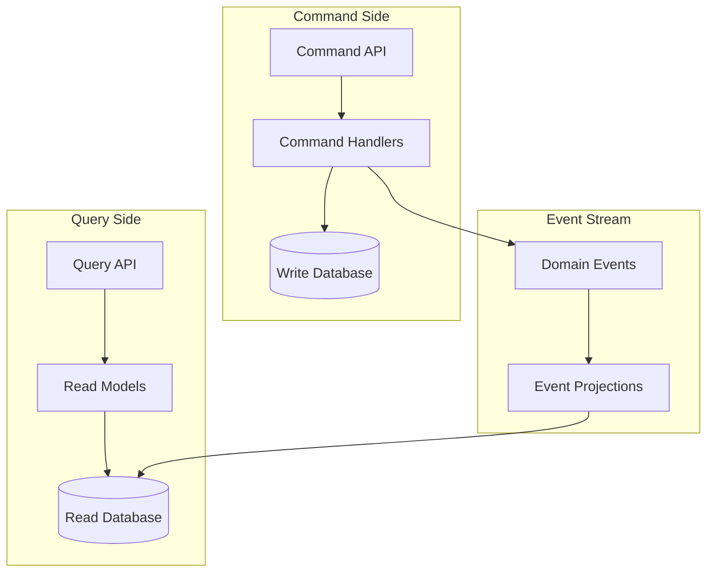

## Resilience Patterns

### 1. Circuit Breaker Pattern

```java
@Component
public class AccountServiceClient {
    
    private final RestTemplate restTemplate;
    private final CircuitBreaker circuitBreaker;
    
    public AccountServiceClient() {
        this.circuitBreaker = CircuitBreaker.ofDefaults("accountService");
        this.circuitBreaker.getEventPublisher()
            .onStateTransition(event -> 
                log.info("Circuit breaker state transition: {}", event));
    }
    
    public Account getAccount(String accountId) {
        return circuitBreaker.executeSupplier(() -> {
            return restTemplate.getForObject(
                "/accounts/{id}", Account.class, accountId);
        });
    }
}
```

### 2. Retry Pattern with Exponential Backoff

```java
@Component
public class PayrollServiceClient {
    
    @Retryable(
        value = {ServiceUnavailableException.class},
        maxAttempts = 3,
        backoff = @Backoff(delay = 1000, multiplier = 2)
    )
    public PayrollResult calculatePayroll(PayrollRequest request) {
        return restTemplate.postForObject(
            "/payroll/calculate", request, PayrollResult.class);
    }
    
    @Recover
    public PayrollResult recover(ServiceUnavailableException ex, PayrollRequest request) {
        log.warn("Payroll calculation failed after retries, using fallback");
        return PayrollResult.fallback(request);
    }
}
```

### 3. Bulkhead Pattern

```yaml
# Resource isolation using separate node pools
apiVersion: v1
kind: Namespace
metadata:
  name: critical-services
---
apiVersion: apps/v1
kind: Deployment
metadata:
  name: account-service
  namespace: critical-services
spec:
  replicas: 5
  template:
    spec:
      nodeSelector:
        workload-type: "critical"
      tolerations:
      - key: "critical-workload"
        operator: "Equal"
        value: "true"
        effect: "NoSchedule"
      containers:
      - name: account-service
        image: company-registry/account-service:latest
        resources:
          limits:
            memory: "2Gi"
            cpu: "1000m"
          requests:
            memory: "1Gi"
            cpu: "500m"
```

## Security Architecture

### 1. Zero Trust Network Model

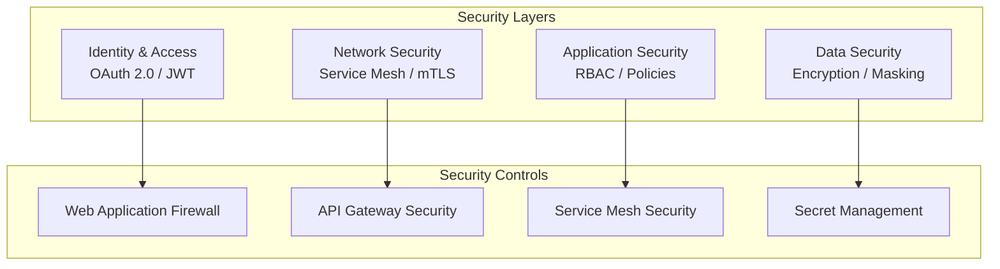

### 2. Service Mesh Security Implementation

```yaml
# Istio security policy
apiVersion: security.istio.io/v1beta1
kind: PeerAuthentication
metadata:
  name: default
  namespace: production
spec:
  mtls:
    mode: STRICT
---
apiVersion: security.istio.io/v1beta1
kind: AuthorizationPolicy
metadata:
  name: account-service-authz
  namespace: production
spec:
  selector:
    matchLabels:
      app: account-service
  rules:
  - from:
    - source:
        principals: ["cluster.local/ns/production/sa/api-gateway"]
    to:
    - operation:
        methods: ["GET", "POST", "PUT"]
        paths: ["/api/v1/accounts/*"]
  - from:
    - source:
        principals: ["cluster.local/ns/production/sa/payroll-service"]
    to:
    - operation:
        methods: ["GET"]
        paths: ["/api/v1/accounts/*"]
```

## Monitoring and Observability

### Three Pillars of Observability

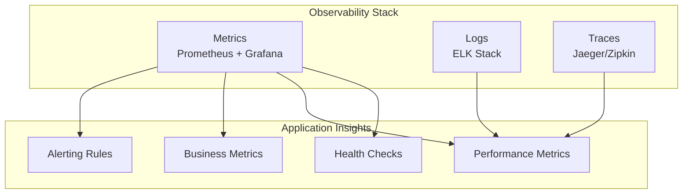

### Monitoring Configuration

```yaml
# Service monitor for Prometheus
apiVersion: monitoring.coreos.com/v1
kind: ServiceMonitor
metadata:
  name: account-service-monitor
spec:
  selector:
    matchLabels:
      app: account-service
  endpoints:
  - port: http
    path: /actuator/prometheus
    interval: 30s
    scrapeTimeout: 10s
---
# Grafana dashboard ConfigMap
apiVersion: v1
kind: ConfigMap
metadata:
  name: account-service-dashboard
data:
  dashboard.json: |
    {
      "dashboard": {
        "title": "Account Service Metrics",
        "panels": [
          {
            "title": "Request Rate",
            "type": "graph",
            "targets": [
              {
                "expr": "rate(http_requests_total{service=\"account-service\"}[5m])"
              }
            ]
          }
        ]
      }
    }
```

This container architecture provides a robust, scalable, and maintainable foundation for migrated COBOL applications, incorporating modern cloud-native patterns and best practices for enterprise-grade systems.