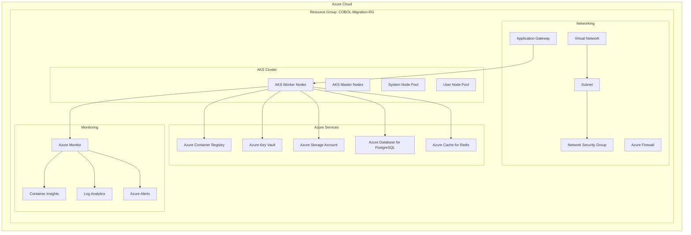

# Azure Kubernetes Service (AKS) Deployment

## Overview

This guide provides comprehensive instructions for deploying migrated COBOL applications to Azure Kubernetes Service (AKS), leveraging Azure's cloud-native services and enterprise-grade security features.

## Azure Architecture Overview



## Infrastructure Setup

### 1. Azure Resource Group Creation

```bash
#!/bin/bash
# Azure Infrastructure Setup Script

# Variables
RESOURCE_GROUP="cobol-migration-rg"
LOCATION="eastus2"
AKS_CLUSTER_NAME="cobol-aks-cluster"
ACR_NAME="cobolmigrationacr"
KEYVAULT_NAME="cobol-migration-kv"

# Create Resource Group
az group create \
    --name $RESOURCE_GROUP \
    --location $LOCATION

echo "Resource group $RESOURCE_GROUP created in $LOCATION"
```

### 2. Azure Container Registry Setup

```bash
# Create Azure Container Registry
az acr create \
    --resource-group $RESOURCE_GROUP \
    --name $ACR_NAME \
    --sku Premium \
    --admin-enabled true \
    --location $LOCATION

# Configure ACR for geo-replication (for high availability)
az acr replication create \
    --registry $ACR_NAME \
    --location westus2

# Enable vulnerability scanning
az acr task create \
    --registry $ACR_NAME \
    --name security-scan-task \
    --image-trigger-enabled \
    --base-image-trigger-enabled \
    --cmd "trivy image --exit-code 1 --severity HIGH,CRITICAL \$Registry/\$Repository:\$Tag"

echo "Azure Container Registry $ACR_NAME created and configured"
```

### 3. AKS Cluster Creation

```bash
# Create AKS cluster with advanced networking and security features
az aks create \
    --resource-group $RESOURCE_GROUP \
    --name $AKS_CLUSTER_NAME \
    --node-count 3 \
    --min-count 3 \
    --max-count 10 \
    --enable-cluster-autoscaler \
    --node-vm-size Standard_D4s_v3 \
    --network-plugin azure \
    --network-policy calico \
    --enable-managed-identity \
    --enable-pod-identity \
    --enable-addons monitoring,azure-keyvault-secrets-provider,ingress-appgw \
    --attach-acr $ACR_NAME \
    --kubernetes-version 1.28 \
    --zones 1 2 3 \
    --enable-encryption-at-host \
    --enable-node-public-ip false \
    --outbound-type loadBalancer

# Add user node pool for application workloads
az aks nodepool add \
    --resource-group $RESOURCE_GROUP \
    --cluster-name $AKS_CLUSTER_NAME \
    --name apppool \
    --node-count 3 \
    --min-count 3 \
    --max-count 20 \
    --enable-cluster-autoscaler \
    --node-vm-size Standard_D8s_v3 \
    --zones 1 2 3 \
    --node-taints workload-type=application:NoSchedule

# Get AKS credentials
az aks get-credentials \
    --resource-group $RESOURCE_GROUP \
    --name $AKS_CLUSTER_NAME

echo "AKS cluster $AKS_CLUSTER_NAME created and configured"
```

### 4. Azure Key Vault Integration

```bash
# Create Azure Key Vault
az keyvault create \
    --name $KEYVAULT_NAME \
    --resource-group $RESOURCE_GROUP \
    --location $LOCATION \
    --sku premium \
    --enable-disk-encryption \
    --enable-soft-delete \
    --soft-delete-retention-days 90

# Store database credentials
az keyvault secret set \
    --vault-name $KEYVAULT_NAME \
    --name "database-username" \
    --value "accountuser"

az keyvault secret set \
    --vault-name $KEYVAULT_NAME \
    --name "database-password" \
    --value "$(openssl rand -base64 32)"

# Configure AKS to access Key Vault
az aks addon enable \
    --resource-group $RESOURCE_GROUP \
    --cluster-name $AKS_CLUSTER_NAME \
    --addon azure-keyvault-secrets-provider

echo "Azure Key Vault $KEYVAULT_NAME created and integrated"
```

## Database Services Setup

### 1. Azure Database for PostgreSQL

```bash
# Create PostgreSQL Flexible Server
az postgres flexible-server create \
    --resource-group $RESOURCE_GROUP \
    --name cobol-postgres-server \
    --location $LOCATION \
    --admin-user adminuser \
    --admin-password $(az keyvault secret show --name database-password --vault-name $KEYVAULT_NAME --query value -o tsv) \
    --sku-name Standard_D4s_v3 \
    --tier GeneralPurpose \
    --storage-size 512 \
    --storage-auto-grow Enabled \
    --backup-retention 35 \
    --geo-redundant-backup Enabled \
    --high-availability ZoneRedundant \
    --zone 1 \
    --standby-zone 2

# Configure database firewall rules
az postgres flexible-server firewall-rule create \
    --resource-group $RESOURCE_GROUP \
    --name cobol-postgres-server \
    --rule-name AllowAKSCluster \
    --start-ip-address 10.0.0.0 \
    --end-ip-address 10.255.255.255

# Create application database
az postgres flexible-server db create \
    --resource-group $RESOURCE_GROUP \
    --server-name cobol-postgres-server \
    --database-name accounts

echo "PostgreSQL server created and configured"
```

### 2. Azure Cache for Redis

```bash
# Create Azure Cache for Redis
az redis create \
    --location $LOCATION \
    --resource-group $RESOURCE_GROUP \
    --name cobol-redis-cache \
    --sku Premium \
    --vm-size P1 \
    --redis-configuration maxmemory-policy=allkeys-lru \
    --enable-non-ssl-port false \
    --minimum-tls-version 1.2 \
    --redis-version 6

echo "Azure Cache for Redis created"
```

## Kubernetes Deployment Configuration

### 1. Namespace and RBAC Setup

```yaml
# namespace.yaml
apiVersion: v1
kind: Namespace
metadata:
  name: cobol-migration
  labels:
    name: cobol-migration
    environment: production
---
# Service Account
apiVersion: v1
kind: ServiceAccount
metadata:
  name: cobol-migration-sa
  namespace: cobol-migration
  annotations:
    azure.workload.identity/client-id: "YOUR_CLIENT_ID"
---
# Role for accessing Azure resources
apiVersion: rbac.authorization.k8s.io/v1
kind: Role
metadata:
  namespace: cobol-migration
  name: cobol-migration-role
rules:
- apiGroups: [""]
  resources: ["secrets", "configmaps"]
  verbs: ["get", "list", "create", "update", "patch"]
- apiGroups: ["apps"]
  resources: ["deployments", "statefulsets"]
  verbs: ["get", "list", "create", "update", "patch", "delete"]
---
# Role Binding
apiVersion: rbac.authorization.k8s.io/v1
kind: RoleBinding
metadata:
  name: cobol-migration-binding
  namespace: cobol-migration
subjects:
- kind: ServiceAccount
  name: cobol-migration-sa
  namespace: cobol-migration
roleRef:
  kind: Role
  name: cobol-migration-role
  apiGroup: rbac.authorization.k8s.io
```

### 2. Azure Key Vault Secret Provider

```yaml
# secret-provider.yaml
apiVersion: secrets-store.csi.x-k8s.io/v1
kind: SecretProviderClass
metadata:
  name: azure-keyvault-secrets
  namespace: cobol-migration
spec:
  provider: azure
  parameters:
    usePodIdentity: "false"
    useVMManagedIdentity: "true"
    userAssignedIdentityID: "YOUR_CLIENT_ID"
    keyvaultName: "cobol-migration-kv"
    objects: |
      array:
        - |
          objectName: database-username
          objectType: secret
          objectVersion: ""
        - |
          objectName: database-password
          objectType: secret
          objectVersion: ""
        - |
          objectName: redis-connection-string
          objectType: secret
          objectVersion: ""
  secretObjects:
  - secretName: app-secrets
    type: Opaque
    data:
    - objectName: database-username
      key: db-username
    - objectName: database-password
      key: db-password
    - objectName: redis-connection-string
      key: redis-url
```

### 3. Application Configuration

```yaml
# configmap.yaml
apiVersion: v1
kind: ConfigMap
metadata:
  name: app-config
  namespace: cobol-migration
data:
  application.yml: |
    spring:
      profiles:
        active: azure
      datasource:
        url: jdbc:postgresql://cobol-postgres-server.postgres.database.azure.com:5432/accounts
        hikari:
          maximum-pool-size: 20
          minimum-idle: 5
      redis:
        timeout: 2000ms
        lettuce:
          pool:
            max-active: 20
            max-idle: 8
            min-idle: 2
      jpa:
        hibernate:
          ddl-auto: validate
        properties:
          hibernate:
            dialect: org.hibernate.dialect.PostgreSQL95Dialect
    
    management:
      endpoints:
        web:
          exposure:
            include: health,metrics,prometheus
      endpoint:
        health:
          show-details: when-authorized
    
    logging:
      level:
        com.company.cobol: INFO
        org.springframework.security: DEBUG
      pattern:
        file: "%d{ISO8601} [%thread] %-5level %logger{36} - %msg%n"
```

### 4. Account Service Deployment

```yaml
# account-service-deployment.yaml
apiVersion: apps/v1
kind: Deployment
metadata:
  name: account-service
  namespace: cobol-migration
  labels:
    app: account-service
    version: v1.0.0
spec:
  replicas: 3
  selector:
    matchLabels:
      app: account-service
  template:
    metadata:
      labels:
        app: account-service
        version: v1.0.0
    spec:
      serviceAccountName: cobol-migration-sa
      nodeSelector:
        workload-type: application
      tolerations:
      - key: workload-type
        operator: Equal
        value: application
        effect: NoSchedule
      containers:
      - name: account-service
        image: cobolmigrationacr.azurecr.io/account-service:latest
        ports:
        - containerPort: 8080
          name: http
        env:
        - name: SPRING_PROFILES_ACTIVE
          value: "azure,production"
        - name: SPRING_DATASOURCE_USERNAME
          valueFrom:
            secretKeyRef:
              name: app-secrets
              key: db-username
        - name: SPRING_DATASOURCE_PASSWORD
          valueFrom:
            secretKeyRef:
              name: app-secrets
              key: db-password
        - name: SPRING_REDIS_URL
          valueFrom:
            secretKeyRef:
              name: app-secrets
              key: redis-url
        resources:
          limits:
            memory: "2Gi"
            cpu: "1000m"
          requests:
            memory: "1Gi"
            cpu: "500m"
        livenessProbe:
          httpGet:
            path: /actuator/health/liveness
            port: 8080
          initialDelaySeconds: 60
          periodSeconds: 30
          timeoutSeconds: 10
          failureThreshold: 3
        readinessProbe:
          httpGet:
            path: /actuator/health/readiness
            port: 8080
          initialDelaySeconds: 30
          periodSeconds: 10
          timeoutSeconds: 5
          failureThreshold: 3
        volumeMounts:
        - name: secrets-store
          mountPath: "/mnt/secrets-store"
          readOnly: true
        - name: config-volume
          mountPath: "/app/config"
      volumes:
      - name: secrets-store
        csi:
          driver: secrets-store.csi.k8s.io
          readOnly: true
          volumeAttributes:
            secretProviderClass: "azure-keyvault-secrets"
      - name: config-volume
        configMap:
          name: app-config
---
# Service
apiVersion: v1
kind: Service
metadata:
  name: account-service
  namespace: cobol-migration
spec:
  selector:
    app: account-service
  ports:
  - name: http
    port: 80
    targetPort: 8080
  type: ClusterIP
```

### 5. Application Gateway Ingress

```yaml
# ingress.yaml
apiVersion: networking.k8s.io/v1
kind: Ingress
metadata:
  name: cobol-migration-ingress
  namespace: cobol-migration
  annotations:
    kubernetes.io/ingress.class: azure/application-gateway
    appgw.ingress.kubernetes.io/ssl-redirect: "true"
    appgw.ingress.kubernetes.io/use-private-ip: "false"
    appgw.ingress.kubernetes.io/backend-protocol: "http"
    cert-manager.io/cluster-issuer: "letsencrypt-prod"
spec:
  tls:
  - hosts:
    - api.cobol-migration.com
    secretName: api-tls-secret
  rules:
  - host: api.cobol-migration.com
    http:
      paths:
      - path: /api/v1/accounts
        pathType: Prefix
        backend:
          service:
            name: account-service
            port:
              number: 80
      - path: /api/v1/payroll
        pathType: Prefix
        backend:
          service:
            name: payroll-service
            port:
              number: 80
```

## Monitoring and Observability

### 1. Azure Monitor Integration

```yaml
# azure-monitor-config.yaml
apiVersion: v1
kind: ConfigMap
metadata:
  name: container-azm-ms-agentconfig
  namespace: kube-system
data:
  schema-version: v1
  config-version: ver1
  log-data-collection-settings: |-
    [log_collection_settings]
      [log_collection_settings.stdout]
        enabled = true
        exclude_namespaces = ["kube-system"]
      [log_collection_settings.stderr]
        enabled = true
        exclude_namespaces = ["kube-system"]
      [log_collection_settings.env_var]
        enabled = true
      [log_collection_settings.enrich_container_logs]
        enabled = false
  prometheus-data-collection-settings: |-
    [prometheus_data_collection_settings.cluster]
      interval = "1m"
      monitor_kubernetes_pods = true
    [prometheus_data_collection_settings.node]
      interval = "1m"
```

### 2. Application Insights

```yaml
# application-insights.yaml
apiVersion: v1
kind: ConfigMap
metadata:
  name: application-insights-config
  namespace: cobol-migration
data:
  ApplicationInsights.json: |
    {
      "instrumentationKey": "YOUR_INSTRUMENTATION_KEY",
      "connectionString": "YOUR_CONNECTION_STRING",
      "role": {
        "name": "account-service"
      },
      "sampling": {
        "percentage": 100
      },
      "jmxMetrics": [],
      "customDimensions": {
        "service.version": "1.0.0",
        "environment": "production"
      }
    }
```

## Deployment Scripts

### 1. Complete Deployment Script

```bash
#!/bin/bash
# deploy-to-aks.sh

set -e

RESOURCE_GROUP="cobol-migration-rg"
AKS_CLUSTER_NAME="cobol-aks-cluster"
ACR_NAME="cobolmigrationacr"
NAMESPACE="cobol-migration"

echo "Starting deployment to AKS..."

# Get AKS credentials
az aks get-credentials --resource-group $RESOURCE_GROUP --name $AKS_CLUSTER_NAME

# Create namespace and RBAC
kubectl apply -f k8s/namespace.yaml

# Deploy secrets provider
kubectl apply -f k8s/secret-provider.yaml

# Deploy configuration
kubectl apply -f k8s/configmap.yaml

# Deploy applications
kubectl apply -f k8s/account-service-deployment.yaml
kubectl apply -f k8s/payroll-service-deployment.yaml
kubectl apply -f k8s/report-service-deployment.yaml

# Deploy ingress
kubectl apply -f k8s/ingress.yaml

# Wait for deployments to be ready
kubectl wait --for=condition=available --timeout=600s deployment/account-service -n $NAMESPACE
kubectl wait --for=condition=available --timeout=600s deployment/payroll-service -n $NAMESPACE
kubectl wait --for=condition=available --timeout=600s deployment/report-service -n $NAMESPACE

echo "Deployment completed successfully!"

# Display service endpoints
kubectl get ingress -n $NAMESPACE
kubectl get services -n $NAMESPACE
```

### 2. Health Check and Validation

```bash
#!/bin/bash
# health-check.sh

NAMESPACE="cobol-migration"
INGRESS_IP=$(kubectl get ingress cobol-migration-ingress -n $NAMESPACE -o jsonpath='{.status.loadBalancer.ingress[0].ip}')

echo "Running health checks..."

# Check application health endpoints
curl -f "http://$INGRESS_IP/api/v1/accounts/health" || exit 1
curl -f "http://$INGRESS_IP/api/v1/payroll/health" || exit 1

echo "All health checks passed!"

# Run smoke tests
kubectl run smoke-test --rm -i --restart=Never --image=curlimages/curl -- \
  sh -c "curl -f http://account-service.cobol-migration/actuator/health"

echo "Smoke tests completed successfully!"
```

This comprehensive AKS deployment guide provides enterprise-ready deployment of migrated COBOL applications with Azure's managed Kubernetes service, incorporating security, monitoring, and operational best practices.