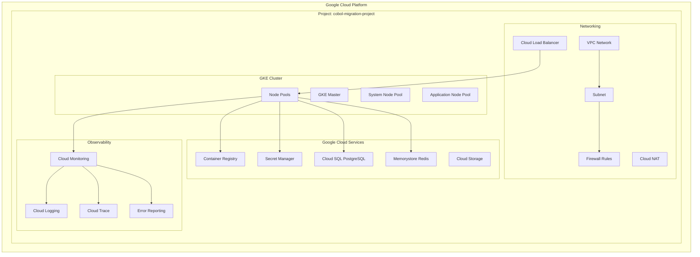

# Google Kubernetes Engine (GKE) Deployment

## Overview

This guide provides comprehensive instructions for deploying migrated COBOL applications to Google Kubernetes Engine (GKE), leveraging Google Cloud's managed Kubernetes service and integrated cloud-native solutions.

## Google Cloud Architecture Overview



## Infrastructure Setup

### 1. Google Cloud Project and APIs

```bash
#!/bin/bash
# GCP Infrastructure Setup Script

# Variables
PROJECT_ID="cobol-migration-project"
REGION="us-central1"
ZONE="us-central1-a"
CLUSTER_NAME="cobol-gke-cluster"
NETWORK_NAME="cobol-vpc-network"

# Set project
gcloud config set project $PROJECT_ID

# Enable required APIs
gcloud services enable container.googleapis.com
gcloud services enable compute.googleapis.com
gcloud services enable containerregistry.googleapis.com
gcloud services enable secretmanager.googleapis.com
gcloud services enable sql-component.googleapis.com
gcloud services enable redis.googleapis.com
gcloud services enable monitoring.googleapis.com
gcloud services enable logging.googleapis.com

echo "Google Cloud APIs enabled for project $PROJECT_ID"
```

### 2. VPC Network Setup

```bash
# Create VPC network
gcloud compute networks create $NETWORK_NAME \
    --subnet-mode regional \
    --description "VPC network for COBOL migration"

# Create subnet for GKE cluster
gcloud compute networks subnets create cobol-gke-subnet \
    --network $NETWORK_NAME \
    --range 10.1.0.0/16 \
    --secondary-range pods=10.2.0.0/16,services=10.3.0.0/16 \
    --region $REGION \
    --description "Subnet for GKE cluster"

# Create firewall rules
gcloud compute firewall-rules create allow-internal-cobol \
    --network $NETWORK_NAME \
    --allow tcp,udp,icmp \
    --source-ranges 10.1.0.0/16,10.2.0.0/16,10.3.0.0/16 \
    --description "Allow internal communication"

gcloud compute firewall-rules create allow-ssh-cobol \
    --network $NETWORK_NAME \
    --allow tcp:22 \
    --source-ranges 0.0.0.0/0 \
    --description "Allow SSH access"

echo "VPC network $NETWORK_NAME created and configured"
```

### 3. Container Registry Setup

```bash
# Configure Docker to use gcloud as credential helper
gcloud auth configure-docker

# Create repository in Artifact Registry (recommended over Container Registry)
gcloud artifacts repositories create cobol-migration-repo \
    --repository-format docker \
    --location $REGION \
    --description "Repository for COBOL migration containers"

echo "Container registry configured"
```

### 4. GKE Cluster Creation

```bash
# Create GKE cluster with advanced features
gcloud container clusters create $CLUSTER_NAME \
    --zone $ZONE \
    --network $NETWORK_NAME \
    --subnetwork cobol-gke-subnet \
    --cluster-secondary-range-name pods \
    --services-secondary-range-name services \
    --num-nodes 3 \
    --min-nodes 3 \
    --max-nodes 10 \
    --enable-autoscaling \
    --machine-type e2-standard-4 \
    --disk-type pd-ssd \
    --disk-size 100GB \
    --enable-autorepair \
    --enable-autoupgrade \
    --enable-network-policy \
    --enable-ip-alias \
    --enable-stackdriver-kubernetes \
    --workload-pool=$PROJECT_ID.svc.id.goog \
    --enable-shielded-nodes \
    --shielded-secure-boot \
    --shielded-integrity-monitoring \
    --addons HorizontalPodAutoscaling,HttpLoadBalancing,NodeLocalDNS,ConfigConnector

# Add node pool for application workloads
gcloud container node-pools create app-pool \
    --cluster $CLUSTER_NAME \
    --zone $ZONE \
    --num-nodes 3 \
    --min-nodes 3 \
    --max-nodes 20 \
    --enable-autoscaling \
    --machine-type e2-standard-8 \
    --disk-type pd-ssd \
    --disk-size 200GB \
    --node-taints workload-type=application:NoSchedule \
    --node-labels workload-type=application \
    --workload-metadata GKE_METADATA

# Get cluster credentials
gcloud container clusters get-credentials $CLUSTER_NAME --zone $ZONE

echo "GKE cluster $CLUSTER_NAME created and configured"
```

## Database and Cache Services

### 1. Cloud SQL PostgreSQL

```bash
# Create Cloud SQL PostgreSQL instance
gcloud sql instances create cobol-postgres-instance \
    --database-version POSTGRES_15 \
    --tier db-custom-4-16384 \
    --region $REGION \
    --storage-type SSD \
    --storage-size 500GB \
    --storage-auto-increase \
    --backup-start-time 02:00 \
    --backup-location $REGION \
    --maintenance-window-day SUN \
    --maintenance-window-hour 03 \
    --availability-type REGIONAL \
    --network $NETWORK_NAME \
    --no-assign-ip \
    --database-flags shared_preload_libraries=pg_stat_statements

# Create database and user
gcloud sql databases create accounts \
    --instance cobol-postgres-instance

gcloud sql users create appuser \
    --instance cobol-postgres-instance \
    --password $(openssl rand -base64 32)

# Store database credentials in Secret Manager
echo "appuser" | gcloud secrets create db-username --data-file=-
openssl rand -base64 32 | gcloud secrets create db-password --data-file=-

echo "Cloud SQL PostgreSQL instance created"
```

### 2. Memorystore Redis

```bash
# Create Memorystore Redis instance
gcloud redis instances create cobol-redis-cache \
    --size 5 \
    --region $REGION \
    --network $NETWORK_NAME \
    --redis-version redis_6_x \
    --tier standard \
    --transit-encryption-mode SERVER_AUTH \
    --auth-enabled \
    --persistence-mode RDB \
    --rdb-snapshot-period 12h \
    --rdb-snapshot-start-time 2023-01-01T02:00:00Z

# Store Redis auth string in Secret Manager
gcloud redis instances describe cobol-redis-cache --region $REGION --format="value(authString)" \
    | gcloud secrets create redis-auth-string --data-file=-

echo "Memorystore Redis instance created"
```

## Secret Management with Google Secret Manager

### 1. Service Account and IAM

```bash
# Create service account for Kubernetes workloads
gcloud iam service-accounts create cobol-migration-sa \
    --display-name "COBOL Migration Service Account"

# Bind IAM roles
gcloud projects add-iam-policy-binding $PROJECT_ID \
    --member "serviceAccount:cobol-migration-sa@$PROJECT_ID.iam.gserviceaccount.com" \
    --role "roles/secretmanager.secretAccessor"

gcloud projects add-iam-policy-binding $PROJECT_ID \
    --member "serviceAccount:cobol-migration-sa@$PROJECT_ID.iam.gserviceaccount.com" \
    --role "roles/cloudsql.client"

# Enable Workload Identity
gcloud iam service-accounts add-iam-policy-binding \
    --role roles/iam.workloadIdentityUser \
    --member "serviceAccount:$PROJECT_ID.svc.id.goog[cobol-migration/cobol-migration-ksa]" \
    cobol-migration-sa@$PROJECT_ID.iam.gserviceaccount.com

echo "Service account and IAM configured"
```

### 2. Secret Manager Integration

```yaml
# secret-manager.yaml
apiVersion: v1
kind: ServiceAccount
metadata:
  name: cobol-migration-ksa
  namespace: cobol-migration
  annotations:
    iam.gke.io/gcp-service-account: cobol-migration-sa@cobol-migration-project.iam.gserviceaccount.com
---
apiVersion: secretmanager.cnrm.cloud.google.com/v1beta1
kind: SecretManagerSecret
metadata:
  name: app-secrets
  namespace: cobol-migration
spec:
  replication:
    automatic: true
  secretId: app-secrets
---
apiVersion: secretmanager.cnrm.cloud.google.com/v1beta1
kind: SecretManagerSecretVersion
metadata:
  name: app-secrets-version
  namespace: cobol-migration
spec:
  secretId: app-secrets
  secretData:
    database-url: jdbc:postgresql://10.x.x.x:5432/accounts
    redis-url: redis://10.x.x.x:6379
```

## Kubernetes Deployment Configuration

### 1. Namespace and RBAC

```yaml
# namespace.yaml
apiVersion: v1
kind: Namespace
metadata:
  name: cobol-migration
  labels:
    name: cobol-migration
    environment: production
---
apiVersion: v1
kind: ServiceAccount
metadata:
  name: cobol-migration-ksa
  namespace: cobol-migration
  annotations:
    iam.gke.io/gcp-service-account: cobol-migration-sa@cobol-migration-project.iam.gserviceaccount.com
---
apiVersion: rbac.authorization.k8s.io/v1
kind: Role
metadata:
  namespace: cobol-migration
  name: cobol-migration-role
rules:
- apiGroups: [""]
  resources: ["secrets", "configmaps"]
  verbs: ["get", "list"]
- apiGroups: ["apps"]
  resources: ["deployments", "replicasets"]
  verbs: ["get", "list", "watch"]
---
apiVersion: rbac.authorization.k8s.io/v1
kind: RoleBinding
metadata:
  name: cobol-migration-binding
  namespace: cobol-migration
subjects:
- kind: ServiceAccount
  name: cobol-migration-ksa
  namespace: cobol-migration
roleRef:
  kind: Role
  name: cobol-migration-role
  apiGroup: rbac.authorization.k8s.io
```

### 2. ConfigMap for Application Configuration

```yaml
# configmap.yaml
apiVersion: v1
kind: ConfigMap
metadata:
  name: app-config
  namespace: cobol-migration
data:
  application-gcp.yml: |
    spring:
      profiles:
        active: gcp
      cloud:
        gcp:
          project-id: cobol-migration-project
          credentials:
            location: file:/var/secrets/google/key.json
      datasource:
        hikari:
          maximum-pool-size: 30
          minimum-idle: 5
          connection-timeout: 20000
          idle-timeout: 600000
          max-lifetime: 1800000
      redis:
        timeout: 2000ms
        lettuce:
          pool:
            max-active: 30
            max-idle: 8
            min-idle: 2
      jpa:
        hibernate:
          ddl-auto: validate
        properties:
          hibernate:
            dialect: org.hibernate.dialect.PostgreSQL95Dialect
            jdbc:
              time_zone: UTC
    
    management:
      endpoints:
        web:
          exposure:
            include: health,metrics,prometheus,info
      endpoint:
        health:
          show-details: when-authorized
      metrics:
        export:
          stackdriver:
            project-id: cobol-migration-project
            enabled: true
    
    logging:
      level:
        com.company.cobol: INFO
        com.google.cloud: WARN
      pattern:
        console: "%d{ISO8601} [%thread] %-5level [%X{traceId:-},%X{spanId:-}] %logger{36} - %msg%n"
```

### 3. Account Service Deployment

```yaml
# account-service-deployment.yaml
apiVersion: apps/v1
kind: Deployment
metadata:
  name: account-service
  namespace: cobol-migration
  labels:
    app: account-service
    version: v1.0.0
spec:
  replicas: 3
  selector:
    matchLabels:
      app: account-service
  template:
    metadata:
      labels:
        app: account-service
        version: v1.0.0
      annotations:
        prometheus.io/scrape: "true"
        prometheus.io/port: "8080"
        prometheus.io/path: "/actuator/prometheus"
    spec:
      serviceAccountName: cobol-migration-ksa
      nodeSelector:
        workload-type: application
      tolerations:
      - key: workload-type
        operator: Equal
        value: application
        effect: NoSchedule
      containers:
      - name: account-service
        image: us-central1-docker.pkg.dev/cobol-migration-project/cobol-migration-repo/account-service:latest
        ports:
        - containerPort: 8080
          name: http
        env:
        - name: SPRING_PROFILES_ACTIVE
          value: "gcp,production"
        - name: GOOGLE_CLOUD_PROJECT
          value: "cobol-migration-project"
        - name: SPRING_DATASOURCE_URL
          valueFrom:
            secretKeyRef:
              name: db-credentials
              key: database-url
        - name: SPRING_DATASOURCE_USERNAME
          valueFrom:
            secretKeyRef:
              name: db-credentials
              key: username
        - name: SPRING_DATASOURCE_PASSWORD
          valueFrom:
            secretKeyRef:
              name: db-credentials
              key: password
        - name: SPRING_REDIS_HOST
          valueFrom:
            secretKeyRef:
              name: redis-credentials
              key: host
        - name: SPRING_REDIS_PASSWORD
          valueFrom:
            secretKeyRef:
              name: redis-credentials
              key: auth-string
        resources:
          limits:
            memory: "2Gi"
            cpu: "1000m"
          requests:
            memory: "1Gi"
            cpu: "500m"
        livenessProbe:
          httpGet:
            path: /actuator/health/liveness
            port: 8080
          initialDelaySeconds: 120
          periodSeconds: 30
          timeoutSeconds: 10
          failureThreshold: 3
        readinessProbe:
          httpGet:
            path: /actuator/health/readiness
            port: 8080
          initialDelaySeconds: 60
          periodSeconds: 10
          timeoutSeconds: 5
          failureThreshold: 3
        volumeMounts:
        - name: config-volume
          mountPath: /app/config
        - name: google-cloud-key
          mountPath: /var/secrets/google
          readOnly: true
      volumes:
      - name: config-volume
        configMap:
          name: app-config
      - name: google-cloud-key
        secret:
          secretName: google-cloud-key
---
apiVersion: v1
kind: Service
metadata:
  name: account-service
  namespace: cobol-migration
  labels:
    app: account-service
spec:
  selector:
    app: account-service
  ports:
  - name: http
    port: 80
    targetPort: 8080
  type: ClusterIP
```

### 4. Horizontal Pod Autoscaler

```yaml
# hpa.yaml
apiVersion: autoscaling/v2
kind: HorizontalPodAutoscaler
metadata:
  name: account-service-hpa
  namespace: cobol-migration
spec:
  scaleTargetRef:
    apiVersion: apps/v1
    kind: Deployment
    name: account-service
  minReplicas: 3
  maxReplicas: 50
  metrics:
  - type: Resource
    resource:
      name: cpu
      target:
        type: Utilization
        averageUtilization: 70
  - type: Resource
    resource:
      name: memory
      target:
        type: Utilization
        averageUtilization: 80
  behavior:
    scaleDown:
      stabilizationWindowSeconds: 300
      policies:
      - type: Percent
        value: 10
        periodSeconds: 60
    scaleUp:
      stabilizationWindowSeconds: 0
      policies:
      - type: Percent
        value: 100
        periodSeconds: 15
      - type: Pods
        value: 4
        periodSeconds: 15
      selectPolicy: Max
```

### 5. Ingress with Google Cloud Load Balancer

```yaml
# ingress.yaml
apiVersion: networking.k8s.io/v1
kind: Ingress
metadata:
  name: cobol-migration-ingress
  namespace: cobol-migration
  annotations:
    kubernetes.io/ingress.class: "gce"
    kubernetes.io/ingress.global-static-ip-name: "cobol-migration-ip"
    networking.gke.io/managed-certificates: "cobol-migration-ssl"
    kubernetes.io/ingress.allow-http: "false"
    cloud.google.com/backend-config: '{"default": "backend-config"}'
    cloud.google.com/neg: '{"ingress": true}'
spec:
  rules:
  - host: api.cobol-migration.com
    http:
      paths:
      - path: /api/v1/accounts/*
        pathType: ImplementationSpecific
        backend:
          service:
            name: account-service
            port:
              number: 80
      - path: /api/v1/payroll/*
        pathType: ImplementationSpecific
        backend:
          service:
            name: payroll-service
            port:
              number: 80
---
apiVersion: networking.gke.io/v1
kind: ManagedCertificate
metadata:
  name: cobol-migration-ssl
  namespace: cobol-migration
spec:
  domains:
    - api.cobol-migration.com
---
apiVersion: cloud.google.com/v1
kind: BackendConfig
metadata:
  name: backend-config
  namespace: cobol-migration
spec:
  healthCheck:
    checkIntervalSec: 15
    timeoutSec: 10
    healthyThreshold: 2
    unhealthyThreshold: 3
    type: HTTP
    requestPath: /actuator/health
    port: 8080
  connectionDraining:
    drainingTimeoutSec: 60
  timeoutSec: 30
```

## Monitoring and Observability

### 1. Google Cloud Monitoring Integration

```yaml
# monitoring-config.yaml
apiVersion: v1
kind: ConfigMap
metadata:
  name: monitoring-config
  namespace: cobol-migration
data:
  stackdriver.yaml: |
    global:
      project_id: "cobol-migration-project"
    
    resource:
      type: "k8s_container"
      labels:
        cluster_name: "cobol-gke-cluster"
        location: "us-central1-a"
        namespace_name: "cobol-migration"
    
    metric_descriptors:
    - name: "custom.googleapis.com/account/requests_total"
      description: "Total number of account requests"
      metric_kind: CUMULATIVE
      value_type: INT64
    
    - name: "custom.googleapis.com/payroll/processing_time"
      description: "Payroll processing time in milliseconds"
      metric_kind: GAUGE
      value_type: DOUBLE
```

### 2. Application Performance Monitoring

```yaml
# apm-config.yaml
apiVersion: v1
kind: ConfigMap
metadata:
  name: apm-config
  namespace: cobol-migration
data:
  jaeger.yaml: |
    reporter:
      logSpans: false
      sender:
        endpoint: http://jaeger-collector:14268/api/traces
    sampler:
      type: probabilistic
      param: 0.1
```

## Deployment Automation

### 1. Complete Deployment Script

```bash
#!/bin/bash
# deploy-to-gke.sh

set -e

PROJECT_ID="cobol-migration-project"
ZONE="us-central1-a"
CLUSTER_NAME="cobol-gke-cluster"
NAMESPACE="cobol-migration"

echo "Starting deployment to GKE..."

# Set project and get cluster credentials
gcloud config set project $PROJECT_ID
gcloud container clusters get-credentials $CLUSTER_NAME --zone $ZONE

# Create namespace and RBAC
kubectl apply -f k8s/namespace.yaml

# Deploy configuration
kubectl apply -f k8s/configmap.yaml

# Deploy secrets (ensure secrets are created in Secret Manager first)
kubectl create secret generic db-credentials \
    --namespace=$NAMESPACE \
    --from-literal=database-url="$(gcloud secrets versions access latest --secret=db-url)" \
    --from-literal=username="$(gcloud secrets versions access latest --secret=db-username)" \
    --from-literal=password="$(gcloud secrets versions access latest --secret=db-password)"

kubectl create secret generic redis-credentials \
    --namespace=$NAMESPACE \
    --from-literal=host="$(gcloud redis instances describe cobol-redis-cache --region=us-central1 --format='value(host)')" \
    --from-literal=auth-string="$(gcloud secrets versions access latest --secret=redis-auth-string)"

# Deploy applications
kubectl apply -f k8s/account-service-deployment.yaml
kubectl apply -f k8s/payroll-service-deployment.yaml
kubectl apply -f k8s/report-service-deployment.yaml

# Deploy HPA
kubectl apply -f k8s/hpa.yaml

# Reserve static IP for ingress
gcloud compute addresses create cobol-migration-ip --global

# Deploy ingress
kubectl apply -f k8s/ingress.yaml

# Wait for deployments to be ready
kubectl wait --for=condition=available --timeout=600s deployment/account-service -n $NAMESPACE
kubectl wait --for=condition=available --timeout=600s deployment/payroll-service -n $NAMESPACE
kubectl wait --for=condition=available --timeout=600s deployment/report-service -n $NAMESPACE

echo "Deployment completed successfully!"

# Display service information
kubectl get ingress -n $NAMESPACE
kubectl get services -n $NAMESPACE
kubectl get hpa -n $NAMESPACE
```

### 2. Monitoring and Alerting Setup

```bash
#!/bin/bash
# setup-monitoring.sh

PROJECT_ID="cobol-migration-project"

# Create alerting policy for high error rate
gcloud alpha monitoring policies create --policy-from-file=- <<EOF
{
  "displayName": "High Error Rate - Account Service",
  "conditions": [
    {
      "displayName": "Error rate > 5%",
      "conditionThreshold": {
        "filter": "resource.type=\"k8s_container\" AND resource.labels.container_name=\"account-service\"",
        "comparison": "COMPARISON_GREATER_THAN",
        "thresholdValue": 0.05,
        "duration": "300s",
        "aggregations": [
          {
            "alignmentPeriod": "60s",
            "perSeriesAligner": "ALIGN_RATE",
            "crossSeriesReducer": "REDUCE_MEAN",
            "groupByFields": ["resource.labels.container_name"]
          }
        ]
      }
    }
  ],
  "notificationChannels": [],
  "enabled": true
}
EOF

echo "Monitoring and alerting configured"
```

This comprehensive GKE deployment guide provides enterprise-ready deployment of migrated COBOL applications using Google Cloud's managed Kubernetes service, with full integration of Google Cloud services for security, monitoring, and operations.