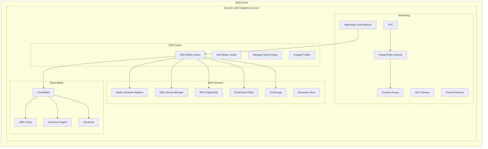

# Amazon Elastic Kubernetes Service (EKS) Deployment

## Overview

This guide provides comprehensive instructions for deploying migrated COBOL applications to Amazon Elastic Kubernetes Service (EKS), leveraging AWS's managed Kubernetes service and integrated cloud-native solutions.

## AWS Architecture Overview



## Infrastructure Setup

### 1. AWS CLI and Prerequisites

```bash
#!/bin/bash
# AWS Infrastructure Setup Script

# Variables
REGION="us-east-1"
CLUSTER_NAME="cobol-eks-cluster"
VPC_NAME="cobol-migration-vpc"
ECR_REPOSITORY="cobol-migration"

# Verify AWS CLI configuration
aws sts get-caller-identity
if [ $? -ne 0 ]; then
    echo "AWS CLI not configured. Please run 'aws configure'"
    exit 1
fi

# Install eksctl if not already installed
if ! command -v eksctl &> /dev/null; then
    echo "Installing eksctl..."
    curl --silent --location "https://github.com/weaveworks/eksctl/releases/latest/download/eksctl_$(uname -s)_amd64.tar.gz" | tar xz -C /tmp
    sudo mv /tmp/eksctl /usr/local/bin
fi

# Install kubectl if not already installed
if ! command -v kubectl &> /dev/null; then
    echo "Installing kubectl..."
    curl -LO "https://dl.k8s.io/release/$(curl -L -s https://dl.k8s.io/release/stable.txt)/bin/linux/amd64/kubectl"
    chmod +x kubectl
    sudo mv kubectl /usr/local/bin/
fi

echo "Prerequisites verified and installed"
```

### 2. VPC and Networking Setup

```yaml
# vpc-config.yaml for eksctl
apiVersion: eksctl.io/v1alpha5
kind: ClusterConfig

metadata:
  name: cobol-eks-cluster
  region: us-east-1
  version: "1.28"

vpc:
  cidr: "10.0.0.0/16"
  nat:
    gateway: HighlyAvailable
  clusterEndpoints:
    publicAccess: true
    privateAccess: true
  publicAccessCIDRs: ["0.0.0.0/0"]
  subnets:
    private:
      us-east-1a:
        cidr: "10.0.1.0/24"
      us-east-1b:
        cidr: "10.0.2.0/24"
      us-east-1c:
        cidr: "10.0.3.0/24"
    public:
      us-east-1a:
        cidr: "10.0.101.0/24"
      us-east-1b:
        cidr: "10.0.102.0/24"
      us-east-1c:
        cidr: "10.0.103.0/24"

addons:
- name: vpc-cni
  version: latest
- name: coredns
  version: latest
- name: kube-proxy
  version: latest
- name: aws-ebs-csi-driver
  version: latest

iam:
  withOIDC: true
  serviceAccounts:
  - metadata:
      name: aws-load-balancer-controller
      namespace: kube-system
    wellKnownPolicies:
      awsLoadBalancerController: true
  - metadata:
      name: external-secrets
      namespace: external-secrets
    attachPolicyARNs:
    - "arn:aws:iam::aws:policy/SecretsManagerReadWrite"
  - metadata:
      name: cluster-autoscaler
      namespace: kube-system
    wellKnownPolicies:
      autoScaler: true

nodeGroups:
- name: system-nodes
  instanceType: m5.large
  desiredCapacity: 2
  minSize: 2
  maxSize: 4
  volumeSize: 50
  ssh:
    allow: true
  labels:
    node-type: system
  taints:
    system: "true:NoSchedule"
  iam:
    attachPolicyARNs:
    - arn:aws:iam::aws:policy/AmazonEKSWorkerNodePolicy
    - arn:aws:iam::aws:policy/AmazonEKS_CNI_Policy
    - arn:aws:iam::aws:policy/AmazonEC2ContainerRegistryReadOnly

- name: application-nodes
  instanceType: m5.2xlarge
  desiredCapacity: 3
  minSize: 3
  maxSize: 20
  volumeSize: 100
  ssh:
    allow: true
  labels:
    node-type: application
    workload-type: cobol-migration
  privateNetworking: true
  iam:
    attachPolicyARNs:
    - arn:aws:iam::aws:policy/AmazonEKSWorkerNodePolicy
    - arn:aws:iam::aws:policy/AmazonEKS_CNI_Policy
    - arn:aws:iam::aws:policy/AmazonEC2ContainerRegistryReadOnly
    - arn:aws:iam::aws:policy/CloudWatchAgentServerPolicy

cloudWatch:
  clusterLogging:
    enable: ["api", "audit", "authenticator", "controllerManager", "scheduler"]
    logRetentionInDays: 30
```

### 3. EKS Cluster Creation

```bash
# Create EKS cluster using eksctl
eksctl create cluster -f vpc-config.yaml

# Update kubeconfig
aws eks update-kubeconfig --region $REGION --name $CLUSTER_NAME

# Verify cluster
kubectl get nodes
kubectl get namespaces

echo "EKS cluster $CLUSTER_NAME created and configured"
```

### 4. ECR Repository Setup

```bash
# Create ECR repositories
aws ecr create-repository \
    --repository-name cobol-migration/account-service \
    --region $REGION \
    --image-scanning-configuration scanOnPush=true \
    --encryption-configuration encryptionType=AES256

aws ecr create-repository \
    --repository-name cobol-migration/payroll-service \
    --region $REGION \
    --image-scanning-configuration scanOnPush=true \
    --encryption-configuration encryptionType=AES256

aws ecr create-repository \
    --repository-name cobol-migration/report-service \
    --region $REGION \
    --image-scanning-configuration scanOnPush=true \
    --encryption-configuration encryptionType=AES256

# Configure lifecycle policies
aws ecr put-lifecycle-policy \
    --repository-name cobol-migration/account-service \
    --lifecycle-policy-text '{
        "rules": [
            {
                "rulePriority": 1,
                "description": "Keep last 30 production images",
                "selection": {
                    "tagStatus": "tagged",
                    "tagPrefixList": ["v"],
                    "countType": "imageCountMoreThan",
                    "countNumber": 30
                },
                "action": {
                    "type": "expire"
                }
            }
        ]
    }' \
    --region $REGION

echo "ECR repositories created and configured"
```

## Database and Cache Services

### 1. RDS PostgreSQL

```bash
# Create RDS subnet group
aws rds create-db-subnet-group \
    --db-subnet-group-name cobol-migration-subnet-group \
    --db-subnet-group-description "Subnet group for COBOL migration RDS" \
    --subnet-ids subnet-xxx subnet-yyy subnet-zzz \
    --region $REGION

# Create security group for RDS
RDS_SG_ID=$(aws ec2 create-security-group \
    --group-name cobol-migration-rds-sg \
    --description "Security group for COBOL migration RDS" \
    --vpc-id vpc-xxx \
    --region $REGION \
    --query 'GroupId' \
    --output text)

# Allow PostgreSQL access from EKS worker nodes
aws ec2 authorize-security-group-ingress \
    --group-id $RDS_SG_ID \
    --protocol tcp \
    --port 5432 \
    --source-group sg-xxx \
    --region $REGION

# Create RDS PostgreSQL instance
aws rds create-db-instance \
    --db-instance-identifier cobol-migration-postgres \
    --db-instance-class db.r5.2xlarge \
    --engine postgres \
    --engine-version 15.4 \
    --master-username postgres \
    --master-user-password "$(openssl rand -base64 32)" \
    --allocated-storage 500 \
    --storage-type gp3 \
    --storage-encrypted \
    --vpc-security-group-ids $RDS_SG_ID \
    --db-subnet-group-name cobol-migration-subnet-group \
    --backup-retention-period 30 \
    --multi-az \
    --deletion-protection \
    --enable-performance-insights \
    --region $REGION

echo "RDS PostgreSQL instance creation initiated"
```

### 2. ElastiCache Redis

```bash
# Create ElastiCache subnet group
aws elasticache create-cache-subnet-group \
    --cache-subnet-group-name cobol-migration-cache-subnet \
    --cache-subnet-group-description "Subnet group for COBOL migration ElastiCache" \
    --subnet-ids subnet-xxx subnet-yyy subnet-zzz \
    --region $REGION

# Create security group for ElastiCache
CACHE_SG_ID=$(aws ec2 create-security-group \
    --group-name cobol-migration-cache-sg \
    --description "Security group for COBOL migration ElastiCache" \
    --vpc-id vpc-xxx \
    --region $REGION \
    --query 'GroupId' \
    --output text)

# Allow Redis access from EKS worker nodes
aws ec2 authorize-security-group-ingress \
    --group-id $CACHE_SG_ID \
    --protocol tcp \
    --port 6379 \
    --source-group sg-xxx \
    --region $REGION

# Create ElastiCache Redis cluster
aws elasticache create-replication-group \
    --replication-group-id cobol-migration-redis \
    --description "Redis cluster for COBOL migration" \
    --num-cache-clusters 3 \
    --cache-node-type cache.r6g.large \
    --engine redis \
    --engine-version 7.0 \
    --cache-parameter-group default.redis7 \
    --cache-subnet-group-name cobol-migration-cache-subnet \
    --security-group-ids $CACHE_SG_ID \
    --at-rest-encryption-enabled \
    --transit-encryption-enabled \
    --auth-token "$(openssl rand -base64 32)" \
    --region $REGION

echo "ElastiCache Redis cluster creation initiated"
```

## Secret Management with AWS Secrets Manager

### 1. Store Database Credentials

```bash
# Store database credentials
aws secretsmanager create-secret \
    --name cobol-migration/database \
    --description "Database credentials for COBOL migration" \
    --secret-string '{
        "username": "postgres",
        "password": "'$(openssl rand -base64 32)'",
        "host": "cobol-migration-postgres.cluster-xxx.us-east-1.rds.amazonaws.com",
        "port": "5432",
        "database": "accounts"
    }' \
    --region $REGION

# Store Redis credentials
aws secretsmanager create-secret \
    --name cobol-migration/redis \
    --description "Redis credentials for COBOL migration" \
    --secret-string '{
        "host": "cobol-migration-redis.xxx.cache.amazonaws.com",
        "port": "6379",
        "auth_token": "'$(openssl rand -base64 32)'"
    }' \
    --region $REGION

echo "Secrets stored in AWS Secrets Manager"
```

### 2. External Secrets Operator

```yaml
# external-secrets-operator.yaml
apiVersion: v1
kind: Namespace
metadata:
  name: external-secrets
---
apiVersion: helm.cattle.io/v1
kind: HelmChart
metadata:
  name: external-secrets
  namespace: external-secrets
spec:
  chart: external-secrets
  repo: https://charts.external-secrets.io
  targetNamespace: external-secrets
  valuesContent: |-
    serviceAccount:
      annotations:
        eks.amazonaws.com/role-arn: arn:aws:iam::ACCOUNT-ID:role/external-secrets-role
---
apiVersion: external-secrets.io/v1beta1
kind: SecretStore
metadata:
  name: aws-secretsmanager
  namespace: cobol-migration
spec:
  provider:
    aws:
      service: SecretsManager
      region: us-east-1
      auth:
        serviceAccount:
          name: external-secrets-sa
---
apiVersion: external-secrets.io/v1beta1
kind: ExternalSecret
metadata:
  name: database-credentials
  namespace: cobol-migration
spec:
  refreshInterval: 1h
  secretStoreRef:
    name: aws-secretsmanager
    kind: SecretStore
  target:
    name: database-secret
    creationPolicy: Owner
  data:
  - secretKey: username
    remoteRef:
      key: cobol-migration/database
      property: username
  - secretKey: password
    remoteRef:
      key: cobol-migration/database
      property: password
  - secretKey: host
    remoteRef:
      key: cobol-migration/database
      property: host
  - secretKey: database
    remoteRef:
      key: cobol-migration/database
      property: database
```

## Kubernetes Deployment Configuration

### 1. Namespace and RBAC

```yaml
# namespace.yaml
apiVersion: v1
kind: Namespace
metadata:
  name: cobol-migration
  labels:
    name: cobol-migration
    environment: production
---
apiVersion: v1
kind: ServiceAccount
metadata:
  name: cobol-migration-sa
  namespace: cobol-migration
  annotations:
    eks.amazonaws.com/role-arn: arn:aws:iam::ACCOUNT-ID:role/cobol-migration-role
---
apiVersion: rbac.authorization.k8s.io/v1
kind: Role
metadata:
  namespace: cobol-migration
  name: cobol-migration-role
rules:
- apiGroups: [""]
  resources: ["secrets", "configmaps", "pods"]
  verbs: ["get", "list", "watch"]
- apiGroups: ["apps"]
  resources: ["deployments", "replicasets"]
  verbs: ["get", "list", "watch"]
- apiGroups: ["metrics.k8s.io"]
  resources: ["pods", "nodes"]
  verbs: ["get", "list"]
---
apiVersion: rbac.authorization.k8s.io/v1
kind: RoleBinding
metadata:
  name: cobol-migration-binding
  namespace: cobol-migration
subjects:
- kind: ServiceAccount
  name: cobol-migration-sa
  namespace: cobol-migration
roleRef:
  kind: Role
  name: cobol-migration-role
  apiGroup: rbac.authorization.k8s.io
```

### 2. ConfigMap for Application Configuration

```yaml
# configmap.yaml
apiVersion: v1
kind: ConfigMap
metadata:
  name: app-config
  namespace: cobol-migration
data:
  application-aws.yml: |
    spring:
      profiles:
        active: aws
      cloud:
        aws:
          region:
            static: us-east-1
          credentials:
            instance-profile: true
      datasource:
        hikari:
          maximum-pool-size: 40
          minimum-idle: 10
          connection-timeout: 20000
          idle-timeout: 600000
          max-lifetime: 1800000
          leak-detection-threshold: 60000
      redis:
        timeout: 3000ms
        lettuce:
          pool:
            max-active: 40
            max-idle: 8
            min-idle: 4
      jpa:
        hibernate:
          ddl-auto: validate
        properties:
          hibernate:
            dialect: org.hibernate.dialect.PostgreSQL95Dialect
            jdbc:
              time_zone: UTC
            connection:
              provider_disables_autocommit: true
        open-in-view: false
    
    management:
      endpoints:
        web:
          exposure:
            include: health,metrics,prometheus,info
      endpoint:
        health:
          show-details: when-authorized
          probes:
            enabled: true
      metrics:
        export:
          cloudwatch:
            namespace: COBOL/Migration
            region: us-east-1
            enabled: true
    
    logging:
      level:
        com.company.cobol: INFO
        com.amazonaws: WARN
      pattern:
        console: "%d{ISO8601} [%thread] %-5level [%X{traceId:-},%X{spanId:-}] %logger{36} - %msg%n"
    
    aws:
      xray:
        tracing-name: account-service
        enabled: true
```

### 3. Account Service Deployment

```yaml
# account-service-deployment.yaml
apiVersion: apps/v1
kind: Deployment
metadata:
  name: account-service
  namespace: cobol-migration
  labels:
    app: account-service
    version: v1.0.0
spec:
  replicas: 5
  selector:
    matchLabels:
      app: account-service
  template:
    metadata:
      labels:
        app: account-service
        version: v1.0.0
      annotations:
        prometheus.io/scrape: "true"
        prometheus.io/port: "8080"
        prometheus.io/path: "/actuator/prometheus"
    spec:
      serviceAccountName: cobol-migration-sa
      nodeSelector:
        node-type: application
      affinity:
        podAntiAffinity:
          preferredDuringSchedulingIgnoredDuringExecution:
          - weight: 100
            podAffinityTerm:
              labelSelector:
                matchExpressions:
                - key: app
                  operator: In
                  values:
                  - account-service
              topologyKey: kubernetes.io/hostname
      containers:
      - name: account-service
        image: ACCOUNT-ID.dkr.ecr.us-east-1.amazonaws.com/cobol-migration/account-service:latest
        ports:
        - containerPort: 8080
          name: http
        env:
        - name: SPRING_PROFILES_ACTIVE
          value: "aws,production"
        - name: AWS_REGION
          value: "us-east-1"
        - name: SPRING_DATASOURCE_URL
          valueFrom:
            secretKeyRef:
              name: database-secret
              key: url
        - name: SPRING_DATASOURCE_USERNAME
          valueFrom:
            secretKeyRef:
              name: database-secret
              key: username
        - name: SPRING_DATASOURCE_PASSWORD
          valueFrom:
            secretKeyRef:
              name: database-secret
              key: password
        - name: SPRING_REDIS_HOST
          valueFrom:
            secretKeyRef:
              name: redis-secret
              key: host
        - name: SPRING_REDIS_PASSWORD
          valueFrom:
            secretKeyRef:
              name: redis-secret
              key: auth_token
        resources:
          limits:
            memory: "3Gi"
            cpu: "1500m"
          requests:
            memory: "1.5Gi"
            cpu: "750m"
        livenessProbe:
          httpGet:
            path: /actuator/health/liveness
            port: 8080
          initialDelaySeconds: 180
          periodSeconds: 30
          timeoutSeconds: 10
          failureThreshold: 3
        readinessProbe:
          httpGet:
            path: /actuator/health/readiness
            port: 8080
          initialDelaySeconds: 90
          periodSeconds: 10
          timeoutSeconds: 5
          failureThreshold: 3
        startupProbe:
          httpGet:
            path: /actuator/health/readiness
            port: 8080
          initialDelaySeconds: 30
          periodSeconds: 10
          timeoutSeconds: 5
          failureThreshold: 18
        volumeMounts:
        - name: config-volume
          mountPath: /app/config
        - name: tmp-volume
          mountPath: /tmp
      volumes:
      - name: config-volume
        configMap:
          name: app-config
      - name: tmp-volume
        emptyDir: {}
      terminationGracePeriodSeconds: 45
---
apiVersion: v1
kind: Service
metadata:
  name: account-service
  namespace: cobol-migration
  labels:
    app: account-service
spec:
  selector:
    app: account-service
  ports:
  - name: http
    port: 80
    targetPort: 8080
  type: ClusterIP
```

### 4. Application Load Balancer Ingress

```yaml
# alb-ingress.yaml
apiVersion: networking.k8s.io/v1
kind: Ingress
metadata:
  name: cobol-migration-ingress
  namespace: cobol-migration
  annotations:
    kubernetes.io/ingress.class: alb
    alb.ingress.kubernetes.io/scheme: internet-facing
    alb.ingress.kubernetes.io/target-type: ip
    alb.ingress.kubernetes.io/listen-ports: '[{"HTTP": 80}, {"HTTPS":443}]'
    alb.ingress.kubernetes.io/ssl-redirect: '443'
    alb.ingress.kubernetes.io/certificate-arn: arn:aws:acm:us-east-1:ACCOUNT-ID:certificate/CERT-ID
    alb.ingress.kubernetes.io/healthcheck-protocol: HTTP
    alb.ingress.kubernetes.io/healthcheck-path: /actuator/health
    alb.ingress.kubernetes.io/healthcheck-interval-seconds: '15'
    alb.ingress.kubernetes.io/healthcheck-timeout-seconds: '5'
    alb.ingress.kubernetes.io/healthy-threshold-count: '2'
    alb.ingress.kubernetes.io/unhealthy-threshold-count: '3'
    alb.ingress.kubernetes.io/group.name: cobol-migration
    alb.ingress.kubernetes.io/group.order: '10'
spec:
  rules:
  - host: api.cobol-migration.com
    http:
      paths:
      - path: /api/v1/accounts
        pathType: Prefix
        backend:
          service:
            name: account-service
            port:
              number: 80
      - path: /api/v1/payroll
        pathType: Prefix
        backend:
          service:
            name: payroll-service
            port:
              number: 80
      - path: /api/v1/reports
        pathType: Prefix
        backend:
          service:
            name: report-service
            port:
              number: 80
```

### 5. Horizontal Pod Autoscaler and Cluster Autoscaler

```yaml
# hpa.yaml
apiVersion: autoscaling/v2
kind: HorizontalPodAutoscaler
metadata:
  name: account-service-hpa
  namespace: cobol-migration
spec:
  scaleTargetRef:
    apiVersion: apps/v1
    kind: Deployment
    name: account-service
  minReplicas: 5
  maxReplicas: 100
  metrics:
  - type: Resource
    resource:
      name: cpu
      target:
        type: Utilization
        averageUtilization: 70
  - type: Resource
    resource:
      name: memory
      target:
        type: Utilization
        averageUtilization: 80
  - type: Pods
    pods:
      metric:
        name: http_requests_per_second
      target:
        type: AverageValue
        averageValue: "100"
  behavior:
    scaleDown:
      stabilizationWindowSeconds: 300
      policies:
      - type: Percent
        value: 10
        periodSeconds: 60
      - type: Pods
        value: 2
        periodSeconds: 60
      selectPolicy: Min
    scaleUp:
      stabilizationWindowSeconds: 0
      policies:
      - type: Percent
        value: 100
        periodSeconds: 15
      - type: Pods
        value: 5
        periodSeconds: 15
      selectPolicy: Max
```

## Monitoring and Observability

### 1. CloudWatch Container Insights

```yaml
# cloudwatch-config.yaml
apiVersion: v1
kind: ConfigMap
metadata:
  name: fluent-bit-config
  namespace: amazon-cloudwatch
data:
  fluent-bit.conf: |
    [SERVICE]
        Flush                     5
        Grace                     30
        Log_Level                 info
        Daemon                    off
        Parsers_File              parsers.conf
        HTTP_Server               On
        HTTP_Listen               0.0.0.0
        HTTP_Port                 2020
        storage.path              /var/fluent-bit/state/flb-storage/
        storage.sync              normal
        storage.checksum          off
        storage.backlog.mem_limit 5M
        
    [INPUT]
        Name                tail
        Tag                 application.*
        Path                /var/log/containers/*account-service*.log
        multiline.parser    docker, cri
        DB                  /var/fluent-bit/state/flb_container.db
        Mem_Buf_Limit       50MB
        Skip_Long_Lines     On
        Refresh_Interval    10

    [OUTPUT]
        Name cloudwatch_logs
        Match application.*
        region us-east-1
        log_group_name /aws/containerinsights/cobol-eks-cluster/application
        log_stream_prefix account-service-
        auto_create_group true
```

### 2. AWS X-Ray Integration

```yaml
# x-ray-daemon.yaml
apiVersion: apps/v1
kind: DaemonSet
metadata:
  name: xray-daemon
  namespace: cobol-migration
spec:
  selector:
    matchLabels:
      app: xray-daemon
  template:
    metadata:
      labels:
        app: xray-daemon
    spec:
      serviceAccountName: xray-daemon-sa
      containers:
      - name: xray-daemon
        image: amazon/aws-xray-daemon:latest
        command:
        - /usr/bin/xray
        - -o
        - -b
        - 0.0.0.0:2000
        resources:
          limits:
            memory: 256Mi
            cpu: 100m
          requests:
            memory: 128Mi
            cpu: 50m
        ports:
        - containerPort: 2000
          name: xray-port
          protocol: UDP
        env:
        - name: AWS_REGION
          value: us-east-1
```

## Deployment Automation

### 1. Complete Deployment Script

```bash
#!/bin/bash
# deploy-to-eks.sh

set -e

REGION="us-east-1"
CLUSTER_NAME="cobol-eks-cluster"
NAMESPACE="cobol-migration"
ACCOUNT_ID=$(aws sts get-caller-identity --query Account --output text)

echo "Starting deployment to EKS cluster: $CLUSTER_NAME"

# Update kubeconfig
aws eks update-kubeconfig --region $REGION --name $CLUSTER_NAME

# Install AWS Load Balancer Controller
echo "Installing AWS Load Balancer Controller..."
kubectl apply -k "github.com/aws/eks-charts/stable/aws-load-balancer-controller/crds?ref=master"

helm repo add eks https://aws.github.io/eks-charts
helm repo update

helm install aws-load-balancer-controller eks/aws-load-balancer-controller \
    -n kube-system \
    --set clusterName=$CLUSTER_NAME \
    --set serviceAccount.create=false \
    --set serviceAccount.name=aws-load-balancer-controller \
    --set region=$REGION \
    --set vpcId=$(aws eks describe-cluster --name $CLUSTER_NAME --query "cluster.resourcesVpcConfig.vpcId" --output text)

# Install External Secrets Operator
echo "Installing External Secrets Operator..."
helm repo add external-secrets https://charts.external-secrets.io
helm install external-secrets external-secrets/external-secrets -n external-secrets --create-namespace

# Deploy application
echo "Deploying application components..."

# Create namespace and RBAC
kubectl apply -f k8s/namespace.yaml

# Deploy external secrets
kubectl apply -f k8s/external-secrets.yaml

# Deploy configuration
kubectl apply -f k8s/configmap.yaml

# Deploy applications
kubectl apply -f k8s/account-service-deployment.yaml
kubectl apply -f k8s/payroll-service-deployment.yaml
kubectl apply -f k8s/report-service-deployment.yaml

# Deploy HPA
kubectl apply -f k8s/hpa.yaml

# Deploy ingress
kubectl apply -f k8s/alb-ingress.yaml

# Wait for deployments to be ready
echo "Waiting for deployments to be ready..."
kubectl wait --for=condition=available --timeout=900s deployment/account-service -n $NAMESPACE
kubectl wait --for=condition=available --timeout=900s deployment/payroll-service -n $NAMESPACE
kubectl wait --for=condition=available --timeout=900s deployment/report-service -n $NAMESPACE

# Get ALB hostname
ALB_HOSTNAME=$(kubectl get ingress cobol-migration-ingress -n $NAMESPACE -o jsonpath='{.status.loadBalancer.ingress[0].hostname}')

echo "Deployment completed successfully!"
echo "Application Load Balancer: $ALB_HOSTNAME"
echo "Application URL: https://api.cobol-migration.com"

# Display cluster information
kubectl get nodes
kubectl get pods -n $NAMESPACE
kubectl get services -n $NAMESPACE
kubectl get hpa -n $NAMESPACE
```

### 2. Monitoring and Health Checks

```bash
#!/bin/bash
# health-check-eks.sh

NAMESPACE="cobol-migration"
ALB_HOSTNAME=$(kubectl get ingress cobol-migration-ingress -n $NAMESPACE -o jsonpath='{.status.loadBalancer.ingress[0].hostname}')

echo "Running EKS health checks..."

# Check pod health
kubectl get pods -n $NAMESPACE

# Check service endpoints
kubectl get endpoints -n $NAMESPACE

# Check HPA status
kubectl get hpa -n $NAMESPACE

# Check application health endpoints
echo "Checking application health endpoints..."
curl -f "http://$ALB_HOSTNAME/api/v1/accounts/actuator/health" || echo "Account service health check failed"
curl -f "http://$ALB_HOSTNAME/api/v1/payroll/actuator/health" || echo "Payroll service health check failed"

# Check CloudWatch logs
aws logs describe-log-groups \
    --log-group-name-prefix "/aws/containerinsights/cobol-eks-cluster" \
    --region us-east-1

echo "Health checks completed"
```

This comprehensive EKS deployment guide provides enterprise-ready deployment of migrated COBOL applications using AWS's managed Kubernetes service, with full integration of AWS services for security, monitoring, and operations.